# AI Programming in C#
- using ML.NET 

- We programmers create an artificial brain 
- We reward good answers and punish bad answers 
- We want an AI to distinguish between apples and oranges 
- We train it on 500 pictures of apples and oranges 
- 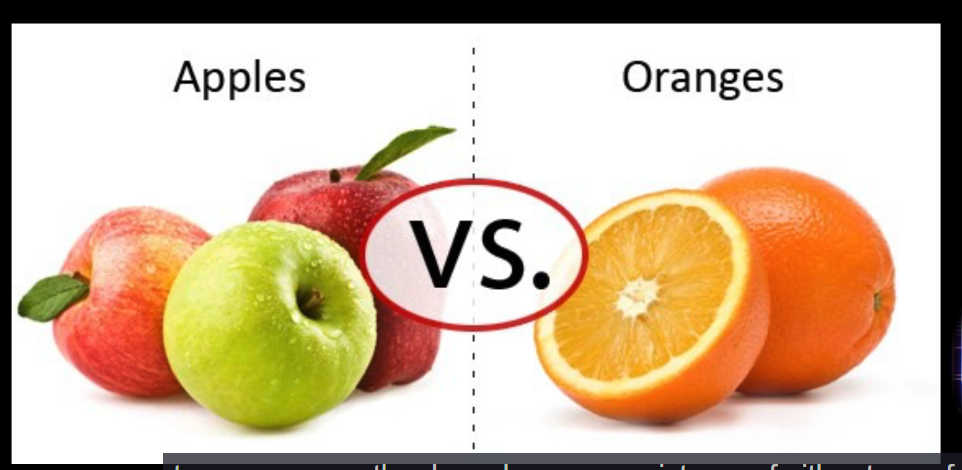
- We then show pictures and ask it to guess if the image is an apple or orange 
- This example is a subtype of AI called machine learning and it is an image classification algorithm 
- ChatGPT is a generative AI 
- It is trained on super large datasets.  
- Here AI program generates a response based on an input. 
- In AI there are subfields 
- 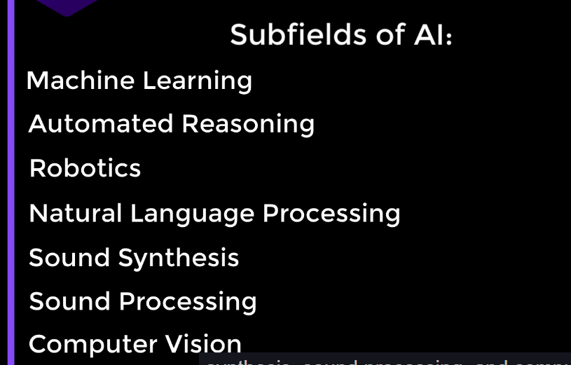
- Other examples of AI are Alexa, Google Home and ChatGPT. 
- AI can also recognize emotions, however it cannot respond to them. 


## Main AI Concepts 

### Types of AI 
- Narrow AI and Strong AI 
- Narrow AI is used to perform specific tasks like an AI designed to play a game 
- Strong AI is a higher powered type of AI and can work on different types of tasks 

### Subtypes of AI 
- 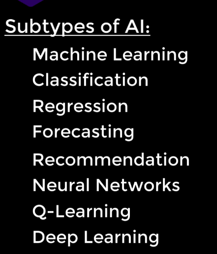

- #### Machine Learning
- In Machine Learning, we use data to train an AI model. After the model is trained, we present it with a situation and it makes a prediction based on its training. 
- Machine learning is of 3 types: 
- Supervised Learning , Unsupervised Learning and Reinforcement Learning
- **Supervised learning** is when we use labelled data to train our model to recognize patterns and predict outcomes 
- **Unsupervised learning** uses data without any labels, which the model uses to discover patterns that exist in the data and then uses the inferences to predict the outcome 
- In **Reinforcement learning**, we assign rewards and punishments to tasks to train the model, when then is able to make predictions using those results. 
- #### Classification 
- Another subtype of AI where the model puts data into different categories based on certain features it has 
- For example, we can classify words or sentences based on if they have a negative or positive emotion in them
- We can also classify images like grouping images of different fruits 
- Types of Classification are :
- **Binary Classification**
- This means we only have 2 categories: like Apples and Oranges
- **Multiclass Classification**
- More than 2 categories like Apples, Oranges and Banana
- **MultiLabel classification** 
- When the same type of data belongs to more than one category. For example if our program has categories: "nature" and "large", then mountains can belong to both these categories 
- Lot of classification algorithms 
- #### Regression 
- It is a strategy that plots all of the known data points and based on how the data is trending, it can predict future values. It allows us to see the relationship between 2 variables. 
- One variable on the X-Axis and One on the Y-Axis. 
- #### Forecasting 
- When an AI can predict future events 
- #### Recommendation 
- An AI strategy which is used to make suggestions based on prior choices. 
- If we viewed items on online store like books on Amazon's website and then seeing recommendations of similar items, that is an example of this type of AI 
- #### Neural Networks 
- 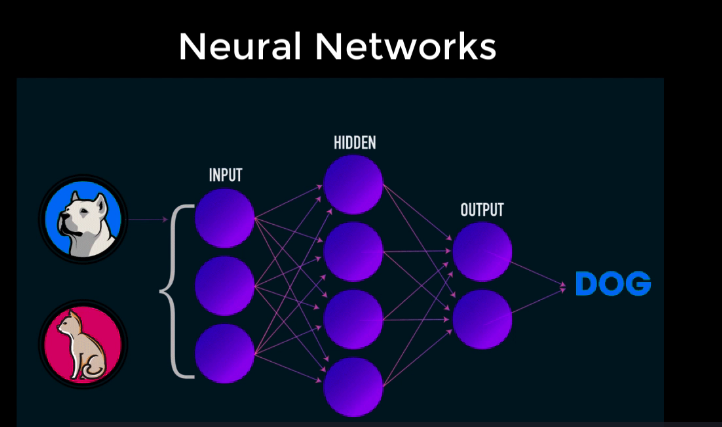
- They are like digital brains. We write code that enables the program to learn from its mistakes based on the way that the human brain works 
- Just like brain has neurons, neural network has perceptrons, which are the digital version of neurons. 
- By adding multiple layers of interconnected perceptrons, we are able to build a neural network that mimics the functionality of a human brain by sending signals between perceptrons. 
- #### Q-Learning 
- Type of reinforcement learning where a model will perform a task over and over and improve taking the correct action over time. 
- #### Deep Learning 
- Enables AI to recognize complex learning and is made possible thanks to neural networks. Examples are deep Q-Learning and Deep Convolutional Q-Learning. 

## Neural Networks 
- A computer program that is able to learn and is modeled around how human brain works 
- Neural network are made up of digital equivalent of neurons called perceptrons. 
- 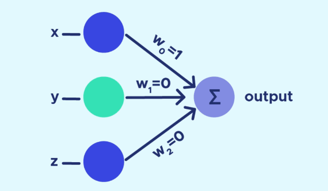
- Each perceptron can take input from one or more perceptrons and send output to one more more perceptrons 
- Neural networks are made up of layers in the most basic form of a neural network.
- There are 3 main layers:
- Input Layer: Made up of perceptrons that make simple decisions based on input 
- Hidden Layer: Perceptrons that make more complex decisions by weighing the results from the first layer 
- Output Layer: Produces the output of the program 
- 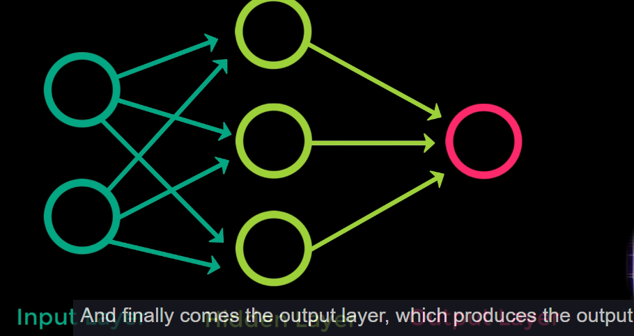
- It is possible for a neural network to have more than one hidden layer between the input layer and the output layer 
- 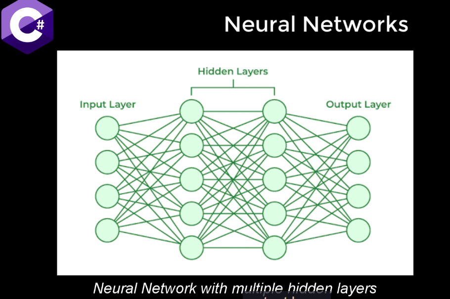
- When a neural network has multiple hidden layers, this enables it to make even more complex decisions. 
- It is called a deep neural network and it is able to work with massive amounts of data.
- Perceptrons are connected by connections and each connection has a weight associated with it. This determines how much influence each perceptron has on the other.  An activation function determines whether or not a perceptron should fire based on the sum of its inputs, weighted using the weight associated with the connection between the two.
- Learning occurs as the network gets input and gets better and better at producing the correct output, thanks to its adjusting its weights
- 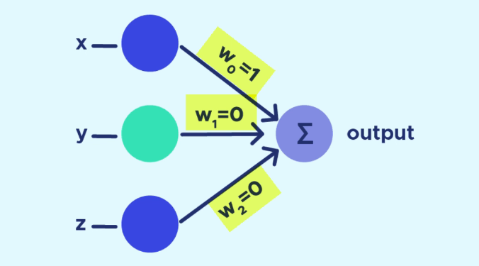
- 3 types of neural networks:
- Feed Forward Neural Networks: Data flows in one direction from input to output node. Each node is connected to the next node in the layer.
- Backpropagation Neural Networks : It is a type of Feedforward neural network which gives feedback that is uses to improve its decisions
- Convolutional Neural Networks: It detects patterns in the data based on images and spatial data
- These types are named based on how data flows from the input node to the output node.
- Lets understand with an example 
- 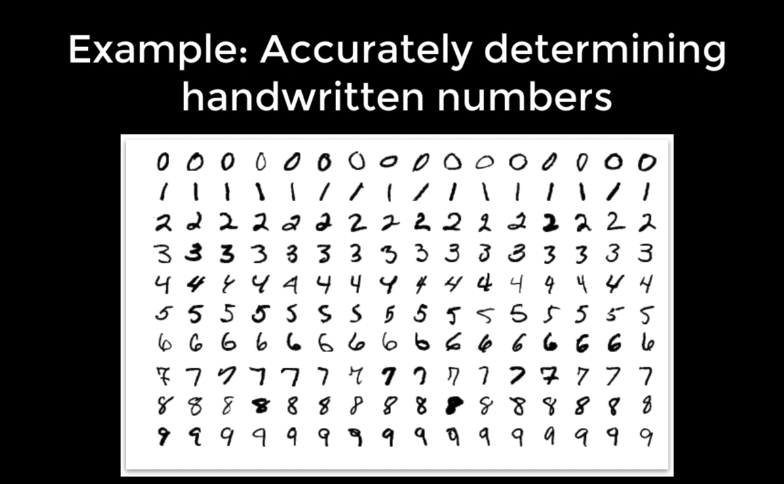
- We can show a lot of handwritten numbers along with their correct values. Neural networks adjust their weights based on its understanding to get better at recognizing the numbers
- Once trained, a neural network can look at a new handwritten number and tell us what it thinks it is, just like human beings do. 

## Machine Learning 
- subfield of AI 
- Lets say we make an algorithm to add 2 numbers
- 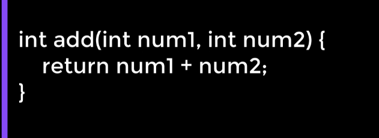
- With machine learning, we do the opposite. We give the program the data and the expected results and then it comes up with the algorithm. 
- We can provide a pair of numbers and their solutions and it will infer from the data 
- In machine learning, we refer to the AI as the model and there are 2 phases a model goes through: 
- 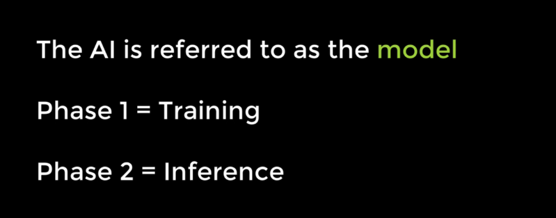
- In training we provide data to train the model 
- 3 main types of ML
- 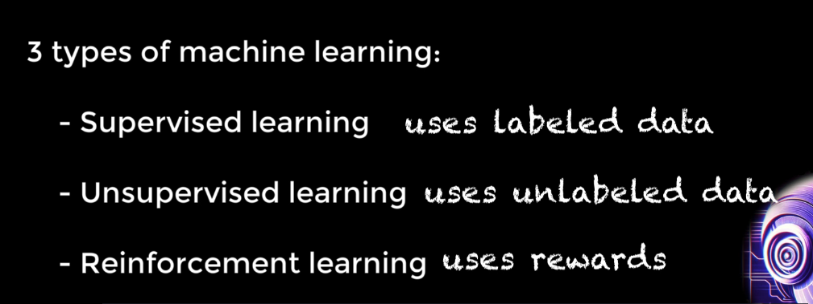
- In supervised learning the model builds a profile of an object based on its labels
- In unsupervised learning, it  builds a profile of similar looking objects by understanding the patterns between them and grouping them accordingly. 
- In reinforcement learning, we have a system of rewards and punishments. If the model correctly identifies the picture of an apple as an apple, we may reward it with a positive score. If it incorrectly labels, we provide a negative score. The model will try the max positive score as possible .

## Q-Learning
- Fundamental concept in reinforcement learning that focuses on learning the optimal action-selection strategy given a particular state of the environment. The agent learns to make decisions by interacting with its environment.
- Imagine playing a video where we control a character navigating through a maze. 
- 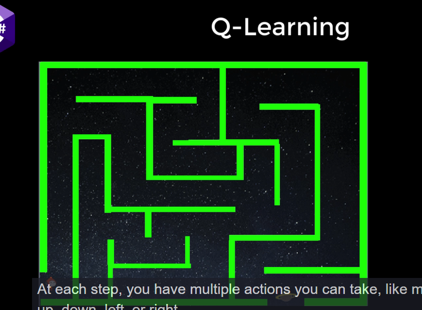
- At each step we can take multiple actions like moving up, down, left and right. 
- The goal is to reach the end of the maze while maximizing our score or reward. 
- In Q-Learning, we use a table called the Q-Table to keep track of the expected future rewards for each possible action in each state of the environment. 
- Each cell in the Q-table represents the "quality" or "value" of taking a particular action in a specific state.
- We start by initializing the Q-table with arbitrary values or zeroes. 
- Then the agent selects an action to take in the current state based on the exploration-exploitation strategy. 
- Initially, the agent explores the environment by taking random actions. 
- Overtime, it gradually shifts towards exploiting the learned information to choose actions that maximize future rewards. 
- After taking an action and observing the resulting state and reward, the agent updates the Q-value for the current state action pair using the following Q-learning update rule:
- 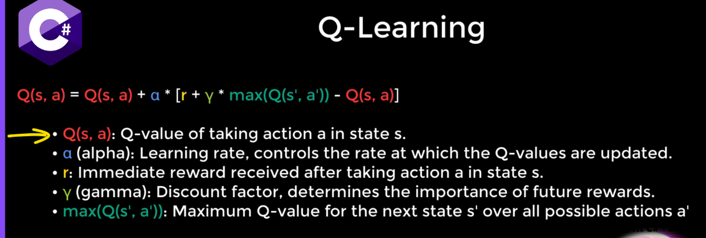
- As the agent learns more about the environment, we decrease the exploration rate over time, allowing the agent to focus more on exploiting the learned information. 
- The Q-Learning process continues until the Q values converge to their optimal values, indicating that the agent has learned the optimal action selection strategy for each state. 
- 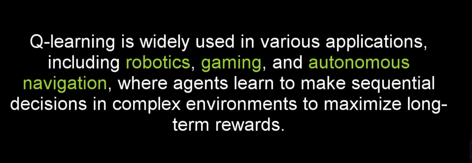
- Used in autonomous navigation systems. 
- Main weakness of traditional Q-learning is that it isnt very scalable for more complex environments. 
- It uses a table to store the Q-values, which can become impossible to manage as the state and action spaces get larger for the more complex environments. 
- This is where deep Q-learning becomes advantageous. 

## Deep Q-Learning 
- It leverages deep neural networks to approximate the Q-values instead of using a tabular representation. 
- This approach known as function approximations, allows DQN to handle high dimensional state spaces such as images or raw sensor data, making it suitable for a wide range of complex environments including video games, robotics and autonomous navigation. 
- 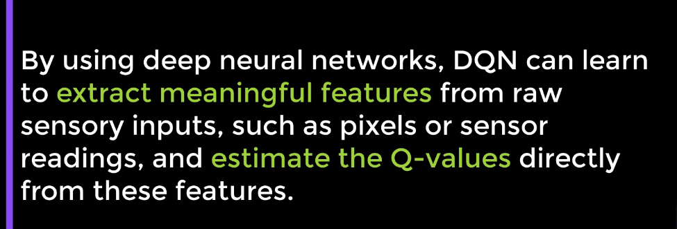
- This enables DQN to generalize across similar states and actions, making it more efficient and scalable compared to traditional tabular Q-Learning. 
- 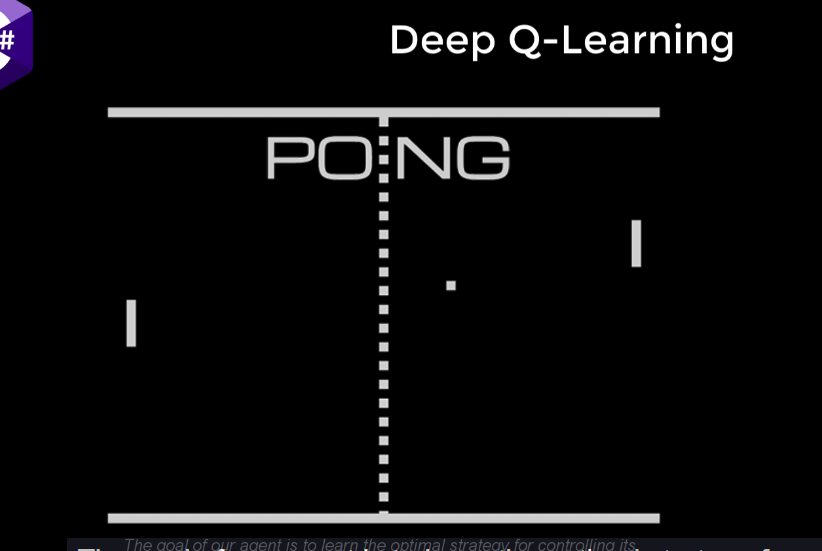
- In pong, we represent the game state as an image frame, where each frame shows the current state of the game, including positions of the paddle and the ball. 
- Agent takes actions based on these image frames, such as moving its paddle up or down, or staying still. 
- 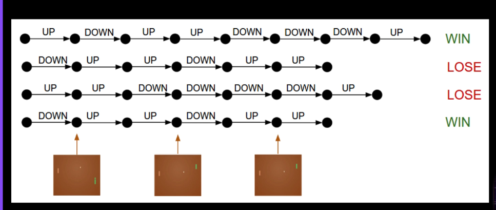
- Agents goal is to learn a Q-function, represented by a deep neural network that estimates the expected future rewards for each possible action given the current state. 
- The neural network takes the image frame of the current state as input and outputs the Q-values for all possible actions. 
- During training the agent interacts with the game environment taking actions based on an epsilon greedy exploration strategy. 
- It collects experience tupes, a tuple with state,action,reward,nextState and uses them to update the Q network parameters using a variant of Q-learning algorithm called deep Q-Learning. 
- 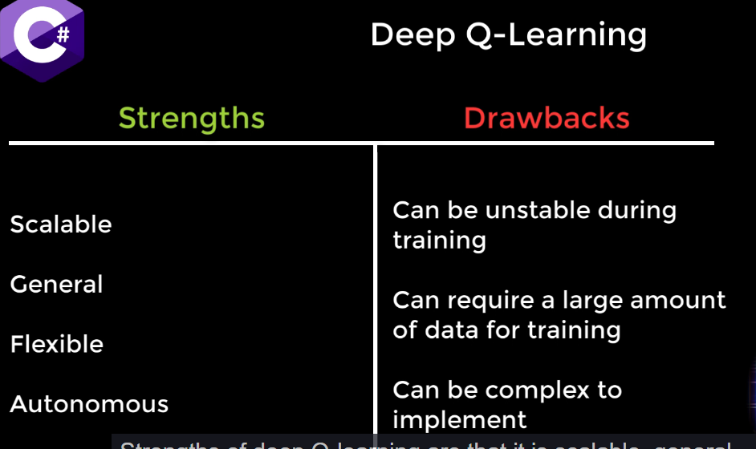
- 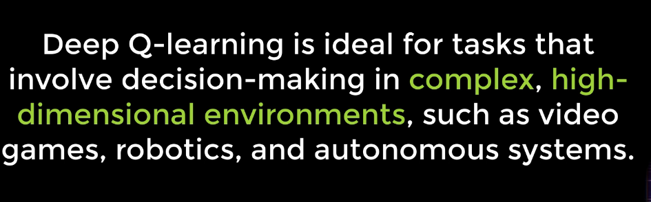
- However deep Q-learning is not very good working with raw pixel data from images.
- For this purpose we have Deep convolutional Q-learning. 

## Deep Convolutional Q-Learning
- It is a type of reinforcement learning algorithm that uses deep convolutional neural networks(CNNs) to learn to make decisions in complex environments, particularly those with high dimensional input spaces like images or raw sensory data. 
- 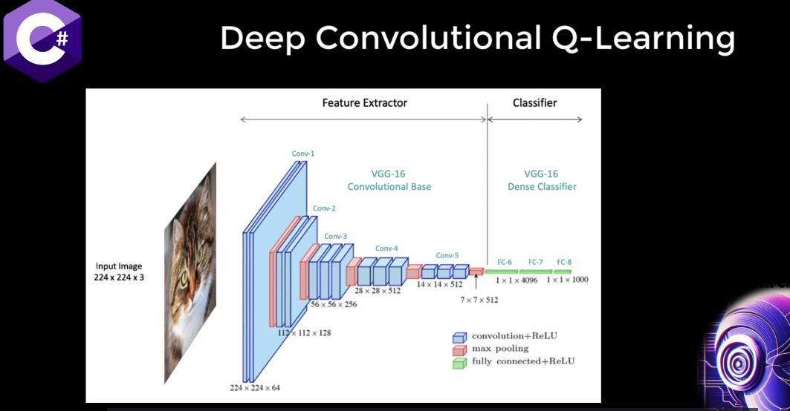
- A CNN is a type of artificial neural network based on how humans see. 
- They are composed of layers of neurons called convolutional layers that apply filters, also called kernels to input data to extract features. 
- 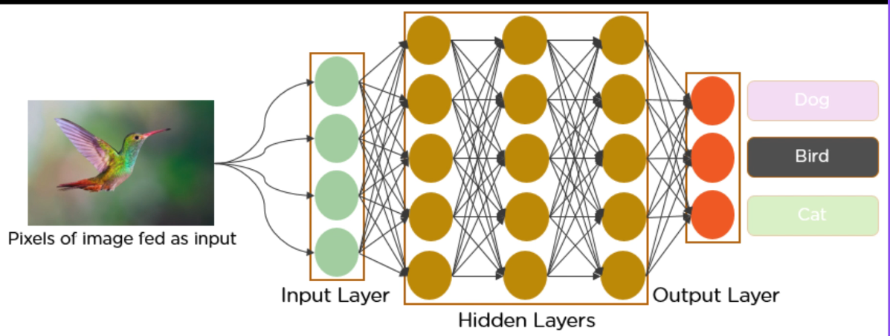
- CNNs are designed to capture spatial hierarchies and patterns in data making them well suited for tasks like image classification and object detection. 
- Here,CNNs learn effective decision making policies in environments with high dimensional input spaces.
- Input is raw sensory data like images or video games. 
- CNN processes the input data, extracting meaningful features that capture spatial relationships and patterns in the environment. 
- Output of the CNN is fed into fully connected layers that estimate the Q- values for all possible actions. 
- e.g environmental monitoring with drones. 
- Goal of these drones is to monitor environmental changes, detect potential threats like wildfires or deforestation and make informed decisions to protect the ecosystem. 
- 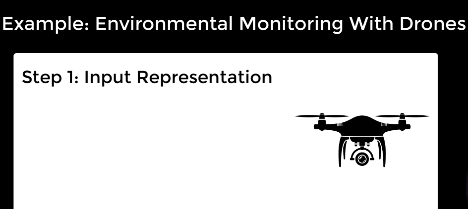
- In the input each drone captures images of the forest area using on-board cameras. 
- These images provide visual information about the vegetation, terrain and any potential threats or changes in the environment. 
- Raw image data is fed into a CNN, which processes the images and extracts features relevant to the environmental monitoring such as density and distribution of vegetation, presence of water bodies and signs of deforestation and wildfire. 
- 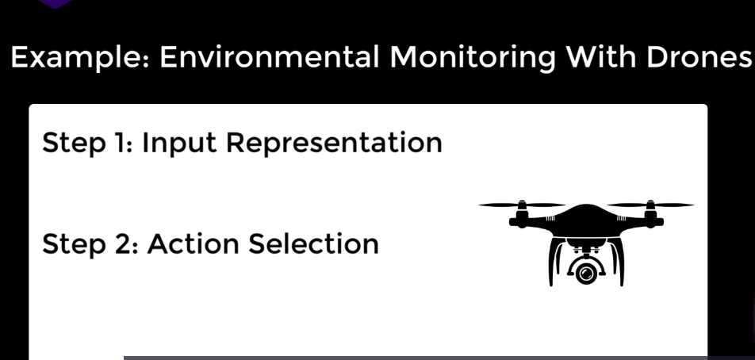
- In the next step, we do action selection, at which point the output of the CNN is passed to the fully connected layers that estimate the Q-values for different drone locations. Based on these Q-values, the drone takes an action aiming to maximize the effectiveness of monitoring and detection while conserving energy and resources.
-  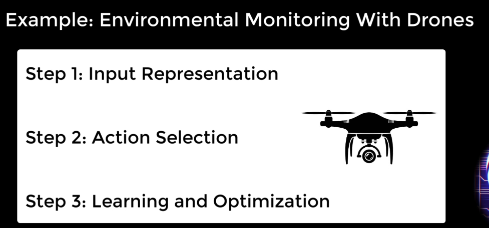
-  Positive rewards are given for actions that contribute to effective environmental monitoring such as detecting changes in vegetation health. 
-  Negative rewards or penalties are given for actions that result in inefficiencies or failures, such as colliding with obstacles or running out of battery. 
-  The deep convolutional Q-learning algorithm updates the Q-values based on the observed rewards and transitions between states and actions enabling the drone to learn optimal strategies. 
-  Overtime, the drone learns how to effectively navigate the forest environment. 
-  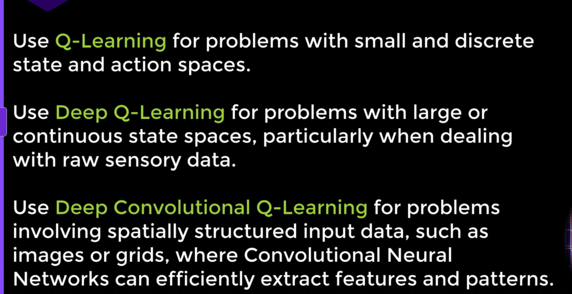
  
## Asynchronous Advantage Actor-Critic(A3C)
- It is a type of reinforcement learning algorithm designed for training agents to interact with environments and make decisions in real-time
- 4 parts of A3C 
- 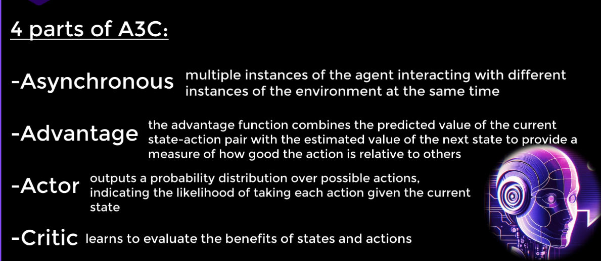
- A3C vs Q-Learning
- A3C is probabilistic vs Q-learning which is deterministic
- 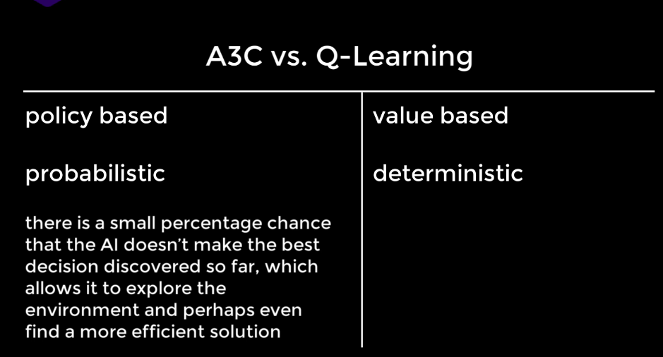
- 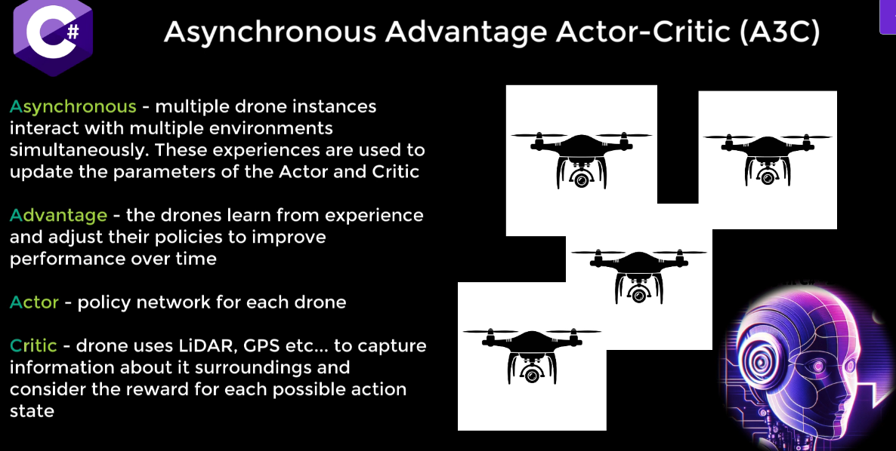
- Drones learn from experience and adjust their policies to improve performance over time. 
- For e.g if a drone encounters traffic in a particular area, it may learn to re-route to avoid congestion. 
- If it encounters a high building, it may increase it altitude to skip the obstacle. 
- 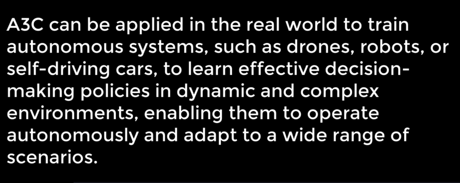

## Large Language Models (LLMs)
- Type of AI powered by neural networks 
- 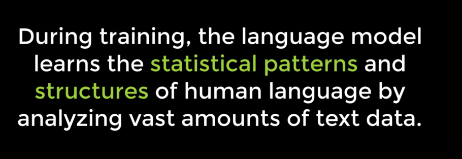
- It is like a smart assistant that can analyze and generate text such as completing sentences, translating languages or even writing articles. 
- LLMs can perform large number of tasks involving natural language processing or NLP. 
- 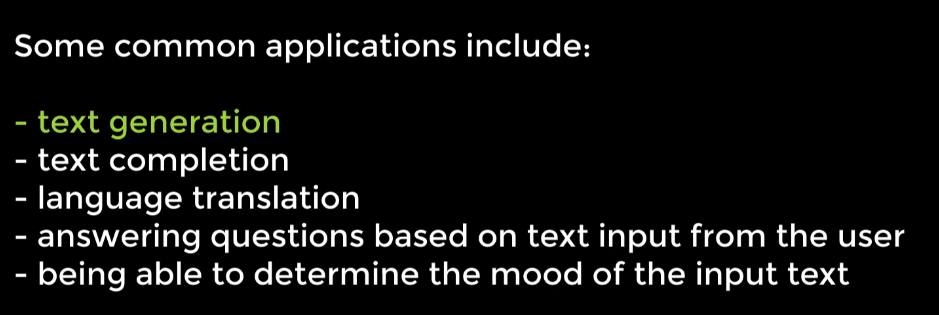
- 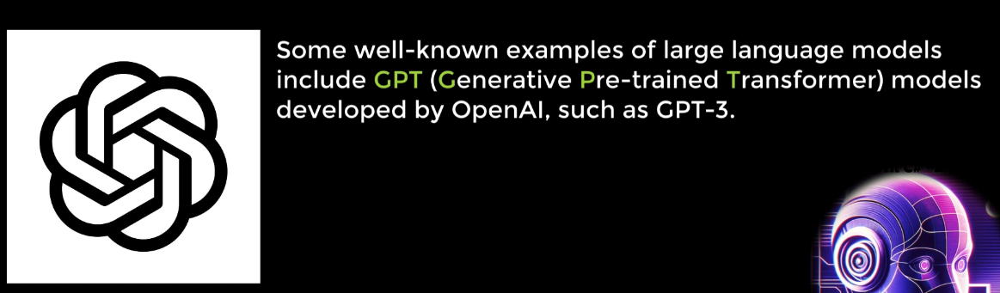
- These models have been trained on massive amounts of text data. 
- ChatGPT is a variant of the GPT model specifically fine tuned for conversational interactions. It is trained on a dataset containing conversational data such as social media conversations, chat logs and customer support interactions. 
- Gives better performance in conversational context. 
- 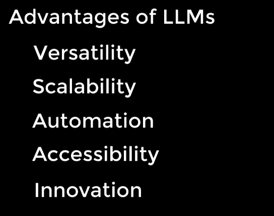
- LLMs are blackbox systems 
- 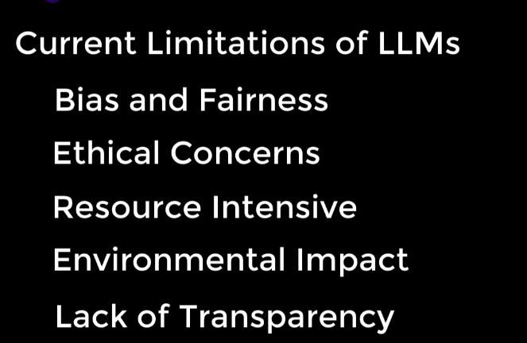
- LLM powered chatbots can help in customer service interactions and reduce workload on human agents. 
- LLMs can generate clinical notes and assist with medical documentation. 
- They can convert spoken or handwritten medical records into structured text to improve accuracy and efficiency of healthcare administration. 
- 

## Generative AI 
- Type of AI that can be used to generate new, original data or content based on patterns learned from existing data. 
- Unlike traditional AI models that focus on tasks like classification, regression or prediction, generative AI models can create new data samples that are similar to the one in the training data set but are not the exact copies. . 
- These models work by learning the underlying statistical patterns and structures of the data during the training process. 
- Once trained, these models can generate new data samples by sampling from the learned distribution of the data. 
- 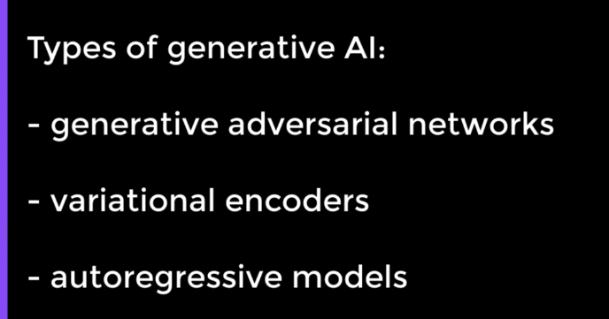
- 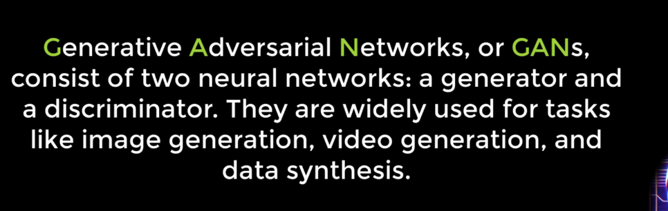
- The generator generates fake data samples like images from random noise.
- The discriminator tries to distinguish between real data samples, like actual images and fake ones generated by the generator.
- Through adversarial training, the generator learns to generate more realistic data samples, while the discriminator learns to become better at distinguishing between the real and fake data samples.
- GANs are widely used for tasks like image generation, video generation, and data synthesis.

### Variational Encoders
- Variational encoders, or VAEs, are probabilistic generative models that learn a latent representation of the input data.
- They consist of an encoder network that maps input data to a latent space, and a decoder network that generates new data samples from the latent space. VAEs aim to learn the underlying distribution of the input data and generate new data samples by sampling from this distribution.
- They are commonly used for tasks like image generation, anomaly detection, and data compression.

### Autoregressive Models 
- Autoregressive models generate data sequentially, one element at a time based on the probability distribution of the next element given the previous elements.
- Examples of autoregressive models include recurrent neural networks or RNNs, transformer models and language models like GPT.
- Autoregressive models are commonly used for tasks like text generation, language translation, and sequence prediction.
- 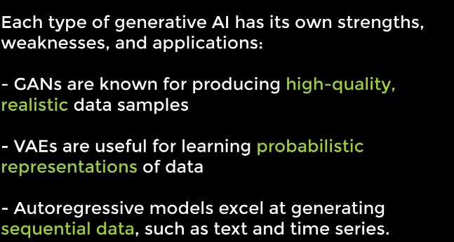
- 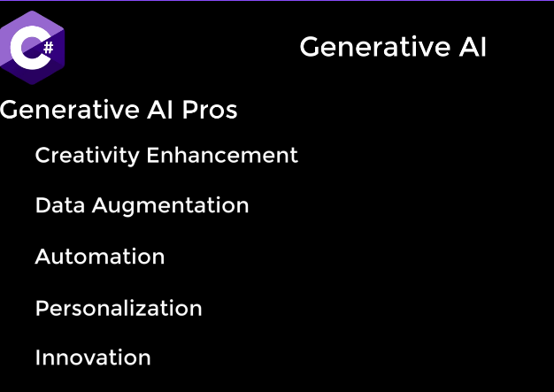
- 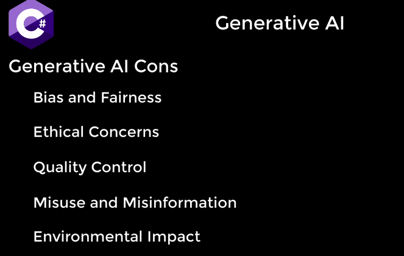


## Computer Vision 
 - Type of AI that focuses on enabling computers to interpret and understand visual information from the real world. 
 - It involves developing algorithms and techniques that allow machines to extract meaningful insights from digital images or videos, similar to how humans perceive and interpret visual stimuli.
 - 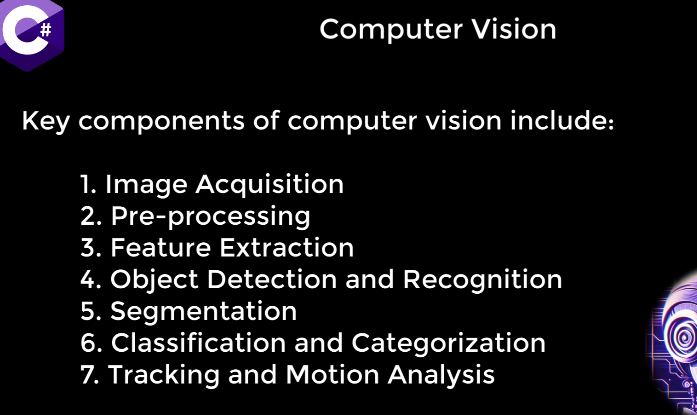
 - 
 - We can use the Computer Vision program described above to analyze live video feeds from surveillance cameras and identify potential security threats such as unauthorized intruders, suspicious packages, or prohibited items.
 - The program continuously processes video frames in real time, detecting and classifying objects within the scene. 
 - When it detects a suspicious object or activity, it triggers an alert notification to alert security personnel, who can then take appropriate action to investigate and respond to the potential threat.
 - 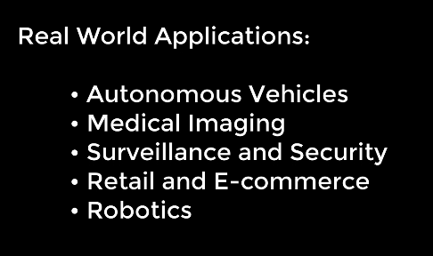
 - Computer Vision can be used in Radiology.


## Generative AI with ChatGPT 
- 
- GPT --> Generative Pre-trained Transformer 
- Trained on large amounts of text from the Internet 
- 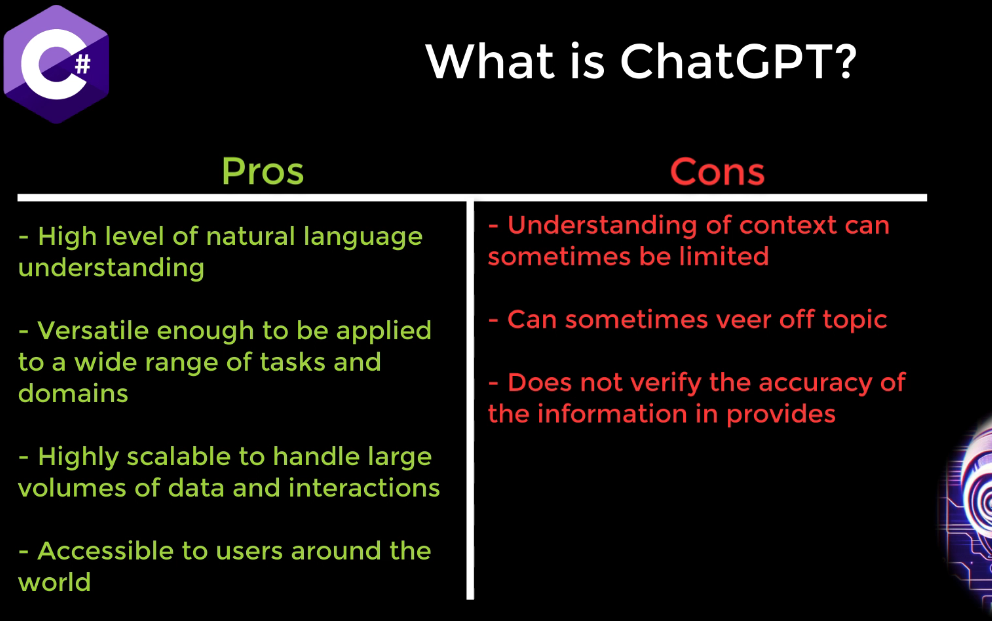
- 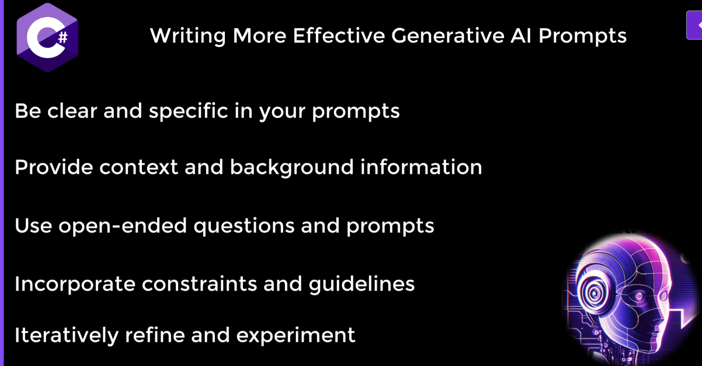

## AI that solves mazes
- 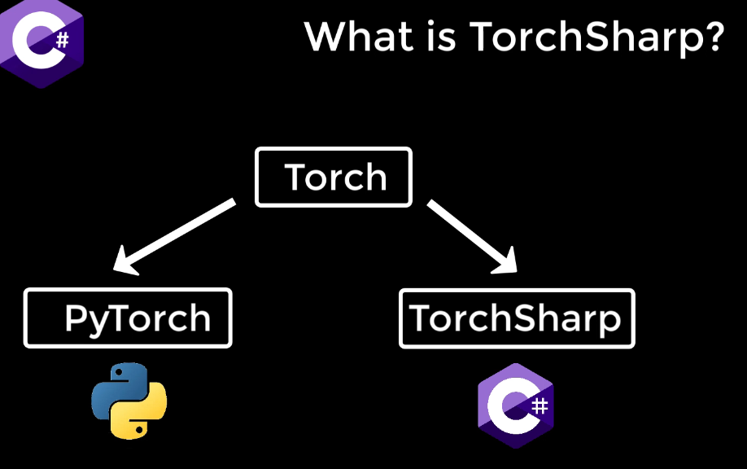
- PyTorch is a python based library that is used to build machine learning models. 
- Under the hood it uses torch library 
- TorchSharp is the .NET equivalent of PyTorch 
- It is open-source. 
- TorchSharp is a .NET library that provides access to the library that powers PyTorch. It is part of the .NET Foundation.
- The focus is to bind the API surfaced by LibTorch with a particular focus on tensors. The design intent is to stay as close as possible to the Pytorch experience, while still taking advantage of the benefits of the .NET static type system where it makes sense. For example: method overloading is relied on when Pytorch defines multiple valid types for a particular parameter.
- We will create a new project and install the following packages:
```shell 
dotnet add package TorchSharp --version 0.102.4
dotnet add package libtorch-cpu-win-x64 --version 2.2.1.1

```
- This maze has three values zero, one, and two.
- Anywhere you see a zero represents part of a wall.
- The ones are the floor tiles and the two is the goal.
- Then we will start at row 11, column five, which is at the bottom middle row zero, column five at the bottom and the top middle is the goal(where there is a 2)
- But keep in mind that the we can only move anywhere there is a one.
- The zeros in this multi-dimensional array are walls.So we will need to learn to avoid the walls.
- Our maze looks like this 
```c#
int[,] maze1 = {
    //0   1   2   3   4   5   6   7   8   9   10  11
    { 0 , 0 , 0 , 0 , 0 , 2 , 0 , 0 , 0 , 0 , 0 , 0 }, //row 0
    { 0 , 1 , 1 , 1 , 1 , 1 , 1 , 1 , 1 , 1 , 1 , 0 }, //row 1
    { 0 , 1 , 0 , 0 , 0 , 0 , 0 , 0 , 0 , 1 , 1 , 0 }, //row 2
    { 0 , 1 , 1 , 0 , 1 , 1 , 1 , 1 , 0 , 1 , 1 , 0 }, //row 3
    { 0 , 0 , 0 , 0 , 1 , 1 , 0 , 1 , 0 , 1 , 1 , 0 }, //row 4
    { 0 , 1 , 1 , 1 , 1 , 1 , 0 , 1 , 1 , 1 , 1 , 0 }, //row 5
    { 0 , 1 , 1 , 1 , 1 , 1 , 0 , 1 , 1 , 1 , 1 , 0 }, //row 6
    { 0 , 1 , 0 , 0 , 0 , 0 , 0 , 0 , 0 , 1 , 1 , 0 }, //row 7
    { 0 , 1 , 0 , 1 , 1 , 1 , 1 , 1 , 0 , 1 , 1 , 0 }, //row 8
    { 0 , 1 , 0 , 1 , 0 , 0 , 0 , 1 , 0 , 1 , 1 , 0 }, //row 9
    { 0 , 1 , 1 , 1 , 0 , 1 , 1 , 1 , 0 , 1 , 1 , 0 }, //row 10
    { 0 , 0 , 0 , 0 , 0 , 1 , 0 , 0 , 0 , 0 , 0, 0 }  //row 11 (start position is (11, 5))
};

```

### Setting up the Actions and Rewards
- An action is any choice an AI can make 
- 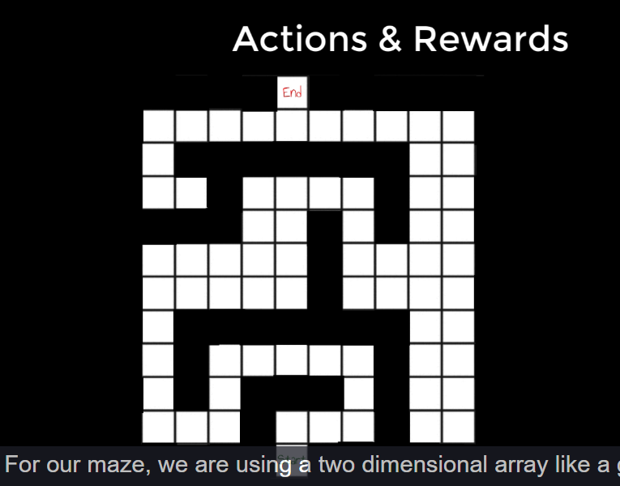
- Our AI has 4 possible action: Left, Right, Up, Down 
- 
- This program demonstrates the concept of reinforcement learning by training a model to navigate through a maze. Reinforcement learning is a type of machine learning where an agent learns to make decisions by interacting with an environment and receiving feedback in the form of rewards or penalties.
- The program starts by defining a maze represented as a 2D array. Each cell in the maze has a specific value indicating whether it is a wall, a floor, or the goal. The program then sets up the rewards for each cell in the maze based on these values.
- Next, the program initializes the Q-values tensor, which represents the expected future rewards for taking a particular action in a specific state. The Q-values are initially set to zero.
- The program then defines several helper functions. The determineNextAction function selects the next action to take based on the epsilon-greedy policy, which balances exploration and exploitation. The moveOneSpace function moves the model one space in the maze based on the selected action. The hasHitWallOrEndOfMaze function checks if the model has hit a wall or the end of the maze.
- The main function, trainTheModel, trains the model to navigate through the maze using reinforcement learning. It iterates through a series of episodes, where each episode is a round of training. In each episode, the model starts at the beginning of the maze and takes actions to navigate through the maze until it reaches a wall or the end. At each step, the model selects an action, updates the Q-values using the Q-learning algorithm, and learns from the rewards received.
- After training is complete, the program provides a function called navigateMaze to visualize the path taken by the model in the maze based on the learned Q-values. It prints the moves made by the model, displaying the move count and the coordinates of each move.
- By running this program, you can gain a better understanding of reinforcement learning and how it can be applied to solve problems such as maze navigation.
- In this program, the Q-values for the maze are stored in a tensor called qValues.
- A tensor is a multi-dimensional array that can hold numerical data. In this case, the qValues tensor has dimensions corresponding to the number of rows and columns in the maze, as well as the number of possible actions.
- The Q-values represent the expected future rewards for taking a particular action in a specific state. Each element in the qValues tensor corresponds to a specific cell in the maze and an action. The value at each element represents the Q-value for that cell-action pair.
- The setupQValues function is responsible for setting up the qValues tensor. It initializes all the values to zero, providing a starting point for reinforcement learning algorithms to update and learn from. The dimensions of the qValues tensor are determined by the number of rows and columns in the maze, as well as the number of possible actions.
- Throughout the training process, the Q-values in the qValues tensor are updated based on the rewards received and the expected future rewards. This allows the model to learn and make optimal decisions based on the learned Q-values.


```c#


using TorchSharp;
int[,] maze1 = {
    //0   1   2   3   4   5   6   7   8   9   10  11
    { 0 , 0 , 0 , 0 , 0 , 2 , 0 , 0 , 0 , 0 , 0 , 0 }, //row 0
    { 0 , 1 , 1 , 1 , 1 , 1 , 1 , 1 , 1 , 1 , 1 , 0 }, //row 1
    { 0 , 1 , 0 , 0 , 0 , 0 , 0 , 0 , 0 , 1 , 1 , 0 }, //row 2
    { 0 , 1 , 1 , 0 , 1 , 1 , 1 , 1 , 0 , 1 , 1 , 0 }, //row 3
    { 0 , 0 , 0 , 0 , 1 , 1 , 0 , 1 , 0 , 1 , 1 , 0 }, //row 4
    { 0 , 1 , 1 , 1 , 1 , 1 , 0 , 1 , 1 , 1 , 1 , 0 }, //row 5
    { 0 , 1 , 1 , 1 , 1 , 1 , 0 , 1 , 1 , 1 , 1 , 0 }, //row 6
    { 0 , 1 , 0 , 0 , 0 , 0 , 0 , 0 , 0 , 1 , 1 , 0 }, //row 7
    { 0 , 1 , 0 , 1 , 1 , 1 , 1 , 1 , 0 , 1 , 1 , 0 }, //row 8
    { 0 , 1 , 0 , 1 , 0 , 0 , 0 , 1 , 0 , 1 , 1 , 0 }, //row 9
    { 0 , 1 , 1 , 1 , 0 , 1 , 1 , 1 , 0 , 1 , 1 , 0 }, //row 10
    { 0 , 0 , 0 , 0 , 0 , 1 , 0 , 0 , 0 , 0 , 0, 0 }  //row 11 (start position is (11, 5))
};

const string UP = "up";
const string DOWN = "down";
const string LEFT = "left";
const string RIGHT = "right";

string[] actions = [UP, DOWN, LEFT, RIGHT ];

int[,] rewards;

const int WALL_REWARD_VALUE = -500;
const int FLOOR_REWARD_VALUE = -10;
const int GOAL_REWARD_VALUE = 500;

//This function sets up the rewards for the maze for each cell
void setupRewards(int[,] maze, int wallValue, int floorValue, int goalValue)
{
    int mazeRows = maze.GetLength(0);//0 dimension is the number of rows
    int mazeColumns = maze.GetLength(1); // 1 dimension is the number of columns
    rewards = new int[mazeRows, mazeColumns];

    for (int i = 0; i < mazeRows; i++)
    {
        for (int j = 0; j < mazeColumns; j++)
        {
            switch (maze[i, j])//example value of maze[i,j] is 0, if it is 0, then it is a wall
            {

                case 0:
                    rewards[i, j] = wallValue;
                    break;
                case 1:
                    rewards[i, j] = floorValue;
                    break;
                case 2:
                    rewards[i, j] = goalValue;
                    break;
            }
        }
    }
}

torch.Tensor qValues;
//The setupQValues function is responsible for setting up the Q-values for each cell in the maze.
//Q-values are used in reinforcement learning algorithms to estimate the expected future rewards for taking a particular action in a specific state.
//Overall, the setupQValues function sets up the Q-values tensor with the appropriate dimensions and initializes all the values to zero, providing a starting point for reinforcement learning algorithms to update and learn from.
//A tensor is a fundamental data structure in many programming frameworks, including TorchSharp.
//It is a multi-dimensional array that can hold numerical data. Tensors are similar to arrays or matrices, but they have additional properties and operations that make them suitable for mathematical computations and machine learning algorithms.
//TorchSharp provides a rich set of functions and methods to create, manipulate, and perform computations on tensors. These operations enable efficient numerical computations and make it easier to implement machine learning algorithms.
//In the context of reinforcement learning, tensors can be used to store Q-values, states, actions, and other relevant data
void setupQValues(int[,] maze)
{
    int mazeRows = maze.GetLength(0);
    int mazeColumns = maze.GetLength(1);
    qValues = torch.zeros(mazeRows, mazeColumns, actions.Length);
}


// Function will return true if the model has hit a wall or goal and false if the model landed on a floor tile.
bool hasHitWallOrEndOfMaze(int currentRow, int currentColumn, int floorValue)
{
    return rewards[currentRow, currentColumn] != floorValue;
}

//Determine the next action to take 
long determineNextAction(int currentRow, int currentColumn, float epsilon)
{
   Random randon = new Random();
   double randomBetween0And1 = randon.NextDouble();
    // this line of code selects the next action to take in the maze based on a random number and the epsilon value.
    // If the random number is less than epsilon, it chooses the action with the highest Q-value for the current cell. Otherwise, it selects a random action from the available actions.

    long nextAction = randomBetween0And1 < epsilon ? torch.argmax(qValues[currentRow, currentColumn]).item<long>() : randon.Next(actions.Length);
    return nextAction;
}

//Move the model one space in the maze
(int,int) moveOneSpace(int[,] maze,  int currentRow, int currentColumn, long currentAction)
{
    int mazeRows = maze.GetLength(0);
    int mazeColumns = maze.GetLength(1);
    int nextRow = currentRow;
    int nextColumn = currentColumn;

    //Move UP, DOWN, LEFT, RIGHT in the maze
    if (actions[currentAction] == UP && currentRow > 0)
    {
        nextRow--;
    } else if (actions[currentAction] == DOWN && currentRow < mazeRows - 1)
    {
        nextRow++;
    }
    else if (actions[currentAction] == LEFT && currentColumn > 0)
    {
        nextColumn--;
    }
    else if (actions[currentAction] == RIGHT && currentColumn < mazeColumns - 1)
    {
        nextColumn++;
    }

    return (nextRow, nextColumn);
}

// The function trainTheModel is responsible for training a model to navigate through a maze using reinforcement learning.
// It takes the maze, floor value, epsilon, discount factor, learning rate, and number of episodes as input parameters.
// The function iterates through a series of episodes, where each episode is a round of training.
// In each episode, the model starts at the beginning of the maze and takes actions to navigate through the maze until it reaches a wall or the end of the maze.
// At each step, the model selects an action based on the epsilon-greedy policy
// and updates the Q-values using the Q-learning algorithm.
// The Q-values represent the expected future rewards for taking a particular action in a specific state.
// The Q-learning algorithm uses the temporal difference error to update the Q-values based on the reward received and the expected future rewards.
// The model learns to navigate through the maze by updating the Q-values through multiple episodes of training.
// After training is complete, the model can use the learned Q-values to make optimal decisions and navigate through the maze efficiently.
// The trainTheModel function is a key component of the reinforcement learning process and enables the model to learn from experience and improve its performance over time.
void trainTheModel(int[,] maze, int floorValue, 
    float epsilon, float discountFactor, float learningRate, float episodes)
{
    for(int episode = 0; episode < episodes; episode++)
    {
        //Each episode is a round of training
        Console.WriteLine("-----Starting episode " + episode + "-----");
        //Set the starting position of the model
        int currentRow = 11;
        int currentColumn = 5;

        while (!hasHitWallOrEndOfMaze(currentRow, currentColumn, floorValue))
        {
            long currentAction = determineNextAction(currentRow, currentColumn, epsilon);
            int previousRow = currentRow;
            int previousColumn = currentColumn;
            (int,int) nextMove = moveOneSpace(maze, currentRow, currentColumn, currentAction);
            currentRow = nextMove.Item1;
            currentColumn = nextMove.Item2;
            float reward = rewards[currentRow, currentColumn];
            float previousQValue = qValues[previousRow, previousColumn, currentAction].item<float>();
            float temporalDifference = reward + discountFactor * torch.max(qValues[currentRow, currentColumn]).item<float>() - previousQValue;
            float nextQValue = previousQValue + (learningRate * temporalDifference);
            qValues[previousRow, previousColumn, currentAction] = nextQValue;
        }

        Console.WriteLine("-----Finished episode " + episode + "-----");

    }

    Console.WriteLine("Training complete!");
}

//The function navigateMaze is responsible for navigating through a maze based on the learned Q-values. It takes the maze, starting row and column, floor value, and wall value as input parameters.
//The function first initializes an empty list called path to store the coordinates of the model's movement in the maze. If the starting position is a wall or the end of the maze, the function immediately returns an empty list.
//If the starting position is a valid floor tile, the function enters a while loop. Inside the loop, it selects the next action to take based on the epsilon value of 1.0, which means it always chooses the action with the highest Q-value for the current cell.
//The function then moves the model one space in the maze based on the selected action using the moveOneSpace function. It updates the current row and column accordingly.
//If the next position is not a wall, it adds the current position to the path list. Otherwise, it continues to the next iteration of the loop.
//Once the model reaches a wall or the end of the maze, the function exits the loop. It then iterates through the path list and prints the moves made by the model, displaying the move count and the coordinates of each move.
//Finally, the function returns the path list, which contains the coordinates of the model's movement in the maze.
//This function allows you to visualize the path taken by the model in the maze based on the learned Q-values, providing insights into the model's decision-making process and its ability to navigate through the maze efficiently.
List<int[]> navigateMaze(int[,] maze, int startRow, int startColumn, int floorValue, int wallValue)
{
    List<int[]> path = new List<int[]>();
    if (hasHitWallOrEndOfMaze(startRow, startColumn, floorValue))
    {
        return [];
    }
    else
    {
        int currentRow = startRow;
        int currentColumn = startColumn;
        path = [[currentRow, currentColumn]];
        while (!hasHitWallOrEndOfMaze(currentRow, currentColumn, floorValue))
        {
            int nextAction = (int) determineNextAction(currentRow, currentColumn, 1.0f);
            (int, int) nextMove = moveOneSpace(maze, currentRow, currentColumn, nextAction);
            currentRow = nextMove.Item1;
            currentColumn = nextMove.Item2;
            if(rewards[currentRow, currentColumn] != wallValue)
            {
                path.Add([currentRow, currentColumn]);
            }
            else
            {
                continue;
            }
        }
    }

    int moveCount = 1;
    for(int i = 0; i < path.Count; i++)
    {
        Console.WriteLine("Move " + moveCount + ": (");
        foreach(int element in path[i])
        {
            Console.WriteLine(" "+element);
        }
        Console.WriteLine(" )");
        Console.WriteLine();
        moveCount++;
    }

    return path;
}

const float EPSILON = 0.95f;
const float DISCOUNT_FACTOR = 0.8f;
const float LEARNING_RATE = 0.9f;
const int EPISODES = 1500;
const int START_ROW = 11;
const int START_COLUMN = 5;

setupRewards(maze1, WALL_REWARD_VALUE, FLOOR_REWARD_VALUE, GOAL_REWARD_VALUE);
setupQValues(maze1);
trainTheModel(maze1, FLOOR_REWARD_VALUE, EPSILON, DISCOUNT_FACTOR, LEARNING_RATE, EPISODES);
navigateMaze(maze1, START_ROW, START_COLUMN, FLOOR_REWARD_VALUE, WALL_REWARD_VALUE);


```
### Result is as follows: 
- 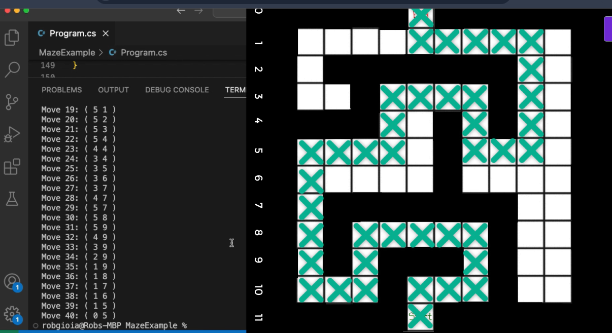

## Neural Networks
- It is basically as a digital brain
- It consists of neurons which receive an input and produces an output. 
- This neuron applies a mathematical function called an activation function on the inputs to produce the output 
- 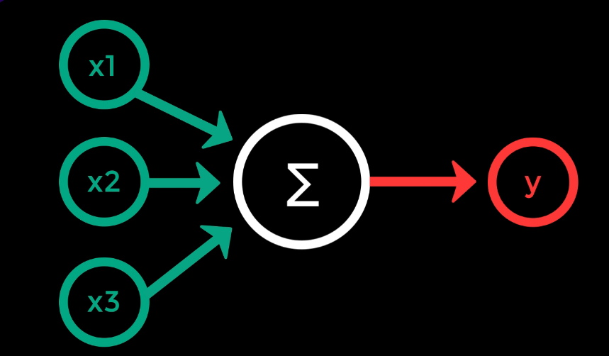
- 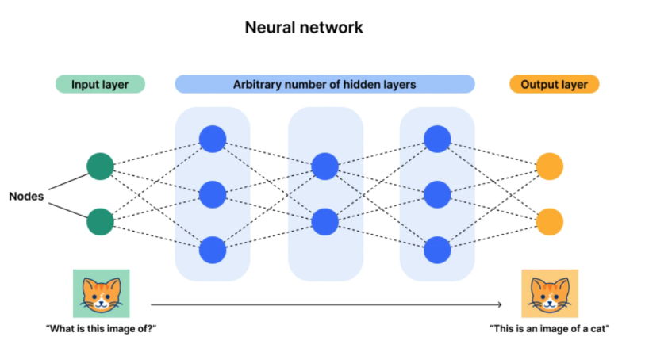
- Neurons are organized into layers 
- 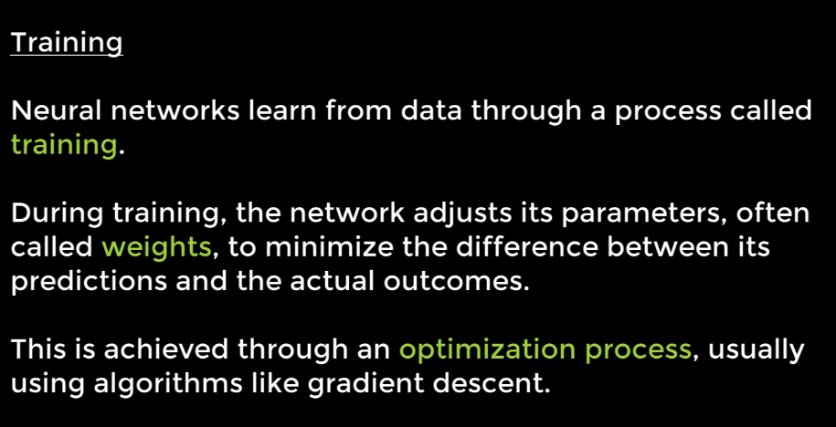
- Imagine we want to build a system that recognizes handwritten digits 
- We feed a neural network images of handwritten digits along with their corresponding labels 
- The neural network learns to extract features from the image like edge, curves and patterns 
- In the output later, the network assigns probability to each digit. 
- For instance, if the network predicts a high probability for digit five, it means it's confident that the input image represents the digit five.
- 

### Neural Network Architecture  
- 
- Main components of neural network architecture are:
- Neurons 
- Layers 
- Weighted Connections 
- 
- Neurons are organized into layers 
- Each layer connects to the next. 
- The number of neurons in each layer can vary 
- Weights determine strength of influence on the neuron 
- 
#### Feed-Forward Neural Network 
- 
- Used for tasks like classification and regression. 
- Lets say we have an image of an fruit, this neural network can help recognize it based on the input features.
- To train this network, we need labelled data.
- Once trained, this neural network can now take in new input data like the color and size of a fruit, and predict whether it's an apple or an orange.

#### Convolutional Neural Network 
- 
- Convolutional neural networks, or CNNs, are specialized for processing grid like data such as images.
- They consist of convolutional layers that extract features from input images, followed by pooling layers for downsampling and fully connected layers for classification.
- Imagine you want to build a system that can recognize whether a picture contains a cat or a dog.
A CNN can help you achieve this.
- In a CNN, the first layer is typically a convolutional layer. This layer consists of tiny filters, also called kernels or feature detectors. Each filter slides across the input image pixel by pixel, and performs a mathematical operation called convolution.
- As the filters slide over the image, they detect patterns such as edges, textures, and shapes.
- These patterns are the building blocks of objects in the image.
- For example, one filter might detect horizontal edges while another detects vertical edges.
- After convolution, the result passes through an activation function such as ReLU, which stands for
rectified linear unit. This function introduces non-linearity to the network, allowing it to learn complex relationships between features.
- Next, the output from the convolutional layer is typically passed through a pooling layer.
- Pooling helps reduce the spatial dimensions of the input, making the network more computationally efficient and less sensitive to small changes in the input after several convolutional and pooling layers.
- The extracted features are flattened into a vector and passed to one or more fully connected layers.
- These layers perform high level reasoning and decision making based on the learned features.
- Finally, the output layer of the CNN contains neurons corresponding to the possible classes like cat
or dog.
- To train a CNN, we need a dataset of labelled images like images of dogs,cats etc. 
- Once trained, if fed an image, the neural network can predict whether it is a cat or dog. 

#### Recurrent Neural Network 
- 
- Recurrent neural networks, or RNNs, are designed to handle sequential data where the order of inputs
matters.
- They have connections that loop back on themselves, allowing them to capture temporal dependencies
in the data.
- RNNs are widely used in tasks like speech recognition, language modeling, and time series prediction.
- Imagine you want to build a system that generates text, one character at a time, based on a given
input. An RNN can help you achieve this by remembering the context of the previous characters as it generates the next one.
- At its core, RNN consists of a chain of repeating neural network modules or cells.
- Each cell takes in two inputs the current input, like the character and the hidden state from the previous cell.
- The hidden state acts as the memory of the network, capturing information about past inputs.
- As the input sequence is fed into the RNN one element at a time, the hidden state is updated at each
step based on the current input and the previous hidden state.
- This process allows the network to maintain context and capture dependencies between sequential elements.
- One variant is LSTM(Long short term memory) network.
- Suppose we want to generate a sentence based on a given starting word.
- We input the starting word into the RNN and let it generate the next word.
- Then we input the generated word back into the RNN along with the previous hidden state, and repeat
this process until we reach the desired length of the sentence.
- During training, the RNN learns to predict the next element in the sequence based on the previous elements.
- This is achieved by adjusting the parameters like weights and biases of the network using backpropagation through time or bptt, a variant of the backpropagation algorithm that takes into account the sequential nature of the data.
- 
- LSTM is much better for speech recognition, time-series prediction
- It builds a context of the input text.

### Creating a Neural Network 
- 
- We must understand the sigmoid function 
- 
- Think of a sigmoid function that takes in any input value and gives us a value between 0 and 1. 
- It can convert any value big or small and give us a value between 0 and 1 which is easy to work with. 
- 
- derivative of any function tells us how much the function is changing at any given point of time. 
- For the sigmoid function, its derivative tells you the rate at which the output is changing concerning
the input.
- When you take the derivative of the sigmoid function, you get another function that also depends on
the input value x.
- This derivative function helps us adjust the weights in our neural network during the training process.
- The derivative function is helpful because it tells us how quickly the output of the sigmoid function
is changing concerning the input x.
- We can use this information to adjust the parameters of our neural network during the training process, which helps our network learn and improve over time.

### Coding the Train Function
- The Train method in the NeuralNetwork class is responsible for training the neural network using a process called backpropagation. Let's break down the steps in the method:
1.	Iteration Loop: The method starts with a loop that iterates numberOfIterations times. This allows the neural network to update its weights multiple times to improve its performance.
2.	Forward Pass: Inside the loop, the Think method is called to perform a forward pass through the neural network. The Think method takes the trainingInputs as input and returns the output of the neural network.
3.	Error Calculation: The next step is to calculate the error between the expected output (trainingOutputs) and the actual output of the neural network. This is done by calling the PerformOperation method with the OPERATION.SUBTRACT operation. The PerformOperation method subtracts the trainingOutputs from the output obtained from the forward pass.
4.	Adjustment Calculation: The adjustment to the weights is calculated using the backpropagation algorithm. The backpropagation algorithm calculates the gradient of the error with respect to the weights and adjusts the weights accordingly. The adjustment is calculated by performing a series of matrix operations:
•	The Activate method is called with the output and true as arguments to calculate the derivative of the sigmoid activation function. The derivative is used to scale the error based on the slope of the activation function.
•	The PerformOperation method is called with the OPERATION.MULTIPLY operation to multiply the error by the derivative of the sigmoid function.
•	The DotProduct method is called with the transposed trainingInputs and the result of the previous operation to calculate the dot product between the transposed inputs and the error multiplied by the derivative.
•	Finally, the PerformOperation method is called with the OPERATION.ADD operation to add the adjustment to the current weights.
5.	Update Weights: The updated weights are assigned back to the weights variable of the neural network.
By repeating this process for the specified number of iterations, the neural network gradually adjusts its weights to minimize the error and improve its performance in producing accurate outputs for the given inputs.

```c#
public void Train(double[,] trainingInputs, double[,] trainingOutputs, int numberOfIterations)
{
    for (int iteration = 0; iteration < numberOfIterations; iteration++)
    {
        double[,] output = Think(trainingInputs);
        double[,] error = PerformOperation(trainingOutputs, output, OPERATION.SUBTRACT);
        double[,] adjustment = DotProduct(Transpose(trainingInputs), PerformOperation(error,Activate(output, true), OPERATION.MULTIPLY));
        weights = PerformOperation(weights, adjustment, OPERATION.ADD);
    }
}

 //The PerformOperation method takes two matrices and an operation as input and performs the specified operation on each element of the matrices.
 //n a neural network, element-wise operations are commonly used during the training process to update the weights based on the calculated error. The PerformOperation method allows for flexible and efficient computation of element-wise operations, such as addition, subtraction, and multiplication.
 //By using a nested loop, the method iterates over each element of the matrices and performs the specified operation based on the OPERATION parameter. The result is stored in a new matrix, which is then returned.
 //For example, during the training process, the PerformOperation method is used to subtract the predicted output from the desired output to calculate the error. It is also used to multiply the error with the derivative of the sigmoid function to adjust the weights. These element-wise operations are essential for updating the weights and improving the performance of the neural network.
 private double[,] PerformOperation(double[,] matrix1, double[,] matrix2, OPERATION operation)
 {
     int numberOfRows = matrix1.GetLength(0);
     int numberOfCols = matrix1.GetLength(1);
     double[,] result = new double[numberOfRows, numberOfCols];
     for (int row = 0; row < numberOfRows; row++)
     {
         for (int col = 0; col < numberOfCols; col++)
         {
             switch (operation)
             {
                 case OPERATION.ADD:
                     result[row, col] = matrix1[row, col] + matrix2[row, col];
                     break;
                 case OPERATION.SUBTRACT:
                     result[row, col] = matrix1[row, col] - matrix2[row, col];
                     break;
                 case OPERATION.MULTIPLY:
                     result[row, col] = matrix1[row, col] * matrix2[row, col];
                     break;
             }
         }
     }
     return result;
 }


```

### DotProduct Function
- The DotProduct function calculates the dot product of two matrices. The dot product is a mathematical operation that takes two matrices and produces a new matrix by multiplying corresponding elements and summing the results.
Here's an example to illustrate how the DotProduct function works:
- Suppose we have two matrices:
matrix1 = [[1, 2],
           [3, 4]]

matrix2 = [[5, 6],
           [7, 8]]

- The dot product of matrix1 and matrix2 can be calculated as follows:
- result = [[1*5 + 2*7, 1*6 + 2*8],
          [3*5 + 4*7, 3*6 + 4*8]]
- Simplifying the calculation, we get:
- result = [[19, 22],
          [43, 50]]
- So, the resulting matrix result will have the same number of rows as matrix1 and the same number of columns as matrix2. Each element in the resulting matrix is obtained by multiplying the corresponding elements from matrix1 and matrix2 and summing them.
- In the provided code, the DotProduct function takes two matrices, matrix1 and matrix2, as input. 
- It iterates over the rows of matrix1 and the columns of matrix2, calculating the dot product for each element in the resulting matrix. The resulting matrix is then returned as the output of the function.
```c#
private double[,] DotProduct(double[,] matrix1, double[,] matrix2)
{
    int numberOfRowsInMatrix1 = matrix1.GetLength(0);
    int numberOfColsInMatrix1 = matrix1.GetLength(1);

    int numberOfRowsInMatrix2 = matrix2.GetLength(0);
    int numberOfColsInMatrix2 = matrix2.GetLength(1);

    double[,] result = new double[numberOfRowsInMatrix1, numberOfColsInMatrix2];
    for(int rowInMatrix1 = 0; rowInMatrix1 < numberOfRowsInMatrix1; rowInMatrix1++)
    {
        for (int colInMatrix2 = 0; colInMatrix2 < numberOfColsInMatrix2; colInMatrix2++)
        {
            double sum = 0;
            for (int colInMatrix1 = 0; colInMatrix1 < numberOfColsInMatrix1; colInMatrix1++)
            {
                sum += matrix1[rowInMatrix1, colInMatrix1] * matrix2[colInMatrix1, colInMatrix2];
            }
            result[rowInMatrix1, colInMatrix2] = sum;
        }
    }

    return result;

}
```


### Think method in Neural Method class
- The Think method in the NeuralNetwork class is responsible for performing a feedforward operation in the neural network. It takes a 2D array of inputs as a parameter and returns a 2D array of the resulting outputs.
- We call the Think method on the neuralNetwork object, passing in the inputs array. The Think method performs a feedforward operation by first calculating the dot product of the inputs and the weights of the neural network. The dot product is calculated using the DotProduct method.
The resulting dot product is then passed to the Activate method, which applies the sigmoid activation function to each element in the dot product matrix. The sigmoid function transforms the values to a range between 0 and 1, representing the output of the neural network.
Finally, the Think method returns the resulting outputs as a 2D array, which we can then use for further processing or analysis.
```c#
 public double[,] Think(double[,] inputs)
{
    return Activate(DotProduct(inputs, weights), false);
}

```

### Transpose Function in Neural Network
- Transposing a 2D array is like flipping it over its diagonal 
- Rows become columns and columns become rows
- 
```c#
  public static double[,] Transpose(this double[] array, int rows, int columns)
 {
     double[,] result = new double[columns, rows];
     for (int row = 0; row < rows;row++)
     {
         for (int col = 0; col < columns; col++)
         {
             result[col, row] = array[row * columns + col];
         }
     }
     return result;
 }
```

### Testing the code 
- The method **Train** in the NeuralNetwork class is responsible for training the neural network using the provided training data. Let's break down the steps performed in this method:
1.	The method takes three parameters: trainingInputs, trainingOutputs, and numberOfIterations.
•	trainingInputs is a 2D array that represents the input data for the neural network. Each row in the array represents a set of input values.
•	trainingOutputs is a 2D array that represents the expected output data for the corresponding input data. Each row in the array represents the expected output for the corresponding input row.
•	numberOfIterations specifies the number of iterations or epochs for which the training process will be performed.
2.	The method starts a loop that iterates numberOfIterations times. This loop represents the training process.
3.	Inside the loop, the **Think** method is called to obtain the output of the neural network for the current set of trainingInputs. The Think method performs a feedforward operation, applying the activation function to the dot product of the trainingInputs and the current weights of the neural network.
4.	The **difference** between the **obtained** output and the **expected** output, called the **error**, is calculated by performing the subtraction operation between trainingOutputs and the obtained output.
5.	The **Activate** method is called to apply the **derivative** of the sigmoid activation function to the obtained output. This is done by passing the obtained output and true as the isDerivative parameter. The Activate method returns the derivative of the sigmoid function if isDerivative is true, otherwise it returns the sigmoid output.
6.	The Transpose method is called to transpose the trainingInputs matrix. Transposing a matrix means converting its rows into columns and its columns into rows. This is useful for performing matrix multiplication.
7.	The DotProduct method is called to perform the dot product between the transposed trainingInputs and the result of the element-wise multiplication of error and the derivative of the obtained output. The dot product is a mathematical operation that calculates the sum of the products of corresponding elements in two matrices.
8.	The resulting dot product, called **adjustment**, represents the **adjustment** to be made to the current weights of the neural network.
9.	The **PerformOperation** method is called to *add the adjustment* to the current weights. The PerformOperation method performs element-wise addition between the two matrices.
10.	The updated weights are assigned to the weights variable of the neural network.
11.	The loop continues until the specified number of iterations is reached.
In summary, the Train method trains the neural network by iteratively adjusting the weights based on the error between the expected output and the obtained output. This process helps the neural network learn and improve its ability to make accurate predictions.

```c#
 //This is a simple implementation of a neural network in C# that can perform the OR operation.
NeuralNetwork neuralNetwork = new NeuralNetwork();

//Specify the inputs for training the neural network
double[,] trainingInputs = new double[,]
{
    {0, 0, 0},
    {1, 1, 1},
    {1, 0, 0}
};

//Remember this will test the OR operation in the neural network
//The OR operation is a logical operation that takes two binary inputs and returns true (1) if at least one of the inputs is true (1), and false (0) otherwise.
double[,] trainingOutputs = new double[,]
{
    {0},
    {1},
    {1}
};

//Train the neural network with the training data
neuralNetwork.Train(trainingInputs, trainingOutputs, 1000);

//Test the neural network with new data
double[,] output = neuralNetwork.Think(new double[,] {
    { 0, 1, 0 },
    { 0, 0, 0 },
    { 0, 0, 1 }

});

//Print the output of the neural network
PrintMatrix(output);

//Method to print a 2D array
static void PrintMatrix(double[,] matrix)
{
    int rows = matrix.GetLength(0);
    int cols = matrix.GetLength(1);
    for(int row = 0; row < rows; row++)
    {
        for(int column = 0; column < cols; column++)
        {
            Console.Write(Math.Round(matrix[row,column]) + " ");
        }

        Console.WriteLine();
    }
}

```

## Final Code:
```c#
 
//This is a simple implementation of a neural network in C# that can perform the OR operation.
NeuralNetwork neuralNetwork = new NeuralNetwork();

//Specify the inputs for training the neural network
double[,] trainingInputs = new double[,]
{
    {0, 0, 0},
    {1, 1, 1},
    {1, 0, 0}
};

//Remember this will test the OR operation in the neural network
//The OR operation is a logical operation that takes two binary inputs and returns true (1) if at least one of the inputs is true (1), and false (0) otherwise.
double[,] trainingOutputs = new double[,]
{
    {0},
    {1},
    {1}
};

//Train the neural network with the training data
neuralNetwork.Train(trainingInputs, trainingOutputs, 1000);

//Test the neural network with new data
double[,] output = neuralNetwork.Think(new double[,] {
    { 0, 1, 0 },
    { 0, 0, 0 },
    { 0, 0, 1 }

});

//Print the output of the neural network
PrintMatrix(output);

//Method to print a 2D array
static void PrintMatrix(double[,] matrix)
{
    int rows = matrix.GetLength(0);
    int cols = matrix.GetLength(1);
    for(int row = 0; row < rows; row++)
    {
        for(int column = 0; column < cols; column++)
        {
            Console.Write(Math.Round(matrix[row,column]) + " ");
        }

        Console.WriteLine();
    }
}

//This class represents a simple implementation of a neural network in C# that can perform the OR operation.
//The neural network is trained using a set of input-output pairs and then used to make predictions on new data.
public class NeuralNetwork
{
    //2D array to store the weights of the neural network
    //In a neural network, the weights represent the strength of the connections between the nodes.
    //Each weight corresponds to a connection between two nodes.
    //A 2D array is used to store the weights in a neural network because it allows for a flexible and efficient representation of the connections.
    //The first dimension of the array represents the input nodes, and the second dimension represents the output nodes.
    //Each element in the array represents the weight of the connection between a specific input node and a specific output node.
    // By using a 2D array, we can easily access and manipulate the weights for each connection in the neural network.
    // For example, if we want to update the weight between the first input node and the second output node, we can simply access weights[0, 1] and modify its value.
    // Overall, using a 2D array for weights provides a structured and organized way to represent the connections in a neural network, making it easier to perform computations and update the weights during the training process.

    private double[,] weights;

    //Enum to represent the operations that the neural network can perform
    enum OPERATION { ADD, SUBTRACT, MULTIPLY };

    //Constructor to initialize the weights of the neural network
    public NeuralNetwork()
    {
        Random randomNumber = new Random();
        //Number of input nodes and output nodes
        int numberOfInputNodes = 3;
        int numberOfOutputNodes = 1;
        weights = new double[numberOfInputNodes, numberOfOutputNodes];
        //Initialize the weights with random values between -1 and 1
        for (int i = 0; i < numberOfInputNodes; i++)
        {
            for (int j = 0; j < numberOfOutputNodes; j++)
            {
                weights[i, j] = 2* randomNumber.NextDouble() - 1;
            }
        }
    }

    //Method to transpose a 2D array
    private double[,] Transpose(double[,] matrix)
    {
        return matrix.Cast<double>().ToArray().Transpose(matrix.GetLength(0), matrix.GetLength(1));
    }


    //Method to perform a feedforward operation in the neural network
    // the Activate method applies the sigmoid activation function to each element in the input matrix and returns the resulting matrix.
    // It also has the option to calculate the derivative of the sigmoid function if specified.
    // This method is an essential step in the feedforward process of a neural network, where the input values are transformed through activation functions to produce the network's output.
    private double[,] Activate(double[,] matrix, bool isDerivative)
    {
        int numberOfRows = matrix.GetLength(0);
        int numberOfCols = matrix.GetLength(1);
        double[,] result = new double[numberOfRows, numberOfCols];
        for (int row = 0; row < numberOfRows; row++)
        {
            for (int col = 0; col < numberOfCols; col++)
            {
                double sigmoidOutput = result[row,col] = 1/(1+ Math.Exp(-matrix[row,col]));
                double derivativeSigmoidOutput = result[row,col] = matrix[row,col] * (1 - matrix[row,col]);
                result[row,col] = isDerivative ? derivativeSigmoidOutput : sigmoidOutput;
            }
        }

        return result;
    }

    
    public void Train(double[,] trainingInputs, double[,] trainingOutputs, int numberOfIterations)
    {
        for (int iteration = 0; iteration < numberOfIterations; iteration++)
        {
            double[,] output = Think(trainingInputs);
            double[,] error = PerformOperation(trainingOutputs, output, OPERATION.SUBTRACT);
            double[,] adjustment = DotProduct(Transpose(trainingInputs), PerformOperation(error,Activate(output, true), OPERATION.MULTIPLY));
            weights = PerformOperation(weights, adjustment, OPERATION.ADD);
        }
    }


    // 
    private double[,] DotProduct(double[,] matrix1, double[,] matrix2)
    {
        int numberOfRowsInMatrix1 = matrix1.GetLength(0);
        int numberOfColsInMatrix1 = matrix1.GetLength(1);

        int numberOfRowsInMatrix2 = matrix2.GetLength(0);
        int numberOfColsInMatrix2 = matrix2.GetLength(1);

        double[,] result = new double[numberOfRowsInMatrix1, numberOfColsInMatrix2];
        for(int rowInMatrix1 = 0; rowInMatrix1 < numberOfRowsInMatrix1; rowInMatrix1++)
        {
            for (int colInMatrix2 = 0; colInMatrix2 < numberOfColsInMatrix2; colInMatrix2++)
            {
                double sum = 0;
                for (int colInMatrix1 = 0; colInMatrix1 < numberOfColsInMatrix1; colInMatrix1++)
                {
                    sum += matrix1[rowInMatrix1, colInMatrix1] * matrix2[colInMatrix1, colInMatrix2];
                }
                result[rowInMatrix1, colInMatrix2] = sum;
            }
        }

        return result;

    }

    //The PerformOperation method takes two matrices and an operation as input and performs the specified operation on each element of the matrices.
    //n a neural network, element-wise operations are commonly used during the training process to update the weights based on the calculated error. The PerformOperation method allows for flexible and efficient computation of element-wise operations, such as addition, subtraction, and multiplication.
    //By using a nested loop, the method iterates over each element of the matrices and performs the specified operation based on the OPERATION parameter. The result is stored in a new matrix, which is then returned.
    //For example, during the training process, the PerformOperation method is used to subtract the predicted output from the desired output to calculate the error. It is also used to multiply the error with the derivative of the sigmoid function to adjust the weights. These element-wise operations are essential for updating the weights and improving the performance of the neural network.
    private double[,] PerformOperation(double[,] matrix1, double[,] matrix2, OPERATION operation)
    {
        int numberOfRows = matrix1.GetLength(0);
        int numberOfCols = matrix1.GetLength(1);
        double[,] result = new double[numberOfRows, numberOfCols];
        for (int row = 0; row < numberOfRows; row++)
        {
            for (int col = 0; col < numberOfCols; col++)
            {
                switch (operation)
                {
                    case OPERATION.ADD:
                        result[row, col] = matrix1[row, col] + matrix2[row, col];
                        break;
                    case OPERATION.SUBTRACT:
                        result[row, col] = matrix1[row, col] - matrix2[row, col];
                        break;
                    case OPERATION.MULTIPLY:
                        result[row, col] = matrix1[row, col] * matrix2[row, col];
                        break;
                }
            }
        }
        return result;
    }

    public double[,] Think(double[,] inputs)
    {
        return Activate(DotProduct(inputs, weights), false);
    }

}

public static class Extensions
{
    //Extension method to transpose a 2D array
    //The Transpose method is an extension method that transposes a 2D array.
    //Transposing a matrix means converting its rows into columns and its columns into rows.
    //This is useful in various mathematical and computational operations.
   //The Transpose method achieves this by creating a new 2D array with the dimensions of the transposed matrix.
   //It then iterates over the original matrix and assigns the values to the corresponding positions in the transposed matrix.
    public static double[,] Transpose(this double[] array, int rows, int columns)
    {
        double[,] result = new double[columns, rows];
        for (int row = 0; row < rows;row++)
        {
            for (int col = 0; col < columns; col++)
            {
                result[col, row] = array[row * columns + col];
            }
        }
        return result;
    }
}


```

## Real world applications of Neural Networks
- 
- 
- Neural networks are used in healthcare like radiology.
- Also used for natural language processing
- Can be used in self-driving cars
- In finance industry, can be used to detect frauds
- Also allow robots to view their environment

## Why we need sigmoid function?
- A neural network is like a brain-inspired system in a computer that learns to make decisions or predictions. It’s made of layers of "neurons" (small units) that process numbers and pass them along. These neurons take inputs (like numbers), do some math, and produce an output.

- The problem is: the raw output of a neuron (after doing some math) can be any number, like -5, 10, or 1000. But in many cases, we need the output to be in a specific range (like 0 to 1) to make sense for things like probabilities or decisions. That’s where the sigmoid function comes in!
- The sigmoid function is a mathematical formula that "squashes" any number into a range between 0 and 1. It’s shaped like an "S" curve and looks like this:
- 
- x is the input number (can be anything: positive, negative, big, small).
- e is a special math constant (~2.718).
- The output is always between 0 and 1.
- How it Works:
- If x is a big positive number (e.g., 10), sigmoid output is close to 1.
- If x is a big negative number (e.g., -10), sigmoid output is close to 0.
- If x is 0, sigmoid output is 0.5.
- This makes it perfect for situations where we want to interpret the output as a probability (like "how likely is this to be true?").
- Neural networks often need to:
- Make Decisions: For example, "Is this a cat in the picture? Yes or No."
- Learn: Adjust their internal math based on how wrong their predictions are.
- The sigmoid function helps with both:
- Squashing Outputs: It turns raw numbers into a 0-to-1 range, which can represent probabilities or "confidence levels."
- Smooth Learning: Its "S" shape is smooth and gradual, which helps the network learn by giving it a way to tweak its predictions little by little (using something called "gradient descent").
- Without sigmoid (or similar functions), the neuron outputs could be all over the place, making it hard to interpret or train the network.
- Imagine you’re building a tiny neural network to decide: "Is this a sunny day?" based on two inputs:
- Temperature (e.g., 80°F).
- Cloud cover (e.g., 20% cloudy).
- Step 1: Raw Math in a Neuron
- The neuron takes these inputs, multiplies them by "weights" (importance factors), adds them up, and gets a number. Let’s say:

- Temperature (80) × Weight (0.1) = 8
- Cloud cover (20) × Weight (-0.2) = -4
- Total = 8 + (-4) = 4
- So, the neuron’s raw output is 4. What does "4" mean? It’s not clear—it’s just a number!

- Step 2: Apply Sigmoid
- Now, plug 4 into the sigmoid function:
- 
- The output is 0.982 (close to 1). This could mean "98.2% chance it’s a sunny day!" That’s way easier to understand than "4."


## Machine Learning with .NET
- Open source ML framework developed by Microsoft. 
- Enables developers to build and incorporate ML models into .NET Applications 
- It provides a set of tools, libraries, and APIs that streamline the process of creating, training,and deploying machine learning models, all within the familiar environment of the dotnet ecosystem.
- 
### Workflow of ML.NET 
- 
### Applications of ML.NET 
- Ml.net supports NLP tasks such as sentiment analysis, named entity recognition and text classification, enabling developers to analyze and extract insights from textual data.
- Ml.net includes components for computer vision tasks such as image classification, object detection,
and image segmentation, allowing developers to build applications that understand and interpret visual
information.
- 
- Add the following nuget package for incorporating ML.NET in our application 
```shell
dotnet add package Microsoft.ML
dotnet add package Microsoft.ML.FastTree
```
### We will create a program using ML.NET which will perform regression on a given dataset(housing-data) and predict house prices 
- The code loads housing data, creates a machine learning pipeline, trains a regression model, makes predictions, evaluates the model's performance, and prints the evaluation metrics.

- MLContext mlContext = new MLContext();: This line creates an instance of the MLContext class, which is the main entry point for ML.NET functionality. It provides the environment for creating and executing machine learning workflows.
  
- IDataView data = mlContext.Data.LoadFromTextFile<HousingData>("housing-data.csv", separatorChar: ',');: This line loads the housing data from a text file called "housing-data.csv" and converts it into an IDataView object. The LoadFromTextFile method is used to read the data from the file, and the generic type parameter HousingData specifies the class that represents the structure of the data.
  
- string[] featureColumns = { "SquareFeet", "Bedrooms" };: This line defines an array of strings that represents the names of the columns in the housing data that will be used as features for the regression task. In this case, the "SquareFeet" and "Bedrooms" columns are selected as features.
  
- string labelColumn = "Price";: This line defines a string variable that represents the name of the column in the housing data that will be used as the label for the regression task. In this case, the "Price" column is selected as the label.
  
- var pipeline = mlContext.Transforms.Concatenate("Features", featureColumns).Append(mlContext.Regression.Trainers.FastTree(labelColumnName: labelColumn));: This line creates a machine learning pipeline. The Concatenate method is used to combine the feature columns into a single column called "Features". The Append method is used to add a regression trainer to the pipeline. In this case, the FastTree trainer is used, which is a decision tree-based regression algorithm.
  
- var model = pipeline.Fit(data);: This line trains the machine learning model by fitting the pipeline to the loaded data. The Fit method takes the data as input and returns a trained model.
  
- var prediction = model.Transform(data);: This line uses the trained model to make predictions on the same data that was used for training. The Transform method takes the data as input and returns a new IDataView object containing the predicted values.
  
- var metrics = mlContext.Regression.Evaluate(prediction, labelColumnName: labelColumn);: This line evaluates the performance of the model by comparing the predicted values with the actual values in the data. The Evaluate method takes the predicted values and the label column name as input and returns a set of regression evaluation metrics.
  
- Console.WriteLine($"Mean Absolute Error: {metrics.MeanAbsoluteError}");: This line prints the mean absolute error metric, which measures the average absolute difference between the predicted and actual values.
  
- Console.WriteLine($"Root Mean Squared Error: {metrics.RootMeanSquaredError}");: This line prints the root mean squared error metric, which measures the square root of the average squared difference between the predicted and actual values.

```c#
 using Microsoft.ML;
using Microsoft.ML.Data;


MLContext mlContext = new MLContext();
IDataView data = mlContext.Data.LoadFromTextFile<HousingData>("housing-data.csv", separatorChar: ',');
string[] featureColumns = { "SquareFeet", "Bedrooms" };
string labelColumn = "Price";

// Define the training pipeline
var pipeline = mlContext.Transforms.Concatenate("Features", featureColumns)
    .Append(mlContext.Regression.Trainers.FastTree(labelColumnName: labelColumn));

// Train the model
var model = pipeline.Fit(data);

// Make predictions
var prediction = model.Transform(data);

// Evaluate the model
var metrics = mlContext.Regression.Evaluate(prediction, labelColumnName: labelColumn);

// Print the evaluation metrics
Console.WriteLine($"Mean Absolute Error: {metrics.MeanAbsoluteError}");
Console.WriteLine($"Root Mean Squared Error: {metrics.RootMeanSquaredError}");


// Define a class to hold the housing data
public class HousingData
{
    [LoadColumn(0)]
    public float SquareFeet { get; set; }

    [LoadColumn(1)]
    public float Bedrooms { get; set; }

    [LoadColumn(2)]
    public float Price { get; set; }
}

// Define a class to hold the housing prediction
public class HousingPrediction
{
    [ColumnName("Score")]
    public float Price { get; set; }
}

```
### Data Preparation and Loading in ML.NET
- ML.NET provides various methods for loading data, including loading from text files, databases and in-memory collections.
- If the data is already available in memory as a collection(e.g a list or an array), we can use the LoadFromEnumerable() method to load it directly into ML.NET. This is useful when your data is relatively small and can fit into memory. 
- If the data is stored in a database, we can use the LoadFromDatabase() to load it into ML.NET. 
- This method allows us to specify a database connection string and SQL query to retrieve the data.
- If our text file contains a header row with column names, we can use the LoadFromTextFileWithHeader method to load the data while automatically inferring the column types. 
- If our data is stored in JSON format, we can use the LoadFromJson() method to load it into ML.NET. This method allows us to specify the JSON file path and the data schema. 
- If our data is in Apache Parquet format, we can use the LoadFromParquetFile() method to load it into ML.NET. Parquet is a columnar storage format that is efficient for large datasets. 
- 
- Ml.net provides methods for cleaning data such as replace missing values, filter rows by missing values, and remove duplicates.
- Ml.net provides transformers for feature engineering tasks such as concatenate, normalize, and one
hot encoding.
- Split your data into training and testing sets to evaluate your model's Performance. Ml.net provides methods for splitting data such as train test, split and cross validation.
- Ml.net provides transformers for normalization such as normalize min max and normalize mean variance.
- Pipeline data preparation steps create a data preparation pipeline to automate and streamline the data preparation process.

### Feature Engineering in ML.NET 
- Feature engineering is the process of creating new features from existing ones or transforming existing features to improve the performance of machine learning models. 
- It is like giving our model the right tools to make accurate predictions.
- Plays crucial role in success of ML models. 
- By engineering meaningful features, we can capture more relevant information from the data, reduce
noise, and improve the model's ability to generalize to unseen data.
- Good feature engineering can make or break a machine learning model.
- In machine learning, features are the pieces of information (or input variables) that a model uses to make predictions. For example, if you’re predicting whether someone will buy a product, features might include their age, income, or location. Feature engineering is the process of preparing and improving these features so that your machine learning model can learn from them more effectively. It’s like organizing and polishing raw data to help the model do its job better.
- In ML.NET, feature engineering involves transforming raw data into a format that the model can understand, creating new useful features, and selecting the most relevant ones. ML.NET makes this easier by providing tools called transformers, which you can chain together in a pipeline to preprocess your data before training a model.
- Transforming existing features: Turning data into a usable form (e.g., converting text or categories into numbers).
- Creating new features: Combining or modifying existing data to make it more meaningful.
- Selecting features: Picking the most important ones to avoid confusing the model with irrelevant details.
- Imagine you have a dataset about houses with these columns:
- Number of bedrooms (e.g., 3)
- Size in square feet (e.g., 1500)
- Age of the house (e.g., 10 years)
- Price (e.g., $300,000)
- Your goal is to predict the price of a house based on the other columns.
- Here’s how feature engineering comes into play:
- Using Existing Features
You can use "number of bedrooms," "size," and "age" directly as features. These are already numbers, so the model can work with them. But we can do more to improve things!
- Creating a New Feature
What if the price depends not just on size, but on how spacious each bedroom feels? You could create a new feature called size per bedroom by dividing "size" by "number of bedrooms" (e.g., 1500 ÷ 3 = 500 square feet per bedroom). This new feature might give the model extra insight into what makes a house valuable.
- Scaling Features
Notice that "size" (1500) is much bigger than "age" (10) or "bedrooms" (3). Some machine learning algorithms get confused when features are on different scales. In ML.NET, you can use a transformer like NormalizeMinMax to adjust all features to a range like 0 to 1, making them easier for the model to compare.

```c#
 var pipeline = mlContext.Transforms.NormalizeMinMax("SizeNormalized", "Size")
    .Append(mlContext.Transforms.NormalizeMinMax("AgeNormalized", "Age"))
    .Append(mlContext.Transforms.Concatenate("Features", "SizeNormalized", "AgeNormalized", "Bedrooms"));

```
#### Feature Engineering Techniques
- Normalization 
- 
- 
- OneHotEncoding is a technique used in machine learning to convert categorical data—information that represents categories or labels, such as colors (red, blue, green), sizes (small, medium, large), or countries (USA, Canada, Mexico)—into a numerical format that machine learning algorithms can understand. Since most machine learning models work with numbers rather than text or labels, OneHotEncoding provides a way to represent categories in a way that’s suitable for these algorithms.
- Machine learning algorithms often assume that numerical data has a natural order or magnitude. For example, if you assign numbers to categories like this:

Red = 1
Blue = 2
Green = 3
The model might incorrectly assume that green (3) is "greater" than red (1), implying a ranking or relationship that doesn’t exist—colors are just different, not ordered. OneHotEncoding solves this by representing each category as a binary vector, ensuring that categories are treated independently without suggesting any hierarchy.
- 

```c#
 using Microsoft.ML;
using Microsoft.ML.Data;


MLContext mlContext = new MLContext();
IDataView data = mlContext.Data.LoadFromTextFile<HousingData>("housing-data.csv", separatorChar: ',');

// Define the data preparation pipeline
// Convert the SquareFeet column to a Single type
// Normalize the SquareFeet column
// Concatenate the SquareFeet and Bedrooms columns into a Features column
// One-hot encode the Neighborhood column

var dataPipeline = 
    mlContext.Transforms.Conversion.ConvertType("SquareFeet", outputKind: DataKind.Single)
    .Append(mlContext.Transforms.NormalizeMinMax("SquareFeet"))
    .Append(mlContext.Transforms.Concatenate("Features", "SquareFeet", "Bedrooms"))
    .Append(mlContext.Transforms.Categorical.OneHotEncoding("Neighborhood"));

// Fit and transform the data
var transformedData = dataPipeline.Fit(data).Transform(data);

// Print the transformed data
var transformedDataEnumerable = mlContext.Data.CreateEnumerable<TransformedHousingData>(transformedData, reuseRowObject: false).ToList();

foreach (var item in transformedDataEnumerable)
{
    Console.WriteLine($"SquareFeet: {item.SquareFeet}," +
        $" Bedrooms: {item.Bedrooms}, " +
        $"Price: {item.Price}, " +
        $"Features: [{string.Join(", ", item.Features)}], " +
        $"Neighborhood: [{string.Join(", ", item.Neighborhood)}]");
}

```

## Model Selection and Evaluation in ML.NET 
- The model selection process involves choosing the best algorithm and hyper-parameters for our machine learning task. 
- 
- 
- 

```c#
 using Microsoft.ML;
using Microsoft.ML.Data;


static void EvaluateMetrics(string modelName, BinaryClassificationMetrics metrics)
{
    Console.WriteLine($"{modelName} - Accuracy:{metrics.Accuracy:0.##}");
    Console.WriteLine($"{modelName} - AUC:{metrics.AreaUnderRocCurve:0.##}");
}

var context = new MLContext();
var data = context.Data.LoadFromTextFile<DataPoint>("data.csv", separatorChar: ',', hasHeader:true);

// Split the data into training and test sets
var trainTestSplit = context.Data.TrainTestSplit(data, testFraction: 0.2);

// Train the model
// Define the pipeline
// Concatenate the features into a single column
// Append the logistic regression trainer
// The label column is the "Label" column
// The maximum number of iterations is 100
// context.Transforms.Concatenate("Features", "Feature1", "Feature2") is a transformation step that concatenates multiple input features into a single column.
// In this example, we are concatenating two features, "Feature1" and "Feature2", into a new column called "Features".
// This transformation is useful when you want to combine multiple features into a single input for the model.
// Append(context.BinaryClassification.Trainers.SdcaLogisticRegression(labelColumnName:"Label", maximumNumberOfIterations: 100)) is the trainer step that appends a logistic regression trainer to the pipeline. The trainer is responsible for training the model using the transformed data. In this example, we are using the SdcaLogisticRegression trainer, which is a type of logistic regression algorithm.
// We specify the label column name as "Label" and set the maximum number of iterations to 100.
var logisticRegressionPipeline = context.Transforms.Concatenate("Features", "Feature1", "Feature2")
    .Append(context.BinaryClassification.Trainers.SdcaLogisticRegression(labelColumnName:"Label", maximumNumberOfIterations: 100));


var fastTreePipeline = context.Transforms.Concatenate("Features", "Feature1", "Feature2")
    .Append(context.BinaryClassification.Trainers.FastTree(labelColumnName: "Label", numberOfLeaves: 50, numberOfTrees:100));

Console.WriteLine("Training Logistic Regression model...");
var logisticRegressionModel = logisticRegressionPipeline.Fit(trainTestSplit.TrainSet);

Console.WriteLine("Training FastTree model...");
var fastTreeModel = fastTreePipeline.Fit(trainTestSplit.TrainSet);

// Evaluate the models
Console.WriteLine("Evaluating the Logistic Regression Model...");
var logisticRegressionPredictions = logisticRegressionModel.Transform(trainTestSplit.TestSet);
var logisticRegressionMetrics = context.BinaryClassification.Evaluate(logisticRegressionPredictions, "Label");
EvaluateMetrics("Logistic Regression", logisticRegressionMetrics);

Console.WriteLine("Evaluating the FastTree Model...");
var fastTreePredictions = fastTreeModel.Transform(trainTestSplit.TestSet);
var fastTreeMetrics = context.BinaryClassification.Evaluate(fastTreePredictions, "Label");
EvaluateMetrics("FastTree", fastTreeMetrics);

if(logisticRegressionMetrics.Accuracy > fastTreeMetrics.Accuracy)
{
    Console.WriteLine("Logistic Regression Model is the better model");
} else if(logisticRegressionMetrics.Accuracy < fastTreeMetrics.Accuracy)
{
    Console.WriteLine("FastTree Model is the better model");
}
else
{
    Console.WriteLine("Both models are equally good");
}

public class DataPoint
{
    [LoadColumn(0)]

    public float Feature1 { get; set; }
    [LoadColumn(1)]
    public float Feature2 { get; set; }

    [LoadColumn(2)]
    public bool Label { get; set; }
}

public class Prediction
{
    [ColumnName("Score")]
    public float Score { get; set; }

    [ColumnName("Probability")]
    public float Probability { get; set; }
}


```

## Training and Tuning the models in ML.NET 
- 
- 
```c#
 var logisticRegressionPipeline = context.Transforms.Concatenate("Features", "Feature1", "Feature2")
    .Append(context.BinaryClassification.Trainers.SdcaLogisticRegression(labelColumnName:"Label", maximumNumberOfIterations: 100));


var fastTreePipeline = context.Transforms.Concatenate("Features", "Feature1", "Feature2")
    .Append(context.BinaryClassification.Trainers.FastTree(labelColumnName: "Label", numberOfLeaves: 50, numberOfTrees:100));

Console.WriteLine("Training Logistic Regression model...");
var logisticRegressionModel = logisticRegressionPipeline.Fit(trainTestSplit.TrainSet);

Console.WriteLine("Training FastTree model...");
var fastTreeModel = fastTreePipeline.Fit(trainTestSplit.TrainSet);
```

### Model Deployment and Integration with ML.NET 
- Model deployment involves making the trained machine learning model available for use in Production Environments.
- 
- Model serialization.
- The trained Ml.net model needs to be serialized into a format that can be easily loaded and used by
production systems.
- Ml.net supports model serialization to different formats, including Onnx, Open Neural Network Exchange, and the native Ml.net format model hosting.
- Once serialized, the model needs to be hosted within an application or service where it can receive
input data, make predictions, and return results.
- This can be achieved by embedding the model within a web service, a serverless function, or a dedicated microservice.
- Scalability and performance.
- When deploying models into production, scalability and performance are crucial factors to consider.
- Ml.net models can be deployed to scalable cloud platforms like Azure, where they can benefit from auto scaling and high performance infrastructure.
- 
- 
- Models can also be packaged into docker containers.
- Ml.net supports building and deploying complex model pipelines that include pre-processing, feature
engineering, and model inference steps.
- These pipelines can be integrated into existing data processing pipelines or workflows to automate the end to end machine learning process.(MLOps)
- Implement logging and monitoring mechanisms to track model performance, detect anomalies and troubleshoot issues in production.
- Maintain version control for deployed models to track changes.

## Creating a Classification AI using ML.NET
- Classification in machine learning is about teaching computers to sort data into different categories based on patterns they learn from past examples. 
- 
- Fruits are our data points and type of fruit is the category or label 
- 
- We can use classification AI to determine if email is spam or not 
- 
- 
- 
### Training the Classification AI model to a csv file containing movie reviews 
- First we will clean the training data 
- The following code will replace all quotes(') with empty text so that our model is not confused
```c#
 //Create a new MLContext instance
MLContext mLContext = new MLContext();
Load the data from the file into an IDataView object
string dataPath = "train.csv";
string text = File.ReadAllText(dataPath);
using (StreamReader streamReader = new StreamReader(dataPath))
{
   text = text.Replace("\'", "");
} 

File.WriteAllText(dataPath, text);

```
- Next we will start training the model 
```c#
//Create a new MLContext instance
MLContext mLContext = new MLContext();
//Load the data from the file into an IDataView object
string dataPath = "train.csv";
//Load training data into a dataView
IDataView dataView = mLContext.Data.LoadFromTextFile<MovieReview>(dataPath, hasHeader: true, allowQuoting: true, separatorChar: ',');

//Create a pipeline which featurizes text and use Logistic Regression algorithm
//The pipeline starts with the Transforms.Text.FeaturizeText method.
//This method is used to convert the text data into numerical features that can be used by the machine learning algorithm.
//It takes two parameters: the name of the output column ("Features") and the name of the input column ("text").
//The Append method is then called on the pipeline to add another component to the sequence.
//In this case, it appends the BinaryClassification.Trainers.SdcaLogisticRegression method, which represents the chosen machine learning algorithm.
//This algorithm is a binary logistic regression model trained using the Stochastic Dual Coordinate Ascent(SDCA) optimization algorithm.
//It takes two parameters: the name of the label column("Label") and the name of the feature column("Features").
//in summary, this line of code creates a pipeline that first converts the text data into numerical features and then applies a binary logistic regression model to train the data.
var pipeline = mLContext.Transforms.Text.FeaturizeText("Features", "text")
    .Append(mLContext.BinaryClassification.Trainers.SdcaLogisticRegression("Label", "Features"));


//In machine learning, a pipeline is a sequence of data processing components, called transformers and estimators, that are applied in a specific order to transform the data and train a model.
//The Fit method is used to train the model by fitting the pipeline to the data.
//In this case, the pipeline variable represents the sequence of transformations and the chosen machine learning algorithm.
//The Fit method takes the dataView as input and trains the model by applying the transformations and the chosen algorithm to the data.
var model = pipeline.Fit(dataView);

//The Transform method is used to apply the trained model to new data and generate predictions.
var predictions = model.Transform(dataView);

//The Evaluate method is used to evaluate the model's performance on the test data.
var metrics = mLContext.BinaryClassification.Evaluate(predictions, "Label");
Console.WriteLine($"Accuracy: {metrics.Accuracy}");
Console.WriteLine($"Accuracy: {metrics.PositivePrecision}");
Console.WriteLine($"Accuracy: {metrics.PositiveRecall}");
Console.WriteLine($"Accuracy: {metrics.F1Score}");

//Save the model to a file
mLContext.Model.Save(model, dataView.Schema, "sentiment_model.zip");


```

### Evaluating and Testing the Model
- We will load the sample test file into the project. Then we will load the zipped model first. 
- Then we will load the test data into the DataView
- We will then create a  prediction engine using the MLContext's Model.CreatePredictionEngine method. - The prediction engine is used to make predictions on new data using a trained ML.NET model.
- In this specific case, the TextData class is used as the input type for the prediction engine, and the SentimentPrediction class is used as the output type. The model variable represents the trained ML.NET model that was loaded from a file.
- Once the prediction engine is created, you can use it to make predictions by calling the Predict method and passing in an instance of the TextData class. 
- The prediction engine will apply the trained model to the input data and generate a prediction based on the model's learned patterns.
- For example, in the code snippet you provided, the prediction engine is used in a loop to make predictions on a list of TextData instances. The predicted sentiment (positive or negative) is then printed to the console.
```c#
  string modelPath = "sentiment_model.zip";
 string testDataPath = "movieReviewsTesting.csv";
 var mlContext = new MLContext();
 ITransformer model;
 using (var stream = new FileStream(modelPath, FileMode.Open, FileAccess.Read, FileShare.Read))
 {
     //Load the model from the file
     model = mlContext.Model.Load(stream, out var modelInputSchema);
 }

 //Load the test data from the file
 IDataView testData = mlContext.Data.LoadFromTextFile<TextData>(testDataPath, hasHeader: true, separatorChar: ',');

 //Apply the model to the test data
 var predictor = mlContext.Model.CreatePredictionEngine<TextData, SentimentPrediction>(model);

 //Get the predictions
 var testDataList = mlContext.Data.CreateEnumerable<TextData>(testData, reuseRowObject: false).ToList();
 foreach (var data in testDataList)
 {
     //Make a prediction
     var prediction = predictor.Predict(data);
     //Print the prediction
     Console.WriteLine($"Text: {data.text} | Prediction: {(prediction.IsPositiveSentiment ? "Positive" : "Negative")}");
 }

```

### Full code of the project 
```c#
using Microsoft.ML;
using Microsoft.ML.Data;
using System.IO;
using Microsoft.ML.Trainers;
using System.Runtime.CompilerServices;
using System.ComponentModel;
using System.Reflection.Emit;

namespace Classification
{
    public class MovieReview
    {
        //The load column attribute is used in Ml.net to specify the index of the column in a data set to load into a property of a class when loading data from a file.
        //In this case, the attribute will load values from the first column index zero of the dataset file into the label property.

        [LoadColumn(0)]
        public string text { get; set; }

        [LoadColumn(1)]
        [ColumnName("Label")]
        public bool sentiment { get; set; }


    }

    public class TextData
    {
        [LoadColumn(0)]
        public string text { get; set; }
    }

    public class SentimentPrediction
    {
        [ColumnName("Score")]
        public float SentimentScore { get; set; }

        public bool IsPositiveSentiment => SentimentScore < 0.5f;
    }

        public class Program
    {
        public static void Main(string[] args)
        {
            ////Create a new MLContext instance
            //MLContext mLContext = new MLContext();
            ////Load the data from the file into an IDataView object
            //string dataPath = "train.csv";
            ////string text = File.ReadAllText(dataPath);
            ////using (StreamReader streamReader = new StreamReader(dataPath))
            ////{
            ////    text = text.Replace("\'", "");
            ////} 

            ////File.WriteAllText(dataPath, text);


            //IDataView dataView = mLContext.Data.LoadFromTextFile<MovieReview>(dataPath, hasHeader: true, allowQuoting: true, separatorChar: ',');

            ////Console.WriteLine("Data loaded successfully");
            ////Console.WriteLine();

            ////var preview = dataView.Preview();
            ////foreach (var row in preview.RowView)
            ////{
            ////    Console.WriteLine($"{row.Values[0]} | {row.Values[1]}");
            ////}

            ////The pipeline starts with the Transforms.Text.FeaturizeText method.
            ////This method is used to convert the text data into numerical features that can be used by the machine learning algorithm.
            ////It takes two parameters: the name of the output column ("Features") and the name of the input column ("text").
            ////The Append method is then called on the pipeline to add another component to the sequence.
            ////In this case, it appends the BinaryClassification.Trainers.SdcaLogisticRegression method, which represents the chosen machine learning algorithm.
            ////This algorithm is a binary logistic regression model trained using the Stochastic Dual Coordinate Ascent(SDCA) optimization algorithm.
            ////It takes two parameters: the name of the label column("Label") and the name of the feature column("Features").
            ////in summary, this line of code creates a pipeline that first converts the text data into numerical features and then applies a binary logistic regression model to train the data.
            //var pipeline = mLContext.Transforms.Text.FeaturizeText("Features", "text")
            //    .Append(mLContext.BinaryClassification.Trainers.SdcaLogisticRegression("Label", "Features"));

            //    //In machine learning, a pipeline is a sequence of data processing components, called transformers and estimators, that are applied in a specific order to transform the data and train a model.
            //    //The Fit method is used to train the model by fitting the pipeline to the data.
            //    //In this case, the pipeline variable represents the sequence of transformations and the chosen machine learning algorithm.
            //    //The Fit method takes the dataView as input and trains the model by applying the transformations and the chosen algorithm to the data.
            //var model = pipeline.Fit(dataView);

            ////The Transform method is used to apply the trained model to new data and generate predictions.
            //var predictions = model.Transform(dataView);

            ////The Evaluate method is used to evaluate the model's performance on the test data.
            //var metrics = mLContext.BinaryClassification.Evaluate(predictions, "Label");
            //Console.WriteLine($"Accuracy: {metrics.Accuracy}");
            //Console.WriteLine($"Accuracy: {metrics.PositivePrecision}");
            //Console.WriteLine($"Accuracy: {metrics.PositiveRecall}");
            //Console.WriteLine($"Accuracy: {metrics.F1Score}");

            ////Save the model to a file
            //mLContext.Model.Save(model, dataView.Schema, "sentiment_model.zip");

            string modelPath = "sentiment_model.zip";
            string testDataPath = "movieReviewsTesting.csv";
            var mlContext = new MLContext();
            ITransformer model;
            using (var stream = new FileStream(modelPath, FileMode.Open, FileAccess.Read, FileShare.Read))
            {
                //Load the model from the file
                model = mlContext.Model.Load(stream, out var modelInputSchema);
            }

            //Load the test data from the file
            IDataView testData = mlContext.Data.LoadFromTextFile<TextData>(testDataPath, hasHeader: true, separatorChar: ',');

            //Apply the model to the test data
            var predictor = mlContext.Model.CreatePredictionEngine<TextData, SentimentPrediction>(model);

            //Get the predictions
            var testDataList = mlContext.Data.CreateEnumerable<TextData>(testData, reuseRowObject: false).ToList();
            foreach (var data in testDataList)
            {
                //Make a prediction
                var prediction = predictor.Predict(data);
                //Print the prediction
                Console.WriteLine($"Text: {data.text} | Prediction: {(prediction.IsPositiveSentiment ? "Positive" : "Negative")}");
            }
        }
    }
}


```

## Building an Image Classification AI 
- Image classification in machine learning is a specialized form of classification where the input data consists of images, and the goal is to categorize these images into predefined classes or labels 
- Images are represented a grid of pixel values with each **pixel encoding color or intensity information**. 
- **Image classification algorithms analyze these pixel values** to identify patterns and features that distinguish one class of images from another.
- For example, in a data set of animal images, the algorithm might learn that certain patterns of shapes, colors, and textures are associated with dogs, while others are associated with cats.
- It might recognize that dogs often have pointy ears and snouts, while cats have rounder faces and whiskers.
- To perform image classification, machine learning models typically use deep learning techniques such
as convolutional neural networks or CNNs.
- CNNs are specifically designed to work with image data, and are capable of automatically learning hierarchical representations of features from raw pixel values.
- **During training, the CNN learns to extract meaningful features from the images** at different levels of abstraction, starting from simple features like edges and textures, and progressing to more complex concepts like object shapes and patterns.
- These learned features are then used to make predictions about the class of new, unseen images.
- 
- 
- 
- 
- 
- 
- Once we create our image classification project, we need to install the following packages:
```shell 
dotnet add package Microsoft.ML 
dotnet add package Microsoft.ML.ImageAnalytics
dotnet add package Microsoft.ML.TensorFlow
dotnet add package Microsoft.ML.Vision 
dotnet add package SciSharp.TensorFlow.Redist
dotnet add package  TensorFlow.NET
```
- Now we will first of all load the data from the images folder and put in inside a data view 
- Inside this dataview, we will have a path to the file and its corresponding label(kitten or dog)
- We will also shuffle the data so as to not have continuous filenames with puppy or kittens.
```c#
 using Microsoft.ML;
using Microsoft.ML.Data;
using Microsoft.ML.Vision;
using static Microsoft.ML.DataOperationsCatalog;

public class ImageData
{
    [LoadColumn(0)]
    public string? ImagePath { get; set; }

    [LoadColumn(1)]
    public string Label { get; set; }
}

class InputData
{
    public byte[] Image { get; set; }
    public uint LabelKey { get; set; }

    public string ImagePath { get; set; }
    public string Label { get; set; }
}

public class Program
{
    static string dataFolder = "C:\\GithubCode\\AI-Programming\\ImageClassification\\Data";

    private static IEnumerable<ImageData> LoadImagesFromDirectory(string folder)
    {
        var files = Directory.GetFiles(folder, "*", searchOption: SearchOption.AllDirectories);
        foreach(var file in files)
        {
            if ((Path.GetExtension(file) != ".jpg") &&
                (Path.GetExtension(file) != ".png") &&
                (Path.GetExtension(file) != ".jpeg"))
                continue;

            string label = Path.GetFileNameWithoutExtension(file).Trim();
            label = label.Substring(0, label.Length - 1);
            yield return new ImageData()
            {
                ImagePath = file,
                Label = label
            };
        }
    }

    public static void PrintDataView(IDataView dataView)
    {
        var preview = dataView.Preview();
        foreach (var row in preview.RowView)
        {
            foreach (var kvp in row.Values)
            {
                Console.Write($"{kvp.Key}:{kvp.Value} ");
            }
            Console.WriteLine();
        }
    }

        public static void Main()
    {
        MLContext mLContext = new MLContext();
        IEnumerable<ImageData> images = LoadImagesFromDirectory(dataFolder);
        IDataView imageData = mLContext.Data.LoadFromEnumerable(images);

        //Shuffle the data 
        IDataView shuffledData = mLContext.Data.ShuffleRows(imageData);

        PrintDataView(shuffledData);

    }
}

```

### Training the Model
- We first map the string values of the Labels to the numeric keys
- This is because ML algorithms work with numeric labels
- We also load the raw image in bytes from the specified image folder and stores them in Image column
- Then the pre-processed data is split into training set and test set. 
- Then we also set options for the image classification trainer. This options determine how the model will be trained. 
- We specify the column name that contains the raw image data and which column contains the numeric label.
- Then we create the training pipeline. 
- We also need to convert the predicted label keys back to their string values(remember they will be numeric)
- Then we pass the test set to the trained model and check the output predictions
```c#
 /*
 In this part, a preprocessing pipeline is created using the mLContext.Transforms API. The pipeline consists of two transformations:
•	MapValueToKey: This transformation maps the string labels in the "Label" column to numeric keys in the "LabelKey" column. 
This is necessary because machine learning algorithms typically work with numeric labels. 
For example, if you have labels like "cat", "dog", and "bird", they will be mapped to numeric keys like 0, 1, and 2.
•	LoadRawImageBytes: This transformation loads the raw image bytes from the specified image folder and stores them in the "Image" column. 
It takes the "ImagePath" column as input, which contains the file paths of the images. The loaded image bytes can be used as input for image classification models.
Example: Suppose you have a dataset with the following rows: | ImagePath       | Label  | |-----------------|--------| | image1.jpg      | cat    | | image2.jpg      | dog    | | image3.jpg      | bird   |
After applying the preprocessing pipeline, the resulting dataset will have the following columns: | ImagePath       | Label  | LabelKey | Image (raw image bytes) | |-----------------|--------|----------|------------------------| | image1.jpg      | cat    | 0        | [raw image bytes]      | | image2.jpg      | dog    | 1        | [raw image bytes]      | | image3.jpg      | bird   | 2        | [raw image bytes]      |
 */
var preprocessingPipeline = mLContext.Transforms.Conversion
    .MapValueToKey(inputColumnName:"Label", outputColumnName:"LabelKey")
    .Append(mLContext.Transforms.LoadRawImageBytes(
        outputColumnName: "Image",
        imageFolder: dataFolder,
        inputColumnName: "ImagePath"));


IDataView preProcessedData = preprocessingPipeline.Fit(shuffledData).Transform(shuffledData);

/*
 In this part, the preprocessed data is split into a training set and a test set using the TrainTestSplit method. 
The testFraction parameter specifies the fraction of data to be used for testing (in this case, 40%). The remaining data is used for training.
 Example: Suppose the preprocessed data contains 100 rows. After the train-test split, the training set will contain 60 rows (60% of the data) and the test set will contain 40 rows (40% of the data).
 */
TrainTestData trainTestData = mLContext.Data.TrainTestSplit(preProcessedData, testFraction: 0.4);
IDataView trainSet = trainTestData.TrainSet;
IDataView testSet = trainTestData.TestSet;


/*
In this part, the options for the image classification trainer are set. These options define how the model will be trained. Here are the key options:
•	FeatureColumnName: Specifies the name of the column that contains the input image data (raw image bytes).
•	LabelColumnName: Specifies the name of the column that contains the numeric label keys.
•	ValidationSet: Specifies the test set to be used for validation during training.
•	Arch: Specifies the architecture of the image classification model. In this case, the ResNet v2 101 architecture is used.
•	MetricsCallback: Specifies a callback function that will be called during training to print the metrics (e.g., accuracy, loss) to the console.
•	TestOnTrainSet: Specifies whether to evaluate the model on the training set during training. In this case, it is set to false.
•	ReuseTrainSetBottleneckCachedValues and ReuseValidationSetBottleneckCachedValues: These options control whether to reuse the cached bottleneck values during training. Bottleneck values are intermediate representations of the images used to speed up training.
 
 */
var classifierOptions = new ImageClassificationTrainer.Options()
{
    FeatureColumnName = "Image",
    LabelColumnName = "LabelKey",
    ValidationSet = testSet,
    Arch = ImageClassificationTrainer.Architecture.ResnetV2101,
    MetricsCallback = (metrics) => Console.WriteLine(metrics),
    TestOnTrainSet = false,
    ReuseTrainSetBottleneckCachedValues = true,
    ReuseValidationSetBottleneckCachedValues = true,
    //WorkspacePath = "C:\\GithubCode\\AI-Programming\\ImageClassification\\Data"
};


/*
In this part, the training pipeline is created using the mLContext.MulticlassClassification.Trainers.ImageClassification method. 
The pipeline consists of the image classification trainer followed by a transformation to map the predicted label keys back to their original string labels.
Example: The training pipeline takes the preprocessed training set as input and trains an image classification model. 
The trained model can then be used to make predictions on new images.
 */
var trainingPipeline = mLContext.MulticlassClassification.Trainers.ImageClassification(classifierOptions)
                        .Append(mLContext.Transforms.Conversion.MapKeyToValue("PredictedLabel"));

// Train the model
// During the training process, the model learns patterns and relationships between the input images and their corresponding labels.
// The trained model can then be used to make predictions on new, unseen images.
ITransformer trainedModel = trainingPipeline.Fit(trainSet);

```
### Final code of image classification AI along with test results 
```c#
 using Microsoft.ML;
using Microsoft.ML.Data;
using Microsoft.ML.Vision;
using static Microsoft.ML.DataOperationsCatalog;

public class ImageData
{
    [LoadColumn(0)]
    public string? ImagePath { get; set; }

    [LoadColumn(1)]
    public string Label { get; set; }
}

class InputData
{
    public byte[] Image { get; set; }
    public uint LabelKey { get; set; }

    public string ImagePath { get; set; }
    public string Label { get; set; }
}

class  Output
{
    public string ImagePath { get; set; }
    public string Label { get; set; }
    public string PredictedLabel { get; set; }
}

public class Program
{
    static string dataFolder = "C:\\GithubCode\\AI-Programming\\ImageClassification\\Data";

    private static IEnumerable<ImageData> LoadImagesFromDirectory(string folder)
    {
        var files = Directory.GetFiles(folder, "*", searchOption: SearchOption.AllDirectories);
        foreach(var file in files)
        {
            if ((Path.GetExtension(file) != ".jpg") &&
                (Path.GetExtension(file) != ".png") &&
                (Path.GetExtension(file) != ".jpeg"))
                continue;

            string label = Path.GetFileNameWithoutExtension(file).Trim();
            label = label.Substring(0, label.Length - 1);
            yield return new ImageData()
            {
                ImagePath = file,
                Label = label
            };
        }
    }

    public static void PrintDataView(IDataView dataView)
    {
        var preview = dataView.Preview();
        foreach (var row in preview.RowView)
        {
            foreach (var kvp in row.Values)
            {
                Console.Write($"{kvp.Key}:{kvp.Value} ");
            }
            Console.WriteLine();
        }
    }

    private static void OutputPrediction(Output prediction)
    {

        string imageName = Path.GetFileName(prediction.ImagePath);
        Console.WriteLine($"Image: {imageName} | Actual Label: {prediction.Label} | Predicted Label: {prediction.PredictedLabel}");
    }

    private static void ClassifyMultiple(MLContext mLContext, IDataView data, ITransformer trainedModel)
    {
        IDataView predictedData = trainedModel.Transform(data);

        var predictions = mLContext.Data.CreateEnumerable<Output>(predictedData, reuseRowObject: false).ToList();

        Console.WriteLine("AI Predictions: ");
        foreach (var prediction in predictions.Take(4))
        {
            OutputPrediction(prediction);
        }
    }

        public static void Main()
    {
        MLContext mLContext = new MLContext();
        IEnumerable<ImageData> images = LoadImagesFromDirectory(dataFolder);
        IDataView imageData = mLContext.Data.LoadFromEnumerable(images);

        //Shuffle the data 
        IDataView shuffledData = mLContext.Data.ShuffleRows(imageData);

        //PrintDataView(shuffledData);

        /*
         In this part, a preprocessing pipeline is created using the mLContext.Transforms API. The pipeline consists of two transformations:
        •	MapValueToKey: This transformation maps the string labels in the "Label" column to numeric keys in the "LabelKey" column. 
        This is necessary because machine learning algorithms typically work with numeric labels. 
        For example, if you have labels like "cat", "dog", and "bird", they will be mapped to numeric keys like 0, 1, and 2.
        •	LoadRawImageBytes: This transformation loads the raw image bytes from the specified image folder and stores them in the "Image" column. 
        It takes the "ImagePath" column as input, which contains the file paths of the images. The loaded image bytes can be used as input for image classification models.
        Example: Suppose you have a dataset with the following rows: | ImagePath       | Label  | |-----------------|--------| | image1.jpg      | cat    | | image2.jpg      | dog    | | image3.jpg      | bird   |
        After applying the preprocessing pipeline, the resulting dataset will have the following columns: | ImagePath       | Label  | LabelKey | Image (raw image bytes) | |-----------------|--------|----------|------------------------| | image1.jpg      | cat    | 0        | [raw image bytes]      | | image2.jpg      | dog    | 1        | [raw image bytes]      | | image3.jpg      | bird   | 2        | [raw image bytes]      |
         */
        var preprocessingPipeline = mLContext.Transforms.Conversion
            .MapValueToKey(inputColumnName:"Label", outputColumnName:"LabelKey")
            .Append(mLContext.Transforms.LoadRawImageBytes(
                outputColumnName: "Image",
                imageFolder: dataFolder,
                inputColumnName: "ImagePath"));


        IDataView preProcessedData = preprocessingPipeline.Fit(shuffledData).Transform(shuffledData);

        /*
         In this part, the preprocessed data is split into a training set and a test set using the TrainTestSplit method. 
        The testFraction parameter specifies the fraction of data to be used for testing (in this case, 40%). The remaining data is used for training.
         Example: Suppose the preprocessed data contains 100 rows. After the train-test split, the training set will contain 60 rows (60% of the data) and the test set will contain 40 rows (40% of the data).
         */
        TrainTestData trainTestData = mLContext.Data.TrainTestSplit(preProcessedData, testFraction: 0.4);
        IDataView trainSet = trainTestData.TrainSet;
        IDataView testSet = trainTestData.TestSet;


        /*
        In this part, the options for the image classification trainer are set. These options define how the model will be trained. Here are the key options:
        •	FeatureColumnName: Specifies the name of the column that contains the input image data (raw image bytes).
        •	LabelColumnName: Specifies the name of the column that contains the numeric label keys.
        •	ValidationSet: Specifies the test set to be used for validation during training.
        •	Arch: Specifies the architecture of the image classification model. In this case, the ResNet v2 101 architecture is used.
        •	MetricsCallback: Specifies a callback function that will be called during training to print the metrics (e.g., accuracy, loss) to the console.
        •	TestOnTrainSet: Specifies whether to evaluate the model on the training set during training. In this case, it is set to false.
        •	ReuseTrainSetBottleneckCachedValues and ReuseValidationSetBottleneckCachedValues: These options control whether to reuse the cached bottleneck values during training. Bottleneck values are intermediate representations of the images used to speed up training.
         
         */
        var classifierOptions = new ImageClassificationTrainer.Options()
        {
            FeatureColumnName = "Image",
            LabelColumnName = "LabelKey",
            ValidationSet = testSet,
            Arch = ImageClassificationTrainer.Architecture.ResnetV2101,
            MetricsCallback = (metrics) => Console.WriteLine(metrics),
            TestOnTrainSet = false,
            ReuseTrainSetBottleneckCachedValues = true,
            ReuseValidationSetBottleneckCachedValues = true,
            //WorkspacePath = "C:\\GithubCode\\AI-Programming\\ImageClassification\\Data"
        };


        /*
        In this part, the training pipeline is created using the mLContext.MulticlassClassification.Trainers.ImageClassification method. 
        The pipeline consists of the image classification trainer followed by a transformation to map the predicted label keys back to their original string labels.
        Example: The training pipeline takes the preprocessed training set as input and trains an image classification model. 
        The trained model can then be used to make predictions on new images.
         */
        var trainingPipeline = mLContext.MulticlassClassification.Trainers.ImageClassification(classifierOptions)
                                .Append(mLContext.Transforms.Conversion.MapKeyToValue("PredictedLabel"));

        // Train the model
        // During the training process, the model learns patterns and relationships between the input images and their corresponding labels.
        // The trained model can then be used to make predictions on new, unseen images.
        ITransformer trainedModel = trainingPipeline.Fit(trainSet);

        //Responsible for using the trained model to make predictions on the test data and printing the results.
        ClassifyMultiple(mLContext, testSet, trainedModel);

    }
}

```

## Coding a Regression AI 
- Regression in machine learning is like trying to draw the best-fitting line through a scatter plot of points. 
- (sizeOfHouse, Price)
- 
- The goal of regression algorithms is to learn the relationship between the input features and the target variable, which is the value that we want to predict from the training data.
- Once the model has learned this relationship, it can then make predictions on new, unseen data.
- 
### Linear Regression
- 
- 
- For example, suppose we want to predict the salary of employees based on their years of experience.
- We collect data on employees years of experience and their corresponding salaries.
- Using linear regression, we can fit a straight line to this data where the input feature.
- Years of experience is used to predict the target variable salary.
### Polynomial Regression 
- Polynomial regression is an extension of linear regression that allows for more complex relationships between the input features and the target variable.
- 
- 
### Decision Tree Regression (Generalize Data)
- 
- 
- For example, suppose that we want to predict the price of a house based on its features such as size, number of bedrooms, and location.
- A decision tree regression model would split the data into subsets based on these features.
- Like houses with more than three bedrooms, houses larger than 2000ft², etc., and assign a constant
value, an average price to each subset.
- Advantages of this type of regression are that it can model non-linear relationships between the input features and the target variable.

### Support Vector Regression(SVR)
- 
- 
- Consider a scenario where we want to predict the fuel efficiency of a car based on its engine size,
weight, and horsepower.
- Support vector regression can be used to find the hyperplane that separates the data points with maximum margin, while minimizing the error between the predicted and actual fuel efficiency values.
- 
- We first load the data into a DataView 
- Then we split it into training and test sets 
- Then we define a pipeline 
- Inside the pipeline we first concatenate all the features into a single column 
- Then we do one hot encoding on the neighborhood column
- Remember, One-hot encoding is a technique used to convert categorical data into a numerical format that machine learning algorithms can use.
- We copy the sale price to the label column 
- Then we train the model 
- Finally we test the trained model against a sample house data with values for bedrooms, neighborhood, bathrooms etc specified. 
- Finally we create a prediction engine and provide the estimated sale price 
```c#
  using Microsoft.ML;
using Microsoft.ML.Data;


namespace HousePricePrediction
{
    public class HouseData
    {
        [LoadColumn(0)]
        public float HouseSizeSqft { get; set; }

        [LoadColumn(1)]
        public float NumBedrooms { get; set; }

        [LoadColumn(2)]
        public float NumBathrooms { get; set; }

        [LoadColumn(3)]
        public string Neighborhood { get; set; }

        [LoadColumn(4)]
        public float SalePrice { get; set; }    
    }

    public class HousePrediction
    {
        [ColumnName("Score")]
        public float PredictedSalePrice { get; set; }
    }

    class Program
    {
        static void Main(string[] args)
        {
            var mlContext = new MLContext(seed: 0);
            var dataPath = Path.Combine(Environment.CurrentDirectory, "house-price-data.csv");

            /*
             Specify the path to the data file containing the house price data and loads it into an IDataView object using the LoadFromTextFile method.
             */
            IDataView data = mlContext.Data.LoadFromTextFile<HouseData>(dataPath, hasHeader: true, separatorChar: ',');

            /*
             The TrainTestSplit method is used to split the data into a training set and a test set. The testFraction parameter specifies the fraction of the data that should be used for testing.
             Data is split into training and testing datasets using the TrainTestSplit method, with 80% of the data used for training and 20% for testing.
             */
            var trainTestData = mlContext.Data.TrainTestSplit(data, testFraction: 0.2);
            var trainData = trainTestData.TrainSet;
            var testData = trainTestData.TestSet;

            /*
             The pipeline is defined using the Concatenate, OneHotEncoding, CopyColumns, and FastTreeRegression classes. 
            The pipeline is used to concatenate the features into a single column, one-hot encode the neighborhood column, and copy the sale price column to the label column. 
            The FastTreeRegression class is used to train the model.
             */
            var pipeline = mlContext.Transforms.Concatenate("Features", "HouseSizeSqft", "NumBedrooms", "NumBathrooms")
                .Append(mlContext.Transforms.Categorical.OneHotEncoding("Neighborhood"))
                .Append(mlContext.Transforms.Concatenate("Features", "Features", "Neighborhood"))
                .Append(mlContext.Transforms.CopyColumns("Label", "SalePrice"))
                .Append(mlContext.Regression.Trainers.FastTree(labelColumnName: "Label"));

            /*
             The Fit method is used to train the model using the training data.
             */
            var trainedModel = pipeline.Fit(trainData);

            /*
             The Transform method is used to make predictions on the test data.
             */
            var predictions = trainedModel.Transform(testData);

            /*
             The Evaluate method is used to evaluate the model using the test data and calculate the RSquared score and root mean squared error.
             */
            var metrics = mlContext.Regression.Evaluate(predictions);

            //Console.WriteLine($"RSquared Score: {metrics.RSquared:0.##}");
            //Console.WriteLine($"Root Mean Squared error: {metrics.RootMeanSquaredError:0.##}");


            /*
             The CreatePredictionEngine method is used to create a prediction engine for making predictions on new data.
             */
            var predictionEngine = mlContext.Model.CreatePredictionEngine<HouseData, HousePrediction>(trainedModel);

            var houseData = new HouseData()
            {
                HouseSizeSqft = 2000,
                NumBedrooms = 3,
                NumBathrooms = 2,
                Neighborhood = "Southwest"
            };

            /*
             The Predict method is used to make a prediction using the prediction engine.
             */
            var prediction = predictionEngine.Predict(houseData);
            Console.WriteLine($"Predicted Sale Price: ${prediction.PredictedSalePrice}");
        }
    }
}

```

## Building a Forecasting AI
- Forecasting in machine learning is like predicting the future based on past patterns and trends.
- 
- 
- 
- 
- Forecasting in machine learning learning is ideally used in scenarios where there is a need to predict future events or outcomes based on historical data patterns. 
- Investors and businesses use these forecasts for strategic planning, investment decisions, and risk
management.
- Workforce forecasting can be used to predict staffing needs, while energy forecasting can help utilities anticipate electricity demand.
- 
- First we will load the data from the csv file. 
- This file contains the date, high, open, low and closing price of stocks 
- We will concatenate high, open and low prices of stocks into a single feature which will serve as input to the model
- The output of our model will the closing price. 
- This is the target variable that our model will try to predict. 
- We will add the regression trainer to the pipeline, in out case, we will use FastTree algorithm.
- We will then split our data set into training set and test set and generate predictions
- Finally we will compare our predictions to the actual closing price of the stock 

```c#
 using Microsoft.ML;
using Microsoft.ML.Data;

namespace StockPriceForecasting
{
    class Program
    {
        public class StockData
        {
            [LoadColumn(0)]
            public string Date { get; set; }

            [LoadColumn(1)]
            public float Open { get; set; }

            [LoadColumn(2)]
            public float High { get; set; }

            [LoadColumn(3)]
            public float Low { get; set; }

            [LoadColumn(4)]
            public float Close { get; set; }
        }

        public class StockPrediction
        {
            [ColumnName("Score")]
            public float PredictedClose { get; set; }
        }

            static void Main(string[] args)
        {
            MLContext mlContext = new MLContext(seed: 0);

            IDataView dataView = mlContext.Data.LoadFromTextFile<StockData>("stock_data.csv", hasHeader: true, separatorChar: ',');

            var preview = dataView.Preview();

            foreach (var row in preview.RowView)
            {
                Console.WriteLine($"{row.Values[0]} | {row.Values[1]}");
            }

            /*
             1.	mlContext.Transforms.Concatenate("Features", "Open", "High", "Low"): 
                This transformation concatenates the "Open", "High", and "Low" columns of the input data and creates a new column called "Features". 
                The "Features" column will be used as input for the regression trainer.
             2.	.Append(mlContext.Transforms.CopyColumns("Label", "Close")): 
                This transformation copies the values from the "Close" column of the input data and creates a new column called "Label". 
                The "Label" column represents the target variable that the regression trainer will try to predict.
             3.	.Append(mlContext.Regression.Trainers.FastTree()): 
                This appends the regression trainer to the pipeline. 
                In this case, the FastTree regression trainer is used. 
                The regression trainer will use the "Features" column as input and the "Label" column as the target variable to train a machine learning model.
             */
            var pipeline = mlContext.Transforms.Concatenate("Features", "Open", "High", "Low")
                            .Append(mlContext.Transforms.CopyColumns("Label", "Close"))
                            .Append(mlContext.Regression.Trainers.FastTree());

            var trainTestData = mlContext.Data.TrainTestSplit(dataView, testFraction: 0.2);
            var model = pipeline.Fit(trainTestData.TrainSet);

            /*
             Apply the trained model to the test dataset and generates predictions for the target variable. 
            These predictions can be used to evaluate the accuracy of the machine learning model and compare them with the actual closing prices of the stocks.
             */
            var predictions = model.Transform(trainTestData.TestSet);

            // Evaluate the model
            var metrics = mlContext.Regression.Evaluate(predictions, labelColumnName: "Label", scoreColumnName: "Score");

            Console.WriteLine($"R-Squared: {metrics.RSquared}");
            Console.WriteLine($"Root Mean Squared Error: {metrics.RootMeanSquaredError}");

            var predictedResult = mlContext.Data.CreateEnumerable<StockPrediction>(predictions, reuseRowObject: false).ToList();

            var testData = mlContext.Data.CreateEnumerable<StockData>(trainTestData.TestSet, reuseRowObject: false).ToList();

            /*
               Iterate over two collections simultaneously: predictedResult and testData. 
               It uses the Zip method to combine the elements of both collections into tuples (prediction, actual).
               For each pair of elements, the loop prints the predicted and actual values of the stock's closing price using the Console.WriteLine method. 
               The predicted value is accessed through the prediction.PredictedClose property, and the actual value is accessed through the actual.Close property.
               In other words, this loop is used to compare the predicted closing prices of stocks with their actual closing prices. It can be helpful for evaluating the accuracy of the machine learning model used to make the predictions.

             */
            foreach (var (prediction, actual) in predictedResult.Zip(testData, (p, a) => (p, a)))
            {
                Console.WriteLine($"Predicted: {prediction.PredictedClose}, Actual: {actual.Close}");
            }

        }

    }
}


```


## Building a Recommendation AI
- 
- Used in netflix to provide recommendations
- 2 main types of recommendation systems:
- **Content Based Filtering**: This approach recommends items similar to those you have liked or interacted with in the past. It analyzes the features or attributes of items like movie genres, actors and plot keywords, and compares them to your Preferences.For example, if you've watched and enjoyed action movies starring Tom cruise, the system might recommend other action movies featuring similar actors or genres.
- **Collaborative Filtering**: This approach recommends items based on the preferences and behaviors of similar users. It looks at the past interactions and ratings of users who have similar tastes to yours, and suggests items that they have liked but you haven't seen yet. For instance, if other users with similar movie preferences to yours have enjoyed a particular film, the system might recommend it to you as well. 
- 
- 
- Cold Start Problem: Recommendation systems may struggle to provide accurate recommendations for new users or items with limited historical data. This is known as the cold start problem, and can hinder the system's ability to provide personalized recommendations until sufficient data is available.
- Popularity Bias: Recommendation systems tend to recommend popular or mainstream items more frequently, leading to a bias toward well-known content. This can result in a lack of diversity in recommendations, and overlooks niche or less popular items that may be relevant to certain users.

### Building a movie recommendation system
- 
- 
- **Matrix Factorization** is a powerful technique used in recommendation system to predict user preferences for items 
- Image we have a table where rows represent users and columns represent movies. 
- 
- It breaks this large table into 2 smaller matrices. One representing users and other representing movies. 
- These smaller matrices capture the underlying features or latent factors that describe the preferences and movie characteristics. For example, in a movie recommendation AI,these latent factors might include genres, actors, or other movie attributes, and user preferences for these factors.
- Each factor and movie is represented as a vector in a lower dimensional space defined by these latent factors.
- 
- The goal of matrix factorization is to find these two matrices, P and Q, such that when you multiply
them together, you approximate the original user movie ratings matrix.
- This approximation allows the recommendation system to fill in the missing ratings.
- By predicting how much a user would like a movie they haven't rated yet. For example, if user A likes action and comedy but dislikes romance and movie X is a comedy with some action. Matrix factorization helps the system predict that user A will likely rate movie X higher, even if
they haven't seen it yet.
- Conversely, if movie Y is a romance with no action or comedy, the system might predict a lower rating from user A.
- 
- By capturing these complex patterns, matrix factorization enables recommendation systems to make accurate and personalized suggestions, significantly improving user experience by helping them discover movies that align with their unique tastes.
- To code this we will do the following steps:
- Load the data from the text file which contains userIds, movieId and their ratings. 
- We will first preprocess the data for training. 
- We will convert userId and movieId to key values and ratings were changed from double to integers to make them easier to work with. 
- Then we will save this preprocessed data to a csv file. 
- Then based on this preprocessed csv file, we will start training our model . 
- We Will divide our data into training set and test set. 
- We will use the MatrixFactorizationTrainer to understand the underlying patterns in the rating data an make predictions for unseen users. 
- We will evaluate the metrics for the model and make a single prediction using the trained model. 
- Whole code is as follows: 
```c#
 using Microsoft.ML;
using Microsoft.ML.Data;
using Microsoft.ML.Trainers;
using System.Net.WebSockets;

namespace Recommendation
{
    public class MovieRating
    {
        [LoadColumn(0)]
        public float userId;

        [LoadColumn(1)]
        public float movieId;

        [LoadColumn(2)]
        public float Label;
    }

    public class MovieRatingPrediction
    {
        public float Label;
        public float Score;
    }

    public class Program
    {

        /*
        This method takes an MLContext object and an IDataView object as input. It performs data preprocessing by mapping the user ID and movie ID columns to key values. 
        This is done to make it easier for the recommendation model to process the data.  
         */
        public static IDataView PreProcessData(MLContext mLContext, IDataView dataView)
        {
            /*
              The user ID has remained the same, but the movie ID has been changed so that each movie ID is one after
              the other, sequentially, without any gaps.
              Furthermore, the ratings were converted from doubles into integers to make them easier to work with.
             */
            return mLContext.Transforms.Conversion.MapValueToKey(outputColumnName: "userId", inputColumnName: "userId")
                    .Append(mLContext.Transforms.Conversion.MapValueToKey(outputColumnName: "movieId", inputColumnName: "movieId"))
                    .Fit(dataView).Transform(dataView);
        }

        /*
          This method takes an MLContext object, an IDataView object, and a file path as input. 
          It saves the preprocessed data to a file in CSV format.
         
         */
        public static void SaveData(MLContext mLContext, IDataView dataView, string dataPath)
        {
            using(var fileStream = new FileStream(dataPath, FileMode.Create, FileAccess.Write, FileShare.Write))
            {
                mLContext.Data.SaveAsText(dataView, fileStream, separatorChar:',',headerRow:true, schema:false);
            }
        }

        /*
          This method takes an MLContext object as input and returns a tuple of IDataView objects. 
          It loads the preprocessed data from a CSV file and splits it into training and test data.
         */
        static (IDataView training, IDataView test) LoadData(MLContext mLContext)
        {
            var dataPath = "preprocessed_ratings.csv";
            IDataView fullData = mLContext.Data.LoadFromTextFile<MovieRating>(dataPath, hasHeader: true, separatorChar: ',');
            var trainTestData = mLContext.Data.TrainTestSplit(fullData, testFraction: 0.2);
            IDataView trainData = trainTestData.TrainSet;
            IDataView testData = trainTestData.TestSet;
            return (trainData, testData);
        }

        /*
         This method takes an IDataView object as input and prints a preview of the data. 
         It shows the key-value pairs for each row in the data.
         */
        public static void PrintDataPreview(IDataView dataView)
        {
            var preview = dataView.Preview();
            foreach (var row in preview.RowView)
            {
                foreach (var column in row.Values)
                {
                    Console.Write($"{column.Key}:{column.Value}\t");
                }
                Console.WriteLine();
            }
        }

        /*
          This method takes an MLContext object and an IDataView object as input. 
          It trains a recommendation model using the MatrixFactorizationTrainer and returns the trained model.
         */
        static ITransformer TrainModel(MLContext mlContext, IDataView trainingDataView)
        {
            IEstimator<ITransformer> estimator = mlContext.Transforms.Conversion
                                                .MapValueToKey(outputColumnName: "outputUserId", inputColumnName: "userId")
                                                .Append(mlContext.Transforms.Conversion.MapValueToKey(outputColumnName: "outputMovieId", inputColumnName: "movieId"));

            /*
             An instance of the MatrixFactorizationTrainer.Options class is created. 
            This class contains various configuration options for the Matrix Factorization trainer.
             */

            var options = new MatrixFactorizationTrainer.Options
            {
                MatrixColumnIndexColumnName = "outputUserId",
                MatrixRowIndexColumnName = "outputMovieId",
                LabelColumnName = "Label",
                NumberOfIterations = 20,
                ApproximationRank = 100
            };

            /*
             The estimator object is responsible for transforming the input data by mapping the user and movie IDs to key values.
             The estimator object will map the "userId" and "movieId" columns to key values. For example, it might map "userId" 1 to key value 0, "userId" 2 to key value 1, and so on. Similarly, it will map "movieId" 101 to key value 0, "movieId" 102 to key value 1, and so on.
             The trainerEstimator will then use the Matrix Factorization algorithm to train the model on the transformed data. 
             The model will learn the underlying patterns in the ratings data and make predictions for unseen user-movie combinations.
             */
            var trainerEstimator = estimator.Append(mlContext.Recommendation().Trainers.MatrixFactorization(options));
            ITransformer model = trainerEstimator.Fit(trainingDataView);
            Console.WriteLine("Model successfully trained");
            return model;
        }

        /*
          This method takes an MLContext object, an IDataView object, and a trained model as input. 
          It evaluates the model's performance on the test dataset by calculating the RSquared and Root Mean Squared Error metrics.
         */
        static void EvaluateModel(MLContext mLContext, IDataView testDataView, ITransformer model)
        {
            var prediction = model.Transform(testDataView);
            var metrics = mLContext.Regression.Evaluate(prediction, labelColumnName: "Label", scoreColumnName: "Score");
            Console.WriteLine($"RSquared: {metrics.RSquared}");
            Console.WriteLine($"Root Mean Squared Error: {metrics.RootMeanSquaredError}");
        }

        /*
          This method takes an MLContext object and a trained model as input. 
          It uses the model to make a single prediction for a user and a movie and prints the predicted rating.
         */

        static void UseModelForSinglePrediction(MLContext mLContext, ITransformer model)
        {
            var predictionEngine = mLContext.Model.CreatePredictionEngine<MovieRating, MovieRatingPrediction>(model);
            var testInput = new MovieRating { userId = 14, movieId = 433 };
            var movieRatingPrediction = predictionEngine.Predict(testInput);
            Console.WriteLine("Predicted rating for movie " + testInput.movieId + " is : " + Math.Round(movieRatingPrediction.Score, 1));
            string recommendation = Math.Round(movieRatingPrediction.Score, 1) > 3.5 ? 
                "Movie " + testInput.movieId + " is recommended for user " + testInput.userId :
                "Movie " + testInput.movieId + " is not recommended for user " + testInput.userId;
            Console.WriteLine(recommendation);
        }


        /*
        This method is the entry point of the program. 
        It initializes the MLContext object, loads the original data, preprocesses and saves the data, 
        loads the training and test datasets, prints a preview of the training data, 
        trains the model, evaluates the model, and makes a single prediction using the model.
         */
        public static void Main(string[] args)
        {
            var mLContext = new MLContext(seed: 0);

            var fullData = mLContext.Data.LoadFromTextFile<MovieRating>("ratings.csv", hasHeader: true, separatorChar: ',');

            var preprocessData = PreProcessData(mLContext, fullData);

            SaveData(mLContext, preprocessData, "preprocessed_ratings.csv");

            (IDataView trainingDataView, IDataView testDataView) data = LoadData(mLContext);

            PrintDataPreview(data.trainingDataView);
            ITransformer model = TrainModel(mLContext, data.trainingDataView);

            EvaluateModel(mLContext,data.testDataView, model);

            UseModelForSinglePrediction(mLContext, model);
        }
    }
}

```

## Develop a Sentiment Analysis AI
- Also known as opinion mining is a subfield of natural language processing that involves determining the emotional tone behind a series of words. 
- 
- Multiple types of sentiment analysis: 
- Fine Grained Sentiment Analysis 
- 
- Aspect based sentiment analysis 
- 
- Emotion detection (useful in customer service )
- 
- Intent Analysis(useful for chatbots)
- 
- 
- 
- 
- We will develop an AI that will determine whether a movie review is positive or negative. 
- 
- 
- We first preprocess the data to remove single quotes and convert positive to boolean true and negative to boolean false 
- We then load the data into a dataview
- Then we create a pipeline where we convert the "reviews" column into its numerical representation 
- We then use Logistic Regression trainer to find out the relationship between this reviews column and its label(sentiment): positive or negative(true or false respectively)
- Finally we train the model and evaluate its various metrics as to how accurate it is while making predictions
```c#
 using Microsoft.ML;
using Microsoft.ML.Data;

public class SentimentData
{
    [LoadColumn(0)]
    public string review { get; set; }

    [LoadColumn(1)]
    [ColumnName("Label")]
    public bool sentiment { get; set; }
}

public class Program
{
    static void Main(string[] args)
    {
        var mlContext = new MLContext();
        string dataPath = "movieReviews.csv";
        string text = File.ReadAllText(dataPath);

        //Remove single quotes from the csv file
        //Replace the words positive and negative with true and false
        using (StreamReader reader = new StreamReader(dataPath))
        {
            text = text.Replace("\'", "");
            text = text.Replace("positive", "true");
            text = text.Replace("negative", "false");
        }

        File.WriteAllText(dataPath, text);

        IDataView dataView = mlContext.Data.LoadFromTextFile<SentimentData>(dataPath, hasHeader: true,allowQuoting:true, separatorChar: ',');

        Console.WriteLine("Data loaded successfully");
        Console.WriteLine();
        var preview = dataView.Preview(maxRows: 5);
        foreach (var row in preview.RowView)
        {
            foreach (var column in row.Values)
            {
                Console.WriteLine($"{column.Key}: {column.Value}");
            }
        }


        var trainTestSplit  = mlContext.Data.TrainTestSplit(dataView, testFraction: 0.2);

        var trainData = trainTestSplit.TrainSet;

        /*
         We create a pipeline that is responsible for transforming the text data in the "review" column into numerical features. 
          It uses the FeaturizeText method from the Text transforms in the MLContext to convert the text into a numerical representation that can be used by the machine learning algorithm. 
          The transformed features are stored in a new column called "Features".
         After this we append a binary classification trainer to the previous transformation. 
          It uses the SdcaLogisticRegression trainer from the BinaryClassification trainers in the MLContext. 
          The trainer is responsible for training a logistic regression model to predict the sentiment label based on the transformed features. 
          The "Label" column is used as the target label, and the "Features" column is used as the input features for training the model.
         */
        var pipeline = mlContext.Transforms.Text.FeaturizeText("Features", "review")
            .Append(mlContext.BinaryClassification.Trainers.SdcaLogisticRegression("Label", "Features"));

        //Fit the pipeline to the training data
        var model = pipeline.Fit(trainData);

        var testData = trainTestSplit.TestSet;

        //Make predictions on the test data
        var predictions = model.Transform(testData);

        //Evaluate the model
        var metrics = mlContext.BinaryClassification.Evaluate(predictions, "Label");

        //How often the AI gets the sentiment(positive or negative) correct
        Console.WriteLine($"Accuracy: {metrics.Accuracy:P2}");
        //AUC stands for Area under ROC Curve. It means how well the AI can tell the difference between
        //positive and negative sentiments
        Console.WriteLine($"AUC: {metrics.AreaUnderRocCurve:P2}");
        //F1 Score is the balance between how many positive reviews the AI correctly finds(recall) and how many of the reviews it says are positive that actually are positive(precision)
        Console.WriteLine($"F1 Score: {metrics.F1Score:P2}");
        //Log loss also known as cross-entropy loss measures how confident the AI is in its predictions and
        //how wrong it is when it makes mistakes
        Console.WriteLine($"Log Loss: {metrics.LogLoss:F2}");
    }
}

```

## Develop an Anomaly Detection AI 
- It is type of AI that identifies unusual patterns or behaviors in data that donot conform to expected norms 
- These unusual patterns are called anomalies, and they can indicate critical events such as fraud,
system failures, or unusual usage patterns.
- Main Concepts: 
- Normal Data: This is the usual expected behavior in your data set. For example, normal transactions in a bank. Regular traffic on a network or typical user activity on a website.
- Anomaly: An anomaly is something that deviates from the norm. In a bank, an anomaly might be a transaction that's much larger than usual on a network. It could be an unusual spike in traffic on a website. It could be an unusual login pattern.
- Anomaly Detection System: This AI system is designed to monitor data and flag anything that looks suspicious or different from normal behavior. It can work in real time or analyze historical data.
- 
- Anomaly detection can monitor vital signs and alert health care providers to any unusual changes in
a patient's condition.
- It can detect defects in products by identifying deviations from the standard manufacturing process.
- 
- 
- 
- 
- Anomalies in Network Traffic can be considered as following: 
- 
- 
- We will first load data from network_data.csv file to a dataview. 
- We will then create a pipeline that converts the SourceIp, DestinationIp to numeric values 
- Then it concatenates features with packet size and normalizes it to a value between 0 and 1 
- Then we apply a K-Means clustering algorithm which is an unsupervised learning algorithm where it categorizes the data based on the input features. 
- Use the K-Means clustering algorithm to train your model. K-Means will partition your data into K clusters based on the mean distance between data points.
- After training, you can use the model to predict the cluster for each data point.
- Calculate the distance of each data point from its cluster centroid. Data points that are far from their centroids can be considered anomalies.
- Finally we make predictions and compare the actual label to the predicted labels and check whether it was able to detect anomalies in the data. 
```c#
 using Microsoft.ML;
using Microsoft.ML.Data;

namespace NetworkTrafficAnomalyDetection
{

    public class NetworkTrafficData
    {
        [LoadColumn(0)]
        public string Timestamp { get; set; }

        [LoadColumn(1)]
        public string SourceIP { get; set; }

        [LoadColumn(2)]
        public string DestinationIP { get; set; }

        [LoadColumn(3)]
        public string Protocol { get; set; }

        [LoadColumn(4)]
        public float PacketSize { get; set; }

        [LoadColumn(5)]
        public string Label { get; set; }

    }

    public class NetworkTrafficPrediction
    {
        [ColumnName("PredictedLabel")]
        public uint PredictedClusterId { get; set; }

        public float[] Score { get; set; }
    }
    class Program
    {
        static void Main(string[] args)
        {
            var mLContext = new MLContext();
            var dataPath = "network_data.csv";
            var dataView = mLContext.Data.LoadFromTextFile<NetworkTrafficData>(dataPath, hasHeader: true, separatorChar: ',');
            //var preview = dataView.Preview();
            //foreach (var row in preview.RowView)
            //{
            //    Console.WriteLine($"{row.Values[0]} | {row.Values[1]}");
            //}


            /*
             In the first step of the pipeline convert the "SourceIP" column in the data to a numeric key. 
              This is useful when working with categorical data in machine learning models.
             Convert the "DestinationIP" column in the data to a numeric key, similar to the previous step.
             Concatenate the "Features" column with the "PacketSize" column. 
             The "Features" column is a combination of multiple input features that will be used for training the model.
             Normalize the values in the "Features" column. 
             Normalization is a common preprocessing step in machine learning that scales the values to a specific range, often between 0 and 1. 
             This ensures that all features have a similar impact on the model.
             Apply the K-means clustering algorithm to the "Features" column. 
             K-means is an unsupervised machine learning algorithm that groups similar data points together. In this case, it will cluster the data into 3 groups based on the values in the "Features" column.
             */
            var pipeline = mLContext.Transforms.Conversion.MapValueToKey("SourceIP")
                .Append(mLContext.Transforms.Conversion.MapValueToKey("DestinationIP"))
                .Append(mLContext.Transforms.Concatenate("Features","PacketSize"))
                .Append(mLContext.Transforms.NormalizeMinMax("Features"))
                .Append(mLContext.Clustering.Trainers.KMeans("Features", numberOfClusters: 3));

            // Train the model
            var model = pipeline.Fit(dataView);

            // Make predictions
            var predictions = model.Transform(dataView);

            var predictedData = mLContext.Data.CreateEnumerable<NetworkTrafficPrediction>(predictions, reuseRowObject: false);
            var actualData = mLContext.Data.CreateEnumerable<NetworkTrafficData>(dataView, reuseRowObject: false);

            using (var predictedEnumerator = predictedData.GetEnumerator())
            using (var actualEnumerator = actualData.GetEnumerator())
            {
                while (predictedEnumerator.MoveNext() && actualEnumerator.MoveNext())
                {
                    var predicted = predictedEnumerator.Current;
                    var actual = actualEnumerator.Current;

                    var predictedLabel = predicted.PredictedClusterId == 1? "Normal": "Anomalous";
                    Console.WriteLine($"Actual Label: {actual.Label}, Predicted Label: {predictedLabel}, Score:{string.Join(", ",predicted.Score)}");
                }
            }

            Console.WriteLine("Anomaly Detection Complete.");
        }
    }
}

```

## Building a Text Generation AI
- It is a technique that uses AI and ML algorithms to create human-like text. 
- The goal is to produce coherent, contextually relevant and grammatically correct text that mimics natural human communication and is engaging for the intended audience. 
- At its core, text generation involves training an AI model on a large corpus of text data.
- This data could be anything from books and articles to scripts and conversations.
- The model learns the structure, context, and nuances of this language from the data.
- For instance, if we train a model on a data set of English literature, it will learn the grammar,vocabulary, and stylistic elements unique to English literature.
- While we prompt the model with a few words or a sentence.
- It can continue the text in a coherent and contextually appropriate manner.
- 
- 
- 
- Transformers like the well known GPT, which stands for Generative pre-trained transformer, have revolutionized text generation.
- They use attention mechanisms to understand the context of each word in relation to others in a sentence, allowing for more coherent and contextually accurate text generation.
- GPT 3.0, for instance, is one of the most advanced text generation models available.
- It can generate text that is almost indistinguishable from human writing, opening up even more possibilities for AI driven text applications.
- To ensure grammatical correctness and coherence, Text generation AI often employs techniques such as parts of speech, POS(Parts of Speech) tagging, and language modeling.
- POS tagging helps identify the grammatical role of each word in a sentence, while language models learn to predict the next word in a sentence based on previous words while generating text.
- 
- 

### Coding and Building a Text-Generation AI
- 
- Text generation is a subfield of natural language processing, or NLP, that involves creating coherent and contextually relevant text based on a given input or prompt.
- 
- 
- Using n-grams allows us to capture the context of words based on their surrounding words.
- This is crucial in generating coherent text, because it helps the model understand which words commonly appear together and in what order.
- 
- The choice of n the size of the n-gram impacts the context captured in the model.
- Smaller values of n like unigrams provide less context, while larger values like trigrams can capture more complex relationships, but may require more data to train effectively.
- N-grams offer a simple yet effective way to model language by leveraging the statistical properties
of word sequences.
N-grams help us create models that generate text with a level of coherence that basic random sampling
cannot achieve. The model learns from the frequency of word combinations, allowing it to produce text that feels natural and contextually relevant.
In our project, we will implement a bigram model, which means we will look at pairs of words to predict the next word in a sequence.

- We basically build a dictionary(ngramModel), where the key is the current word and its value is another dictionary of the next words it can have based on its training data set. 
- We ask the user to provide a starting sequence of words. 
- For example the user can specify: "To be" 
- We then use the ngram model to lookup the key of "be" and then in its value(of dictionary), we find the nextWord. This nextWord has to be one the highest frequency. 
- Lets say that word is "or" 
- So now our result becomes "To be or". 
- Now we will look up the ngramModel with the key of "or" keyword and find the next word and so on till reach the max length of the sentence that is required 
- Here is the full code: 
```c#
 using Microsoft.ML;
using Microsoft.ML.Data;
using System.Collections.Generic;
using System.Reflection;
using System.Text.RegularExpressions;
using static System.Runtime.InteropServices.JavaScript.JSType;

public class TextData
{
    public string Text { get; set; }
}

public class NgramPrediction
{
    public string Input { get; set; }
    public string Label { get; set; }
}

public class Program
{
    // This dictionary stores the n-gram model. The key is an n-gram, and the value is a dictionary that stores the frequency of each next word for the given n-gram key.
    // The ngramModel dictionary in the CreateNgramModel function serves as the core data structure for storing the n-gram model.
    // Its purpose is to keep track of the frequency of each possible next word given a specific sequence of n-1 words (the n-gram key).
    static Dictionary<string,Dictionary<string,int>> ngramModel = new Dictionary<string, Dictionary<string, int>>();

    static IEnumerable<TextData> LoadData(MLContext mlContext, string inputPath)
    {
        string text = File.ReadAllText(inputPath);
        return new List<TextData> { new TextData { Text = text } };
    }

    /*
     This function processes the text data, extracts n-grams, and builds a dictionary-based model that stores the frequency of each next word for a given n-gram key. 
     This model can be used to generate text or make predictions based on the provided data.
     */
    static void CreateNgramModel(IEnumerable<TextData> data, int n)
    {
        foreach (var text in data)
        {
            // Remove special characters and split the text into words
            // It removes any non-alphanumeric characters from the text using a regular expression.
            // It converts the text to lowercase.
            // It splits the text into an array of words using spaces, newlines, and carriage returns as delimiters.
            
            var words = Regex.Replace(text.Text, @"[^\w\s]", "").ToLower().Split(new char[] { ' ', '\n', '\r' }, StringSplitOptions.RemoveEmptyEntries);

            // Iterate over the array of words, excluding the last n words.
            for (int i = 0; i < words.Length - n; i++)
            {
                // Extract the n-gram key and the next word.
                var ngramKey = string.Join(" ", words.Skip(i).Take(n - 1));

                // Extract the next word.
                var nextWord = words[i + n - 1];

                // If ngram model doesnot contain the word, add it to the dictionary as the key
                if (!ngramModel.ContainsKey(ngramKey))
                {
                    ngramModel[ngramKey] = new Dictionary<string, int>();

                }

                //if the ngram model contains an entry with the key of the current word and its dictionary of next words contains the next word, increment it
                //we are doing all this to calculate the frequency of the next words and this will give us the most likely next word in the sequence.
                if (!ngramModel[ngramKey].ContainsKey(nextWord))
                {
                    ngramModel[ngramKey][nextWord] = 0;
                }
                ngramModel[ngramKey][nextWord]++;
            }
        }
    }

    // Randomly select a word from the dictionary based on the frequency of each word.
    // This method can be used in the context of text generation or prediction based on n-gram models.
    // By randomly selecting the next word from the dictionary of possible next words, it adds an element of randomness to the generated or predicted text.
    static string GetRandomWord(Dictionary<string, int> nextWords)
    {
        var total = nextWords.Values.Sum();
        var randomValue = new Random().Next(0, total);
        foreach (var word in nextWords)
        {
            randomValue -= word.Value;
            if (randomValue < 0)
            {
                return word.Key;
            }
        }

        return string.Empty;
    }

    // Generate text based on the provided initial text and length.
    static string GenerateText(string seed, int length)
    {
        var result = seed;
        var words = seed.Split(' ');
        for (int i = 0; i < length; i++) 
        { 
            var ngramKey = string.Join(" ", words.Skip(Math.Max(0,words.Length - 1)));
            // Check if the n-gram key is present in the model
            if (ngramModel.ContainsKey(ngramKey))
            {
                // Get the possible next words for the n-gram key
                var nextWords = ngramModel[ngramKey];
                // Get the next word based on the frequency of each word
                var nextWord = GetRandomWord(nextWords);
                // Add the next word to the result
                result += " " + nextWord;
                // Add the next word to the array of words
                Array.Resize(ref words, words.Length + 1);
                words[words.Length - 1] = nextWord;
            }
            else
            {
                break;
            }  
        }
        return result;
    }
        public static void Main(string[] args)
    {
        var mlContext = new MLContext();
        var data = LoadData(mlContext, "input.txt");

        // Create a 2-gram model
        /*
         Suppose n is 3, and the text is "the quick brown fox jumps over the lazy dog".
         The function will generate 3-grams like "the quick brown", "quick brown fox", "brown fox jumps", etc.
         For the 3-gram "the quick brown", "the quick" is the key, and "brown" is the next word.
         The ngramModel will be updated to reflect that "brown" follows "the quick" once.
         The ngramModel can be used to predict the next word in a sequence by looking up the n-gram key and selecting the most frequent next word.
         It can also be used to generate text by repeatedly predicting the next word based on the current sequence of words.
         The ngramModel dictionary is essential for storing the relationships between n-grams and their subsequent words, allowing the function to build a predictive model based on the input text data.
         */
        CreateNgramModel(data, n:2);
        Console.WriteLine("Enter a starting sentence:");
        string seed = Console.ReadLine();
        Console.WriteLine("Enter the length of the generated text:");
        int length = int.Parse(Console.ReadLine());
        string generatedText = GenerateText(seed, length);
        Console.WriteLine("\nGenerated Shakespearean text:");
        Console.WriteLine(generatedText);

    }
}

```

## Develop a Time-series AI(Predictive AI)
- Time Series data is a sequence of observations collected at regular intervals over time.
- It differs from cross-sectional data in that each data point is indexed by time, whether it is hourly, daily, monthly or yearly. 
- This chronological order allows us to uncover patterns and trends that can provide valuable insights
into the behavior of data

- For example, in finance, analysts use time series data to forecast stock prices or predict market
trends.
- In healthcare, it helps in monitoring patient health over time.
- 
- 
- 
- 
- 

## Building a TimeSeries AI
- 
- We will first load the csv file containing columns for the datetime and the traffic. 
- We will map this to a TrafficData class 
- As a pre-processing step, we will replace the missing values so as to generate complete information
- We will then split the csv file into training data and test data.
- We will then create a forecasting pipeline using the Singular Spectrum Analysis(SSA) algorithm.
- We will then create a timeseries engine and then evaluate and print the forecasts.
- 
- Here is the complete code: 
```c#
 using Microsoft.ML;
using Microsoft.ML.Data;
using Microsoft.ML.Transforms;
using Microsoft.ML.Transforms.TimeSeries;
using System.Globalization;


public class TrafficData
{
    [LoadColumn(0)]
    public DateTime Date;

    [LoadColumn(1)]
    public float Traffic;
}

public class Prediction
{
    public float[] PredictedTraffic { get; set; }
    public float[] LowerBoundTraffic { get; set; }
    public float[] UpperBoundTraffic { get; set; }
}
public class Program
{

    // Forecast the traffic values for the next 'horizon' time steps using the forecasting model.
    static void Forecast(MLContext mlContext, IDataView testData,int horizon, TimeSeriesPredictionEngine<TrafficData,Prediction> forecaster)
    {
        var forecast = forecaster.Predict(horizon: horizon);
        var testTrafficData = mlContext.Data.CreateEnumerable<TrafficData>(testData, reuseRowObject: false).ToList();
        for (int i = 0; i < horizon && i< forecast.PredictedTraffic.Length; i++)
        {
           string date = testTrafficData[i].Date.ToShortDateString();
           float actualTraffic = i < testTrafficData.Count ?  testTrafficData[i].Traffic : 0;
            float lowerEstimate = Math.Max(0,forecast.LowerBoundTraffic[i]);
            float estimate = forecast.PredictedTraffic[i];
            float upperEstimate = forecast.UpperBoundTraffic[i];
            Console.WriteLine($"Date: {date}, Actual Traffic: {actualTraffic}, Forecast Traffic: {estimate}, Lower Estimate: {lowerEstimate}, Upper Estimate: {upperEstimate}");
        }
    }

    // Evaluate the forecasting model using the Mean Absolute Error (MAE) and Root Mean Squared Error (RMSE) metrics.
    static void EvaluateMetrics(IDataView testData, IDataView predictions, MLContext mLContext)
    {
        IEnumerable<float> actual = mLContext.Data.CreateEnumerable<TrafficData>(testData,true)
            .Select(observed => observed.Traffic);
        IEnumerable<float> forecast = mLContext.Data.CreateEnumerable<Prediction>(predictions, true)
            .Select(prediction => prediction.PredictedTraffic[0]);
        
        var metrics = actual.Zip(forecast, (actualValue, forecastValue) => actualValue - forecastValue);
        var MAE = metrics.Average(Math.Abs);
        var RMSE = Math.Sqrt(metrics.Average(error =>Math.Pow(error,2)));
        Console.WriteLine("Evaluate Metrics");
        Console.WriteLine($"Mean Absolute Error: {MAE}");
        Console.WriteLine($"Root Mean Squared Error: {RMSE}");
    }
    public static void Main(string[] args)
    {
        string dataPath = "data_timeseries.csv";
        var mlContext = new MLContext();
        // Load data
        var dataView = mlContext.Data.LoadFromTextFile<TrafficData>(dataPath, hasHeader: true, separatorChar: ',');

        // It replaces missing values in the "Traffic" column of the data with the mean value of the available data. It is a preprocessing step that ensures the data is complete and ready for further analysis or modeling.
        var filledDataView = mlContext.Transforms.ReplaceMissingValues(
            outputColumnName: "Traffic",
            replacementMode: MissingValueReplacingEstimator.ReplacementMode.Mean)
            .Fit(dataView)
            .Transform(dataView);

        var trainTestData = mlContext.Data.TrainTestSplit(filledDataView, testFraction: 0.2);
        var trainData = trainTestData.TrainSet;
        var testData = trainTestData.TestSet;

        //Create a forecasting pipeline using the Singular Spectrum Analysis (SSA) algorithm in the ML.NET library.
        //The SSA algorithm is used for time series forecasting, which involves predicting future values based on historical data.
        var pipeline = mlContext.Forecasting.ForecastBySsa(
            //Specifies the name of the column that will store the predicted traffic values.
            outputColumnName: "PredictedTraffic",
            //Specifies the name of the column that contains the input traffic values used for forecasting.
            inputColumnName: "Traffic",
            //Specifies the size of the sliding window used in the SSA algorithm.
            //This window size determines the number of historical data points used to make predictions.
            windowSize: 14,
            //Specifies the length of the time series.
            //This value represents the total number of data points in the time series.
            seriesLength: 100,
            //Specifies the size of the training set, which is the percentage of the time series used for training the forecasting model.In this case, 80 % of the data will be used for training.
            trainSize: 80,
            //Specifies the number of future time steps to forecast.In this case, the model will predict the traffic values for the next 7 time steps.
            horizon: 7,
            //Specifies the confidence level for the prediction intervals.
            //The confidence level of 0.95 means that the predicted traffic values will fall within the 95% confidence interval.
            confidenceLevel: 0.95f,
            //Specifies the name of the column that will store the lower bound of the confidence interval.
            confidenceLowerBoundColumn: "LowerBoundTraffic",
            //Specifies the name of the column that will store the upper bound of the confidence interval.
            confidenceUpperBoundColumn: "UpperBoundTraffic");

        var model = pipeline.Fit(trainData);
        var predictions = model.Transform(testData);
        //EvaluateMetrics(testData, predictions, mlContext);

        //Create a time series engine using the forecasting model.
        var forecastingEngine = model.CreateTimeSeriesEngine<TrafficData, Prediction>(mlContext);
        Forecast(mlContext, testData, 7, forecastingEngine);
    }
}


```

### Single Spectrum Analysis
-  Let's break down Single Spectrum Analysis (SSA) in simple terms
-  Imagine you have a song, and you want to understand its structure. Here's how SSA would help:
-  1.	Breaking Down the Song:
- You break the song into small overlapping clips.
2.	Finding Patterns:
- You analyze these clips to find repeating melodies, rhythms, and beats.
3.	Grouping Similar Patterns:
- You group all the clips with similar melodies together, all the clips with similar rhythms together, and so on.
4.	Reconstructing the Song:
- You put these groups back together to understand the main melody, the rhythm, and the background noise separately.
- By doing this, SSA helps you understand the underlying structure of your data, making it easier to analyze and forecast future values.
- Imagine you have a long list of numbers representing something over time, like daily temperatures.
- SSA starts by breaking this long list into smaller overlapping chunks. Think of it like taking a long sentence and breaking it into overlapping phrases.
- Next, SSA looks for patterns in these chunks. It uses a mathematical tool called Singular Value Decomposition (SVD) to find these patterns.
- SVD helps to identify the main trends and repeating cycles in the data, kind of like finding the main themes and repeated phrases in a book.
- After identifying the patterns, SSA groups similar ones together. For example, it might group all the chunks that show a rising trend or all the chunks that show a repeating cycle.
- Finally, SSA puts these grouped patterns back together to reconstruct the original data. This helps to separate the main trends, cycles, and random noise.
- It's like taking the themes and phrases you found in a book and using them to understand the overall story better.


## Develop a Clustering AI(Unsupervised learning, find patterns)
- Clustering involces using algorithms to partition data points into clusters, where each cluster consists of data points that are similar to each other according to certain criteria. 
- Unlike supervised learning where data is labeled with predefined classes, clustering operates on unlabelled data, aiming to discover inherent structures or patterns 
- 
- Customer segmentation businesses use clustering to group customers based on purchasing behavior, demographics, or preferences. This helps in targeted marketing strategies and personalized customer experiences.
- In computer vision, clustering algorithms can group pixels and images based on color or texture similarity, enabling tasks like object recognition and segmentation.
- Clustering can identify unusual patterns or outliers in data that deviate significantly from normal
behavior aiding in fraud detection or system monitoring.
- Clustering techniques are used to group genes with similar expression patterns across different biological conditions, helping biologists to understand gene functions and interactions.
- 
- 
- 
- 

### Building a Clustering AI 
- 
- We first load the customer data from customers.csv file where we have the customer id, annual income and spending score provided to us 
- We then create a pipeline to train the model and use the K-means algorithm to group our data into 3 clusters. 
- Then we apply the model to our input data and for each customer generate the predicted cluster id.
```c#
 using Microsoft.ML;
using Microsoft.ML.Data;

public class CustomerData
{
    [LoadColumn(0)]
    public float CustomerID;

    [LoadColumn(1)]
    public float AnnualIncome;

    [LoadColumn(2)]
    public float SpendingScore;
}

public class ClusterPrediction
{
    [ColumnName("PredictedLabel")]
    public uint PredictedClusterId { get; set; }

    [ColumnName("Score")]
    public float[] Score { get; set; }

    public float CustomerID { get; set; }
}

public class Program
{
    private static readonly string dataPath = "customers.csv";

    public static void Main(string[] args)
    {
        var mlContext = new MLContext();    
        IDataView dataView = mlContext.Data.LoadFromTextFile<CustomerData>(dataPath, hasHeader: true, separatorChar: ',');
        //This is a transformation step in the pipeline. It concatenates the columns "AnnualIncome" and "SpendingScore" into a single column called "Features".
        //The Concatenate method is used to combine multiple columns into a single column, which is a common preprocessing step in machine learning.
        //The KMeans method is used to train a KMeans clustering model on the "Features" column.
        //The numberOfClusters parameter specifies the number of clusters to create.
        // K-means is an unsupervised machine learning algorithm used for clustering data points into a specified number of clusters.
        var pipeline = mlContext.Transforms.Concatenate("Features", "AnnualIncome", "SpendingScore")
            .Append(mlContext.Clustering.Trainers.KMeans(featureColumnName: "Features", numberOfClusters: 3));
        var model = pipeline.Fit(dataView);
        //The Transform method is used to apply the trained model to the input data and generate predictions.
        var transformedData = model.Transform(dataView);
        //The CreateEnumerable method is used to extract the predictions from the transformed data.
        var predictions = mlContext.Data.CreateEnumerable<ClusterPrediction>(transformedData, reuseRowObject: false);
        foreach (var prediction in predictions)
        {
            Console.WriteLine($"Customer: {prediction.CustomerID} - Cluster: {prediction.PredictedClusterId}");
        }

    }
}

```

## Developing a Reinforcement Learning AI 
- Reinforcement learning is a type of machine learning where an agent learns to make decisions by interacting with its environment.
- Reinforcement learning is based on the idea of learning from feedback.
- The agent takes actions in the environment, receives rewards or penalties based on those actions,
and uses this feedback to improve future behavior.
- The ultimate goal of reinforcement learning is to train an agent to maximize cumulative reward over
time.
- 
- The reward signal is the feedback the agent receives from the environment after taking an action.
- It can be positive, like a reward or negative like a penalty. The agent's objective is to learn a policy a mapping from states to actions that maximizes the total reward it accumulates over time.
- This process of maximizing cumulative reward is central to reinforcement learning, and distinguishes
it from other types of machine learning.
- A critical aspect of reinforcement learning is the exploration exploitation trade off.
- 
- Exploration refers to the agent trying out new actions to discover their potential rewards.
- Exploitation, on the other hand, involves the agent choosing actions that are known to yield high
rewards based on past experiences.
- Balancing these two strategies is essential for effective learning.
- If the agent focuses too much on exploration, it may miss out on exploiting the best known strategies.
- Conversely, if it focuses too much on exploitation, it might fail to discover even better strategies
that could yield higher rewards.
- Q Learning algorithm 
- 
- 
- 
- 
- 
- 

### Developing a RL AI project(Tic, Tac, Toe)
- 
- We first create a TicTacToe environment where we define a 3 x 3 board and define the states for winning and losing in a tic tac toe game.
- We then create a QLearning Agent that stores a dictionary of state and qTable values 
- It chooses the next action based on the qTable values 
- Over time, it builds it qTable and learns to play the game effectively. 
- We then test this model by playing it against a random opponent and simulating its moves. 
- Here is the complete code 
```c#
using System.Runtime.CompilerServices;
using System.Security.Cryptography;
using System;

namespace TicTacToe
{
    public class TicTacToeEnv
    {
        private readonly char[,] board;
        private readonly char empty = '-';
        private readonly char playerX = 'X';
        private readonly char playerO = 'O';
        private char currentPlayer;

        // Setup an empty 3 x 3 board and set the current player to X
        public TicTacToeEnv()
        {
            board = new char[3, 3];
            for (int i = 0; i < 3; i++)
            {
                for (int j = 0; j < 3; j++)
                {
                    board[i, j] = empty;
                }
            }
            currentPlayer = playerX;
        }

        public void DisplayBoard()
        {
            for (int i = 0; i < 3; i++)
            {

                for (int j = 0; j < 3; j++)
                {
                    Console.Write(board[i, j] + " ");
                }
                Console.WriteLine();
            }
        }

        // Make a move on the board if the cell is empty
        public bool MakeMove(int row, int col)
        {
            if (row >= 0 && row < 3 && col < 3 && board[row, col] == empty)
            {
                board[row, col] = currentPlayer;
                currentPlayer = currentPlayer == playerX ? playerO : playerX;
                return true;
            }
            return false;

        }

        // Check if the current player has won (horizontal, vertical, diagonal)
        public bool CheckWin(char player)
        {
            for (int i = 0; i < 3; i++)
            {
                if (board[i, 0] == player && board[i, 1] == player && board[i, 2] == player)
                {
                    return true;
                }
                if (board[0, i] == player && board[1, i] == player && board[2, i] == player)
                {
                    return true;
                }
            }
            if (board[0, 0] == player && board[1, 1] == player && board[2, 2] == player)
            {
                return true;
            }
            if (board[0, 2] == player && board[1, 1] == player && board[2, 0] == player)
            {
                return true;
            }
            return false;
        }

        // Check if the game is a draw and no more moves can be made
        public bool CheckDraw()
        {
            foreach (var cell in board)
            {
                if (cell == empty)
                {
                    return false;
                }
            }
            return true;
        }

        public char[,] GetBoard()
        {
            return board;
        }
    }

    public class QLearningAgent
    {
        private readonly Dictionary<string, double[]> qTable;
        private readonly double learningRate = 0.1;
        private readonly double discountFactor = 0.9;
        private readonly double explorationRate = 0.1;
        private readonly Random random = new Random();

        public QLearningAgent(double learningRate, double discountFactor, double explorationRate)
        {
            // A dictionary that maps states to arrays of Q-values. Each state is represented as a string, and the Q-values are stored as an array of doubles.
            qTable = new Dictionary<string, double[]>();
            this.learningRate = learningRate;
            this.discountFactor = discountFactor;
            this.explorationRate = explorationRate;
            random = new Random();
        }


        // Choose an action based on the current state. If the state is not in the Q-table, choose a random action.
        public int ChooseAction(char[,] board)
        {
            var state = GetState(board);
            if (!qTable.ContainsKey(state) || random.NextDouble() < explorationRate)
            {
                return random.Next(9);
            }

            var qValues = qTable[state];
            double maxQValue = double.MinValue;
            int action = 0;
            for (int i = 0; i < qValues.Length; i++)
            {
                if (qValues[i] > maxQValue)
                {
                    maxQValue = qValues[i];
                    action = i;
                }
            }

            return action;
        }


        // Update the Q-table based on the current state, action, reward, and the next state.
        public void UpdateQTable(char[,] board, int action, double reward, char[,] nextBoard)
        {
            var state = GetState(board);
            var nextState = GetState(nextBoard);
            if (!qTable.ContainsKey(state))
            {
                qTable[state] = new double[9];
            }
            if (!qTable.ContainsKey(nextState))
            {
                qTable[nextState] = new double[9];
            }

            double maxNextQValue = double.MinValue;
            foreach (var qValue in qTable[nextState])
            {
                if (qValue > maxNextQValue)
                {
                    maxNextQValue = qValue;
                }
            }

            qTable[state][action] = (1 - learningRate) * qTable[state][action] + learningRate * (reward + discountFactor * maxNextQValue);
        }

        // Get the state of the board as a string
        private string GetState(char[,] board)
        {
            char[] state = new char[9];
            int index = 0;
            for (int i = 0; i < 3; i++)
            {
                for (int j = 0; j < 3; j++)
                {
                    state[index++] = board[i, j];
                }
            }

            return new string(state);
        }
    }

    public class Program
    {

        //  We are training a Tic-Tac-Toe playing agent using the Q-learning algorithm. The agent learns to make optimal moves by updating a Q-table based on the rewards it receives during gameplay.
        static void Main(string[] args)
        {
            var env = new TicTacToeEnv();
            var agent = new QLearningAgent(0.1, 0.9, 0.1);

            // This loop represents the training phase of the agent. The agent plays 10,000 games of Tic-Tac-Toe against a random opponent and updates its Q-table based on the rewards it receives.
            for (int i = 0; i < 10000; i++)
            
            {
                // Reset the environment for a new game
                env = new TicTacToeEnv();
                // The game loop, here '-' indicates that no winner has been determined yet
                char winner = '-';
                // Continue playing the game until a winner is determined
                while (winner == '-')
                {
                    // The agent chooses an action based on the current state of the board
                    var board = env.GetBoard();
                    //We use the ChooseAction method of the QLearningAgent class to select an action (move) based on the current state of the game board.
                    //If the current state is not in the Q-table or a random exploration is chosen, a random action is selected.
                    int action = agent.ChooseAction(board);
                    //We convert the selected action into row and column indices using simple arithmetic operations.
                    int row = action / 3;
                    int col = action % 3;
                    //We make the move on the board using the MakeMove method of the TicTacToeEnv class.
                    //If the move is valid, we proceed to check for a win or draw condition.

                    if (env.MakeMove(row, col))
                    {
                        var nextBoard = env.GetBoard();
                        if (env.CheckWin('X'))
                        {
                            winner = 'X';
                            //If the agent wins, we update the Q-table based on the current state, action, reward, and the next state using the UpdateQTable method of the QLearningAgent class.
                            //The reward for a win is typically set to 1.
                            agent.UpdateQTable(board, action, 1, nextBoard);
                        }
                        else if (env.CheckDraw())
                        {
                            winner = 'D';
                            //If the game is a draw, we update the Q-table based on the current state, action, reward, and the next state using the UpdateQTable method of the QLearningAgent class.
                            //The reward for a draw is typically set to 0.
                            agent.UpdateQTable(board, action, 0, nextBoard);
                        }
                        //If the game is not over, we update the Q-table based on the current state, action, reward, and the next state using the UpdateQTable method of the QLearningAgent class.
                        else
                        {
                            // The opponent makes a random move
                            while (true)
                            {
                                int opponentAction = new Random().Next(9);
                                int opponentRow = opponentAction / 3;
                                int opponentCol = opponentAction % 3;
                                if (env.MakeMove(opponentRow, opponentCol))
                                {
                                    break;
                                }
                            }

                            // Get the updated game board after opponent's move
                            nextBoard = env.GetBoard();
                            //If the opponent ('O') wins the game, we update the Q-table with a reward of -1 for the chosen action.
                            if (env.CheckWin('O'))
                            {
                                winner = 'O';
                                agent.UpdateQTable(board, action, -1, nextBoard);
                            }
                            //If the game is a draw, we update the Q-table with a reward of 0 for the chosen action.
                            else if (env.CheckDraw())
                            {
                                winner = 'D';
                                agent.UpdateQTable(board, action, 0, nextBoard);
                            }
                            //If the game is still ongoing, we update the Q-table with a reward of 0 for the chosen action.
                            else
                            {
                                agent.UpdateQTable(board, action, 0, nextBoard);
                            }
                        }
                    }


                    }
            }

            // After training the agent, we can test its performance by playing a game against it.
            var testEnv = new TicTacToeEnv();

            // The game loop for testing the agent against a random opponent
            while (true)
            {
                // Display the current state of the game board
                testEnv.DisplayBoard();
                var testBoard = testEnv.GetBoard();
                // The agent chooses an action based on the current state of the board
                int testAction = agent.ChooseAction(testBoard);
                int testRow = testAction / 3;
                int testCol = testAction % 3;
                testEnv.MakeMove(testRow, testCol);
                // Check if the agent ('X') has won or if the game is a draw and we break out of the loop
                if (testEnv.CheckWin('X') || testEnv.CheckDraw())
                {
                    testEnv.DisplayBoard();
                    break;
                }

                //Simulate the opponent's move by choosing a random valid action and making the move on the game board.
                while (true)
                {
                    int opponentAction = new Random().Next(9);
                    int opponentRow = opponentAction / 3;
                    int opponentCol = opponentAction % 3;
                    if (testEnv.MakeMove(opponentRow, opponentCol))
                    {
                        break;
                    }
                }

                //If the opponent ('O') wins the game or the game ends in a draw, we display the final state of the game board and break out of the testing loop.
                if (testEnv.CheckWin('O') || testEnv.CheckDraw())
                {
                    testEnv.DisplayBoard();
                    break;

                }
            }
            }
    }

}

```

## Data Manipulation and Analysis Fundamentals
- Reading or Writing Data from csv file or json file using c#
```c#
using CsvHelper;
using System.Globalization;
using Newtonsoft.Json;
using System.IO;
using System.Collections.Generic;


class Program
{
    static void Main()
    {
        string csvFilePath = @"readAndWriteSampleCSV.csv";
        using (var reader = new StreamReader(csvFilePath))
        using (var csv = new CsvReader(reader, CultureInfo.InvariantCulture))
        {
            var records = csv.GetRecords<MyData>();
            foreach (var record in records)
            {
                record.DisplayInfo();
            }
        }

        var dataToWrite = new List<MyData>() { new MyData { Name = "John", Age = 25, City = "New York" }
                                             ,new MyData { Name = "Jane", Age = 30, City = "Los Angeles" }
                                             ,new MyData{Name = "Bob", Age = 25, City = "Chicago"} };

        string outputCsvFilePath = @"output.csv";
        using (var writer = new StreamWriter(outputCsvFilePath))
        using (var csv = new CsvWriter(writer, CultureInfo.InvariantCulture))
        {
            csv.WriteRecords(dataToWrite);
        }

        string jsonFilePath = @"example.json";
        var jsonData = File.ReadAllText(jsonFilePath);
        var dataFromJson = JsonConvert.DeserializeObject<List<MyData>>(jsonData);
        foreach(var item in dataFromJson)
        {
            item.DisplayInfo();
        }

        var dataToWriteJson = new List<MyData>() { new MyData { Name = "John", Age = 25, City = "New York" }
                                             ,new MyData { Name = "Jane", Age = 30, City = "Los Angeles" }
                                             ,new MyData{Name = "Bob", Age = 25, City = "Chicago"} };

        string outputJsonFilePath = @"outputFile.json";
        var json = JsonConvert.SerializeObject(dataToWriteJson);
        File.WriteAllText(outputJsonFilePath, json);
    }
}

public class MyData
{
    public string Name { get; set; }
    public int Age { get; set; }
    public string City { get; set; }

    public void DisplayInfo()
    {
        Console.WriteLine($"Name: {Name}, Age: {Age}, City: {City}");
    }
}

```

### Data Preprocessing Techniques 
- 
- 
```c#
using System;
using System.Collections.Generic;
using System.Linq;


public class MyData
{
    public string Name { get; set; }
    public int? Age { get; set; }
}

public class Program
{
    public static void Main()
    {
        List<MyData> list = new List<MyData>();
        list.Add(new MyData { Name = "John", Age = 25 });
        list.Add(new MyData { Name = "Diana", Age = null });
        list.Add(new MyData { Name = "Jane", Age = 30 });
        list.Add(new MyData { Name = "Bob", Age = null });

        List<MyData> cleanedData  = list.Where(x => x.Age.HasValue).ToList();
        double meanAge = list.Where(x => x.Age.HasValue).Average(x => x.Age.Value);
        List<MyData> imputedData = list.Select(x => new MyData { Name = x.Name, Age = x.Age ?? (int)meanAge }).ToList();
        Console.WriteLine("Data after removing missing values");
        cleanedData.ForEach(x => Console.WriteLine($"Name: {x.Name}, Age: {x.Age}"));
        Console.WriteLine("\nData after imputing missing values");
        imputedData.ForEach(x => Console.WriteLine($"Name: {x.Name}, Age: {x.Age}"));

    }
}

```
### Feature Scaling 
- Scaling is a preprocessing technique used in machine learning to normalize the range of features or variables. It helps to ensure that all features have a similar scale, which can be beneficial for many machine learning algorithms.
- Scaling is important because features with different scales can have a disproportionate impact on the learning process.
-  Some machine learning algorithms, such as gradient descent, are sensitive to the scale of the input features. If the features have different scales, the algorithm may take longer to converge or may not converge at all. Scaling the features can help mitigate this issue.
-  n the provided code, scaling is performed on the Age variable. The purpose is to transform the age values to a range between 0 and 1. This is achieved by subtracting the minimum age from each value and then dividing it by the range of ages (maximum age minus minimum age). The resulting scaled values are then stored in the scaledData list.
-  It's important to note that not all machine learning algorithms require scaling. For example, decision trees and random forests are not sensitive to feature scaling. However, many other algorithms, such as support vector machines, k-nearest neighbors, and neural networks, can benefit from scaling. It's a good practice to scale the features before training these types of algorithms to improve their performance.
```c#
  List<MyData> data = new List<MyData>();
 data.Add(new MyData { Name = "John", Age = 25 });
 data.Add(new MyData { Name = "Diana", Age = 30 });
 data.Add(new MyData { Name = "Jane", Age = 35 });
 data.Add(new MyData { Name = "Bob", Age = 40 });

 int minAge = data.Min(x => x.Age.Value);
 int maxAge = data.Max(x => x.Age.Value);

 List<ScaledData> scaledData = data.Select(x => new ScaledData { Name = x.Name, Age = (double)(x.Age.Value - minAge) / (maxAge - minAge) }).ToList();

 Console.WriteLine("\nData after scaling");
 scaledData.ForEach(x => Console.WriteLine($"Name: {x.Name}, Age: {x.Age}"));
```

### Encoding Categorical Variables(using OneHotEncoding)
- One-hot encoding is a common technique used in machine learning algorithms to represent categorical variables as binary vectors.
- In machine learning, algorithms typically work with numerical data, and categorical variables cannot be directly used as input. One-hot encoding transforms categorical variables into a binary vector representation, where each category is represented by a separate binary feature. This allows machine learning algorithms to effectively process and learn from categorical data.
- In the provided code, the dataCategorical list contains objects of the MyDataCategorical class, which has two properties: Name and Category. The goal is to convert the categorical variable Category into one-hot encoded features.
- The code uses the Select LINQ method to transform each element of the dataCategorical list into a new anonymous type. The anonymous type has properties for Name, CategoryA, CategoryB, and CategoryC. The values of CategoryA, CategoryB, and CategoryC are determined using conditional expressions (x.Category == "A" ? 1 : 0, etc.). If the Category value matches the specified category, the corresponding property is set to 1; otherwise, it is set to 0.
- The resulting oneHotEncodedData list contains the transformed data, where each categorical value is represented by a binary feature. This one-hot encoded representation can then be used as input for machine learning algorithms that require numerical data.
- One-hot encoding is important in machine learning because it allows algorithms to effectively handle categorical variables and capture the relationships between different categories. It helps prevent the algorithm from assuming any ordinal relationship between the categories and treats them as independent features.
```c#
List<MyDataCategorical> dataCategorical = new List<MyDataCategorical>();
dataCategorical.Add(new MyDataCategorical { Name = "John", Category = "A" });
dataCategorical.Add(new MyDataCategorical { Name = "Diana", Category = "B" });
dataCategorical.Add(new MyDataCategorical { Name = "Jane", Category = "A" });
dataCategorical.Add(new MyDataCategorical { Name = "Bob", Category = "C" });

var categories = dataCategorical.Select(x => x.Category).Distinct().ToList();
var oneHotEncodedData = dataCategorical.Select(x => new
{
    Name = x.Name,
    CategoryA = x.Category == "A" ? 1 : 0,
    CategoryB = x.Category == "B" ? 1 : 0,
    CategoryC = x.Category == "C" ? 1 : 0
}).ToList();

Console.WriteLine("\nData after one-hot encoding");
oneHotEncodedData.ForEach(x => Console.WriteLine($"Name: {x.Name}, CategoryA: {x.CategoryA}, CategoryB: {x.CategoryB}, CategoryC: {x.CategoryC}"));

```

### Exploratory Data Analysis(EDA)
- We need to use statistical techniques to gain insights into underlying patterns and structure of our data.
- 
- The mean is the average of a set of numbers calculated by dividing the sum of all the numbers by the
count of numbers.
- 
- 
- 
- 
```c#
 public static void Main()
{
    List<double> data = new List<double>() { 2,4,4,5,5,7,9};
    // Calculate the mean
    // The mean is the average of a set of numbers calculated by dividing the sum of all the numbers by the
    //count of numbers.
    double mean = data.Average();
    // Calculate the median
    // The median is the middle number in a sorted, ascending or descending, list of numbers and can be more
    double median = data.OrderBy(x => x).Skip(data.Count / 2).First();
    // Calculate the mode
    // The mode is the number that appears most frequently in a data set.
    double mode = data.GroupBy(n=>n).OrderByDescending(g => g.Count()).First().Key;
    // Calculate the standard deviation
    // The standard deviation is a measure of the amount of variation or dispersion of a set of values.
    double stdDeviation = Math.Sqrt(data.Average(v => Math.Pow(v - mean, 2)));
    // Calculate the minimum value
    // The minimum value is the smallest value in a data set.
    double min = data.Min();
    // Calculate the maximum value
    // The maximum value is the largest value in a data set.
    double max = data.Max();
    Console.WriteLine("Mean: " + mean);
    Console.WriteLine("Median: " + median);
    Console.WriteLine("Mode: " + mode);
    Console.WriteLine("Standard Deviation: " + stdDeviation);
    Console.WriteLine("Min: " + min);
    Console.WriteLine("Max: " + max);

}

```

### Data Visualization
- Visualizations are powerful tools for understanding data patterns, trends, and distributions.
- 
- 
- 
- 
- Binning is the process of converting continuous variables into discrete categories or bins.
- It helps in reducing the effects of minor observation errors.
- We will install the ScottPlot and SkiaSharp packages
- We will use it to plot the visualization of data:
```c#
  Plot plot = new Plot();
 double[] dataX = { 1, 2, 3, 4, 5};
 double[] dataY = { 2, 4, 6, 8, 10 };

 plot.Title("Title of the graph");
 plot.XLabel("X values");
 plot.YLabel("Y values");
 plot.Add.Scatter(dataX,dataY);
 plot.SavePng("demo.png",500,500);

```
- 

### Data Summarization
- 
- 
- This process helps in reducing the data to a more manageable form, allowing for easier analysis and
interpretation.
- 
- Once data is grouped, aggregation functions can be applied to each group independently, enabling comparative analysis between different subsets of the data.
- 
```c#
  List<Sale> sales = new List<Sale>()
 {
     new Sale() { Category = "Electronics", Amount = 1000 },
     new Sale() { Category = "Fashion", Amount = 1500 },
     new Sale() { Category = "Cosmetics", Amount = 500 },
     new Sale() { Category = "Electronics", Amount = 2000 },
     new Sale() { Category = "Fashion", Amount = 2500 },
     new Sale() { Category = "Cosmetics", Amount = 1000 },
     new Sale() { Category = "Electronics", Amount = 3000 },
     new Sale() { Category = "Fashion", Amount = 3500 },
     new Sale() { Category = "Cosmetics", Amount = 2000 },
 };

 var summary = sales.GroupBy(s => s.Category)
     .Select(g => new
     {
         Category = g.Key,
         TotalSales = g.Sum(s => s.Amount),
         Average = g.Average(s => s.Amount),
         Min = g.Min(s => s.Amount),
         Max = g.Max(s => s.Amount)
     }).ToList();

 foreach (var item in summary)
 {
     Console.WriteLine($"Category: {item.Category}, Total Sales: {item.TotalSales}");
 }

```

## Feature Engineering
- Goal is to improve Model Performance
- We can create new features from existing data 
- We can select relevant features for modeling and also transform features to improve model performance.
- Suppose we have a data set containing information about houses, including features such as the number of bedrooms, bathrooms, and size of the house in square feet.
- We can create new features that might help our model perform better.
```c#
 public class House
{
    public int Bedrooms { get; set; }
    public int Bathrooms { get; set; }
    public double Size { get; set; }

    // New Feature
    // Provide additional insights to our model
    public double SizePerBedroom { get; set; }
}

public class Program
{
    public static void Main()
    {
        List<House> houses = new List<House>() { new House
        {
            Bedrooms = 3,
            Bathrooms = 2,
            Size = 1500
        },
        new House
        {
            Bedrooms = 4,
            Bathrooms = 3,
            Size = 2000
        },
new House
        {
            Bedrooms = 2,
            Bathrooms = 1,
            Size = 1000
        }};

        foreach (House house in houses)
        {
            house.SizePerBedroom = house.Size / house.Bedrooms;
        }

        foreach (House house in houses)
        {
            Console.WriteLine("Bedrooms: " + house.Bedrooms + " Bathrooms: " + house.Bathrooms + " Size: " + house.Size + " SizePerBedroom: " + house.SizePerBedroom);
        }
    }
}


```
### Feature Selection
- Choose most relevant features for our model 
- To prevent overfitting and reduce computational complexity in C#, we can use correlation analysis or feature importance scores to select features.
- We need to install MathNet.Numerics nuget package 
- Then we have 2 arrays sizes of house and their prices. 
- We calculate the Pearson Correlation Coefficient between them 
- The Pearson correlation coefficient is a measure of the linear relationship between two variables. - It ranges from -1 to 1, where -1 indicates a perfect negative correlation, 1 indicates a perfect positive correlation, and 0 indicates no correlation.
- In this specific example, the sizes array represents the sizes of houses, and the prices array represents the corresponding prices of those houses. The correlation coefficient is calculated to determine how closely the size and price of a house are related.
```c#
 double[] sizes = { 1500, 2000, 1000 };
double[] prices = { 300000, 400000, 200000 };
// Calculate the correlation between size and price
// A high correlation indicates that size and price are closely related
//It also indicates the feature is relevant to the model
double correlation = Correlation.Pearson(sizes, prices);
Console.WriteLine("Correlation between size and price: " + correlation);
```
- The sizes array contains the sizes of three houses, and the prices array contains the corresponding prices. By calling Correlation.Pearson(sizes, prices), we calculate the Pearson correlation coefficient between these two arrays.
- The resulting correlation coefficient will indicate the strength and direction of the relationship between the size and price of the houses. If the correlation coefficient is close to 1, it means that as the size of the house increases, the price also tends to increase. 
- If the correlation coefficient is close to -1, it means that as the size of the house increases, the price tends to decrease. 
- If the correlation coefficient is close to 0, it means that there is no significant linear relationship between the size and price of the houses.

### Feature Transformation 
- Feature transformation involves scaling, encoding, or otherwise modifying features to improve model
performance.
- Common transformations include normalization, standardization, and encoding categorical variables.
- In this code, we normalize the size feature and encode categorical variables.
- Normalization scales the feature to a range between 0 and 1, and encoding converts categorical data
into numerical values.
- Feature engineering is an essential skill for data scientists and machine learning practitioners.
- By creating new features, selecting relevant ones, and transforming them appropriately, you can significantly improve the performance of your models.

```c#

public class House
{
    public int Bedrooms { get; set; }
    public int Bathrooms { get; set; }
    public double Size { get; set; }
    public double Price { get; set; }
    public double NormalizedSize { get; set; }

    public string Category { get; set; }
    public int CategoryEncoded { get; set; }

    // New Feature
    // Provide additional insights to our model
    public double SizePerBedroom { get; set; }
}
         #region FeatureTransformation
        List<House> housesForTransformation = new List<House>() { new House
        {
            Bedrooms = 3,
            Bathrooms = 2,
            Size = 1500,
            Price = 300000,
            Category = "Single Family"
        },
        new House
        {
            Bedrooms = 4,
            Bathrooms = 3,
            Size = 2000,
            Price = 400000,
            Category = "Condo"
        },
new House
        {
            Bedrooms = 2,
            Bathrooms = 1,
            Size = 1000,
            Price = 200000,
            Category = "Townhouse"
        }};

        double maxSize = housesForTransformation.Max(h => h.Size);
        double minSize = housesForTransformation.Min(h => h.Size);
        foreach(var house in housesForTransformation)
        {
            house.NormalizedSize = (house.Size - minSize) / (maxSize - minSize);
            Console.WriteLine("Size: " + house.Size + " Normalized Size: " + house.NormalizedSize);
        }


        var categoryEncoding = new Dictionary<string, int>
        {
            {"Single Family", 0},
            {"Condo", 1},
            {"Townhouse", 2}
        };

        foreach (var house in housesForTransformation)
        {
            house.CategoryEncoded = categoryEncoding[house.Category];
            Console.WriteLine("Category: " + house.Category + " Category Encoded: " + house.CategoryEncoded);
        }


        #endregion

```

## Data Integration and Aggregation
- Here we combine data from multiple sources, merge data sets based on common keys, and perform
aggregation operations to summarize data at different levels.
```c#
 public class Employee
{
    public int EmployeeId { get; set; }
    public string Name { get; set; }
}

public class Department
{
    public int EmployeeId { get; set; }
    public string DepartmentName { get; set; }
}

public class Program
{
    public static void Main()
    {
        List<Employee> employees = new List<Employee>()
    {
        new Employee { EmployeeId = 1, Name = "John Doe" },
        new Employee { EmployeeId = 2, Name = "Jane Doe" },
        new Employee { EmployeeId = 3, Name = "Sam Doe" }
    };

        List<Department> departments = new List<Department>()
    {
        new Department { EmployeeId = 1, DepartmentName = "HR" },
        new Department { EmployeeId = 2, DepartmentName = "IT" },
        new Department { EmployeeId = 3, DepartmentName = "Finance" }
    };

        var combinedData = from employee in employees
                           join department in departments
                           on employee.EmployeeId equals department.EmployeeId
                           select new
                           {
                               employee.EmployeeId,
                               employee.Name,
                               department.DepartmentName
                           };

        foreach (var data in combinedData)
        {
            Console.WriteLine($"EmployeeId: {data.EmployeeId},Name:{data.Name}, Department: {data.DepartmentName}  ");
        }
    }
}


```

### Data Aggregation
- Aggregation operations allow us to summarize data at different levels, such as calculating the total, average, or count of values in the data set.
- We can combine and summarize data from various sources, providing valuable insights for
analysis and decision making.
```c#
 List<SalesRecord> salesRecords = new List<SalesRecord>()
{
    new SalesRecord { Product = "Laptop", Price = 1000, Quantity = 2 },
    new SalesRecord { Product = "Mobile", Price = 500, Quantity = 5 },
    new SalesRecord { Product = "Tablet", Price = 300, Quantity = 3 },
    new SalesRecord { Product = "Desktop", Price = 1500, Quantity = 1 }
};

//Group and apply aggregation functions
//Group sales records by product and calculate total revenue and quantity
var totalSales = salesRecords.GroupBy(s => s.Product).Select(s => new
{
    Product = s.Key,
    TotalRevenue = s.Sum(p => p.Price * p.Quantity),
    TotalQuantity = s.Sum(p => p.Quantity)
});

foreach (var sales in totalSales)
{
    Console.WriteLine($"Product: {sales.Product}, Total Revenue: {sales.TotalRevenue}, Total Quantity: {sales.TotalQuantity}");
}
```


## Using Math.NET Numerics library for Data Analysis
- Standard deviation is a measure of the amount of variation or dispersion in a set of values. It quantifies how much the values in a data set deviate from the mean (average) of the data set. A low standard deviation indicates that the values are close to the mean, while a high standard deviation indicates that the values are spread out over a wider range.
- The mean is the average of all the values in the data set. The standard deviation uses the mean as a reference point to measure the spread of the values. Specifically, it calculates the average distance of each value from the mean.
- Standard deviation is a crucial metric in statistical analysis for several reasons:
1.	Measure of Dispersion: It quantifies the amount of variation or dispersion in a set of data values. A low standard deviation indicates that the data points are close to the mean, while a high standard deviation indicates that the data points are spread out over a wider range.
2.	Comparison of Data Sets: It allows for the comparison of the spread of different data sets. For example, two data sets with the same mean but different standard deviations will have different levels of variability.
3.	Normal Distribution: In a normal distribution, about 68% of the data values fall within one standard deviation of the mean, about 95% within two standard deviations, and about 99.7% within three standard deviations. This property is known as the empirical rule or the 68-95-99.7 rule.
4.	Risk Assessment: In finance, standard deviation is used to measure the risk or volatility of an investment. A higher standard deviation indicates a higher risk, as the investment's returns are more spread out from the mean.
5.	Quality Control: In manufacturing and quality control, standard deviation is used to determine the consistency of a process. A low standard deviation indicates that the process produces items with little variation, which is desirable for maintaining quality.
- In summary, standard deviation is a fundamental concept in statistics that provides insights into the variability and consistency of data, making it an essential tool for data analysis and decision-making.
- The CumulativeDistribution method in the MathNetNumerics library is used to calculate the cumulative distribution function (CDF) for a given value in a specified probability distribution. The CDF represents the probability that a random variable drawn from the distribution will be less than or equal to a given value.
- The primary purpose of the CumulativeDistribution method is to determine the likelihood that a random variable falls within a certain range. This is useful in various statistical analyses, such as hypothesis testing, probability calculations, and risk assessments.
```c#
  static void ManipulateVectorsAndMatrices()
 {
     var vector = Vector<double>.Build.DenseOfArray(new double[] { 1.0, 2.0, 3.0 });
     Console.WriteLine("Vector: " + vector);
     Console.WriteLine("First Element: " + vector[0]);
     var scaledVector = vector * 2.0;
     Console.WriteLine("Scaled Vector: " + scaledVector);
     var matrix = Matrix<double>.Build.DenseOfArray(new double[,] { { 1.0, 2.0, 3.0 }, { 4.0, 5.0, 6.0 }, { 7.0, 8.0, 9.0 } });
     Console.WriteLine("Matrix: " + matrix);
     Console.WriteLine("Element at 0,0: " + matrix[0, 0]);
     Console.WriteLine("Element at 0,1: " + matrix[0, 1]);
     Console.WriteLine("Element at 1,2: " + matrix[1, 2]);

     var addedMatrix = matrix + 1.0;
     Console.WriteLine("Added Matrix: " + addedMatrix);
 }

 static void WorkWithStatisticAnalysisInMathNetNumerics()
 {
     double[] data = new double[] { 1.2, 2.3, 3.4, 4.5, 5.6,6.7 };
     var mean = Statistics.Mean(data);
     var stdDev = Statistics.StandardDeviation(data);
     var median = Statistics.Median(data);
     var min = Statistics.Minimum(data);
     var max = Statistics.Maximum(data);

     Console.WriteLine("Mean: " + mean);
     Console.WriteLine("Standard Deviation: " + stdDev);
     Console.WriteLine("Median: " + median);
     Console.WriteLine("Min: " + min);
     Console.WriteLine("Max: " + max);


     
     var normalDist = new MathNet.Numerics.Distributions.Normal(mean, stdDev);

     var prob = normalDist.CumulativeDistribution(3.0);
     Console.WriteLine("Probability of value being less than 3.0: " + prob);

     var tTest = new StudentT();
     var pValue = tTest.CumulativeDistribution(prob);
     Console.WriteLine("P-Value for the paired t-Test: " + pValue);

 }
```
## Linear Algerbra Operations with Math.NET Numerics
- 
- Solving a linear system means finding the values of variables that satisfy a set of linear equations, where each equation is a straight line in a coordinate system.
- For example, in two dimensions you might have two lines, and solving the system means finding the
point where these lines intersect.
- Methods like substitution, elimination, or using matrix operations can be used to find the solution.
```c#
 static void WorkWithLinearAlgebraOperations()
{
    var matrixA = DenseMatrix.OfArray(new double[,]
    {
        {1,2 },
        {3,4}

    });
    var matrixB = DenseMatrix.OfArray(new double[,]
   {
        {5,6 },
        {7,8}

   });

    var matrixAdd = matrixA + matrixB;
    Console.WriteLine("Matrix Addition:\n" + matrixAdd);

    var matrixSub = matrixA - matrixB;
    Console.WriteLine("Matrix Subtraction: " + matrixSub);

    //Cartesian Product of the matrix
    var matrixMul = matrixA * matrixB;
    Console.WriteLine("Matrix Multiplication: " + matrixMul);

    /*
      The inverse of a matrix is a new matrix that, when multiplied with the original matrix, results in the identity matrix. 
      In other words, if A is the original matrix and A^-1 is its inverse, then A * A^-1 = I, where I is the identity matrix.
      Inverse of matrix A is   -2   1
                                1  -0.5
      To verify that the inverse is correct, we can multiply matrixA with matrixInv:
      Result is the identity matrix: 
      1  0
      0  1
     */
    var matrixInv = matrixA.Inverse();
    Console.WriteLine("Matrix Inversion\n" + matrixInv);

    var b = DenseVector.OfArray(new double[] { 1, 2 });
    /*
     The Solve method is called on the matrixA object. The Solve method solves the linear system of equations Ax = b, where A is the matrix and x is the unknown vector. The result of the Solve method is assigned to the variable x.
     This means we have to solve this equation: 
    1x + 2y = 1
    3x + 4y = 2
    Here x = 0 and y = (1 - 1x)/2
    So y = 0.5
     */
    var x = matrixA.Solve(b);
    Console.WriteLine("Solution to Ax = b:\n"+x);
}

```

### Numerical Integration and Differentiation
```c#
 static void NumericalIntegrationAndDifferentiation()
{
    Func<double,double> function = x => Math.Sin(x);
    /*
      This line of code is performing numerical integration using the Simpson's rule. It calculates the integral of a given function over a specified range.
      In the provided code, the SimpsonRule.IntegrateComposite method is called with the following parameters:
        •	function: This is a lambda function that represents the function to be integrated. In this case, it is x => Math.Sin(x), which represents the sine function.
        •	0: This is the lower bound of the integration range.
        •	Math.PI: This is the upper bound of the integration range.
        •	1000: This is the number of intervals used in the composite Simpson's rule.
      The result of the integration is stored in the integral variable.
      It allows us to calculate the definite integral of a function over a specified interval using Simpson's rule. 
      This is important in various fields such as physics, engineering, and economics where integration is used to determine quantities like area under a curve, total accumulated value, and more.
    1.	Pharmacokinetics: The area under the concentration-time curve (AUC) of a drug in the bloodstream helps in understanding the drug's absorption, distribution, metabolism, and excretion. This is crucial for determining appropriate dosages.
    2.	Medical Imaging: In techniques like MRI and CT scans, integrating signal intensities can help in reconstructing images of the body's interior, aiding in diagnosis and treatment planning.
     */

    double integral = SimpsonRule.IntegrateComposite(function, 0, Math.PI, 1000);
    Console.WriteLine($"Numerical Integration of sin(x) from 0 to pi:  "+integral);

    /*
     Numerical derivatives are useful because they allow us to approximate the derivative of a function when an analytical solution is difficult or impossible to obtain. 
    This is particularly helpful in real-world applications where functions may not have simple closed-form expressions or where data is noisy or discrete.
     •	Rate of Change: Numerical derivatives can be used to calculate the rate of change of economic indicators, such as inflation rates or stock prices.
     •	Gradient Descent: Numerical derivatives are used to compute gradients in optimization algorithms, which are essential for training machine learning models.
     •	Sensitivity Analysis: They help in understanding how changes in input variables affect the output of a model.
     •	Signal Processing: If sin(x) represents a signal, its derivative can provide information about the rate of change of the signal, which is useful in filtering and analyzing the signal.
     •	Control Systems: In control theory, understanding the rate of change of a system's output can help in designing controllers that respond appropriately to changes in the system.
     */
    Func<double,double> functionToDifferentiate = x => Math.Sin(x);
    NumericalDerivative derivative = new NumericalDerivative();
    double derivativeAtPoint = derivative.EvaluateDerivative(functionToDifferentiate, 1, 1);
    Console.WriteLine($"Numerical Derivative of sin(x) at x = 1: {derivativeAtPoint}");
}

```

### Solving Linear Equations and Systems
- 
```c#
 static void LinearEquationsAndSystems()
 {
     /*
      This code is demonstrating the use of LU decomposition to solve a system of linear equations. 
      LU decomposition is a method that decomposes a square matrix into the product of a lower triangular matrix and an upper triangular matrix.
      It is commonly used to solve systems of linear equations efficiently.
      3.	The code calls the LU method on the matrix A. This method performs LU decomposition on the matrix A and returns an LU factorization object.
     4.	The code calls the Solve method on the LU factorization object, passing in the vector b. 
         This method solves the system of linear equations Ax = b, where A is the matrix and x is the unknown vector. 
         The result of the Solve method is assigned to the variable x.
         LU decomposition is a powerful technique for solving systems of linear equations and is widely used in various fields of mathematics, science, and engineering.
      */
     var A = DenseMatrix.OfArray(new double[,] { {3,2,-1 },{2,-2,4 },{-1,0.5,-1 } });
     var b = DenseVector.OfArray(new double[] {1,-2,0} );

     var lu = A.LU();
     var x = lu.Solve(b);

     Console.WriteLine($"Solution using LU Decomposition: "+ x);

     /*
      This code demonstrates the use of QR decomposition to solve an overdetermined system of linear equations. 
     QR decomposition is a method that decomposes a matrix into the product of an orthogonal matrix and an upper triangular matrix. 
     It is commonly used to solve systems of linear equations efficiently.
      */
     var A_over = DenseMatrix.OfArray(new double[,]
     {
         {1, 1 },
         {2, 3 },
         {4,5 } });

     var B_over = DenseVector.OfArray(new double[] {6,14,24} );

     var qr = A_over.QR();
     var x_over = qr.Solve(B_over);
     Console.WriteLine($"Solution to overdetermined system using QR decomposition:" + x_over);


     /*
      The selected code demonstrates how to solve an underdetermined system of linear equations using Singular Value Decomposition (SVD). 
     This is useful in various scenarios where you have more unknowns than equations, making the system underdetermined. Here are some practical applications:
     1.	Data Science and Machine Learning: In these fields, you often encounter situations where you have more features (variables) than samples (equations). SVD can help in dimensionality reduction and solving such systems.
     2.	Signal Processing: SVD is used in signal processing for noise reduction and data compression.
     3.	Control Systems: In control theory, SVD can be used to design controllers for systems with more control inputs than outputs.
     4.	Image Processing: SVD is used in image compression techniques like JPEG.
     5.	Economics and Finance: In these fields, SVD can be used for portfolio optimization and risk management when dealing with large datasets.
     This approach ensures that you can find a solution even when the system does not have a unique solution, which is common in real-world applications.

      */
     var A_under = DenseMatrix.OfArray(new double[,]
     {
         {2,3,1 },
         {1,1,0 },
          });

     var B_under = DenseVector.OfArray(new double[] { 1,2 });

     var svd = A_under.Svd(true);
     var x_under = svd.Solve(B_under);
     Console.WriteLine($"Solution to underdetermined system using SVD:" + x_under);

 }
```

### Curve Fitting and Interpolation Techniques using MathNet.Numerics
- 
```c#
 static void CurveFittingInterpolationTechniques()
{
    /*
     This code is performing polynomial curve fitting using the MathNet.Numerics library. 
     Polynomial curve fitting is a technique used to find a polynomial function that best fits a given set of data points.
     In this code, the xData array represents the x-coordinates of the data points, and the yData array represents the corresponding y-coordinates. The Fit.Polynomial method is used to fit a polynomial function to the data points.
     This code is useful when you have a set of data points and want to find a polynomial function that closely approximates the relationship between the x and y values. Polynomial curve fitting is commonly used in various fields, such as data analysis, signal processing, and machine learning.
     Polynomial curve fitting has various applications in different fields. Here are some common applications:
     Data Analysis: Polynomial curve fitting is often used in data analysis to model and approximate relationships between variables. It can help identify trends, patterns, and make predictions based on the given data.
     */
    double[] xData = { 1, 2, 3, 4, 5, };
    double[] yData = { 1, 4, 9, 16, 25 };
    var polyFit = Fit.Polynomial(xData, yData, 2);
    Console.WriteLine("Polynomial Coefficient");
    foreach(var coeff in polyFit)
    {
        Console.WriteLine(coeff.ToString());
    }

    //This code is evaluating a polynomial function at a specific value of x and printing the result.
    double polyValue = Polynomial.Evaluate(6);
    Console.WriteLine($"Polynomial Value at x= 6: {polyValue}");


    /*
      This code is performing linear interpolation using the MathNet.Numerics library. 
    Linear interpolation is a method used to estimate values between two known data points. 
    In this code, the Interpolate.Linear method is used to create a linear interpolation function based on the provided xData and yData arrays. 
    The Interpolate object returned by Interpolate.Linear represents the linear interpolation function.
     */
    var linearInterp = Interpolate.Linear(xData, yData);
    double linearValue = linearInterp.Interpolate(2.5);
    Console.WriteLine($"Linear interpolation at x = 2.5: {linearValue}");


    /*
    This code is performing cubic spline interpolation using the MathNet.Numerics library. 
    Interpolation is a method used to estimate values between known data points. 
    In this code, the Interpolate.CubicSpline method is used to create a cubic spline interpolation function based on the provided xData and yData arrays.
    Cubic spline interpolation is a technique that uses piecewise-defined cubic polynomials to approximate a smooth curve that passes through the given data points. 
    It provides a more accurate and smooth interpolation compared to linear interpolation.
     */
    var splineInterp = Interpolate.CubicSpline(xData, yData);
    double splineValue = splineInterp.Interpolate(2.5);
    Console.WriteLine($"Cubic spline interpolation at x = 2.5: {splineValue}");

}

```
- 

### Optimization Methods using Math.NET Numerics
- Gradient-Based Optimization Methods
- These methods rely on the gradient of the objective function to find the minimum or maximum.
- 
- The above algorithm also called BFGS algorithm is a popular choice for unconstrained optimization
- In this example, we'll define a simple quadratic objective function and its gradient.
- We'll then use the Bfgs algorithm to find the minimum. The Findminimum method returns the optimal point and the corresponding function value at the top of the code.
- Optimization Problems: The BFGS algorithm is widely used in various fields to solve optimization problems, particularly when the objective function is smooth and differentiable. It's effective in machine learning, data science, and operations research.
- Machine Learning: It's often used in training machine learning models, including logistic regression, support vector machines, and neural networks.
- BFGS algorithm is useful for optimizing predictive models and improve decision making process
- BFGS is used to optimize the weights of neural networks, improving their performance in tasks such as image recognition and natural language processing.
- Portfolio Optimization: BFGS is employed to maximize returns and minimize risks in investment portfolios by optimizing the allocation of assets.
- Image Reconstruction: BFGS is used in medical imaging techniques, such as MRI and CT scans, to reconstruct high-quality images from raw data.
- In machine learning, we often have a model (like a neural network) that makes predictions. We want these predictions to be as accurate as possible. To achieve this, we need to find the best set of parameters (like weights in a neural network) that minimize the error between the model's predictions and the actual data. This process of finding the best parameters is called optimization.
- The BFGS algorithm is a method used to perform optimization. It helps us find the best parameters by iteratively improving them based on the error and its gradient (a measure of how the error changes with respect to the parameters).
- 1.	Define the Loss Function:
•	The loss function measures how far off our model's predictions are from the actual values. The goal is to minimize this loss.
•	In the code, lossFunction is defined as a function that takes the current weights and computes the loss using the training data.
```c#
Func<Vector<double>, double> lossFunction = weights => ComputeLoss(weights, trainingData);

```
- 2.	Define the Gradient Function:
•	The gradient function tells us how to change the weights to reduce the loss. It's like getting directions to the bottom of a hill when you're trying to find the lowest point.
•	In the code, gradientFunction is defined as a function that takes the current weights and computes the gradient using the training data.
```c#
Func<Vector<double>, Vector<double>> gradientFunction = weights => ComputeGradient(weights, trainingData);

```
- 3.	Create the Optimizer:
•	We create an instance of the BFGS optimizer. This optimizer will use the loss and gradient functions to find the best weights.
•	The parameters 1e-6, 100, and 1 are settings for the optimizer, like how precise we want the solution to be, the maximum number of iterations, and the initial step size.
```c#
var solver = new BfgsMinimizer(1e-6, 100, 1);
```
- 4.	Initial Weights:
•	We start with an initial guess for the weights. These can be random or based on some prior knowledge.
```c#
var initialWeights = Vector<double>.Build.DenseOfArray(new double[] { /* initial weights */ });

```
- 5.	Run the Optimization:
•	We run the optimizer to find the best weights that minimize the loss. The optimizer uses the loss and gradient functions to iteratively improve the weights.
•	The result contains the optimal weights and the minimum loss.
```c#
var result = solver.FindMinimum(ObjectiveFunction.Gradient(lossFunction, gradientFunction), initialWeights);

```

- 6.	Print the Results:
•	Finally, we print the optimal weights and the minimum loss.
```c#
Console.WriteLine($"Optimal Weights: {result.MinimizingPoint}");
Console.WriteLine($"Minimum Loss: {result.FunctionInfoAtMinimum.Value}");

```
- 7. Imagine you have a model that predicts house prices based on features like size, number of rooms, etc. You want your model to be as accurate as possible. By using the BFGS algorithm, you can find the best weights for your model that minimize the prediction error. This process involves defining how wrong the predictions are (loss function), how to improve the weights (gradient function), and then using the optimizer to find the best weights.

```c#
static void OptimizationMethods()
{
    /*
     This code is performing optimization using the BFGS (Broyden-Fletcher-Goldfarb-Shanno) algorithm in the MathNet.Numerics library. 
     Optimization is the process of finding the best solution (minimum or maximum) for a given objective function, often subject to certain constraints.
     Optimization algorithms are used to minimize the loss function during the training of machine learning models, such as neural networks.
     In machine learning, the BFGS algorithm can be used to optimize the weights of a neural network. 
     The objective function in this case would be the loss function, which measures the difference between the predicted and actual values. 
     The gradient function would compute the gradient of the loss function with respect to the weights.
     By using optimization techniques like BFGS, you can efficiently find the best parameters for your models and systems, leading to improved performance and outcomes in various applications.
 
     */
    Func<Vector<double>,double> objectiveFunction = x => Math.Pow(x[0], 2) + Math.Pow(x[1],2);
    Func<Vector<double>, Vector<double>> gradientFunction = x => Vector<double>.Build.DenseOfArray(new double[] { 2 * x[0], 2 * x[1] });
    var solver = new BfgsMinimizer(1e-6, 100, 1);
    var result = solver.FindMinimum(ObjectiveFunction.Gradient(objectiveFunction, gradientFunction), Vector<double>.Build.DenseOfArray([1.0, 1.0]);
    Console.WriteLine($"Optimal Point: {result.MinimizingPoint}");
    Console.WriteLine($"Optimal Value: {result.FunctionInfoAtMinimum.Value}");
}

```
### Sparse Matrices and Compressed Storage Formats 
- 
- 
-  The matrix is represented by three arrays, one for the non-zero values, one for the column indices of these values, and one for the row pointers that indicate the start of each row.
-  
-  
-  A sparse matrix is a matrix in which most of the elements are zero. They are commonly used in scientific computing and data science because they can save a significant amount of storage and computation time when dealing with large datasets.
-  The CSR format is one of the ways to efficiently store sparse matrices. It compresses the matrix by only storing the non-zero elements and their locations. Here's a breakdown of how it works:
- Values Array: Stores the non-zero elements of the matrix in row-major order.
- Column Indices Array: Stores the column indices of the corresponding non-zero elements in the values array.
- Row Pointers Array: Stores the index in the values array where each row starts. The length of this array is equal to the number of rows in the matrix plus one.
- Let's say we have the following sparse matrix:
- 
In CSR format, this matrix would be represented as:

Values Array: [3, 4, 5, 6]

Column Indices Array: [2, 0, 3, 0]

Row Pointers Array: [0, 1, 2, 3, 4]

```c#
static void SparseMatrixRepresentation()
{
    int rows = 4;
    int columns = 4;
    var sparseMatrix = SparseMatrix.OfIndexed(rows, columns, new[]
    {
        Tuple.Create(0,0,1.0),
        Tuple.Create(1,1,2.0),
        Tuple.Create(2,2,3.0),
        Tuple.Create(3,3,4.0),
        Tuple.Create(0,3,5.0)
    });

    Console.WriteLine("Sparse Matrix (CSR Format):");
    Console.WriteLine(sparseMatrix);

    var denseMatrix = DenseMatrix.OfIndexed(rows, columns, new[]
    {
        Tuple.Create(0,0,1.0),
        Tuple.Create(1,1,2.0),
        Tuple.Create(2,2,3.0),
        Tuple.Create(3,3,4.0),
        Tuple.Create(0,3,5.0)
    });

    var result = sparseMatrix.Multiply(denseMatrix);
    Console.WriteLine("Result of multiplication with Dense Matrix");
    Console.WriteLine(result);
}

```
- 

### Eigen Value Decomposition and Singular Value Decomposition
- 
- Eigenvalues and eigenvectors play crucial roles in various machine learning algorithms and techniques.
- Eigenvalues can help identify the most important features in a dataset. In some feature selection techniques, the eigenvalues associated with the covariance matrix are used to rank the features based on their contribution to the overall variance.
- Spectral clustering is a clustering technique that uses the eigenvalues and eigenvectors of a similarity matrix to perform clustering.
- In graph-based machine learning algorithms, eigenvalues and eigenvectors of the graph Laplacian matrix are used to analyze the structure of the graph and extract meaningful patterns
- Used in Principal Component Analysis(PCA)
- PCA is a dimensionality reduction technique used to transform high-dimensional data into a lower-dimensional space while retaining most of the variance in the data. The eigenvalues and eigenvectors of the data's covariance matrix are used to identify the principal components:
- Eigenvalues: Indicate the amount of variance captured by each principal component.
- Eigenvectors: Represent the directions of the principal components.
- Imagine you’re on a calm lake in a rowboat. The water represents a matrix, the directions in which the boat can move represent eigenvectors, and how fast you can row in each direction represents eigenvalues. In some directions, you might row more efficiently (high eigenvalue), while in other directions, you move slower (low eigenvalue).
- Understanding these special directions (eigenvectors) and how much things change in those directions (eigenvalues) helps in various areas:
- In Music: To simplify and analyze sound waves.
- In Images: To compress and reduce image sizes.
- In Finance: To understand how different factors affect markets.
- In Science: To solve complex equations that describe natural phenomena.
- By understanding and utilizing eigenvalues and eigenvectors, machine learning practitioners can improve model accuracy, enhance feature selection, and uncover hidden patterns in data. These concepts are fundamental to many advanced techniques and are essential for building robust and efficient machine learning models.
- SVD is a factorization of a matrix into three matrices U, epsilon, and V star.
- It is used for dimensionality reduction, noise reduction, and matrix approximation.
```c#
static void EigenValueDecomposition()
{
    var matrix = DenseMatrix.OfArray(new double[,]
    {
        {4, 2 },
        {1,1 }
    });

    var evd = matrix.Evd();

    var eigenValues = evd.EigenValues;
    var eigenVectors = evd.EigenVectors;

    Console.WriteLine($"Eigen Values: {eigenValues}");
    Console.WriteLine($"Eigen Vectos: {eigenVectors}");


    var matrixSvd = DenseMatrix.OfArray(new double[,]
    {
        {1,0,0,0,2 },
        {0,0,3,0,0 },
        {0,0,0,0,0 },
        {0,4,0,0,0 }
    });

    var svd = matrixSvd.Svd();
    var U = svd.U;
    var S = svd.S;
    var VT = svd.VT;

    Console.WriteLine($"U Value: {U} S Value: {S} VT Value: {VT}");
}
```

### Multivariate Data Analysis and Dimensionality Reduction
- MDA(Multivariate Data Analysis) involves examining multiple variables simultaneously to understand the relationships among them and how they influence one another. It's used in various fields like finance, biology, social sciences, and engineering.
- Dimensionality Reduction reduces the number of input variables in a dataset while preserving its core information. It's essential for simplifying models, improving computational efficiency, and visualizing high-dimensional data.
- Integrating these techniques can enhance your pharmacy management system by enabling predictive analytics and improving data visualization.
- Used in PCA
- Principal Component Analysis (PCA): Reduces the dimensionality of data while retaining as much variability as possible.PCA reduces dimensions by finding principal components that explain the most variance.
- Factor analysis is a technique used to model observed variables and their underlying latent factors.
- It helps in understanding the structure of the data by identifying the relationship between observed
and latent variables.
- MDS(Multidimensional Scaling) is a technique used to visualize the level of similarity of individual cases of a data set.
- It aims to place each object in n dimensional space, such that the between object distances are preserved as well as possible.
- This code is performing Multi-Dimensional Scaling (MDS). MDS is a technique used to visualize the similarity or dissimilarity between a set of objects in a lower-dimensional space. It aims to represent the objects in a way that preserves their pairwise distances or dissimilarities.
- MDS is commonly used in various fields, such as data visualization, psychology, and social sciences, to analyze and visualize complex relationships between objects based on their dissimilarities.
```c#
 static void MultiDimensionalScaling()
 {
     double[,] dissimilarities =
     {
         {0.0,0.3,0.4,0.7 },
         {0.3,0.3,0.5,0.8 },
         {0.4,0.5,0.0,0.6 },
         {0.7,0.8,0.6,0.0 },
     };

     var dissimilarityMatrix = Matrix<double>.Build.DenseOfArray(dissimilarities);
     var n = dissimilarityMatrix.RowCount;
     var identity = Matrix<double>.Build.DenseIdentity(n);
     var ones = Matrix<double>.Build.Dense(n, n, 1.0);
     var h = identity - (1.0 / n) * ones;
     var b = -0.5 * h * dissimilarityMatrix.PointwisePower(2.0) * h;
     var evd = b.Evd();
     var mdsCoordinates = evd.EigenVectors.SubMatrix(0,n,0,2);
     Console.WriteLine("MDS Coordinates");
     Console.WriteLine(mdsCoordinates);
 }

```

## NumSharp for Scientific Computing
- NumSharp is similar to NumPy
- We can create 1D, 2D and 3D arrays easily 
- We can reshape arrays to change their dimensions and we can also slice them to access specific elements
- NumSharp also supports a variety of basic operations like addition, subtraction, multiplication,
and division.
```c#
public static void NumSharpIntro()
{
    var array1D = np.array(new int[] { 1, 2, 3, 4, 5 });
    Console.WriteLine("1D Array");
    Console.WriteLine(array1D.ToString());

    var array2D = np.array(new int[,] { { 1, 2 }, { 3, 4 },{ 5, 6 } });

    Console.WriteLine("2D Array");
    Console.WriteLine(array2D.ToString());

    var array = np.array(new int[] { 1, 2, 3, 4, 5,6 });
    var reshapredArray = array.reshape(2, 3);
    Console.WriteLine("Reshaped Array");
    Console.WriteLine(array.ToString());

    var slicedArray = array["1:5"];
    Console.WriteLine("Sliced Array");
    Console.WriteLine(slicedArray.ToString());

    //Do addition
    var array1 = np.array(new int[] { 1, 2, 3 });
    var array2 = np.array(new int[] { 4, 5, 6 });
    var sumArray = array1 + array2;
    Console.WriteLine("Summed Array");
    Console.WriteLine(sumArray.ToString());

    //Do multiplication
    var productArray = array1 * array2;
    Console.WriteLine("Product Array");
    Console.WriteLine(productArray.ToString());

    //Linear Algebra
    var matrix1 = np.array(new double[,] { { 1, 2 }, { 3, 4 } });
    var matrix2 = np.array(new double[,] { { 5,6 }, { 7,8 } });

    var matrixProduct = np.dot(matrix1, matrix2);
    Console.WriteLine("Matrix Product");
    Console.WriteLine(matrixProduct.ToString());


}

```

### Working with Arrays in NumSharp
```c#
using MathNet.Numerics.Statistics;
using NumSharp;
using NumSharp.Utilities;
using System;
using System.Net.WebSockets;

public class Program
{
    public static void Main()
    {
        //NumSharpIntro();
        //NumSharpArrays();
        //MathOperations();
        //IndexingSlicingTechniques();
        //LinearAlgebra();
        //StatisticalAnalysis();
        ArrayBroadCastingUniversalFunctions();
    }

    public static void NumSharpIntro()
    {
        var array1D = np.array(new int[] { 1, 2, 3, 4, 5 });
        Console.WriteLine("1D Array");
        Console.WriteLine(array1D.ToString());

        var array2D = np.array(new int[,] { { 1, 2 }, { 3, 4 },{ 5, 6 } });

        Console.WriteLine("2D Array");
        Console.WriteLine(array2D.ToString());

        var array = np.array(new int[] { 1, 2, 3, 4, 5,6 });
        var reshapredArray = array.reshape(2, 3);
        Console.WriteLine("Reshaped Array");
        Console.WriteLine(array.ToString());

        var slicedArray = array["1:5"];
        Console.WriteLine("Sliced Array");
        Console.WriteLine(slicedArray.ToString());

        //Do addition
        var array1 = np.array(new int[] { 1, 2, 3 });
        var array2 = np.array(new int[] { 4, 5, 6 });
        var sumArray = array1 + array2;
        Console.WriteLine("Summed Array");
        Console.WriteLine(sumArray.ToString());

        //Do multiplication
        var productArray = array1 * array2;
        Console.WriteLine("Product Array");
        Console.WriteLine(productArray.ToString());

        //Linear Algebra
        var matrix1 = np.array(new double[,] { { 1, 2 }, { 3, 4 } });
        var matrix2 = np.array(new double[,] { { 5,6 }, { 7,8 } });

        var matrixProduct = np.dot(matrix1, matrix2);
        Console.WriteLine("Matrix Product");
        Console.WriteLine(matrixProduct.ToString());
    }

    public static void NumSharpArrays()
    {
        Console.WriteLine("NumSharp array of 2s");
        NDArray numSharpArray = np.full(2, 5);
        foreach(var item in numSharpArray)
        {
            Console.WriteLine(item.ToString());
        }

        Console.WriteLine("NumSharp array of 0s");
        NDArray numSharpArrayZero = np.zeros(5);
        foreach (var item in numSharpArrayZero)
        {
            Console.WriteLine(item.ToString());
        }

        var array1D = np.array(new int[] { 1, 2, 3,4,5 });
        array1D[0] = 9;
        Console.WriteLine(array1D.ToString());

        var array2D = np.array(new int[,] { { 1, 2 }, { 3, 4 }, { 5, 6 } });
        array2D[0][0] = 7;
        array2D[2][1] = 0;
        Console.WriteLine("2D Array");
        Console.WriteLine(array2D.ToString());

        var slicedArray = array1D["1:4"];
        Console.WriteLine("Sliced Array");
        Console.WriteLine(slicedArray.ToString());

        var array = np.array(new int[] { 1, 2, 3, 4, 5, 6 });
        var reshapredArray = array.reshape(2, 3);
        Console.WriteLine("Reshaped Array 2 x 3");
        Console.WriteLine(reshapredArray.ToString());

        var reshapredArray2 = array.reshape(3, 2);
        Console.WriteLine("Reshaped Array 3 x2");
        Console.WriteLine(reshapredArray2.ToString());
    }

    public static void MathOperations()
    {
        //Do addition
        var array1 = np.array(new int[] { 1, 2, 3,4,5 });
        var array2 = np.array(new int[] { 5, 4, 3,2,1 });
        var sumArray = array1 + array2;
        Console.WriteLine("Summed Array");
        Console.WriteLine(sumArray.ToString());

        var difference = array1 - array2;
        Console.WriteLine("Subtraction Array");
        Console.WriteLine(difference.ToString());

        var productArray = array1 * array2;
        Console.WriteLine("Product Array");
        Console.WriteLine(productArray.ToString());

        var quotient = array1 / array2;
        Console.WriteLine("Division of Array");
        Console.WriteLine(quotient.ToString());

        var array = np.array(new double[] { 1.0, 4.0, 9.0, 16.0 });
        var sqrtArray = np.sqrt(array);
        Console.WriteLine("Square Root of Array");
        Console.WriteLine(sqrtArray.ToString());

        var expArray = np.exp(array);
        Console.WriteLine("Exponential of Array");
        Console.WriteLine(expArray.ToString());

        var logArray = np.log(array);
        Console.WriteLine("Logarithm of Array");
        Console.WriteLine(logArray.ToString());


        var maxArray = np.maximum(array1, array2);
        Console.WriteLine("Elementwise Maximum");
        Console.WriteLine(maxArray.ToString());

        var minArray = np.minimum(array1, array2);
        Console.WriteLine("Elementwise Minimum");
        Console.WriteLine(minArray.ToString());
        
        //1,4,9,16,25
        var powerArray = np.power(array1, 2);
        Console.WriteLine("Elementwise Power(array1^2)");
        Console.WriteLine(powerArray.ToString());

    }

    public static void IndexingSlicingTechniques()
    {
        //Indexing arrays
        var array = np.array(new int[] { 10, 20, 30, 40, 50 });
        Console.WriteLine("First Element");
        Console.WriteLine(array[0].ToString());
        Console.WriteLine("Last Element");
        Console.WriteLine(array[-1].ToString());

        //Slicing Arrays
        var slice1 = array["1:4"];
        Console.WriteLine("Slice from index 1 to 3");
        Console.WriteLine(slice1.ToString());

        var slice2 = array[":3"];
        Console.WriteLine("Slice from start to index 2:");
        Console.WriteLine(slice2.ToString());

        var slice3 = array["2:"];
        Console.WriteLine("Slice from index 2 to end:");
        Console.WriteLine(slice3.ToString());


        var array2D = np.array(new int[,] { { 1, 2,3 }, { 4,5,6 }, { 7,8,9 } });
        Console.WriteLine("Element at (1,1) 2D Array");
        Console.WriteLine(array2D[1,1].ToString());

        var slice2D = array2D["1:,:2"];
        Console.WriteLine("Slice from row 1 to end and columns 0 to 1");
        Console.WriteLine(slice2D.ToString());

    }

    public static void LinearAlgebra()
    {
        var matrixA = np.array(new double[,] { { 1, 2 },{ 3, 4 } });
        var matrixB = np.array(new double[,] { {5,6 },{ 7, 8 } });

        Console.WriteLine("MatrixA * MatrixB");
        //Cartesian Product
        var result = np.dot(matrixA,matrixB);
        Console.WriteLine(result.ToString());
    }

    public static void StatisticalAnalysis()
    {
        var data = np.array(new double[] { 1, 2, 3, 4, 5, 6, 7, 8, 9, 10 });

        //Get the descriptive statistics
        var mean = np.mean(data);
        var stdDev = np.std(data);
        var min = np.min(data);
        var max = np.max(data);

        //Get the covariance
        //Covariance is a statistical measure that indicates the degree to which two random variables change together.
        //If the covariance is positive, it suggests that as one variable increases, the other tends to increase as well.
        //If it is negative, one variable tends to decrease as the other increases.

        int n = 5;
        var sample1 = new double[] {1.1,2.2,3.3,4.4,5.5 };
        var sample2 = new double[] { 2.1, 3.2, 4.3, 5.4, 6.5 };

        var covariance = Statistics.Covariance(sample1 , sample2);
        Console.WriteLine($"Covariance is: {covariance}");

    }

    public static void ArrayBroadCastingUniversalFunctions()
    {
        var array1 = np.array(new double[] { 1, 2, 3 });
        var array2 = np.array(new double[,] { { 1}, { 2 },{ 3 } });

        var result = array1 + array2;
        Console.WriteLine("Broadcasted addition result ");
        //Broadcasted addition result
        //[[2, 3, 4],
        //[3, 4, 5],
        //[4, 5, 6]]
        Console.WriteLine(result.ToString());


        // Elementwise operations on arrays using ufuncs
        // Ufuncs provide a concise and efficient way to apply operations to entire arrays.
        // Combining broadcasting and ufuncs can greatly simplify complex array operations.
        var squared = np.power(array1, 2);
        var sqrt = np.sqrt(array1);
        Console.WriteLine(squared.ToString());
        Console.WriteLine(sqrt.ToString());


        var array3 = np.array(new double[,] { { 1,2,3 }, { 4,5,6 } });
        var array4 = np.array(new double[] { 1, 2, 3 } );

        var result2 = np.power(array3 + array4 , 2);
        //Broadcasting and UFunc combined
        Console.WriteLine(result2.ToString());

        var array5 = np.arange(12);
        var array6 = np.reshape(array5,new Shape(3,4));
        Console.WriteLine("Original Array");
        //Original Array
        //[0, 1, 2, 3, 4, ..., 7, 8, 9, 10, 11]
        Console.WriteLine(array5.ToString());
        //Reshaped array
        //[[0, 1, 2, 3],
        //[4, 5, 6, 7],
        //[8, 9, 10, 11]]
        Console.WriteLine("Reshaped array");
        Console.WriteLine(array6.ToString());


        //Stacking Arrays(combining arrays)
        //Stacking arrays combines multiple arrays into a single array along a specified axis.
        //We can stack arrays horizontally using NP dot stack, or vertically using NP dot stack.

        var array7 = np.array(new int[,] { {1,2},{ 3, 4 } });
        var array8 = np.array(new int[,] { { 5, 6 }, { 7,8 } });

        var stackedHorizontally = np.hstack([array7, array8]);
        var stackedVertically = np.vstack([array7, array8]);
        Console.WriteLine("Stacked Horizontally:");
        //Stacked Horizontally:
        //[[1, 2, 5, 6],
        //[3, 4, 7, 8]]
        Console.WriteLine(stackedHorizontally.ToString());
        Console.WriteLine("Stacked Vertically:");
        //Stacked Vertically:
        //[[1, 2],
        //[3, 4],
        //[5, 6],
        //[7, 8]]
        Console.WriteLine(stackedVertically.ToString());


    }
}

```

## Deedle for Time Series Data Analysis
- Deedle is an open source library designed specifically for data and time series manipulation in .NET
- It's particularly useful for tasks involving financial data, sensor data, or any kind of temporal
data.
- Deedle provides robust data frame structures for manipulating structured data, similar to pandas in Python.
- Deedle provides a robust and intuitive API for working with data frames and series, making it easy
to perform complex data analysis.

### Key Features
- Data Frames and Series(2 main data structures provided by Deedle)
- Frames are like data tables or spreadsheets, while series are similar to columns in those tables.
- Indexing and alignment
- Deedle supports powerful indexing and data alignment capabilities. We can index your data by date, integers, or custom indices, and deedle will automatically align data when performing operations on different series or frames.
- Resampling and aggregation
- Resampling and aggregating time series data is straightforward.
- With deedle, you can easily group data by different time periods and apply aggregate functions to
summarize your data.
- Missing data handling
- Deedle provides robust handling of missing data. You can fill, drop, or interpolate missing values effortlessly.
- Integration with other libraries
- Deedle integrates well with other .Net libraries like F charting library for visualizations, and it can interoperate with libraries like Math.net numerics for numerical computations.
```c#
 using Deedle;
using ScottPlot;
using Microsoft.ML;
using Microsoft.ML.Data;
using Microsoft.ML.Transforms.TimeSeries;

public class Program
{
    public static void Main()
    {
        //BasicDeedleManipulation();
        //LoadingAndManipulatingData();
        //BasicTimeSeriesOperations();
        //ResamplingAggregatingOperations();
        //TimeSeriesIndexingAndSlicing();
        //HandleMissingValuesInDeedle();
        //RollingWindowsAndMovingAverages();
        //TimeSeriesVisualization();
        //seasonalityAndTrendAnalysis();
        //StationarityTesting();
        MLNetIntegration();


    }

    public static void BasicDeedleManipulation()
    {
        var dates = new DateTime[] { new DateTime(2023,1,1)
                                    , new DateTime(2023,1,2)
                                    ,new DateTime(2023,1,3)};
        var values = new double[] { 10.5, 20.0, 30.2 };
        var series = new Series<DateTime, double>(dates, values);
        List<Series<DateTime, double>> seriesList = [series];
        var frame = Frame.FromColumns(seriesList);
    }

    public static void LoadingAndManipulatingData()
    {
        var dataFrame = Frame.ReadCsv("data (1).csv");
        Console.WriteLine(dataFrame);
        var timeSeries = dataFrame.GetColumn<double>("Value").SortByKey();
        //series [ 0 => 100; 1 => 150; 2 => 200; 3 => <missing>; 4 => 175;  ... ; 9 => 350]
        Console.WriteLine(timeSeries);
        var filteredSeries = timeSeries.Where(kvp => kvp.Value > 100);
        //series [ 1 => 150; 2 => 200; 4 => 175; 6 => 225; 7 => 250;  ... ; 9 => 350]
        Console.WriteLine(filteredSeries);

        //Provide an estimated value for missing elements in the timeseries
        var filledSeries = timeSeries.FillMissing(Direction.Forward);
        Console.WriteLine(filledSeries);
    }

    public static void BasicTimeSeriesOperations()
    {
        var dataFrame = Frame.ReadCsv("data (1).csv");
        Console.WriteLine(dataFrame);

        var specificDate = dataFrame.Rows[0]["Date"];
        Console.WriteLine(specificDate);

        var meanValue = dataFrame["Value"].Mean();
        Console.WriteLine(meanValue);

        var sumValue = dataFrame["Value"].Sum();
        Console.WriteLine(sumValue);

        dataFrame["Value"] = dataFrame["Value"].FillMissing(Direction.Forward);
        Console.WriteLine(dataFrame.Rows[3]);

        var cleanDataFrame = dataFrame.DropSparseRows();
        Console.WriteLine(cleanDataFrame.Rows[3]);
    }

    public static void ResamplingAggregatingOperations()
    {
        var dataFrame = Frame.ReadCsv("stock_data_1.csv");
        Console.WriteLine(dataFrame);
        var frameDate = dataFrame.IndexRows<DateTime>("Date").SortRowsByKey();
        var openingPriceByDay = frameDate.GetColumn<decimal>("Open");
        openingPriceByDay.Print();

        var openingPriceByWeek = openingPriceByDay
            .GroupBy(date => GetStartOfWeek(date.Key))
            .Select(g => new
            {
                WeekStart = g.Key,
                OpeningPrice = g.Value.Mean()
            });

        //27-05-2024 00:00:00 -> { WeekStart = 27-05-2024 00:00:00, OpeningPrice = 101.125 }
        //03 - 06 - 2024 00:00:00-> { WeekStart = 03 - 06 - 2024 00:00:00, OpeningPrice = 107.69285714285714 }
        //10 - 06 - 2024 00:00:00-> { WeekStart = 10 - 06 - 2024 00:00:00, OpeningPrice = 115.36428571428573 }
        //17 - 06 - 2024 00:00:00-> { WeekStart = 17 - 06 - 2024 00:00:00, OpeningPrice = 122.62142857142858 }
        //24 - 06 - 2024 00:00:00-> { WeekStart = 24 - 06 - 2024 00:00:00, OpeningPrice = 129.52857142857144 }
        //01 - 07 - 2024 00:00:00-> { WeekStart = 01 - 07 - 2024 00:00:00, OpeningPrice = 136.6142857142857 }
        //08 - 07 - 2024 00:00:00-> { WeekStart = 08 - 07 - 2024 00:00:00, OpeningPrice = 143.52857142857144 }
        //15 - 07 - 2024 00:00:00-> { WeekStart = 15 - 07 - 2024 00:00:00, OpeningPrice = 150.57142857142858 }
        openingPriceByWeek.Print();


    }

    private static DateTime GetStartOfWeek(DateTime date)
    {
        int daysToSubTract = (int)date.DayOfWeek - 1;
        if (daysToSubTract < 0) daysToSubTract += 7;
        return date.AddDays(-daysToSubTract).Date;
    }

    public static void TimeSeriesIndexingAndSlicing()
    {
        var dataFrame = Frame.ReadCsv("stock_data_1.csv");
        Console.WriteLine(dataFrame);
        var frameDate = dataFrame.IndexRows<DateTime>("Date").SortRowsByKey();
        var openingPriceByDay = frameDate.GetColumn<decimal>("Open");
        var firstDayOpeningPrice = openingPriceByDay.GetAt(0);
        Console.WriteLine(firstDayOpeningPrice);

        var openingPriceSpecificDay = openingPriceByDay.Get(new DateTime(2024, 6, 20));
        Console.WriteLine(openingPriceSpecificDay);

        var openingPricesBetweenTwoDays = openingPriceByDay.Between(new DateTime(2024, 6, 20), new DateTime(2024, 6, 30));
        Console.WriteLine(openingPricesBetweenTwoDays);

        var highValueData = dataFrame.Where(row => row.Value.GetAs<double>("Close") > 130);
        Console.WriteLine(highValueData);


    }

    public static void HandleMissingValuesInDeedle()
    {
        var dataFrame = Frame.ReadCsv("stock_data_with_missing_values.csv");
        Console.WriteLine(dataFrame);

        var fillZeroes = dataFrame.FillMissing(0.0);
        /*
        0  -> 01-06-2024 00:00:00 100.25 102.5  99.75  0
        1  -> 02-06-2024 00:00:00 102    104.75 0      104.5
        2  -> 03-06-2024 00:00:00 104.75 106.25 103.5  105.2
        3  -> 04-06-2024 00:00:00 105.4  107    104.8  0
        4  -> 05-06-2024 00:00:00 106.8  108.25 105.9  107.9
        5  -> 06-06-2024 00:00:00 107.5  109    106.75 108.4
        6  -> 07-06-2024 00:00:00 0      110.5  107.8  109.7
        7  -> 08-06-2024 00:00:00 109.8  111.25 109    110.9
        8  -> 09-06-2024 00:00:00 111    112.75 0      112.1
        9  -> 10-06-2024 00:00:00 0      0      0      113.5
        10 -> 11-06-2024 00:00:00 113.6  115.25 112.5  114.9
        11 -> 12-06-2024 00:00:00 114.5  0      113.8  115.2
         */
        //fillZeroes.Print();

        var meanValueForColumn = dataFrame.GetColumn<double>("Close").Mean();
        dataFrame = dataFrame.FillMissing(meanValueForColumn);
        dataFrame.Print();

        //Linear Interpolation
        var closeSeries = dataFrame.GetColumn<double>("Close");
        var interpolatedLinear = closeSeries.Interpolate(
            closeSeries.Keys,
            (key, prev, next) =>
            {
                if (prev.HasValue && next.HasValue)
                {
                    return (prev.Value.Value + next.Value.Value) / 2;
                }
                return prev.HasValue ? prev.Value.Value : next.Value.Value;
            }
            );

        interpolatedLinear.Print();

    }

    public static void RollingWindowsAndMovingAverages()
    {
        var dataFrame = Frame.ReadCsv("rollingwindow.csv");
        Console.WriteLine(dataFrame);

        var ThreedayRollingMean = dataFrame.GetColumn<double>("Value")
                            .Window(3)
                            .SelectValues(win => win.Mean());

        ThreedayRollingMean.Print();

        var ThreedayRollingSum = dataFrame.GetColumn<double>("Value")
                           .Window(3)
                           .SelectValues(win => win.Sum());

        ThreedayRollingSum.Print();

        var ThreedayRollingStandardDeviation = dataFrame.GetColumn<double>("Value")
                           .Window(3)
                           .SelectValues(win => win.StdDev());

        ThreedayRollingStandardDeviation.Print();
    }

    public static void TimeSeriesVisualization()
    {
        var dataFrame = Frame.ReadCsv("timseriesvisualization.csv");
        Console.WriteLine(dataFrame);
        dataFrame.IndexRows<DateTime>("Date");
        Plot plot = new Plot();
        plot.Title("Time Series Scatter Plot");
        plot.XLabel("Date");
        plot.YLabel("Value");
        var dates = dataFrame.RowKeys.ToArray();
        var values = dataFrame.GetColumn<double>("Value").Values.ToArray();
        //plot.Add.Scatter(dates, values);
        //plot.SavePng("vis1.png", 500, 500);

        for (int i = 0; i < dates.Length; i++)
        {
            var bar = new Bar
            {
                Position = i,
                Value = values[i],
                Size = 0.8,
                FillColor = Colors.Blue,
                LineColor = Colors.Black
            };
            plot.Add.Bar(bar);
        }

        plot.SavePng("vis2.png", 500, 500);
    }

    public static void seasonalityAndTrendAnalysis()
    {
        var dataFrame = Frame.ReadCsv("seasonality.csv");
        Console.WriteLine(dataFrame);

        var movingAverage = dataFrame.GetColumn<double>("Value")
                            .Window(12).SelectValues(win => win.Mean());
        dataFrame.AddColumn("Trend", movingAverage);

        var seasonalIndex = dataFrame["Value"] / dataFrame["Trend"];
        dataFrame.AddColumn("Seasonal Index", seasonalIndex);

        var residual = dataFrame["Value"] - dataFrame["Trend"] * dataFrame["SeasonalIndex"];
        dataFrame.AddColumn("Residual", residual);
        dataFrame.Print();

        Plot plot = new Plot();
        plot.Title("Trend");
        plot.XLabel("Date");
        plot.YLabel("Trend Component");
        dataFrame.IndexRows<DateTime>("Date");
        var dates = dataFrame.RowKeys.ToArray();
        var trendValues = dataFrame.GetColumn<double>("Trend").Values.ToArray();
        plot.Add.Scatter(dates, trendValues);
        plot.SavePng("trends.png", 500, 500);
    }

    public static void StationarityTesting()
    {
        var dataFrame = Frame.ReadCsv("seasonality.csv");
        Console.WriteLine(dataFrame);
        var values = dataFrame["Value"].Values.ToArray();
        var isStationary = IsStationary(values);
        Console.WriteLine(isStationary);
    }

    static bool IsStationary(double[] values, double significanceLevel = 0.05)
    {
        double mean = values.Average();
        double variance = values.Select(v => (v-mean)*(v-mean)).Sum()/(values.Length-1);
        double adfStat = variance / (Math.Sqrt(variance) * values.Length);
        double criticalValue = -3.5;
        return adfStat < criticalValue;
    }

    public static void MLNetIntegration()
    {
        var dataFrame = Frame.ReadCsv("finalDataTimeSeries.csv");
        dataFrame = dataFrame.SortRowsBy<int, string,string, DateTime>("Date",dateString => DateTime.Parse(dateString));

        var timeSeriesList = new List<TimeSeriesData>();
        var timeSeriesData = dataFrame.Rows.Select(row => new TimeSeriesData
        {
            Date = row.Value.GetAs<DateTime>("Date"),
            Value = row.Value.GetAs<float>("Value")
        });

        foreach (var item in timeSeriesData.GetAllValues())
        {
            timeSeriesList.Add(item.Value);
        }

        var mlContext = new MLContext();
        IDataView dataView = mlContext.Data.LoadFromEnumerable(timeSeriesList);
        var forecastingPipeline = mlContext.Forecasting.ForecastBySsa(
            "ForecastedValues", "Value", windowSize: 12, seriesLength: 24, trainSize: 36, horizon: 6
            );

        var model = forecastingPipeline.Fit(dataView);
        var forecastEngine = model.CreateTimeSeriesEngine<ModelInput, ModelOutput>(mlContext);
        var forecast = forecastEngine.Predict();

        Console.WriteLine("Forecasted Values: ");
        foreach(var value in forecast.ForecastedValues)
        {
            Console.WriteLine(value.ToString());
        }

        var predictions = model.Transform(dataView);
        var predictionResults = mlContext.Data.CreateEnumerable<ModelOutput>(predictions, reuseRowObject: false).ToList();
        foreach(var result in predictionResults)
        {
            Console.WriteLine(string.Join(",",result.ForecastedValues));
        }
    }
}

public class TimeSeriesData
{
    public DateTime Date { get; set; }
    public float Value { get; set; }
}

public class ModelInput
{
    [LoadColumn(0)]
    public DateTime Date { get; set; }

    [LoadColumn(1)]
    public float Value { get; set; }
}

public class ModelOutput
{
    [VectorType(6)]
    public float[] ForecastedValues { get; set; }
}

```

## Accord.NET for Machine Learning and Statistical Analysis
- It is an open-source .NET framework that provides a wide range of libraries for scientific computing, machine learning, computer vision, signal processing and statistics
- Designed to be easy to use
- 
- 
- 
- 
- 

### Loading and Pre-Processing Data with Accord.NET
- Preprocessing involves cleaning and transforming the data to make it suitable for analysis.
- Common preprocessing steps include handling missing values, normalizing data, and encoding categorical variables.
- Handling missing values is crucial to ensure the quality of your data.
- Accord.net provides functions to manage missing values efficiently.
- Normalization is a key step in pre-processing, especially for machine learning models.
- It scales the data to a standard range, improving the performance of algorithms.
```c#
  public static void LoadingData()
  {
      var csvReader = new CsvReader("accorddata.csv", hasHeaders: true);
      DataTable dataTable = csvReader.ToTable();
      Normalization normalization = new Normalization(dataTable);
      DataTable result = normalization.Apply(dataTable);
      DisplayDataTable(result);

  }

```

### Exploratory Data Analysis(EDA) with Accord.NET
- Exploratory Data Analysis, or EDA, is a critical step in understanding the structure and patterns
within your data.
- It involves summarizing the main characteristics of the data, often using visual methods.
- EDA helps in discovering patterns, spotting anomalies, framing hypotheses, and checking assumptions.
```c#
 public static void StatisticalAnalysis()
 {
     var csvReader = new CsvReader("statistical.csv", hasHeaders: true);
     DataTable dataTable = csvReader.ToTable();

     foreach( DataColumn column in dataTable.Columns)
     {
         //Descriptive Statistics
         var values = dataTable.AsEnumerable().Select(row => Convert.ToDouble(row[column])).ToArray();
         double mean = values.Mean();
         double median = values.Median();
         double stdDev = values.StandardDeviation();
         double variance = values.Variance();
         double min = values.Min();
         double max = values.Max();
     }
 }

 public static void HypothesisTests()
 {
     double[] group1 = { 85, 89, 92, 88, 90, 91, 87 };
     double[] group2 = { 78, 74, 77, 76, 80, 79, 75 };

     //Tests where mean of 2 samples is different
     var ttest = new TwoSampleTTest(group1, group2, assumeEqualVariances: true);

     Console.WriteLine(ttest.Statistic);
     Console.WriteLine(ttest.PValue);
     Console.WriteLine(ttest.Significant);

     var csvReader = new CsvReader("student_scores.csv", hasHeaders: true);
     DataTable dataTable = csvReader.ToTable();
     var methodA = dataTable.AsEnumerable().Where(row => row["Method"].ToString() == "A")
                     .Select(row => Convert.ToDouble(row["Score"])).ToArray();

     var methodB = dataTable.AsEnumerable().Where(row => row["Method"].ToString() == "B")
                     .Select(row => Convert.ToDouble(row["Score"])).ToArray();

     double meanA = methodA.Mean();
     double meanB = methodB.Mean();

     double stdDevA = methodA.StandardDeviation();
     double stdDevB = methodB.StandardDeviation();

     var ttest2 = new TwoSampleTTest(methodA, methodB, assumeEqualVariances: true);
     Console.WriteLine(ttest2.Statistic);
     Console.WriteLine(ttest2.PValue);
     Console.WriteLine(ttest2.Significant);

 }

```

### Classification Algorithms in Accord.NET 
- Classification is a fundamental task in machine learning, where the goal is to assign labels to instances based on their features.
- Accord.net provides a variety of classification algorithms to help you build robust models.
- Decision trees are a versatile and intuitive classification method that splits data into branches to
make decisions based on feature values.
- In this code, we created a decision tree classifier using the C45 algorithm, taught the tree from
the sample data and used it to predict the label of a new instance.
- Decision trees split data based on feature values, making decisions at each branch until a label is
assigned.

#### K Nearest Neighbors(KNN)
- Simple and effective classification algorithm that assigns a label to a new instance based on the labels of its k nearest neighbors in the feature space.
```c#
private static void ClassificationAlgos()
{
    double[][] inputs =
    {
        [1,1],
        [1,0],
        [0,1],
        [0,0]
    };
    int[] outputs = { 1, 0, 0, 0 };
    var decisionVariables = DecisionVariable.FromData(inputs);
    var decisionTree = new DecisionTree(decisionVariables, 2);
    var teacher = new C45Learning(decisionTree);
    DecisionTree tree = teacher.Learn(inputs, outputs);
    int[] newInputs = { 1, 1 };
    int predicted = tree.Decide(newInputs);
    Console.WriteLine($"PredictedLabel: {predicted}");

    var knn = new KNearestNeighbors(k: 2);
    knn.Learn(inputs, outputs);
    double[] newInput = {1,1};
    int predictedVal = knn.Decide(newInput);
    Console.WriteLine($"Predicted Label: {predictedVal}");
}

```

## Regression Techniques in Accord.NET 
- Regression analysis is a powerful statistical method used to model the relationship between a dependent variable and one or more independent variables.
### Linear Regression
- Linear regression is the simplest form of regression analysis, where we model the relationship between the dependent and independent variables using a straight line.Linear regression fits a straight line to the data, making it easy to understand and interpret.

### Polynomial Regression
- Polynomial regression is an extension of linear regression, where the relationship between the dependent and independent variables is modeled as an nth degree polynomial.
- Polynomial regression fits a polynomial curve to the data, allowing for more complex relationships
between variables.

### Clustering Methods in Accord.NET
- Clustering is an unsupervised learning technique used to group similar data points into clusters.
- This method is particularly useful for identifying patterns in data, customer segmentation, and image compression.
```c#
private static void ClusteringTechniques()
{
    string[] lines = File.ReadAllLines("clustering.csv");
    double[][] data = new double[lines.Length - 1][];
    for (int i = 0; i < lines.Length; i++)
    {
        string[] parts = lines[i].Split(',');
        data[i - 1] = new double[]
        {
            double.Parse(parts[1]), //Math Score
            double.Parse(parts[2]), //English Score
            double.Parse(parts[3]), //Science Score
            double.Parse(parts[4]) //History Score
        };

    }
    int k = 3;
    KMeans kmeans = new KMeans(k);
    KMeansClusterCollection clusters = kmeans.Learn(data);
    int[] labels = clusters.Decide(data);
    Console.WriteLine("K-Means Clustering Results");
    for (int i = 0; i < labels.Length; i++)
    {
        Console.WriteLine($"Data point {i + 1} is in cluster {labels[i] + 1}");
    }
    
}

```
### Dimensionality Reduction Techniques
- Dimensionality reduction is a process used to reduce the number of features in a data set, while retaining as much information as possible.
- This technique is useful for visualizing high dimensional data, speeding up machine learning algorithms, and combating the curse of dimensionality.
- We have dimensionality reduction techniques like PCA and t-SNE.
- PCA is a linear technique that transforms the data into a new coordinate system, such that the greatest variance by any projection of the data comes to lie on the first coordinate, the second greatest variance on the second coordinate, and so on.
- T-distributed stochastic neighbor embedding or t-SNE: t-SNE is a nonlinear dimensionality reduction technique that is particularly good for visualizing high dimensional data.
```c#
private static void DimensionalityReductionTechniques()
{
    string[] lines = File.ReadAllLines("clustering.csv");
    double[][] data = new double[lines.Length - 1][];
    for (int i = 0; i < lines.Length; i++)
    {
        string[] parts = lines[i].Split(',');
        data[i - 1] = new double[]
        {
            double.Parse(parts[1]), //Math Score
            double.Parse(parts[2]), //English Score
            double.Parse(parts[3]), //Science Score
            double.Parse(parts[4]) //History Score
        };
    }

    var pca = new PrincipalComponentAnalysis()
    {
        Method = PrincipalComponentMethod.Center,
        Whiten = false
    };

    pca.Learn(data);
    double[][] pcaResult = pca.Transform(data);
    Console.WriteLine("PCA Results:");
    for(int i = 0; i < pcaResult.Length ; i++)
    {
        Console.WriteLine($"Data point {i + 1}: [{string.Join(", ", pcaResult[i])}]");
    }

    var tsne = new TSNE()
    {
        NumberOfOutputs = 2,
        Perplexity = 2,
        Theta = 0.5
    };
    double[][] tsneResult = tsne.Transform(data);
    Console.WriteLine("TSNE Results:");
    for (int i = 0; i < tsneResult.Length; i++)
    {
        Console.WriteLine($"Data point {i + 1}: [{string.Join(", ", tsneResult[i])}]");
    }

}

```

### Ensemble Learning and Random Forest in Accord.NET
- Ensemble learning is a powerful machine learning technique that combines the predictions of multiple
models to create a more accurate and robust final prediction.
- The idea is that by aggregating the strengths of various models, we can mitigate their individual weaknesses.
- Common ensemble methods include bagging, boosting, and stacking.
- Random forests are an ensemble learning method that operates by constructing a multitude of decision
trees during training time, and outputting the class that is, the mode of the classes, the classification or mean prediction regression of the individual trees.
- This approach helps to reduce overfitting and improve predictive accuracy.
```c#
private static void EnsembleLearning()
{
    string[] lines = File.ReadAllLines("ensembleLearning.csv");
    double[][] data = new double[lines.Length - 1][];
    int[] labels = new int[lines.Length - 1];
    for (int i = 0; i < lines.Length; i++)
    {
        string[] parts = lines[i].Split(',');
        data[i - 1] = new double[]
        {
            double.Parse(parts[1]), //Math Score
            double.Parse(parts[2]), //English Score
            double.Parse(parts[3]), //Science Score
            double.Parse(parts[4]) //History Score
        };
        labels[i-1] = int.Parse(parts[4]);
    }

    DecisionVariable[] attributes =
    {
        new DecisionVariable("MathScore",DecisionVariableKind.Continuous),
        new DecisionVariable("EnglishScore",DecisionVariableKind.Continuous),
        new DecisionVariable("ScienceScore",DecisionVariableKind.Continuous),
        new DecisionVariable("HistoryScore",DecisionVariableKind.Continuous),
    };

    var teacher = new RandomForestLearning()
    {
        NumberOfTrees = 100
    };

    var forest = teacher.Learn(data,labels);
    int[] predictions = forest.Decide(data);

    double accuracy = new GeneralConfusionMatrix(predictions, labels).Accuracy;
    Console.WriteLine($"Accuracy: {accuracy * 100:0.00}");

}

```

### Support Vector Machines(SVM) with Accord.NET
- Support Vector Machine, or SVM, is a powerful supervised learning algorithm used for classification
and regression tasks.
- The goal of SVM is to find the optimal hyperplane that best separates the data points of different classes in a high dimensional space.
- SVM is effective in high dimensional spaces and is versatile due to its use of different kernel functions.
```c#
 private static void SupportVectorMachines()
{
    double[][] inputs =
    {
        [0,0],
        [0,1],
        [1,0],
        [1,1],
    };

    int[] xor = { 0, 1, 1, 0 };
    var learn = new SequentialMinimalOptimization<Gaussian>()
    {
        UseComplexityHeuristic = true,
        UseKernelEstimation = true,
    };

    SupportVectorMachine<Gaussian> svm = learn.Learn(inputs, xor);
    bool[] predictions = svm.Decide(inputs);
    for (int i = 0; i < inputs.Length; i++)
    {
        int prediction = predictions[i] ? 1 : 0;
        Console.WriteLine($"Input: ({inputs[i][0]},{inputs[i][1]}) - Prediction: {prediction}");
    }
}

```

### Neural Networks and Deep Learning with Accord.NET
- Neural networks are a subset of machine learning algorithms modeled after the human brain.
- They consist of interconnected nodes or neurons organized in layers.
- The three main types of layers are the input layer, hidden layers, and the output layer.
```c#
  private static void NeuralNetworks()
 {
     //provide number of input neurons, number of hidden neurons and number of output neurons
     ActivationNetwork network = new ActivationNetwork(new SigmoidFunction(),2,2,1);
     BackPropagationLearning teacher = new BackPropagationLearning(network)
     {
         LearningRate = 0.1
     };
     double[][] inputs =
     {
         [0,0],
         [0,1],
         [1,0],
         [0,1]
     };
     double[][] outputs = {
     [0] ,
     [1] ,
     [1],
     [0]
     };

     //Train for 1000 episodes or epochs
     for (int i = 0; i < 1000; i++)
     {
         double error = teacher.RunEpoch(inputs, outputs);
         if(i % 100 == 0)
         {
             Console.WriteLine($"Epoch {i}, Error: {error}");
         }
     }

     //provide a sample input
     double[] result = network.Compute([0, 1]);
     Console.WriteLine($"Result for input [0,1]: {result[0]}");
 }

```

## ML Agents in Unity(Intelligent AI for Video Games)
- ML Agents are a toolkit provided by Unity that allows developers to create intelligent agents using reinforcement learning. 
- These agents can learn from their environment and improve their behavior over time.
- It bridges the gap between game development and machine learning, making it easier to create AI driven experiences.
- In reinforcement learning, agents learn to make decisions by interacting with their environment.
- They receive rewards or penalties based on their actions, which helps them learn and improve over time.
- 
- These can be movements, jumps, rotations, or any other interaction with the environment.
- In the collect observations method, we used a vector sensor class to collect data from the environment.
- 
- Here we add the position of the target and the position of the agent itself as is observations.
- This information will help our agent understand where it is in relation to the target.
- Defining the action space involves specifying the possible actions our agent can take based on the observations in the on action received method.
- We define two actions moving along the x axis and moving along the z axis.
- 
- These actions will control the movement of our agent in the environment.
- Additionally, we have a heuristic method that defines manual control actions for the agent.
- This is useful during the training phase, when we want to control the agent manually and see how it
responds to different inputs.
- 

### Implementation of a Greedy Algorithm
- A greedy algorithm is a methodical approach used in optimization problems and decision-making processes, including in machine learning. The central idea is to make the locally optimal choice at each step, assuming it will lead to a globally optimal solution.
- Feature Selection: Greedy algorithms are often used to select features in datasets.
- Forward Selection: Start with no features and iteratively add the one that improves model performance the most.
- Backward Elimination: Start with all features and iteratively remove the least impactful one.
- Clustering (K-Means): Though not strictly a greedy algorithm, K-Means uses a greedy approach when assigning data points to the nearest cluster center at each step.
- Decision Trees (e.g., CART): Greedy algorithms are used in decision tree construction, where each node splits the data based on the attribute that best reduces impurity (like Gini Index or entropy) at that point.

### Q-Learning and Policy Gradient Method
- Q-learning is a model free reinforcement learning algorithm that aims to learn the value of an action in a particular state.
- At its heart is the Bellman Equation, which is used to iteratively update the Q-values.
- The agent chooses actions based on the Q-values (e.g., using an ε-greedy strategy), aiming to maximize rewards over time.
- Policy gradient methods, on the other hand, optimize the agent's policy directly by computing the
gradient of expected rewards.
- Instead of learning a value function, it learns a policy directly—a mapping from states to actions.
- At its core, Policy Gradient is about teaching an agent how to make good decisions directly. Instead of trying to figure out the value of every action in every state (like Q-Learning does), it focuses on improving a "policy"—a strategy or set of rules—that maps states to actions.
- Think of Policy Gradient as training an agent to play chess. Instead of evaluating the value of every possible move, it learns a strategy for choosing good moves based on experience.
- Here’s how it works step-by-step:
- Start with a Policy: The policy (which can be a neural network) predicts which actions to take in a given state. Initially, it’s not very smart—it’s like flipping a coin to decide moves.
- Play and Gather Rewards: The agent interacts with the environment, takes actions, and gets rewards (positive or negative). For example, in chess, winning gives a positive reward, and losing gives a negative reward.
- Update the Policy: Using the Policy Gradient formula, the agent adjusts the policy so actions that led to higher rewards are more likely to be chosen in the future. Actions that led to lower rewards are discouraged.
- Think of it like tweaking the strategy after each game, favoring moves that helped it win.
- The term "gradient" comes from Gradient Ascent, a method used to improve the policy. It calculates how changing the policy’s parameters (the weights in the neural network) will increase the agent’s performance and makes those changes step by step.
- Sharp Dynamic Difficulty Adjustment, or DDA, is a technique used in games to automatically adjust
the challenge level based on the player's performance.
- Hyperparameters play a crucial role in the performance of machine learning models.
- These are the parameters that govern the training process, such as learning rate, batch size, and
exploration rate.
- Fine tuning these hyperparameters can significantly impact the effectiveness and efficiency of your
AI agent.

### Exploration-Exploitation Strategies
- Exploration and exploitation strategies are a key concept in reinforcement learning and decision-making scenarios. These strategies help an agent balance between two competing goals:
- Exploitation: Making decisions based on what the agent already knows to maximize rewards. For example, consistently choosing the action that has previously yielded the best results.
- Exploration: Trying out new actions to discover their potential benefits, even if they may not immediately seem optimal. This helps the agent learn more about its environment.
- If an agent focuses too much on exploitation, it might get stuck in a local optimum and miss potentially better solutions.
- If it explores excessively, it wastes time and resources without leveraging its existing knowledge.
- This trade-off is often referred to as the exploration-exploitation dilemma.

#### Common Strategies to Balance Exploration and Exploitation
- Epsilon-Greedy Strategy:
- The agent explores with a probability of 𝜖 (a small random chance) and exploits the best-known action otherwise.
- Example: In early learning, 𝜖 is high (more exploration), and it gradually decreases as the agent learns.
- Boltzmann Exploration:
- Actions are chosen based on a probability distribution weighted by their expected rewards.
- Higher reward actions are more likely to be chosen, but other actions are not ignored entirely.

#### Real-World Applications
- Recommender Systems: Balancing between recommending popular items (exploitation) and showing lesser-known items (exploration) to improve diversity.
- Online Ads: Balancing between showing well-performing ads and testing new ones to optimize click-through rates.

### Handling Sparse Rewards in Reinforcement Learning using Reward Shaping and Function Approximation
- Handling sparse rewards in reinforcement learning can be challenging, but techniques like reward reshaping and function approximation can make the learning process more efficient.
- Reward reshaping involves modifying the reward signal to provide more frequent feedback to the agent, making it easier to learn. However, care must be taken to avoid introducing bias or misleading the agent.
- Shaping Rewards: Add intermediate rewards for partial progress toward the goal. For example, in a maze-solving task, reward the agent for moving closer to the exit.
- Function approximation is used to estimate the value function or policy when the state or action space is large or continuous. This helps the agent generalize from limited experiences.
- Neural Networks: Use deep neural networks to approximate the Q-function or policy. For example, in Deep Q-Learning (DQN), a neural network predicts Q-values for state-action pairs.
- Linear Function Approximation: Use a linear combination of features to approximate the value function:
- 
- 
- 
- 
- 
- 
- 
- Continuous learning, also known as lifelong learning, refers to the ability of an AI agent to keep
learning and improving its performance over time without forgetting previously acquired knowledge.
- This is crucial for applications where the agent needs to adapt to changing environments or new tasks.
- To implement continuous learning, we will allow the agent to retain knowledge from previous episodes
rather than resetting the learning process.
- We can achieve this by modifying the Q table to persist between episodes.
- Save the Q table to a file after each episode so that the agent can load it when it starts again.
- On initialization, attempt to load an existing Q table.
- Retain learned rewards across episodes.
- Transfer learning involves leveraging a pre-trained model on a related task or environment to improve the learning efficiency of a new task.
- This is particularly useful when training data is limited or when the new task is complex.

## Best Practices and Optimization for Machine Learning and AI Programs
- Understanding how well our models perform is crucial in machine learning.
- It allows us to make informed decisions about which models to deploy and how they will behave in real world scenarios.
- 
- Accuracy is perhaps the most intuitive metric, measuring the proportion of correctly classified instances out of the total instances.
- For example, if we have a binary classification model predicting whether an email is spam or not.
- Accuracy tells us the percentage of emails correctly classified as spam or not spam.
- Precision and recall are important metrics, especially in imbalanced datasets where one class is more prevalent than the other.
- Precision measures the proportion of true positive predictions among all positive predictions.
- Recall measures the proportion of true positives that were correctly identified by the model.
- The F1 score is the harmonic mean of precision and recall.
- It provides a single metric that balances both precision and recall.
- It is useful when you need to seek a balance between precision and recall, especially in scenarios
where false positives and false negatives have different consequences.
- A confusion matrix provides a more detailed breakdown of model performance by showing the counts of
true positives, true negatives, false positives, and false negatives.
- It's a great tool for visualizing where the model is making errors and understanding the distribution of predictions across different classes.
- 
### Hyper-parameter tuning strategies to optimize model performance and enhance predictive accuracy
- 
- Hyperparameters play a critical role in determining the performance of machine learning models.
- Unlike parameters, which are learned during training.
- Hyperparameters are set before the learning process begins and can greatly influence how well the model generalizes to new data.
- They include parameters like learning rate, regularization, strength, number of layers in a neural
network, and so on.
- 
- Manual tuning involves adjusting hyperparameters based on intuition, domain knowledge, or trial and error. It is time-consuming and doesnot always produce optimal results.
- **Grid search** is a systematic approach that evaluates the model's performance for each combination of
hyperparameter values specified in a grid. For example, if you have two hyperparameters with three possible values, each grid search will evaluate the model's performance for all nine combinations.
- It's effective for exploring a limited number of hyperparameter combinations.
- 
- 
- **Random search** selects hyperparameter values randomly from specified distributions, rather than exhaustively evaluating all possible combinations like grid search.
- Random search is advantageous when the search space for hyperparameters is large, or when certain hyperparameters are more influential than others.
- 
- 
- It's often more efficient than grid search in finding good hyperparameter settings.
- 
- 
- **Bayesian optimization** builds a probabilistic model of the objective function,
and uses this model to select the most promising hyperparameters to evaluate next. 
- Grid Search and Random Search are brute force methods where Bayesian Optimization is smarter.
- 
- It's particularly useful when the objective function is expensive to evaluate, as it aims to find the optimal hyperparameters with fewer evaluations compared to exhaustive search methods.
- 
- It builds a surrogate model based on initial data and improves it with each evaluation and improves the hyperparameters.
- 
- 
- **Automated hyperparameter tuning.**
- Automated tools and libraries such as Hyperopt, optuna, and scikit learn's, gridsearchcv and Randomizedsearchcv simplify the process of hyperparameter tuning by providing built in functions and algorithms.
- 
- 
- 
- 
### Model Interpretability Techniques
- 
- 
- 
- 

### Pruning Models for Efficiency
- 
- 
- 
- 
### Quantization and Compression for Model Optimization
- 
- 
- 
- 
- 
- 
- 

### Distributed Training: Scaling Model Training
- 
- 
- 
- 
- Each device processes its batch and computes gradients.The gradients are then aggregated and used to update the model parameters.
- This approach is particularly effective when you have a large data set.
- 
- Each device handles a portion of the model and computes the forward and backward passes for its section. This method is useful when the model is too large to fit into the memory of a single device.
- 

## C# Refresher
- Designed by Anders Hejlsberg
- Released in 2000 by Microsoft
- 
- A namespace is a way to organize your code and is used to group related classes together.
- Classes are the building blocks of C sharp applications. They contain methods and data and define the behavior of objects created from the class.
- The static keyword means this method belongs to the class itself rather than an instance of the class.
- A variable is a storage location in your program that holds a value.Each variable has a name, a type, and a value.
- Data types specify the kind of data a variable can hold, such as integers, floating point numbers,
characters, and more.
- 
- 
- 
- 
- 
- 
- 
- Polymorphism allows us to define methods in the base class that can be overridden in the derived classes to provide specific behavior.
- 
- The most common access modifiers in C sharp are public, private, protected, and internal.
- 
- 
- 
- 
- An array is a fixed sized collection of elements of the same type.
- 
- 
- Lists are flexible and efficient for managing collections of data where the number of elements can change. They provide various methods for adding, removing, and accessing elements.
- 
- 
- 
- In Csharp generics enable you to define classes, methods, and interfaces with a placeholder for
the type of data they store or use.
- This allows you to create reusable and type safe code that can work with any data type.
- 
- 
- 
- 
- 
- Asynchronous programming allows your application to perform tasks without blocking the main thread,
improving responsiveness and scalability.

- Here since we wait for result so main thread is blocked
- 
- When we use await keyword, the main thread is not blocked and it is free to do other tasks
- 
- In this example, we're calling Fetchdata async from the main method, which is also marked as async.
- This ensures that our application remains responsive while waiting for the data to be fetched.
- We can also run multiple tasks in parallel 
- 
- 
- 
- Linq also supports method syntax, which can be more concise and is often preferred by developers.
- In the method syntax, we use the where method to filter the list and a lambda expression to specify
the condition.
- 
- This syntax is often more compact and can be easier to read.
- 
- For projection we use the Select method to build new anonymous types
- 
- Delegates are like pointers to functions, while events provide a way for a class to notify other classes when something interesting happens.
- A delegate is a type that represents references to methods with a specific parameter list and return
type.
- 
- We have multicast delegates also
- Delegates can also point to multiple methods. These are known as multicast delegates using the += sign.
- 
- Both methods are called sequentially when delegate is invoked
- Events are built on top of delegates and provide a way for a class to notify other classes or objects when something of interest happens.
- They are commonly used in GUI applications and other scenarios where you need to handle asynchronous
actions.
- 
- 
- 
- Reflection is a feature in C sharp that allows you to obtain information about assemblies, modules,
and types at runtime.
- It enables you to inspect and manipulate objects, their properties, methods, and events dynamically.
- 
- Attributes, on the other hand, provide a way to add declarative information to your code, which can be retrieved at runtime using reflection.
- The attribute usage attribute is a special attribute in C-sharp that specifies how a custom attribute can be used.
- It defines the valid program elements for an attribute, whether it can be inherited by derived classes, and whether multiple instances of the attribute can be applied to a single element.
- Attributes are used to give additional information to the compiler or runtime, which can then take specific actions based on this metadata.
- Create a custom attribute
```c#
 [AttributeUsage(AttributeTargets.Class | AttributeTargets.Method, AllowMultiple = false)]
public class CustomAttribute : Attribute
{
    public string Description { get; }
    public CustomAttribute(string description)
    {
        Description = description;
    }
}

// Applying the custom attribute
[Custom("This is a sample custom attribute")]
public class SampleClass { }


//Retrieve and use attributes through reflection
using System;
using System.Reflection;

[Custom("This is a demo class")]
public class DemoClass { }

class Program
{
    static void Main()
    {
        Type type = typeof(DemoClass);
        var attributes = type.GetCustomAttributes(false);
        foreach (var attribute in attributes)
        {
            Console.WriteLine(attribute.ToString());
        }
    }
}

```
- Uses of Attributes
- Marking Code for Serialization (e.g., [Serializable]).
- Defining Unit Tests (e.g., [TestMethod] or [Test]).
- Interop with External Libraries (e.g., [DllImport]).
- Enabling Features in Frameworks (e.g., [HttpGet] in ASP.NET Core for routing).
- Guiding Build or Runtime Behavior (e.g., [Conditional("DEBUG")] to conditionally compile code).
- 
- 
- 
- 
- 
- Streams are abstract representations of byte sequences, which can be used for reading from and writing to various data sources like files, memory, and network sockets.
- The System.IO namespace provides several classes for working with streams such as file stream, memory stream, buffered stream, Streamreader, and Streamwriter.
- 
- 
- Memorystream is used for temporary storage of data in memory.
- This is particularly useful for scenarios where you need to manipulate data before writing it to a permanent storage.
- 
- Sometimes we need to add buffering to our I/O operations to improve performance
- Buffered stream can be wrapped around other streams to provide this functionality.
- 
- 
- We can use buffered stream to wrap a file stream, which improves the performance of reading and writing operations by reducing the number of I/O operations.
- 
- 

## Linear Algebra Refresher
