# AI Programming in C#
- using ML.NET 

- We programmers create an artificial brain 
- We reward good answers and punish bad answers 
- We want an AI to distinguish between apples and oranges 
- We train it on 500 pictures of apples and oranges 
- 
- We then show pictures and ask it to guess if the image is an apple or orange 
- This example is a subtype of AI called machine learning and it is an image classification algorithm 
- ChatGPT is a generative AI 
- It is trained on super large datasets.  
- Here AI program generates a response based on an input. 
- In AI there are subfields 
- 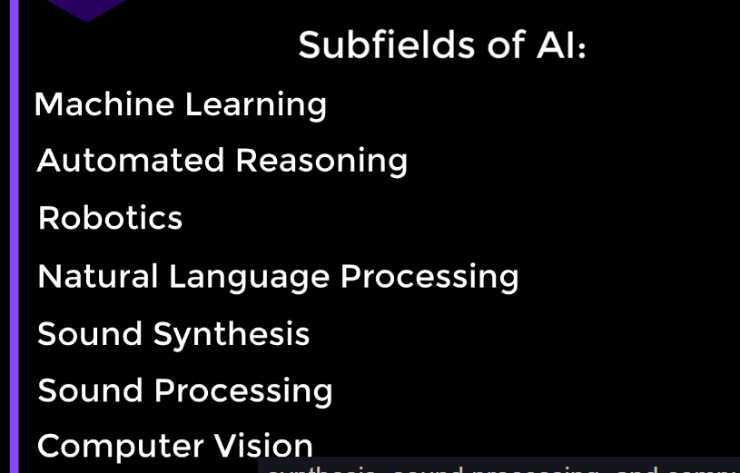
- Other examples of AI are Alexa, Google Home and ChatGPT. 
- AI can also recognize emotions, however it cannot respond to them. 


## Main AI Concepts 

### Types of AI 
- Narrow AI and Strong AI 
- Narrow AI is used to perform specific tasks like an AI designed to play a game 
- Strong AI is a higher powered type of AI and can work on different types of tasks 

### Subtypes of AI 
- 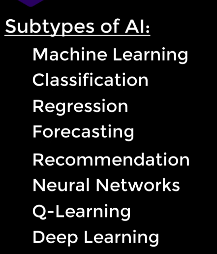

- #### Machine Learning
- In Machine Learning, we use data to train an AI model. After the model is trained, we present it with a situation and it makes a prediction based on its training. 
- Machine learning is of 3 types: 
- Supervised Learning , Unsupervised Learning and Reinforcement Learning
- **Supervised learning** is when we use labelled data to train our model to recognize patterns and predict outcomes 
- **Unsupervised learning** uses data without any labels, which the model uses to discover patterns that exist in the data and then uses the inferences to predict the outcome 
- In **Reinforcement learning**, we assign rewards and punishments to tasks to train the model, when then is able to make predictions using those results. 
- #### Classification 
- Another subtype of AI where the model puts data into different categories based on certain features it has 
- For example, we can classify words or sentences based on if they have a negative or positive emotion in them
- We can also classify images like grouping images of different fruits 
- Types of Classification are :
- **Binary Classification**
- This means we only have 2 categories: like Apples and Oranges
- **Multiclass Classification**
- More than 2 categories like Apples, Oranges and Banana
- **MultiLabel classification** 
- When the same type of data belongs to more than one category. For example if our program has categories: "nature" and "large", then mountains can belong to both these categories 
- Lot of classification algorithms 
- #### Regression 
- It is a strategy that plots all of the known data points and based on how the data is trending, it can predict future values. It allows us to see the relationship between 2 variables. 
- One variable on the X-Axis and One on the Y-Axis. 
- #### Forecasting 
- When an AI can predict future events 
- #### Recommendation 
- An AI strategy which is used to make suggestions based on prior choices. 
- If we viewed items on online store like books on Amazon's website and then seeing recommendations of similar items, that is an example of this type of AI 
- #### Neural Networks 
- 
- They are like digital brains. We write code that enables the program to learn from its mistakes based on the way that the human brain works 
- Just like brain has neurons, neural network has perceptrons, which are the digital version of neurons. 
- By adding multiple layers of interconnected perceptrons, we are able to build a neural network that mimics the functionality of a human brain by sending signals between perceptrons. 
- #### Q-Learning 
- Type of reinforcement learning where a model will perform a task over and over and improve taking the correct action over time. 
- #### Deep Learning 
- Enables AI to recognize complex learning and is made possible thanks to neural networks. Examples are deep Q-Learning and Deep Convolutional Q-Learning. 

## Neural Networks 
- A computer program that is able to learn and is modeled around how human brain works 
- Neural network are made up of digital equivalent of neurons called perceptrons. 
- 
- Each perceptron can take input from one or more perceptrons and send output to one more more perceptrons 
- Neural networks are made up of layers in the most basic form of a neural network.
- There are 3 main layers:
- Input Layer: Made up of perceptrons that make simple decisions based on input 
- Hidden Layer: Perceptrons that make more complex decisions by weighing the results from the first layer 
- Output Layer: Produces the output of the program 
- 
- It is possible for a neural network to have more than one hidden layer between the input layer and the output layer 
- 
- When a neural network has multiple hidden layers, this enables it to make even more complex decisions. 
- It is called a deep neural network and it is able to work with massive amounts of data.
- Perceptrons are connected by connections and each connection has a weight associated with it. This determines how much influence each perceptron has on the other.  An activation function determines whether or not a perceptron should fire based on the sum of its inputs, weighted using the weight associated with the connection between the two.
- Learning occurs as the network gets input and gets better and better at producing the correct output, thanks to its adjusting its weights
- 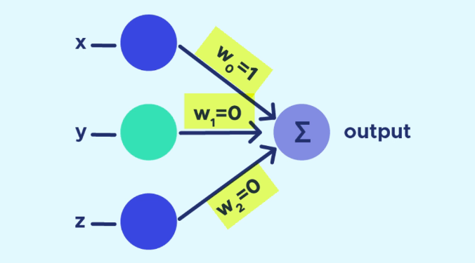
- 3 types of neural networks:
- Feed Forward Neural Networks: Data flows in one direction from input to output node. Each node is connected to the next node in the layer.
- Backpropagation Neural Networks : It is a type of Feedforward neural network which gives feedback that is uses to improve its decisions
- Convolutional Neural Networks: It detects patterns in the data based on images and spatial data
- These types are named based on how data flows from the input node to the output node.
- Lets understand with an example 
- 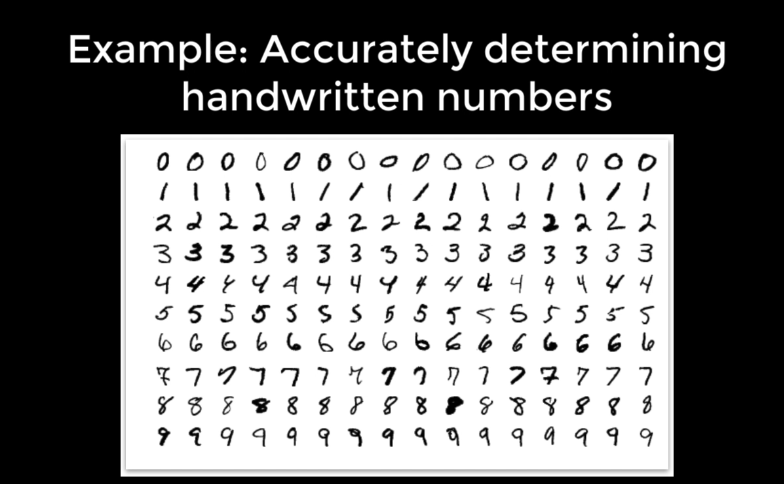
- We can show a lot of handwritten numbers along with their correct values. Neural networks adjust their weights based on its understanding to get better at recognizing the numbers
- Once trained, a neural network can look at a new handwritten number and tell us what it thinks it is, just like human beings do. 

## Machine Learning 
- subfield of AI 
- Lets say we make an algorithm to add 2 numbers
- 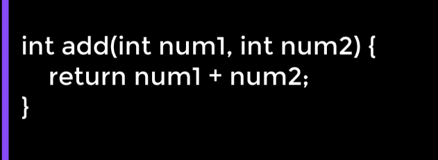
- With machine learning, we do the opposite. We give the program the data and the expected results and then it comes up with the algorithm. 
- We can provide a pair of numbers and their solutions and it will infer from the data 
- In machine learning, we refer to the AI as the model and there are 2 phases a model goes through: 
- 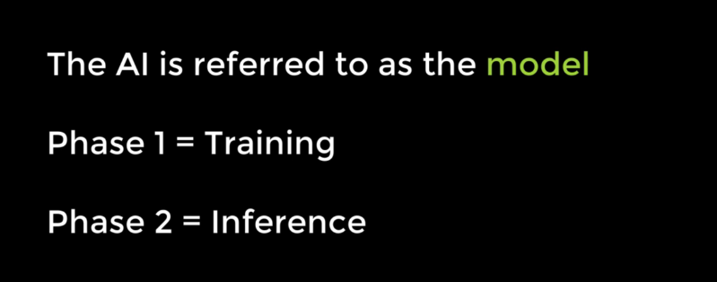
- In training we provide data to train the model 
- 3 main types of ML
- 
- In supervised learning the model builds a profile of an object based on its labels
- In unsupervised learning, it  builds a profile of similar looking objects by understanding the patterns between them and grouping them accordingly. 
- In reinforcement learning, we have a system of rewards and punishments. If the model correctly identifies the picture of an apple as an apple, we may reward it with a positive score. If it incorrectly labels, we provide a negative score. The model will try the max positive score as possible .

## Q-Learning
- Fundamental concept in reinforcement learning that focuses on learning the optimal action-selection strategy given a particular state of the environment. The agent learns to make decisions by interacting with its environment.
- Imagine playing a video where we control a character navigating through a maze. 
- 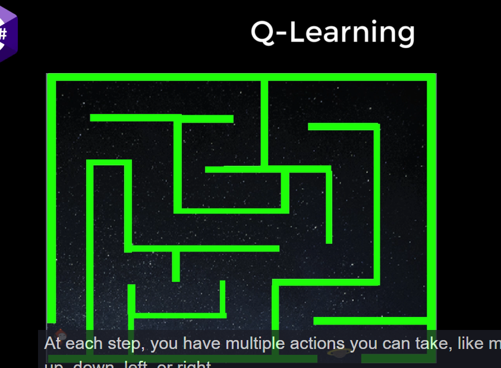
- At each step we can take multiple actions like moving up, down, left and right. 
- The goal is to reach the end of the maze while maximizing our score or reward. 
- In Q-Learning, we use a table called the Q-Table to keep track of the expected future rewards for each possible action in each state of the environment. 
- Each cell in the Q-table represents the "quality" or "value" of taking a particular action in a specific state.
- We start by initializing the Q-table with arbitrary values or zeroes. 
- Then the agent selects an action to take in the current state based on the exploration-exploitation strategy. 
- Initially, the agent explores the environment by taking random actions. 
- Overtime, it gradually shifts towards exploiting the learned information to choose actions that maximize future rewards. 
- After taking an action and observing the resulting state and reward, the agent updates the Q-value for the current state action pair using the following Q-learning update rule:
- 
- As the agent learns more about the environment, we decrease the exploration rate over time, allowing the agent to focus more on exploiting the learned information. 
- The Q-Learning process continues until the Q values converge to their optimal values, indicating that the agent has learned the optimal action selection strategy for each state. 
- 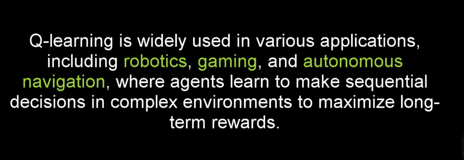
- Used in autonomous navigation systems. 
- Main weakness of traditional Q-learning is that it isnt very scalable for more complex environments. 
- It uses a table to store the Q-values, which can become impossible to manage as the state and action spaces get larger for the more complex environments. 
- This is where deep Q-learning becomes advantageous. 

## Deep Q-Learning 
- It leverages deep neural networks to approximate the Q-values instead of using a tabular representation. 
- This approach known as function approximations, allows DQN to handle high dimensional state spaces such as images or raw sensor data, making it suitable for a wide range of complex environments including video games, robotics and autonomous navigation. 
- 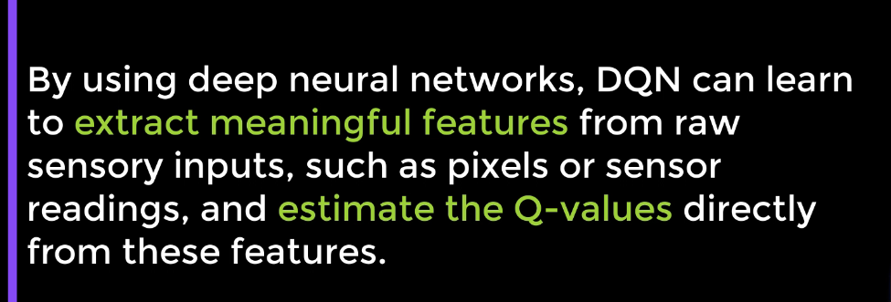
- This enables DQN to generalize across similar states and actions, making it more efficient and scalable compared to traditional tabular Q-Learning. 
- 
- In pong, we represent the game state as an image frame, where each frame shows the current state of the game, including positions of the paddle and the ball. 
- Agent takes actions based on these image frames, such as moving its paddle up or down, or staying still. 
- 
- Agents goal is to learn a Q-function, represented by a deep neural network that estimates the expected future rewards for each possible action given the current state. 
- The neural network takes the image frame of the current state as input and outputs the Q-values for all possible actions. 
- During training the agent interacts with the game environment taking actions based on an epsilon greedy exploration strategy. 
- It collects experience tupes, a tuple with state,action,reward,nextState and uses them to update the Q network parameters using a variant of Q-learning algorithm called deep Q-Learning. 
- 
- 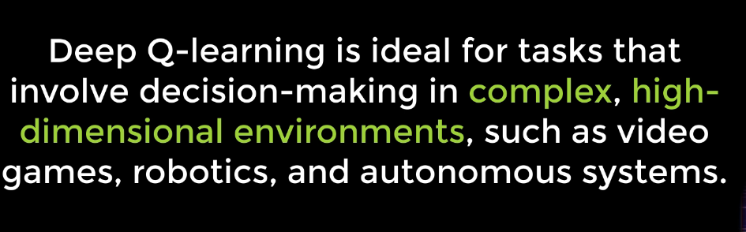
- However deep Q-learning is not very good working with raw pixel data from images.
- For this purpose we have Deep convolutional Q-learning. 

## Deep Convolutional Q-Learning
- It is a type of reinforcement learning algorithm that uses deep convolutional neural networks(CNNs) to learn to make decisions in complex environments, particularly those with high dimensional input spaces like images or raw sensory data. 
- 
- A CNN is a type of artificial neural network based on how humans see. 
- They are composed of layers of neurons called convolutional layers that apply filters, also called kernels to input data to extract features. 
- 
- CNNs are designed to capture spatial hierarchies and patterns in data making them well suited for tasks like image classification and object detection. 
- Here,CNNs learn effective decision making policies in environments with high dimensional input spaces.
- Input is raw sensory data like images or video games. 
- CNN processes the input data, extracting meaningful features that capture spatial relationships and patterns in the environment. 
- Output of the CNN is fed into fully connected layers that estimate the Q- values for all possible actions. 
- e.g environmental monitoring with drones. 
- Goal of these drones is to monitor environmental changes, detect potential threats like wildfires or deforestation and make informed decisions to protect the ecosystem. 
- 
- In the input each drone captures images of the forest area using on-board cameras. 
- These images provide visual information about the vegetation, terrain and any potential threats or changes in the environment. 
- Raw image data is fed into a CNN, which processes the images and extracts features relevant to the environmental monitoring such as density and distribution of vegetation, presence of water bodies and signs of deforestation and wildfire. 
- 
- In the next step, we do action selection, at which point the output of the CNN is passed to the fully connected layers that estimate the Q-values for different drone locations. Based on these Q-values, the drone takes an action aiming to maximize the effectiveness of monitoring and detection while conserving energy and resources.
-  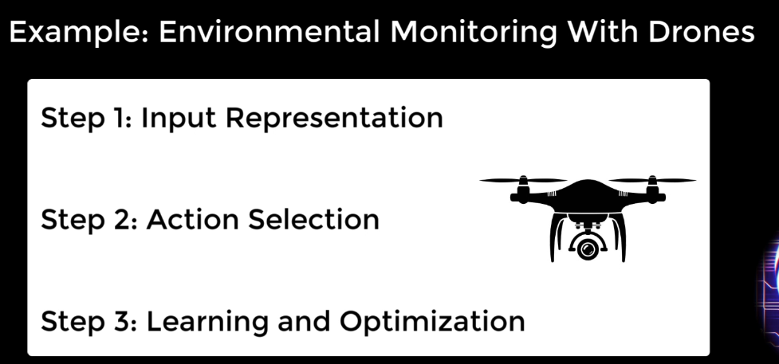
-  Positive rewards are given for actions that contribute to effective environmental monitoring such as detecting changes in vegetation health. 
-  Negative rewards or penalties are given for actions that result in inefficiencies or failures, such as colliding with obstacles or running out of battery. 
-  The deep convolutional Q-learning algorithm updates the Q-values based on the observed rewards and transitions between states and actions enabling the drone to learn optimal strategies. 
-  Overtime, the drone learns how to effectively navigate the forest environment. 
-  
  
## Asynchronous Advantage Actor-Critic(A3C)
- It is a type of reinforcement learning algorithm designed for training agents to interact with environments and make decisions in real-time
- 4 parts of A3C 
- 
- A3C vs Q-Learning
- A3C is probabilistic vs Q-learning which is deterministic
- 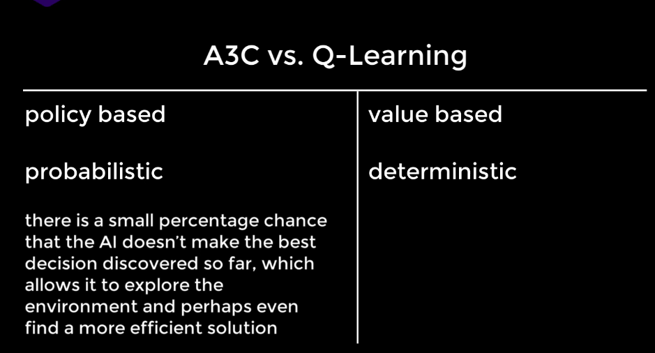
- 
- Drones learn from experience and adjust their policies to improve performance over time. 
- For e.g if a drone encounters traffic in a particular area, it may learn to re-route to avoid congestion. 
- If it encounters a high building, it may increase it altitude to skip the obstacle. 
- 

## Large Language Models (LLMs)
- Type of AI powered by neural networks 
- 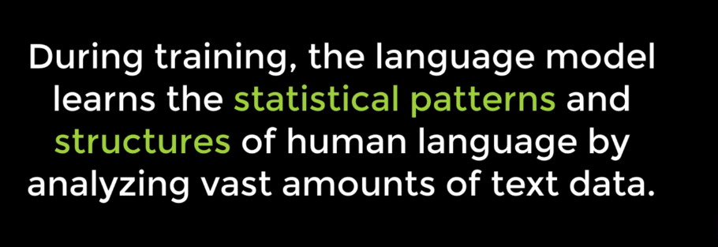
- It is like a smart assistant that can analyze and generate text such as completing sentences, translating languages or even writing articles. 
- LLMs can perform large number of tasks involving natural language processing or NLP. 
- 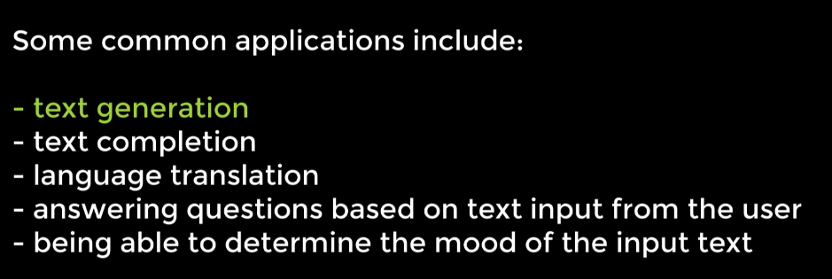
- 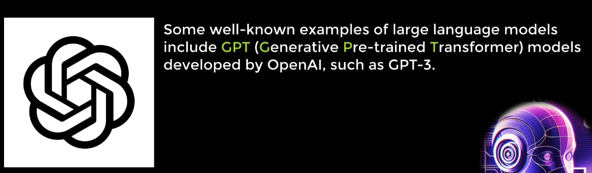
- These models have been trained on massive amounts of text data. 
- ChatGPT is a variant of the GPT model specifically fine tuned for conversational interactions. It is trained on a dataset containing conversational data such as social media conversations, chat logs and customer support interactions. 
- Gives better performance in conversational context. 
- 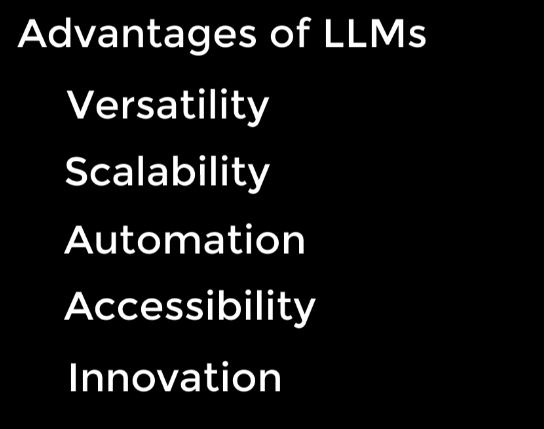
- LLMs are blackbox systems 
- 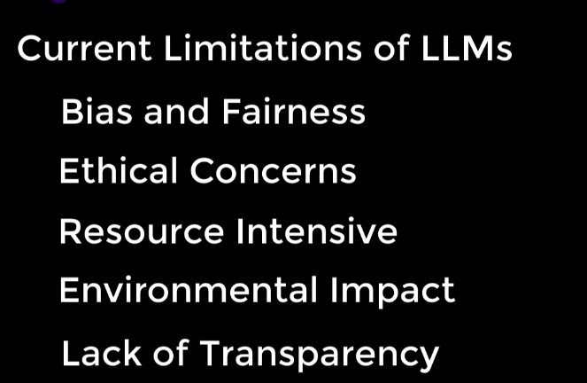
- LLM powered chatbots can help in customer service interactions and reduce workload on human agents. 
- LLMs can generate clinical notes and assist with medical documentation. 
- They can convert spoken or handwritten medical records into structured text to improve accuracy and efficiency of healthcare administration. 
- 

## Generative AI 
- Type of AI that can be used to generate new, original data or content based on patterns learned from existing data. 
- Unlike traditional AI models that focus on tasks like classification, regression or prediction, generative AI models can create new data samples that are similar to the one in the training data set but are not the exact copies. . 
- These models work by learning the underlying statistical patterns and structures of the data during the training process. 
- Once trained, these models can generate new data samples by sampling from the learned distribution of the data. 
- 
- 
- The generator generates fake data samples like images from random noise.
- The discriminator tries to distinguish between real data samples, like actual images and fake ones generated by the generator.
- Through adversarial training, the generator learns to generate more realistic data samples, while the discriminator learns to become better at distinguishing between the real and fake data samples.
- GANs are widely used for tasks like image generation, video generation, and data synthesis.

### Variational Encoders
- Variational encoders, or VAEs, are probabilistic generative models that learn a latent representation of the input data.
- They consist of an encoder network that maps input data to a latent space, and a decoder network that generates new data samples from the latent space. VAEs aim to learn the underlying distribution of the input data and generate new data samples by sampling from this distribution.
- They are commonly used for tasks like image generation, anomaly detection, and data compression.

### Autoregressive Models 
- Autoregressive models generate data sequentially, one element at a time based on the probability distribution of the next element given the previous elements.
- Examples of autoregressive models include recurrent neural networks or RNNs, transformer models and language models like GPT.
- Autoregressive models are commonly used for tasks like text generation, language translation, and sequence prediction.
- 
- 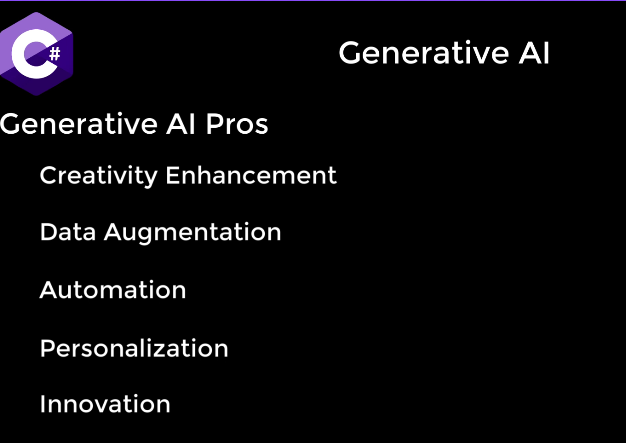
- 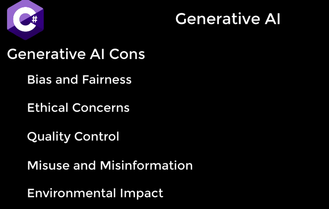


## Computer Vision 
 - Type of AI that focuses on enabling computers to interpret and understand visual information from the real world. 
 - It involves developing algorithms and techniques that allow machines to extract meaningful insights from digital images or videos, similar to how humans perceive and interpret visual stimuli.
 - 
 - 
 - We can use the Computer Vision program described above to analyze live video feeds from surveillance cameras and identify potential security threats such as unauthorized intruders, suspicious packages, or prohibited items.
 - The program continuously processes video frames in real time, detecting and classifying objects within the scene. 
 - When it detects a suspicious object or activity, it triggers an alert notification to alert security personnel, who can then take appropriate action to investigate and respond to the potential threat.
 - 
 - Computer Vision can be used in Radiology.


## Generative AI with ChatGPT 
- 
- GPT --> Generative Pre-trained Transformer 
- Trained on large amounts of text from the Internet 
- 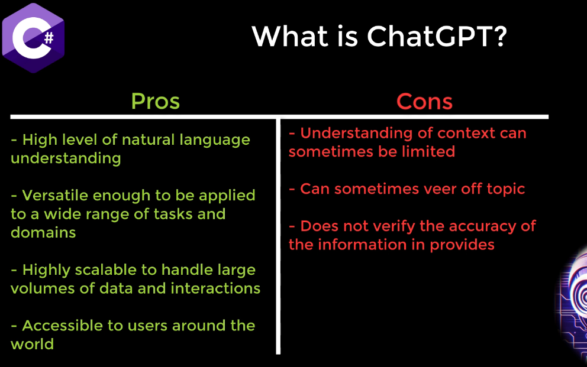
- 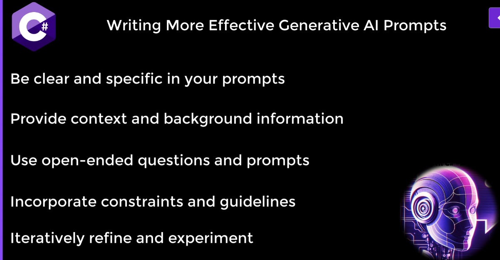

## AI that solves mazes
- 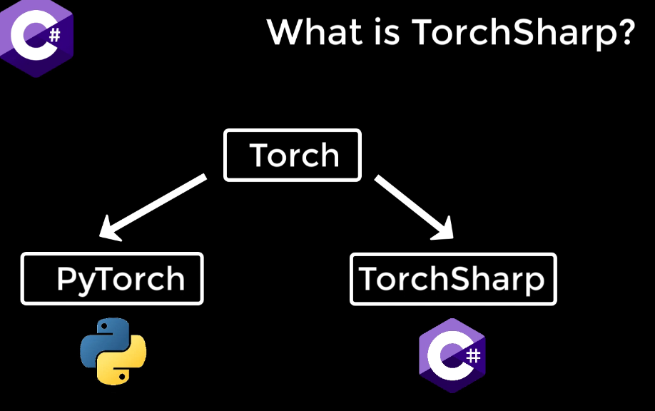
- PyTorch is a python based library that is used to build machine learning models. 
- Under the hood it uses torch library 
- TorchSharp is the .NET equivalent of PyTorch 
- It is open-source. 
- TorchSharp is a .NET library that provides access to the library that powers PyTorch. It is part of the .NET Foundation.
- The focus is to bind the API surfaced by LibTorch with a particular focus on tensors. The design intent is to stay as close as possible to the Pytorch experience, while still taking advantage of the benefits of the .NET static type system where it makes sense. For example: method overloading is relied on when Pytorch defines multiple valid types for a particular parameter.
- We will create a new project and install the following packages:
```shell 
dotnet add package TorchSharp --version 0.102.4
dotnet add package libtorch-cpu-win-x64 --version 2.2.1.1

```
- This maze has three values zero, one, and two.
- Anywhere you see a zero represents part of a wall.
- The ones are the floor tiles and the two is the goal.
- Then we will start at row 11, column five, which is at the bottom middle row zero, column five at the bottom and the top middle is the goal(where there is a 2)
- But keep in mind that the we can only move anywhere there is a one.
- The zeros in this multi-dimensional array are walls.So we will need to learn to avoid the walls.
- Our maze looks like this 
```c#
int[,] maze1 = {
    //0   1   2   3   4   5   6   7   8   9   10  11
    { 0 , 0 , 0 , 0 , 0 , 2 , 0 , 0 , 0 , 0 , 0 , 0 }, //row 0
    { 0 , 1 , 1 , 1 , 1 , 1 , 1 , 1 , 1 , 1 , 1 , 0 }, //row 1
    { 0 , 1 , 0 , 0 , 0 , 0 , 0 , 0 , 0 , 1 , 1 , 0 }, //row 2
    { 0 , 1 , 1 , 0 , 1 , 1 , 1 , 1 , 0 , 1 , 1 , 0 }, //row 3
    { 0 , 0 , 0 , 0 , 1 , 1 , 0 , 1 , 0 , 1 , 1 , 0 }, //row 4
    { 0 , 1 , 1 , 1 , 1 , 1 , 0 , 1 , 1 , 1 , 1 , 0 }, //row 5
    { 0 , 1 , 1 , 1 , 1 , 1 , 0 , 1 , 1 , 1 , 1 , 0 }, //row 6
    { 0 , 1 , 0 , 0 , 0 , 0 , 0 , 0 , 0 , 1 , 1 , 0 }, //row 7
    { 0 , 1 , 0 , 1 , 1 , 1 , 1 , 1 , 0 , 1 , 1 , 0 }, //row 8
    { 0 , 1 , 0 , 1 , 0 , 0 , 0 , 1 , 0 , 1 , 1 , 0 }, //row 9
    { 0 , 1 , 1 , 1 , 0 , 1 , 1 , 1 , 0 , 1 , 1 , 0 }, //row 10
    { 0 , 0 , 0 , 0 , 0 , 1 , 0 , 0 , 0 , 0 , 0, 0 }  //row 11 (start position is (11, 5))
};

```

### Setting up the Actions and Rewards
- An action is any choice an AI can make 
- 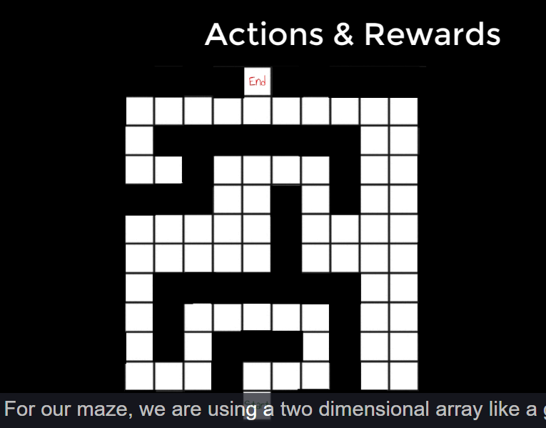
- Our AI has 4 possible action: Left, Right, Up, Down 
- 
- This program demonstrates the concept of reinforcement learning by training a model to navigate through a maze. Reinforcement learning is a type of machine learning where an agent learns to make decisions by interacting with an environment and receiving feedback in the form of rewards or penalties.
- The program starts by defining a maze represented as a 2D array. Each cell in the maze has a specific value indicating whether it is a wall, a floor, or the goal. The program then sets up the rewards for each cell in the maze based on these values.
- Next, the program initializes the Q-values tensor, which represents the expected future rewards for taking a particular action in a specific state. The Q-values are initially set to zero.
- The program then defines several helper functions. The determineNextAction function selects the next action to take based on the epsilon-greedy policy, which balances exploration and exploitation. The moveOneSpace function moves the model one space in the maze based on the selected action. The hasHitWallOrEndOfMaze function checks if the model has hit a wall or the end of the maze.
- The main function, trainTheModel, trains the model to navigate through the maze using reinforcement learning. It iterates through a series of episodes, where each episode is a round of training. In each episode, the model starts at the beginning of the maze and takes actions to navigate through the maze until it reaches a wall or the end. At each step, the model selects an action, updates the Q-values using the Q-learning algorithm, and learns from the rewards received.
- After training is complete, the program provides a function called navigateMaze to visualize the path taken by the model in the maze based on the learned Q-values. It prints the moves made by the model, displaying the move count and the coordinates of each move.
- By running this program, you can gain a better understanding of reinforcement learning and how it can be applied to solve problems such as maze navigation.
- In this program, the Q-values for the maze are stored in a tensor called qValues.
- A tensor is a multi-dimensional array that can hold numerical data. In this case, the qValues tensor has dimensions corresponding to the number of rows and columns in the maze, as well as the number of possible actions.
- The Q-values represent the expected future rewards for taking a particular action in a specific state. Each element in the qValues tensor corresponds to a specific cell in the maze and an action. The value at each element represents the Q-value for that cell-action pair.
- The setupQValues function is responsible for setting up the qValues tensor. It initializes all the values to zero, providing a starting point for reinforcement learning algorithms to update and learn from. The dimensions of the qValues tensor are determined by the number of rows and columns in the maze, as well as the number of possible actions.
- Throughout the training process, the Q-values in the qValues tensor are updated based on the rewards received and the expected future rewards. This allows the model to learn and make optimal decisions based on the learned Q-values.


```c#


using TorchSharp;
int[,] maze1 = {
    //0   1   2   3   4   5   6   7   8   9   10  11
    { 0 , 0 , 0 , 0 , 0 , 2 , 0 , 0 , 0 , 0 , 0 , 0 }, //row 0
    { 0 , 1 , 1 , 1 , 1 , 1 , 1 , 1 , 1 , 1 , 1 , 0 }, //row 1
    { 0 , 1 , 0 , 0 , 0 , 0 , 0 , 0 , 0 , 1 , 1 , 0 }, //row 2
    { 0 , 1 , 1 , 0 , 1 , 1 , 1 , 1 , 0 , 1 , 1 , 0 }, //row 3
    { 0 , 0 , 0 , 0 , 1 , 1 , 0 , 1 , 0 , 1 , 1 , 0 }, //row 4
    { 0 , 1 , 1 , 1 , 1 , 1 , 0 , 1 , 1 , 1 , 1 , 0 }, //row 5
    { 0 , 1 , 1 , 1 , 1 , 1 , 0 , 1 , 1 , 1 , 1 , 0 }, //row 6
    { 0 , 1 , 0 , 0 , 0 , 0 , 0 , 0 , 0 , 1 , 1 , 0 }, //row 7
    { 0 , 1 , 0 , 1 , 1 , 1 , 1 , 1 , 0 , 1 , 1 , 0 }, //row 8
    { 0 , 1 , 0 , 1 , 0 , 0 , 0 , 1 , 0 , 1 , 1 , 0 }, //row 9
    { 0 , 1 , 1 , 1 , 0 , 1 , 1 , 1 , 0 , 1 , 1 , 0 }, //row 10
    { 0 , 0 , 0 , 0 , 0 , 1 , 0 , 0 , 0 , 0 , 0, 0 }  //row 11 (start position is (11, 5))
};

const string UP = "up";
const string DOWN = "down";
const string LEFT = "left";
const string RIGHT = "right";

string[] actions = [UP, DOWN, LEFT, RIGHT ];

int[,] rewards;

const int WALL_REWARD_VALUE = -500;
const int FLOOR_REWARD_VALUE = -10;
const int GOAL_REWARD_VALUE = 500;

//This function sets up the rewards for the maze for each cell
void setupRewards(int[,] maze, int wallValue, int floorValue, int goalValue)
{
    int mazeRows = maze.GetLength(0);//0 dimension is the number of rows
    int mazeColumns = maze.GetLength(1); // 1 dimension is the number of columns
    rewards = new int[mazeRows, mazeColumns];

    for (int i = 0; i < mazeRows; i++)
    {
        for (int j = 0; j < mazeColumns; j++)
        {
            switch (maze[i, j])//example value of maze[i,j] is 0, if it is 0, then it is a wall
            {

                case 0:
                    rewards[i, j] = wallValue;
                    break;
                case 1:
                    rewards[i, j] = floorValue;
                    break;
                case 2:
                    rewards[i, j] = goalValue;
                    break;
            }
        }
    }
}

torch.Tensor qValues;
//The setupQValues function is responsible for setting up the Q-values for each cell in the maze.
//Q-values are used in reinforcement learning algorithms to estimate the expected future rewards for taking a particular action in a specific state.
//Overall, the setupQValues function sets up the Q-values tensor with the appropriate dimensions and initializes all the values to zero, providing a starting point for reinforcement learning algorithms to update and learn from.
//A tensor is a fundamental data structure in many programming frameworks, including TorchSharp.
//It is a multi-dimensional array that can hold numerical data. Tensors are similar to arrays or matrices, but they have additional properties and operations that make them suitable for mathematical computations and machine learning algorithms.
//TorchSharp provides a rich set of functions and methods to create, manipulate, and perform computations on tensors. These operations enable efficient numerical computations and make it easier to implement machine learning algorithms.
//In the context of reinforcement learning, tensors can be used to store Q-values, states, actions, and other relevant data
void setupQValues(int[,] maze)
{
    int mazeRows = maze.GetLength(0);
    int mazeColumns = maze.GetLength(1);
    qValues = torch.zeros(mazeRows, mazeColumns, actions.Length);
}


// Function will return true if the model has hit a wall or goal and false if the model landed on a floor tile.
bool hasHitWallOrEndOfMaze(int currentRow, int currentColumn, int floorValue)
{
    return rewards[currentRow, currentColumn] != floorValue;
}

//Determine the next action to take 
long determineNextAction(int currentRow, int currentColumn, float epsilon)
{
   Random randon = new Random();
   double randomBetween0And1 = randon.NextDouble();
    // this line of code selects the next action to take in the maze based on a random number and the epsilon value.
    // If the random number is less than epsilon, it chooses the action with the highest Q-value for the current cell. Otherwise, it selects a random action from the available actions.

    long nextAction = randomBetween0And1 < epsilon ? torch.argmax(qValues[currentRow, currentColumn]).item<long>() : randon.Next(actions.Length);
    return nextAction;
}

//Move the model one space in the maze
(int,int) moveOneSpace(int[,] maze,  int currentRow, int currentColumn, long currentAction)
{
    int mazeRows = maze.GetLength(0);
    int mazeColumns = maze.GetLength(1);
    int nextRow = currentRow;
    int nextColumn = currentColumn;

    //Move UP, DOWN, LEFT, RIGHT in the maze
    if (actions[currentAction] == UP && currentRow > 0)
    {
        nextRow--;
    } else if (actions[currentAction] == DOWN && currentRow < mazeRows - 1)
    {
        nextRow++;
    }
    else if (actions[currentAction] == LEFT && currentColumn > 0)
    {
        nextColumn--;
    }
    else if (actions[currentAction] == RIGHT && currentColumn < mazeColumns - 1)
    {
        nextColumn++;
    }

    return (nextRow, nextColumn);
}

// The function trainTheModel is responsible for training a model to navigate through a maze using reinforcement learning.
// It takes the maze, floor value, epsilon, discount factor, learning rate, and number of episodes as input parameters.
// The function iterates through a series of episodes, where each episode is a round of training.
// In each episode, the model starts at the beginning of the maze and takes actions to navigate through the maze until it reaches a wall or the end of the maze.
// At each step, the model selects an action based on the epsilon-greedy policy
// and updates the Q-values using the Q-learning algorithm.
// The Q-values represent the expected future rewards for taking a particular action in a specific state.
// The Q-learning algorithm uses the temporal difference error to update the Q-values based on the reward received and the expected future rewards.
// The model learns to navigate through the maze by updating the Q-values through multiple episodes of training.
// After training is complete, the model can use the learned Q-values to make optimal decisions and navigate through the maze efficiently.
// The trainTheModel function is a key component of the reinforcement learning process and enables the model to learn from experience and improve its performance over time.
void trainTheModel(int[,] maze, int floorValue, 
    float epsilon, float discountFactor, float learningRate, float episodes)
{
    for(int episode = 0; episode < episodes; episode++)
    {
        //Each episode is a round of training
        Console.WriteLine("-----Starting episode " + episode + "-----");
        //Set the starting position of the model
        int currentRow = 11;
        int currentColumn = 5;

        while (!hasHitWallOrEndOfMaze(currentRow, currentColumn, floorValue))
        {
            long currentAction = determineNextAction(currentRow, currentColumn, epsilon);
            int previousRow = currentRow;
            int previousColumn = currentColumn;
            (int,int) nextMove = moveOneSpace(maze, currentRow, currentColumn, currentAction);
            currentRow = nextMove.Item1;
            currentColumn = nextMove.Item2;
            float reward = rewards[currentRow, currentColumn];
            float previousQValue = qValues[previousRow, previousColumn, currentAction].item<float>();
            float temporalDifference = reward + discountFactor * torch.max(qValues[currentRow, currentColumn]).item<float>() - previousQValue;
            float nextQValue = previousQValue + (learningRate * temporalDifference);
            qValues[previousRow, previousColumn, currentAction] = nextQValue;
        }

        Console.WriteLine("-----Finished episode " + episode + "-----");

    }

    Console.WriteLine("Training complete!");
}

//The function navigateMaze is responsible for navigating through a maze based on the learned Q-values. It takes the maze, starting row and column, floor value, and wall value as input parameters.
//The function first initializes an empty list called path to store the coordinates of the model's movement in the maze. If the starting position is a wall or the end of the maze, the function immediately returns an empty list.
//If the starting position is a valid floor tile, the function enters a while loop. Inside the loop, it selects the next action to take based on the epsilon value of 1.0, which means it always chooses the action with the highest Q-value for the current cell.
//The function then moves the model one space in the maze based on the selected action using the moveOneSpace function. It updates the current row and column accordingly.
//If the next position is not a wall, it adds the current position to the path list. Otherwise, it continues to the next iteration of the loop.
//Once the model reaches a wall or the end of the maze, the function exits the loop. It then iterates through the path list and prints the moves made by the model, displaying the move count and the coordinates of each move.
//Finally, the function returns the path list, which contains the coordinates of the model's movement in the maze.
//This function allows you to visualize the path taken by the model in the maze based on the learned Q-values, providing insights into the model's decision-making process and its ability to navigate through the maze efficiently.
List<int[]> navigateMaze(int[,] maze, int startRow, int startColumn, int floorValue, int wallValue)
{
    List<int[]> path = new List<int[]>();
    if (hasHitWallOrEndOfMaze(startRow, startColumn, floorValue))
    {
        return [];
    }
    else
    {
        int currentRow = startRow;
        int currentColumn = startColumn;
        path = [[currentRow, currentColumn]];
        while (!hasHitWallOrEndOfMaze(currentRow, currentColumn, floorValue))
        {
            int nextAction = (int) determineNextAction(currentRow, currentColumn, 1.0f);
            (int, int) nextMove = moveOneSpace(maze, currentRow, currentColumn, nextAction);
            currentRow = nextMove.Item1;
            currentColumn = nextMove.Item2;
            if(rewards[currentRow, currentColumn] != wallValue)
            {
                path.Add([currentRow, currentColumn]);
            }
            else
            {
                continue;
            }
        }
    }

    int moveCount = 1;
    for(int i = 0; i < path.Count; i++)
    {
        Console.WriteLine("Move " + moveCount + ": (");
        foreach(int element in path[i])
        {
            Console.WriteLine(" "+element);
        }
        Console.WriteLine(" )");
        Console.WriteLine();
        moveCount++;
    }

    return path;
}

const float EPSILON = 0.95f;
const float DISCOUNT_FACTOR = 0.8f;
const float LEARNING_RATE = 0.9f;
const int EPISODES = 1500;
const int START_ROW = 11;
const int START_COLUMN = 5;

setupRewards(maze1, WALL_REWARD_VALUE, FLOOR_REWARD_VALUE, GOAL_REWARD_VALUE);
setupQValues(maze1);
trainTheModel(maze1, FLOOR_REWARD_VALUE, EPSILON, DISCOUNT_FACTOR, LEARNING_RATE, EPISODES);
navigateMaze(maze1, START_ROW, START_COLUMN, FLOOR_REWARD_VALUE, WALL_REWARD_VALUE);


```
### Result is as follows: 
- 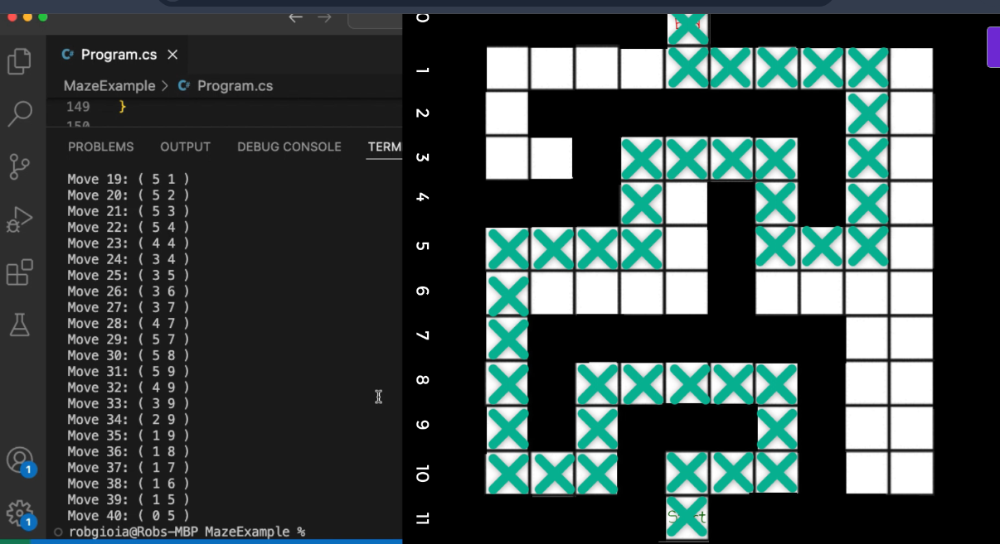

## Neural Networks
- It is basically as a digital brain
- It consists of neurons which receive an input and produces an output. 
- This neuron applies a mathematical function called an activation function on the inputs to produce the output 
- 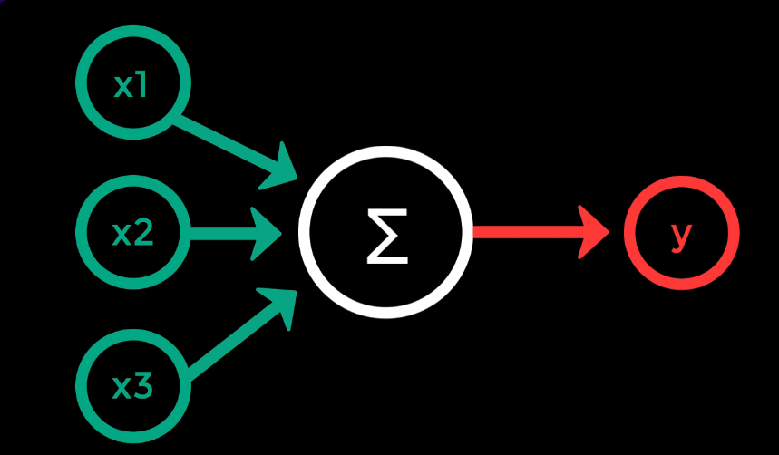
- 
- Neurons are organized into layers 
- 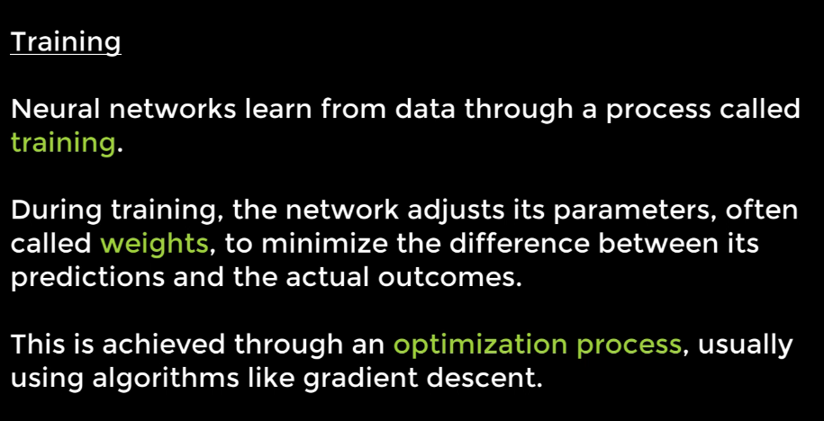
- Imagine we want to build a system that recognizes handwritten digits 
- We feed a neural network images of handwritten digits along with their corresponding labels 
- The neural network learns to extract features from the image like edge, curves and patterns 
- In the output later, the network assigns probability to each digit. 
- For instance, if the network predicts a high probability for digit five, it means it's confident that the input image represents the digit five.
- 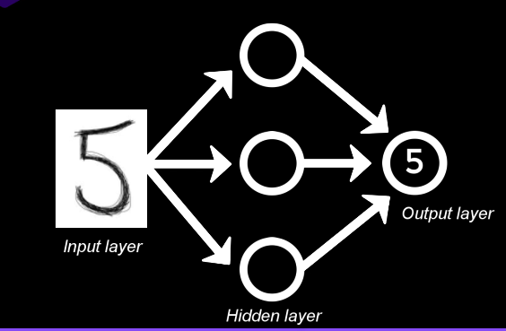

### Neural Network Architecture  
- 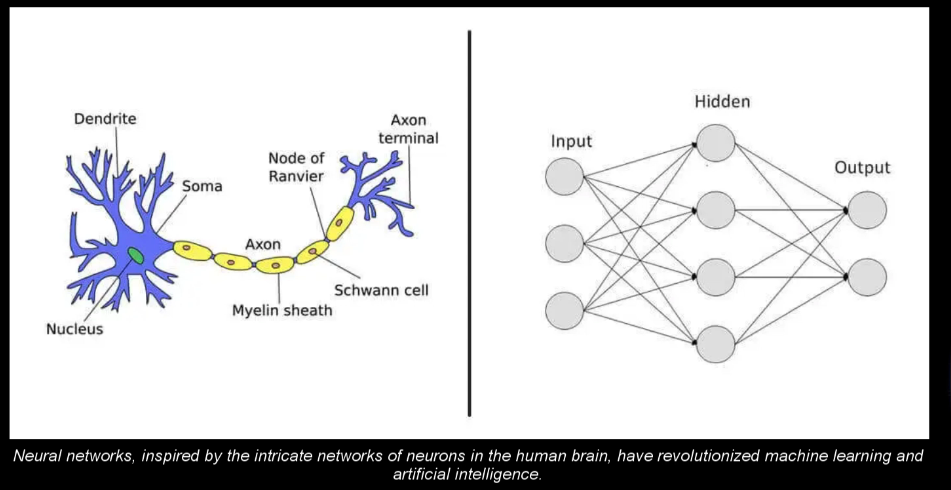
- Main components of neural network architecture are:
- Neurons 
- Layers 
- Weighted Connections 
- 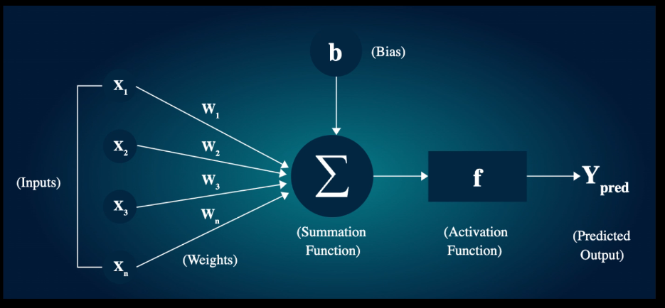
- Neurons are organized into layers 
- Each layer connects to the next. 
- The number of neurons in each layer can vary 
- Weights determine strength of influence on the neuron 
- 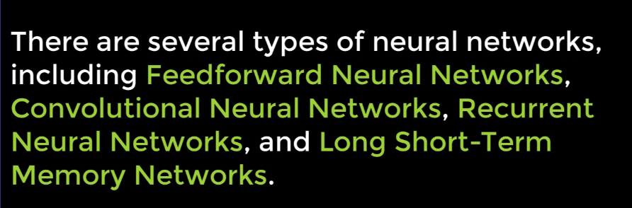
#### Feed-Forward Neural Network 
- 
- Used for tasks like classification and regression. 
- Lets say we have an image of an fruit, this neural network can help recognize it based on the input features.
- To train this network, we need labelled data.
- Once trained, this neural network can now take in new input data like the color and size of a fruit, and predict whether it's an apple or an orange.

#### Convolutional Neural Network 
- 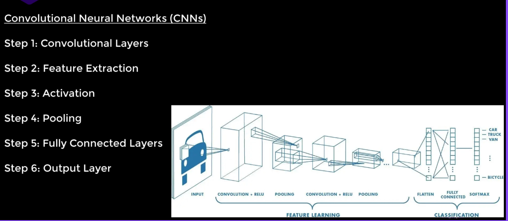
- Convolutional neural networks, or CNNs, are specialized for processing grid like data such as images.
- They consist of convolutional layers that extract features from input images, followed by pooling layers for downsampling and fully connected layers for classification.
- Imagine you want to build a system that can recognize whether a picture contains a cat or a dog.
A CNN can help you achieve this.
- In a CNN, the first layer is typically a convolutional layer. This layer consists of tiny filters, also called kernels or feature detectors. Each filter slides across the input image pixel by pixel, and performs a mathematical operation called convolution.
- As the filters slide over the image, they detect patterns such as edges, textures, and shapes.
- These patterns are the building blocks of objects in the image.
- For example, one filter might detect horizontal edges while another detects vertical edges.
- After convolution, the result passes through an activation function such as ReLU, which stands for
rectified linear unit. This function introduces non-linearity to the network, allowing it to learn complex relationships between features.
- Next, the output from the convolutional layer is typically passed through a pooling layer.
- Pooling helps reduce the spatial dimensions of the input, making the network more computationally efficient and less sensitive to small changes in the input after several convolutional and pooling layers.
- The extracted features are flattened into a vector and passed to one or more fully connected layers.
- These layers perform high level reasoning and decision making based on the learned features.
- Finally, the output layer of the CNN contains neurons corresponding to the possible classes like cat
or dog.
- To train a CNN, we need a dataset of labelled images like images of dogs,cats etc. 
- Once trained, if fed an image, the neural network can predict whether it is a cat or dog. 

#### Recurrent Neural Network 
- 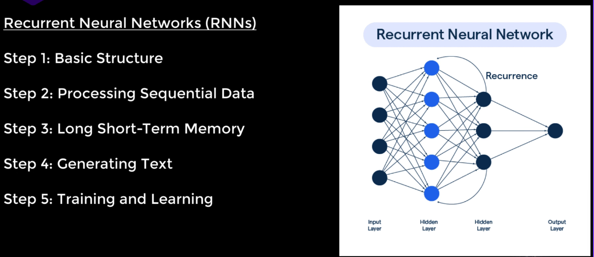
- Recurrent neural networks, or RNNs, are designed to handle sequential data where the order of inputs
matters.
- They have connections that loop back on themselves, allowing them to capture temporal dependencies
in the data.
- RNNs are widely used in tasks like speech recognition, language modeling, and time series prediction.
- Imagine you want to build a system that generates text, one character at a time, based on a given
input. An RNN can help you achieve this by remembering the context of the previous characters as it generates the next one.
- At its core, RNN consists of a chain of repeating neural network modules or cells.
- Each cell takes in two inputs the current input, like the character and the hidden state from the previous cell.
- The hidden state acts as the memory of the network, capturing information about past inputs.
- As the input sequence is fed into the RNN one element at a time, the hidden state is updated at each
step based on the current input and the previous hidden state.
- This process allows the network to maintain context and capture dependencies between sequential elements.
- One variant is LSTM(Long short term memory) network.
- Suppose we want to generate a sentence based on a given starting word.
- We input the starting word into the RNN and let it generate the next word.
- Then we input the generated word back into the RNN along with the previous hidden state, and repeat
this process until we reach the desired length of the sentence.
- During training, the RNN learns to predict the next element in the sequence based on the previous elements.
- This is achieved by adjusting the parameters like weights and biases of the network using backpropagation through time or bptt, a variant of the backpropagation algorithm that takes into account the sequential nature of the data.
- 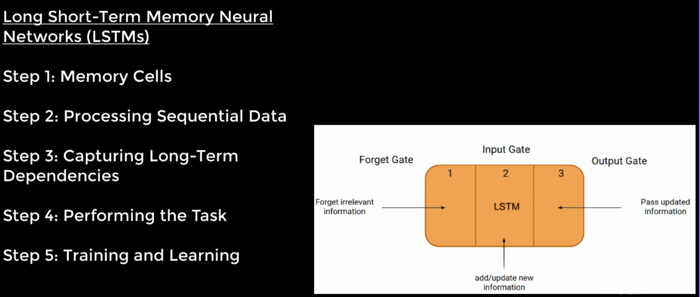
- LSTM is much better for speech recognition, time-series prediction
- It builds a context of the input text.

### Creating a Neural Network 
- 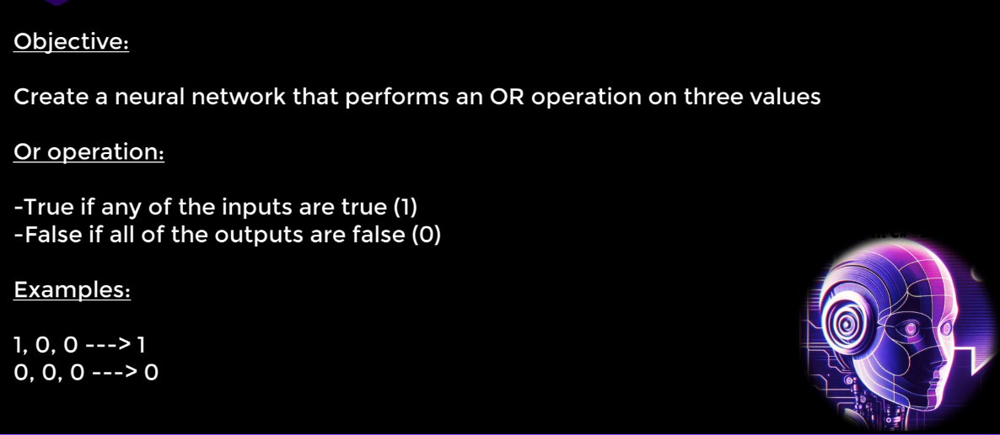
- We must understand the sigmoid function 
- 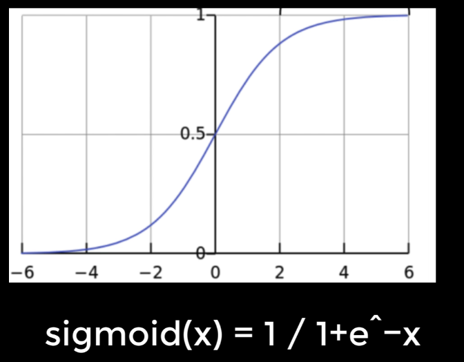
- Think of a sigmoid function that takes in any input value and gives us a value between 0 and 1. 
- It can convert any value big or small and give us a value between 0 and 1 which is easy to work with. 
- 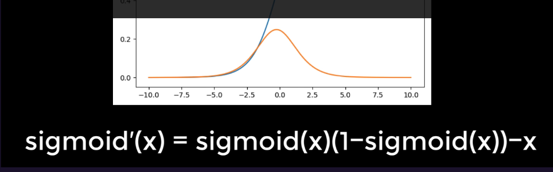
- derivative of any function tells us how much the function is changing at any given point of time. 
- For the sigmoid function, its derivative tells you the rate at which the output is changing concerning
the input.
- When you take the derivative of the sigmoid function, you get another function that also depends on
the input value x.
- This derivative function helps us adjust the weights in our neural network during the training process.
- The derivative function is helpful because it tells us how quickly the output of the sigmoid function
is changing concerning the input x.
- We can use this information to adjust the parameters of our neural network during the training process, which helps our network learn and improve over time.

### Coding the Train Function
- The Train method in the NeuralNetwork class is responsible for training the neural network using a process called backpropagation. Let's break down the steps in the method:
1.	Iteration Loop: The method starts with a loop that iterates numberOfIterations times. This allows the neural network to update its weights multiple times to improve its performance.
2.	Forward Pass: Inside the loop, the Think method is called to perform a forward pass through the neural network. The Think method takes the trainingInputs as input and returns the output of the neural network.
3.	Error Calculation: The next step is to calculate the error between the expected output (trainingOutputs) and the actual output of the neural network. This is done by calling the PerformOperation method with the OPERATION.SUBTRACT operation. The PerformOperation method subtracts the trainingOutputs from the output obtained from the forward pass.
4.	Adjustment Calculation: The adjustment to the weights is calculated using the backpropagation algorithm. The backpropagation algorithm calculates the gradient of the error with respect to the weights and adjusts the weights accordingly. The adjustment is calculated by performing a series of matrix operations:
•	The Activate method is called with the output and true as arguments to calculate the derivative of the sigmoid activation function. The derivative is used to scale the error based on the slope of the activation function.
•	The PerformOperation method is called with the OPERATION.MULTIPLY operation to multiply the error by the derivative of the sigmoid function.
•	The DotProduct method is called with the transposed trainingInputs and the result of the previous operation to calculate the dot product between the transposed inputs and the error multiplied by the derivative.
•	Finally, the PerformOperation method is called with the OPERATION.ADD operation to add the adjustment to the current weights.
5.	Update Weights: The updated weights are assigned back to the weights variable of the neural network.
By repeating this process for the specified number of iterations, the neural network gradually adjusts its weights to minimize the error and improve its performance in producing accurate outputs for the given inputs.

```c#
public void Train(double[,] trainingInputs, double[,] trainingOutputs, int numberOfIterations)
{
    for (int iteration = 0; iteration < numberOfIterations; iteration++)
    {
        double[,] output = Think(trainingInputs);
        double[,] error = PerformOperation(trainingOutputs, output, OPERATION.SUBTRACT);
        double[,] adjustment = DotProduct(Transpose(trainingInputs), PerformOperation(error,Activate(output, true), OPERATION.MULTIPLY));
        weights = PerformOperation(weights, adjustment, OPERATION.ADD);
    }
}

 //The PerformOperation method takes two matrices and an operation as input and performs the specified operation on each element of the matrices.
 //n a neural network, element-wise operations are commonly used during the training process to update the weights based on the calculated error. The PerformOperation method allows for flexible and efficient computation of element-wise operations, such as addition, subtraction, and multiplication.
 //By using a nested loop, the method iterates over each element of the matrices and performs the specified operation based on the OPERATION parameter. The result is stored in a new matrix, which is then returned.
 //For example, during the training process, the PerformOperation method is used to subtract the predicted output from the desired output to calculate the error. It is also used to multiply the error with the derivative of the sigmoid function to adjust the weights. These element-wise operations are essential for updating the weights and improving the performance of the neural network.
 private double[,] PerformOperation(double[,] matrix1, double[,] matrix2, OPERATION operation)
 {
     int numberOfRows = matrix1.GetLength(0);
     int numberOfCols = matrix1.GetLength(1);
     double[,] result = new double[numberOfRows, numberOfCols];
     for (int row = 0; row < numberOfRows; row++)
     {
         for (int col = 0; col < numberOfCols; col++)
         {
             switch (operation)
             {
                 case OPERATION.ADD:
                     result[row, col] = matrix1[row, col] + matrix2[row, col];
                     break;
                 case OPERATION.SUBTRACT:
                     result[row, col] = matrix1[row, col] - matrix2[row, col];
                     break;
                 case OPERATION.MULTIPLY:
                     result[row, col] = matrix1[row, col] * matrix2[row, col];
                     break;
             }
         }
     }
     return result;
 }


```

### DotProduct Function
- The DotProduct function calculates the dot product of two matrices. The dot product is a mathematical operation that takes two matrices and produces a new matrix by multiplying corresponding elements and summing the results.
Here's an example to illustrate how the DotProduct function works:
- Suppose we have two matrices:
matrix1 = [[1, 2],
           [3, 4]]

matrix2 = [[5, 6],
           [7, 8]]

- The dot product of matrix1 and matrix2 can be calculated as follows:
- result = [[1*5 + 2*7, 1*6 + 2*8],
          [3*5 + 4*7, 3*6 + 4*8]]
- Simplifying the calculation, we get:
- result = [[19, 22],
          [43, 50]]
- So, the resulting matrix result will have the same number of rows as matrix1 and the same number of columns as matrix2. Each element in the resulting matrix is obtained by multiplying the corresponding elements from matrix1 and matrix2 and summing them.
- In the provided code, the DotProduct function takes two matrices, matrix1 and matrix2, as input. 
- It iterates over the rows of matrix1 and the columns of matrix2, calculating the dot product for each element in the resulting matrix. The resulting matrix is then returned as the output of the function.
```c#
private double[,] DotProduct(double[,] matrix1, double[,] matrix2)
{
    int numberOfRowsInMatrix1 = matrix1.GetLength(0);
    int numberOfColsInMatrix1 = matrix1.GetLength(1);

    int numberOfRowsInMatrix2 = matrix2.GetLength(0);
    int numberOfColsInMatrix2 = matrix2.GetLength(1);

    double[,] result = new double[numberOfRowsInMatrix1, numberOfColsInMatrix2];
    for(int rowInMatrix1 = 0; rowInMatrix1 < numberOfRowsInMatrix1; rowInMatrix1++)
    {
        for (int colInMatrix2 = 0; colInMatrix2 < numberOfColsInMatrix2; colInMatrix2++)
        {
            double sum = 0;
            for (int colInMatrix1 = 0; colInMatrix1 < numberOfColsInMatrix1; colInMatrix1++)
            {
                sum += matrix1[rowInMatrix1, colInMatrix1] * matrix2[colInMatrix1, colInMatrix2];
            }
            result[rowInMatrix1, colInMatrix2] = sum;
        }
    }

    return result;

}
```


### Think method in Neural Method class
- The Think method in the NeuralNetwork class is responsible for performing a feedforward operation in the neural network. It takes a 2D array of inputs as a parameter and returns a 2D array of the resulting outputs.
- We call the Think method on the neuralNetwork object, passing in the inputs array. The Think method performs a feedforward operation by first calculating the dot product of the inputs and the weights of the neural network. The dot product is calculated using the DotProduct method.
The resulting dot product is then passed to the Activate method, which applies the sigmoid activation function to each element in the dot product matrix. The sigmoid function transforms the values to a range between 0 and 1, representing the output of the neural network.
Finally, the Think method returns the resulting outputs as a 2D array, which we can then use for further processing or analysis.
```c#
 public double[,] Think(double[,] inputs)
{
    return Activate(DotProduct(inputs, weights), false);
}

```

### Transpose Function in Neural Network
- Transposing a 2D array is like flipping it over its diagonal 
- Rows become columns and columns become rows
- 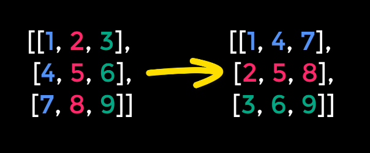
```c#
  public static double[,] Transpose(this double[] array, int rows, int columns)
 {
     double[,] result = new double[columns, rows];
     for (int row = 0; row < rows;row++)
     {
         for (int col = 0; col < columns; col++)
         {
             result[col, row] = array[row * columns + col];
         }
     }
     return result;
 }
```

### Testing the code 
- The method **Train** in the NeuralNetwork class is responsible for training the neural network using the provided training data. Let's break down the steps performed in this method:
1.	The method takes three parameters: trainingInputs, trainingOutputs, and numberOfIterations.
•	trainingInputs is a 2D array that represents the input data for the neural network. Each row in the array represents a set of input values.
•	trainingOutputs is a 2D array that represents the expected output data for the corresponding input data. Each row in the array represents the expected output for the corresponding input row.
•	numberOfIterations specifies the number of iterations or epochs for which the training process will be performed.
2.	The method starts a loop that iterates numberOfIterations times. This loop represents the training process.
3.	Inside the loop, the **Think** method is called to obtain the output of the neural network for the current set of trainingInputs. The Think method performs a feedforward operation, applying the activation function to the dot product of the trainingInputs and the current weights of the neural network.
4.	The **difference** between the **obtained** output and the **expected** output, called the **error**, is calculated by performing the subtraction operation between trainingOutputs and the obtained output.
5.	The **Activate** method is called to apply the **derivative** of the sigmoid activation function to the obtained output. This is done by passing the obtained output and true as the isDerivative parameter. The Activate method returns the derivative of the sigmoid function if isDerivative is true, otherwise it returns the sigmoid output.
6.	The Transpose method is called to transpose the trainingInputs matrix. Transposing a matrix means converting its rows into columns and its columns into rows. This is useful for performing matrix multiplication.
7.	The DotProduct method is called to perform the dot product between the transposed trainingInputs and the result of the element-wise multiplication of error and the derivative of the obtained output. The dot product is a mathematical operation that calculates the sum of the products of corresponding elements in two matrices.
8.	The resulting dot product, called **adjustment**, represents the **adjustment** to be made to the current weights of the neural network.
9.	The **PerformOperation** method is called to *add the adjustment* to the current weights. The PerformOperation method performs element-wise addition between the two matrices.
10.	The updated weights are assigned to the weights variable of the neural network.
11.	The loop continues until the specified number of iterations is reached.
In summary, the Train method trains the neural network by iteratively adjusting the weights based on the error between the expected output and the obtained output. This process helps the neural network learn and improve its ability to make accurate predictions.

```c#
 //This is a simple implementation of a neural network in C# that can perform the OR operation.
NeuralNetwork neuralNetwork = new NeuralNetwork();

//Specify the inputs for training the neural network
double[,] trainingInputs = new double[,]
{
    {0, 0, 0},
    {1, 1, 1},
    {1, 0, 0}
};

//Remember this will test the OR operation in the neural network
//The OR operation is a logical operation that takes two binary inputs and returns true (1) if at least one of the inputs is true (1), and false (0) otherwise.
double[,] trainingOutputs = new double[,]
{
    {0},
    {1},
    {1}
};

//Train the neural network with the training data
neuralNetwork.Train(trainingInputs, trainingOutputs, 1000);

//Test the neural network with new data
double[,] output = neuralNetwork.Think(new double[,] {
    { 0, 1, 0 },
    { 0, 0, 0 },
    { 0, 0, 1 }

});

//Print the output of the neural network
PrintMatrix(output);

//Method to print a 2D array
static void PrintMatrix(double[,] matrix)
{
    int rows = matrix.GetLength(0);
    int cols = matrix.GetLength(1);
    for(int row = 0; row < rows; row++)
    {
        for(int column = 0; column < cols; column++)
        {
            Console.Write(Math.Round(matrix[row,column]) + " ");
        }

        Console.WriteLine();
    }
}

```

## Final Code:
```c#
 
//This is a simple implementation of a neural network in C# that can perform the OR operation.
NeuralNetwork neuralNetwork = new NeuralNetwork();

//Specify the inputs for training the neural network
double[,] trainingInputs = new double[,]
{
    {0, 0, 0},
    {1, 1, 1},
    {1, 0, 0}
};

//Remember this will test the OR operation in the neural network
//The OR operation is a logical operation that takes two binary inputs and returns true (1) if at least one of the inputs is true (1), and false (0) otherwise.
double[,] trainingOutputs = new double[,]
{
    {0},
    {1},
    {1}
};

//Train the neural network with the training data
neuralNetwork.Train(trainingInputs, trainingOutputs, 1000);

//Test the neural network with new data
double[,] output = neuralNetwork.Think(new double[,] {
    { 0, 1, 0 },
    { 0, 0, 0 },
    { 0, 0, 1 }

});

//Print the output of the neural network
PrintMatrix(output);

//Method to print a 2D array
static void PrintMatrix(double[,] matrix)
{
    int rows = matrix.GetLength(0);
    int cols = matrix.GetLength(1);
    for(int row = 0; row < rows; row++)
    {
        for(int column = 0; column < cols; column++)
        {
            Console.Write(Math.Round(matrix[row,column]) + " ");
        }

        Console.WriteLine();
    }
}

//This class represents a simple implementation of a neural network in C# that can perform the OR operation.
//The neural network is trained using a set of input-output pairs and then used to make predictions on new data.
public class NeuralNetwork
{
    //2D array to store the weights of the neural network
    //In a neural network, the weights represent the strength of the connections between the nodes.
    //Each weight corresponds to a connection between two nodes.
    //A 2D array is used to store the weights in a neural network because it allows for a flexible and efficient representation of the connections.
    //The first dimension of the array represents the input nodes, and the second dimension represents the output nodes.
    //Each element in the array represents the weight of the connection between a specific input node and a specific output node.
    // By using a 2D array, we can easily access and manipulate the weights for each connection in the neural network.
    // For example, if we want to update the weight between the first input node and the second output node, we can simply access weights[0, 1] and modify its value.
    // Overall, using a 2D array for weights provides a structured and organized way to represent the connections in a neural network, making it easier to perform computations and update the weights during the training process.

    private double[,] weights;

    //Enum to represent the operations that the neural network can perform
    enum OPERATION { ADD, SUBTRACT, MULTIPLY };

    //Constructor to initialize the weights of the neural network
    public NeuralNetwork()
    {
        Random randomNumber = new Random();
        //Number of input nodes and output nodes
        int numberOfInputNodes = 3;
        int numberOfOutputNodes = 1;
        weights = new double[numberOfInputNodes, numberOfOutputNodes];
        //Initialize the weights with random values between -1 and 1
        for (int i = 0; i < numberOfInputNodes; i++)
        {
            for (int j = 0; j < numberOfOutputNodes; j++)
            {
                weights[i, j] = 2* randomNumber.NextDouble() - 1;
            }
        }
    }

    //Method to transpose a 2D array
    private double[,] Transpose(double[,] matrix)
    {
        return matrix.Cast<double>().ToArray().Transpose(matrix.GetLength(0), matrix.GetLength(1));
    }


    //Method to perform a feedforward operation in the neural network
    // the Activate method applies the sigmoid activation function to each element in the input matrix and returns the resulting matrix.
    // It also has the option to calculate the derivative of the sigmoid function if specified.
    // This method is an essential step in the feedforward process of a neural network, where the input values are transformed through activation functions to produce the network's output.
    private double[,] Activate(double[,] matrix, bool isDerivative)
    {
        int numberOfRows = matrix.GetLength(0);
        int numberOfCols = matrix.GetLength(1);
        double[,] result = new double[numberOfRows, numberOfCols];
        for (int row = 0; row < numberOfRows; row++)
        {
            for (int col = 0; col < numberOfCols; col++)
            {
                double sigmoidOutput = result[row,col] = 1/(1+ Math.Exp(-matrix[row,col]));
                double derivativeSigmoidOutput = result[row,col] = matrix[row,col] * (1 - matrix[row,col]);
                result[row,col] = isDerivative ? derivativeSigmoidOutput : sigmoidOutput;
            }
        }

        return result;
    }

    
    public void Train(double[,] trainingInputs, double[,] trainingOutputs, int numberOfIterations)
    {
        for (int iteration = 0; iteration < numberOfIterations; iteration++)
        {
            double[,] output = Think(trainingInputs);
            double[,] error = PerformOperation(trainingOutputs, output, OPERATION.SUBTRACT);
            double[,] adjustment = DotProduct(Transpose(trainingInputs), PerformOperation(error,Activate(output, true), OPERATION.MULTIPLY));
            weights = PerformOperation(weights, adjustment, OPERATION.ADD);
        }
    }


    // 
    private double[,] DotProduct(double[,] matrix1, double[,] matrix2)
    {
        int numberOfRowsInMatrix1 = matrix1.GetLength(0);
        int numberOfColsInMatrix1 = matrix1.GetLength(1);

        int numberOfRowsInMatrix2 = matrix2.GetLength(0);
        int numberOfColsInMatrix2 = matrix2.GetLength(1);

        double[,] result = new double[numberOfRowsInMatrix1, numberOfColsInMatrix2];
        for(int rowInMatrix1 = 0; rowInMatrix1 < numberOfRowsInMatrix1; rowInMatrix1++)
        {
            for (int colInMatrix2 = 0; colInMatrix2 < numberOfColsInMatrix2; colInMatrix2++)
            {
                double sum = 0;
                for (int colInMatrix1 = 0; colInMatrix1 < numberOfColsInMatrix1; colInMatrix1++)
                {
                    sum += matrix1[rowInMatrix1, colInMatrix1] * matrix2[colInMatrix1, colInMatrix2];
                }
                result[rowInMatrix1, colInMatrix2] = sum;
            }
        }

        return result;

    }

    //The PerformOperation method takes two matrices and an operation as input and performs the specified operation on each element of the matrices.
    //n a neural network, element-wise operations are commonly used during the training process to update the weights based on the calculated error. The PerformOperation method allows for flexible and efficient computation of element-wise operations, such as addition, subtraction, and multiplication.
    //By using a nested loop, the method iterates over each element of the matrices and performs the specified operation based on the OPERATION parameter. The result is stored in a new matrix, which is then returned.
    //For example, during the training process, the PerformOperation method is used to subtract the predicted output from the desired output to calculate the error. It is also used to multiply the error with the derivative of the sigmoid function to adjust the weights. These element-wise operations are essential for updating the weights and improving the performance of the neural network.
    private double[,] PerformOperation(double[,] matrix1, double[,] matrix2, OPERATION operation)
    {
        int numberOfRows = matrix1.GetLength(0);
        int numberOfCols = matrix1.GetLength(1);
        double[,] result = new double[numberOfRows, numberOfCols];
        for (int row = 0; row < numberOfRows; row++)
        {
            for (int col = 0; col < numberOfCols; col++)
            {
                switch (operation)
                {
                    case OPERATION.ADD:
                        result[row, col] = matrix1[row, col] + matrix2[row, col];
                        break;
                    case OPERATION.SUBTRACT:
                        result[row, col] = matrix1[row, col] - matrix2[row, col];
                        break;
                    case OPERATION.MULTIPLY:
                        result[row, col] = matrix1[row, col] * matrix2[row, col];
                        break;
                }
            }
        }
        return result;
    }

    public double[,] Think(double[,] inputs)
    {
        return Activate(DotProduct(inputs, weights), false);
    }

}

public static class Extensions
{
    //Extension method to transpose a 2D array
    //The Transpose method is an extension method that transposes a 2D array.
    //Transposing a matrix means converting its rows into columns and its columns into rows.
    //This is useful in various mathematical and computational operations.
   //The Transpose method achieves this by creating a new 2D array with the dimensions of the transposed matrix.
   //It then iterates over the original matrix and assigns the values to the corresponding positions in the transposed matrix.
    public static double[,] Transpose(this double[] array, int rows, int columns)
    {
        double[,] result = new double[columns, rows];
        for (int row = 0; row < rows;row++)
        {
            for (int col = 0; col < columns; col++)
            {
                result[col, row] = array[row * columns + col];
            }
        }
        return result;
    }
}


```

## Real world applications of Neural Networks
- 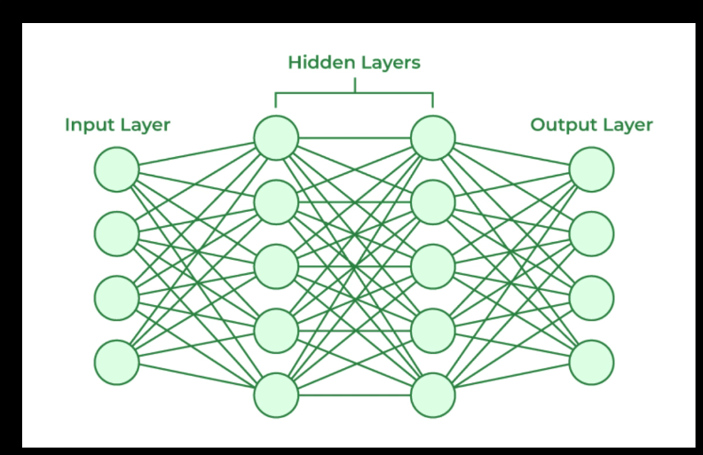
- 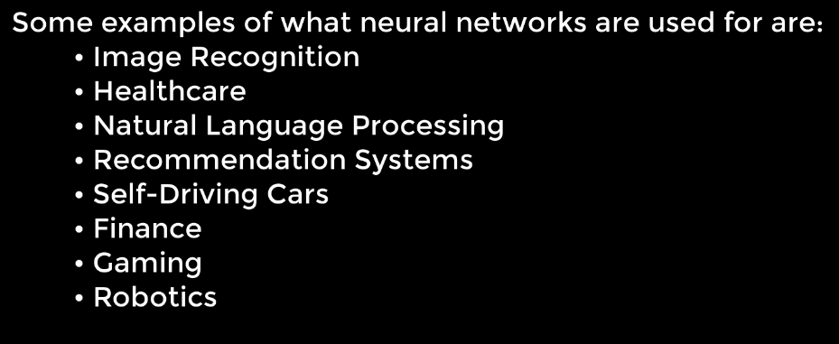
- Neural networks are used in healthcare like radiology.
- Also used for natural language processing
- Can be used in self-driving cars
- In finance industry, can be used to detect frauds
- Also allow robots to view their environment

## Why we need sigmoid function?
- A neural network is like a brain-inspired system in a computer that learns to make decisions or predictions. It’s made of layers of "neurons" (small units) that process numbers and pass them along. These neurons take inputs (like numbers), do some math, and produce an output.

- The problem is: the raw output of a neuron (after doing some math) can be any number, like -5, 10, or 1000. But in many cases, we need the output to be in a specific range (like 0 to 1) to make sense for things like probabilities or decisions. That’s where the sigmoid function comes in!
- The sigmoid function is a mathematical formula that "squashes" any number into a range between 0 and 1. It’s shaped like an "S" curve and looks like this:
- 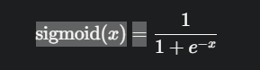
- x is the input number (can be anything: positive, negative, big, small).
- e is a special math constant (~2.718).
- The output is always between 0 and 1.
- How it Works:
- If x is a big positive number (e.g., 10), sigmoid output is close to 1.
- If x is a big negative number (e.g., -10), sigmoid output is close to 0.
- If x is 0, sigmoid output is 0.5.
- This makes it perfect for situations where we want to interpret the output as a probability (like "how likely is this to be true?").
- Neural networks often need to:
- Make Decisions: For example, "Is this a cat in the picture? Yes or No."
- Learn: Adjust their internal math based on how wrong their predictions are.
- The sigmoid function helps with both:
- Squashing Outputs: It turns raw numbers into a 0-to-1 range, which can represent probabilities or "confidence levels."
- Smooth Learning: Its "S" shape is smooth and gradual, which helps the network learn by giving it a way to tweak its predictions little by little (using something called "gradient descent").
- Without sigmoid (or similar functions), the neuron outputs could be all over the place, making it hard to interpret or train the network.
- Imagine you’re building a tiny neural network to decide: "Is this a sunny day?" based on two inputs:
- Temperature (e.g., 80°F).
- Cloud cover (e.g., 20% cloudy).
- Step 1: Raw Math in a Neuron
- The neuron takes these inputs, multiplies them by "weights" (importance factors), adds them up, and gets a number. Let’s say:

- Temperature (80) × Weight (0.1) = 8
- Cloud cover (20) × Weight (-0.2) = -4
- Total = 8 + (-4) = 4
- So, the neuron’s raw output is 4. What does "4" mean? It’s not clear—it’s just a number!

- Step 2: Apply Sigmoid
- Now, plug 4 into the sigmoid function:
- 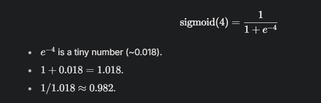
- The output is 0.982 (close to 1). This could mean "98.2% chance it’s a sunny day!" That’s way easier to understand than "4."


## Machine Learning with .NET
- Open source ML framework developed by Microsoft. 
- Enables developers to build and incorporate ML models into .NET Applications 
- It provides a set of tools, libraries, and APIs that streamline the process of creating, training,and deploying machine learning models, all within the familiar environment of the dotnet ecosystem.
- 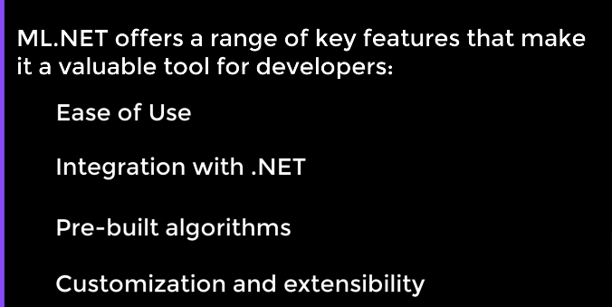
### Workflow of ML.NET 
- 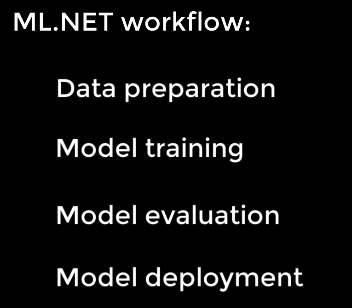
### Applications of ML.NET 
- Ml.net supports NLP tasks such as sentiment analysis, named entity recognition and text classification, enabling developers to analyze and extract insights from textual data.
- Ml.net includes components for computer vision tasks such as image classification, object detection,
and image segmentation, allowing developers to build applications that understand and interpret visual
information.
- 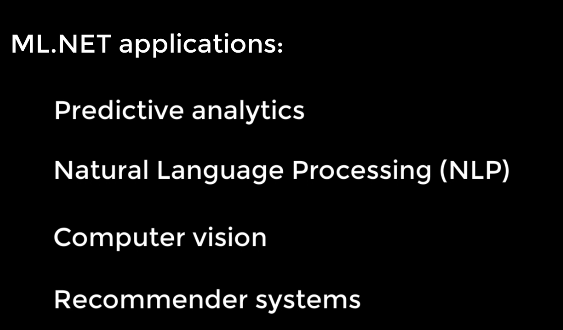
- Add the following nuget package for incorporating ML.NET in our application 
```shell
dotnet add package Microsoft.ML
dotnet add package Microsoft.ML.FastTree
```
### We will create a program using ML.NET which will perform regression on a given dataset(housing-data) and predict house prices 
- The code loads housing data, creates a machine learning pipeline, trains a regression model, makes predictions, evaluates the model's performance, and prints the evaluation metrics.

- MLContext mlContext = new MLContext();: This line creates an instance of the MLContext class, which is the main entry point for ML.NET functionality. It provides the environment for creating and executing machine learning workflows.
  
- IDataView data = mlContext.Data.LoadFromTextFile<HousingData>("housing-data.csv", separatorChar: ',');: This line loads the housing data from a text file called "housing-data.csv" and converts it into an IDataView object. The LoadFromTextFile method is used to read the data from the file, and the generic type parameter HousingData specifies the class that represents the structure of the data.
  
- string[] featureColumns = { "SquareFeet", "Bedrooms" };: This line defines an array of strings that represents the names of the columns in the housing data that will be used as features for the regression task. In this case, the "SquareFeet" and "Bedrooms" columns are selected as features.
  
- string labelColumn = "Price";: This line defines a string variable that represents the name of the column in the housing data that will be used as the label for the regression task. In this case, the "Price" column is selected as the label.
  
- var pipeline = mlContext.Transforms.Concatenate("Features", featureColumns).Append(mlContext.Regression.Trainers.FastTree(labelColumnName: labelColumn));: This line creates a machine learning pipeline. The Concatenate method is used to combine the feature columns into a single column called "Features". The Append method is used to add a regression trainer to the pipeline. In this case, the FastTree trainer is used, which is a decision tree-based regression algorithm.
  
- var model = pipeline.Fit(data);: This line trains the machine learning model by fitting the pipeline to the loaded data. The Fit method takes the data as input and returns a trained model.
  
- var prediction = model.Transform(data);: This line uses the trained model to make predictions on the same data that was used for training. The Transform method takes the data as input and returns a new IDataView object containing the predicted values.
  
- var metrics = mlContext.Regression.Evaluate(prediction, labelColumnName: labelColumn);: This line evaluates the performance of the model by comparing the predicted values with the actual values in the data. The Evaluate method takes the predicted values and the label column name as input and returns a set of regression evaluation metrics.
  
- Console.WriteLine($"Mean Absolute Error: {metrics.MeanAbsoluteError}");: This line prints the mean absolute error metric, which measures the average absolute difference between the predicted and actual values.
  
- Console.WriteLine($"Root Mean Squared Error: {metrics.RootMeanSquaredError}");: This line prints the root mean squared error metric, which measures the square root of the average squared difference between the predicted and actual values.

```c#
 using Microsoft.ML;
using Microsoft.ML.Data;


MLContext mlContext = new MLContext();
IDataView data = mlContext.Data.LoadFromTextFile<HousingData>("housing-data.csv", separatorChar: ',');
string[] featureColumns = { "SquareFeet", "Bedrooms" };
string labelColumn = "Price";

// Define the training pipeline
var pipeline = mlContext.Transforms.Concatenate("Features", featureColumns)
    .Append(mlContext.Regression.Trainers.FastTree(labelColumnName: labelColumn));

// Train the model
var model = pipeline.Fit(data);

// Make predictions
var prediction = model.Transform(data);

// Evaluate the model
var metrics = mlContext.Regression.Evaluate(prediction, labelColumnName: labelColumn);

// Print the evaluation metrics
Console.WriteLine($"Mean Absolute Error: {metrics.MeanAbsoluteError}");
Console.WriteLine($"Root Mean Squared Error: {metrics.RootMeanSquaredError}");


// Define a class to hold the housing data
public class HousingData
{
    [LoadColumn(0)]
    public float SquareFeet { get; set; }

    [LoadColumn(1)]
    public float Bedrooms { get; set; }

    [LoadColumn(2)]
    public float Price { get; set; }
}

// Define a class to hold the housing prediction
public class HousingPrediction
{
    [ColumnName("Score")]
    public float Price { get; set; }
}

```
### Data Preparation and Loading in ML.NET
- ML.NET provides various methods for loading data, including loading from text files, databases and in-memory collections.
- If the data is already available in memory as a collection(e.g a list or an array), we can use the LoadFromEnumerable() method to load it directly into ML.NET. This is useful when your data is relatively small and can fit into memory. 
- If the data is stored in a database, we can use the LoadFromDatabase() to load it into ML.NET. 
- This method allows us to specify a database connection string and SQL query to retrieve the data.
- If our text file contains a header row with column names, we can use the LoadFromTextFileWithHeader method to load the data while automatically inferring the column types. 
- If our data is stored in JSON format, we can use the LoadFromJson() method to load it into ML.NET. This method allows us to specify the JSON file path and the data schema. 
- If our data is in Apache Parquet format, we can use the LoadFromParquetFile() method to load it into ML.NET. Parquet is a columnar storage format that is efficient for large datasets. 
- 
- Ml.net provides methods for cleaning data such as replace missing values, filter rows by missing values, and remove duplicates.
- Ml.net provides transformers for feature engineering tasks such as concatenate, normalize, and one
hot encoding.
- Split your data into training and testing sets to evaluate your model's Performance. Ml.net provides methods for splitting data such as train test, split and cross validation.
- Ml.net provides transformers for normalization such as normalize min max and normalize mean variance.
- Pipeline data preparation steps create a data preparation pipeline to automate and streamline the data preparation process.

### Feature Engineering in ML.NET 
- Feature engineering is the process of creating new features from existing ones or transforming existing features to improve the performance of machine learning models. 
- It is like giving our model the right tools to make accurate predictions.
- Plays crucial role in success of ML models. 
- By engineering meaningful features, we can capture more relevant information from the data, reduce
noise, and improve the model's ability to generalize to unseen data.
- Good feature engineering can make or break a machine learning model.
- In machine learning, features are the pieces of information (or input variables) that a model uses to make predictions. For example, if you’re predicting whether someone will buy a product, features might include their age, income, or location. Feature engineering is the process of preparing and improving these features so that your machine learning model can learn from them more effectively. It’s like organizing and polishing raw data to help the model do its job better.
- In ML.NET, feature engineering involves transforming raw data into a format that the model can understand, creating new useful features, and selecting the most relevant ones. ML.NET makes this easier by providing tools called transformers, which you can chain together in a pipeline to preprocess your data before training a model.
- Transforming existing features: Turning data into a usable form (e.g., converting text or categories into numbers).
- Creating new features: Combining or modifying existing data to make it more meaningful.
- Selecting features: Picking the most important ones to avoid confusing the model with irrelevant details.
- Imagine you have a dataset about houses with these columns:
- Number of bedrooms (e.g., 3)
- Size in square feet (e.g., 1500)
- Age of the house (e.g., 10 years)
- Price (e.g., $300,000)
- Your goal is to predict the price of a house based on the other columns.
- Here’s how feature engineering comes into play:
- Using Existing Features
You can use "number of bedrooms," "size," and "age" directly as features. These are already numbers, so the model can work with them. But we can do more to improve things!
- Creating a New Feature
What if the price depends not just on size, but on how spacious each bedroom feels? You could create a new feature called size per bedroom by dividing "size" by "number of bedrooms" (e.g., 1500 ÷ 3 = 500 square feet per bedroom). This new feature might give the model extra insight into what makes a house valuable.
- Scaling Features
Notice that "size" (1500) is much bigger than "age" (10) or "bedrooms" (3). Some machine learning algorithms get confused when features are on different scales. In ML.NET, you can use a transformer like NormalizeMinMax to adjust all features to a range like 0 to 1, making them easier for the model to compare.

```c#
 var pipeline = mlContext.Transforms.NormalizeMinMax("SizeNormalized", "Size")
    .Append(mlContext.Transforms.NormalizeMinMax("AgeNormalized", "Age"))
    .Append(mlContext.Transforms.Concatenate("Features", "SizeNormalized", "AgeNormalized", "Bedrooms"));

```
#### Feature Engineering Techniques
- Normalization 
- 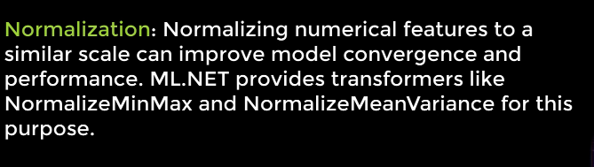
- 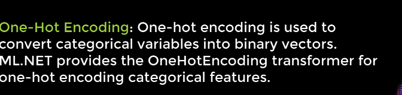
- OneHotEncoding is a technique used in machine learning to convert categorical data—information that represents categories or labels, such as colors (red, blue, green), sizes (small, medium, large), or countries (USA, Canada, Mexico)—into a numerical format that machine learning algorithms can understand. Since most machine learning models work with numbers rather than text or labels, OneHotEncoding provides a way to represent categories in a way that’s suitable for these algorithms.
- Machine learning algorithms often assume that numerical data has a natural order or magnitude. For example, if you assign numbers to categories like this:

Red = 1
Blue = 2
Green = 3
The model might incorrectly assume that green (3) is "greater" than red (1), implying a ranking or relationship that doesn’t exist—colors are just different, not ordered. OneHotEncoding solves this by representing each category as a binary vector, ensuring that categories are treated independently without suggesting any hierarchy.
- 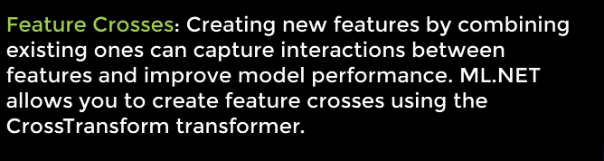

```c#
 using Microsoft.ML;
using Microsoft.ML.Data;


MLContext mlContext = new MLContext();
IDataView data = mlContext.Data.LoadFromTextFile<HousingData>("housing-data.csv", separatorChar: ',');

// Define the data preparation pipeline
// Convert the SquareFeet column to a Single type
// Normalize the SquareFeet column
// Concatenate the SquareFeet and Bedrooms columns into a Features column
// One-hot encode the Neighborhood column

var dataPipeline = 
    mlContext.Transforms.Conversion.ConvertType("SquareFeet", outputKind: DataKind.Single)
    .Append(mlContext.Transforms.NormalizeMinMax("SquareFeet"))
    .Append(mlContext.Transforms.Concatenate("Features", "SquareFeet", "Bedrooms"))
    .Append(mlContext.Transforms.Categorical.OneHotEncoding("Neighborhood"));

// Fit and transform the data
var transformedData = dataPipeline.Fit(data).Transform(data);

// Print the transformed data
var transformedDataEnumerable = mlContext.Data.CreateEnumerable<TransformedHousingData>(transformedData, reuseRowObject: false).ToList();

foreach (var item in transformedDataEnumerable)
{
    Console.WriteLine($"SquareFeet: {item.SquareFeet}," +
        $" Bedrooms: {item.Bedrooms}, " +
        $"Price: {item.Price}, " +
        $"Features: [{string.Join(", ", item.Features)}], " +
        $"Neighborhood: [{string.Join(", ", item.Neighborhood)}]");
}

```

## Model Selection and Evaluation in ML.NET 
- The model selection process involves choosing the best algorithm and hyper-parameters for our machine learning task. 
- 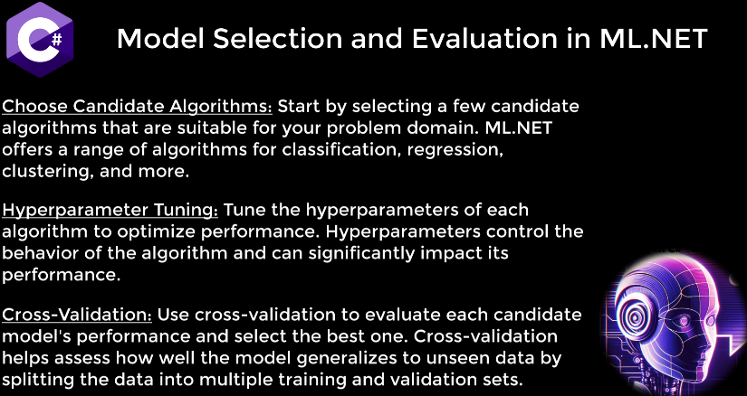
- 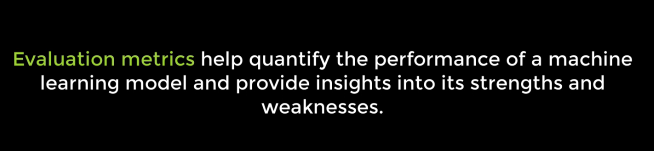
- 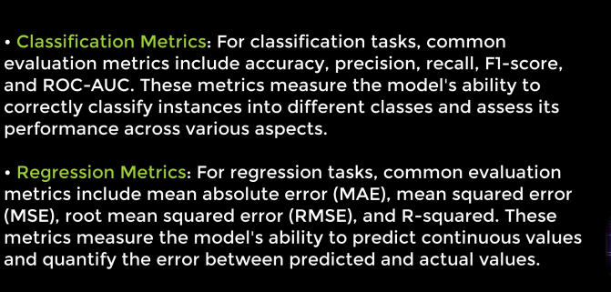

```c#
 using Microsoft.ML;
using Microsoft.ML.Data;


static void EvaluateMetrics(string modelName, BinaryClassificationMetrics metrics)
{
    Console.WriteLine($"{modelName} - Accuracy:{metrics.Accuracy:0.##}");
    Console.WriteLine($"{modelName} - AUC:{metrics.AreaUnderRocCurve:0.##}");
}

var context = new MLContext();
var data = context.Data.LoadFromTextFile<DataPoint>("data.csv", separatorChar: ',', hasHeader:true);

// Split the data into training and test sets
var trainTestSplit = context.Data.TrainTestSplit(data, testFraction: 0.2);

// Train the model
// Define the pipeline
// Concatenate the features into a single column
// Append the logistic regression trainer
// The label column is the "Label" column
// The maximum number of iterations is 100
// context.Transforms.Concatenate("Features", "Feature1", "Feature2") is a transformation step that concatenates multiple input features into a single column.
// In this example, we are concatenating two features, "Feature1" and "Feature2", into a new column called "Features".
// This transformation is useful when you want to combine multiple features into a single input for the model.
// Append(context.BinaryClassification.Trainers.SdcaLogisticRegression(labelColumnName:"Label", maximumNumberOfIterations: 100)) is the trainer step that appends a logistic regression trainer to the pipeline. The trainer is responsible for training the model using the transformed data. In this example, we are using the SdcaLogisticRegression trainer, which is a type of logistic regression algorithm.
// We specify the label column name as "Label" and set the maximum number of iterations to 100.
var logisticRegressionPipeline = context.Transforms.Concatenate("Features", "Feature1", "Feature2")
    .Append(context.BinaryClassification.Trainers.SdcaLogisticRegression(labelColumnName:"Label", maximumNumberOfIterations: 100));


var fastTreePipeline = context.Transforms.Concatenate("Features", "Feature1", "Feature2")
    .Append(context.BinaryClassification.Trainers.FastTree(labelColumnName: "Label", numberOfLeaves: 50, numberOfTrees:100));

Console.WriteLine("Training Logistic Regression model...");
var logisticRegressionModel = logisticRegressionPipeline.Fit(trainTestSplit.TrainSet);

Console.WriteLine("Training FastTree model...");
var fastTreeModel = fastTreePipeline.Fit(trainTestSplit.TrainSet);

// Evaluate the models
Console.WriteLine("Evaluating the Logistic Regression Model...");
var logisticRegressionPredictions = logisticRegressionModel.Transform(trainTestSplit.TestSet);
var logisticRegressionMetrics = context.BinaryClassification.Evaluate(logisticRegressionPredictions, "Label");
EvaluateMetrics("Logistic Regression", logisticRegressionMetrics);

Console.WriteLine("Evaluating the FastTree Model...");
var fastTreePredictions = fastTreeModel.Transform(trainTestSplit.TestSet);
var fastTreeMetrics = context.BinaryClassification.Evaluate(fastTreePredictions, "Label");
EvaluateMetrics("FastTree", fastTreeMetrics);

if(logisticRegressionMetrics.Accuracy > fastTreeMetrics.Accuracy)
{
    Console.WriteLine("Logistic Regression Model is the better model");
} else if(logisticRegressionMetrics.Accuracy < fastTreeMetrics.Accuracy)
{
    Console.WriteLine("FastTree Model is the better model");
}
else
{
    Console.WriteLine("Both models are equally good");
}

public class DataPoint
{
    [LoadColumn(0)]

    public float Feature1 { get; set; }
    [LoadColumn(1)]
    public float Feature2 { get; set; }

    [LoadColumn(2)]
    public bool Label { get; set; }
}

public class Prediction
{
    [ColumnName("Score")]
    public float Score { get; set; }

    [ColumnName("Probability")]
    public float Probability { get; set; }
}


```

## Training and Tuning the models in ML.NET 
- 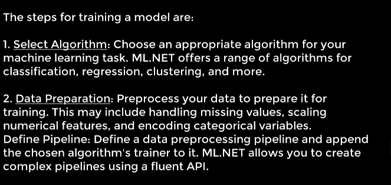
- 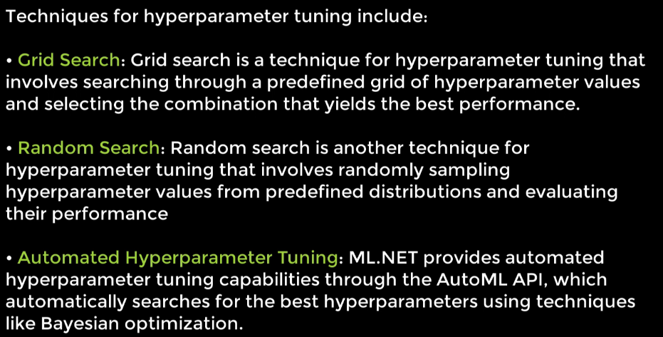
```c#
 var logisticRegressionPipeline = context.Transforms.Concatenate("Features", "Feature1", "Feature2")
    .Append(context.BinaryClassification.Trainers.SdcaLogisticRegression(labelColumnName:"Label", maximumNumberOfIterations: 100));


var fastTreePipeline = context.Transforms.Concatenate("Features", "Feature1", "Feature2")
    .Append(context.BinaryClassification.Trainers.FastTree(labelColumnName: "Label", numberOfLeaves: 50, numberOfTrees:100));

Console.WriteLine("Training Logistic Regression model...");
var logisticRegressionModel = logisticRegressionPipeline.Fit(trainTestSplit.TrainSet);

Console.WriteLine("Training FastTree model...");
var fastTreeModel = fastTreePipeline.Fit(trainTestSplit.TrainSet);
```

### Model Deployment and Integration with ML.NET 
- Model deployment involves making the trained machine learning model available for use in Production Environments.
- 
- Model serialization.
- The trained Ml.net model needs to be serialized into a format that can be easily loaded and used by
production systems.
- Ml.net supports model serialization to different formats, including Onnx, Open Neural Network Exchange, and the native Ml.net format model hosting.
- Once serialized, the model needs to be hosted within an application or service where it can receive
input data, make predictions, and return results.
- This can be achieved by embedding the model within a web service, a serverless function, or a dedicated microservice.
- Scalability and performance.
- When deploying models into production, scalability and performance are crucial factors to consider.
- Ml.net models can be deployed to scalable cloud platforms like Azure, where they can benefit from auto scaling and high performance infrastructure.
- 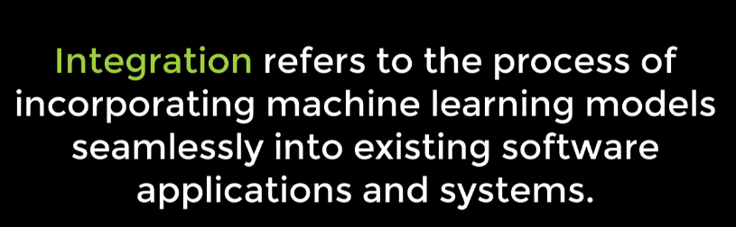
- 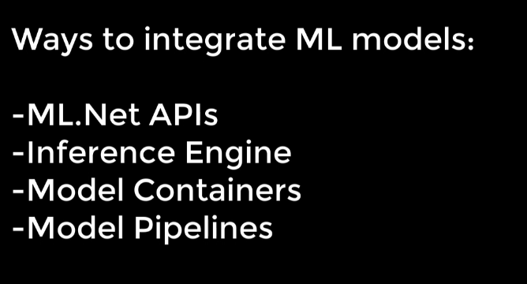
- Models can also be packaged into docker containers.
- Ml.net supports building and deploying complex model pipelines that include pre-processing, feature
engineering, and model inference steps.
- These pipelines can be integrated into existing data processing pipelines or workflows to automate the end to end machine learning process.(MLOps)
- Implement logging and monitoring mechanisms to track model performance, detect anomalies and troubleshoot issues in production.
- Maintain version control for deployed models to track changes.

## Creating a Classification AI using ML.NET
- Classification in machine learning is about teaching computers to sort data into different categories based on patterns they learn from past examples. 
- 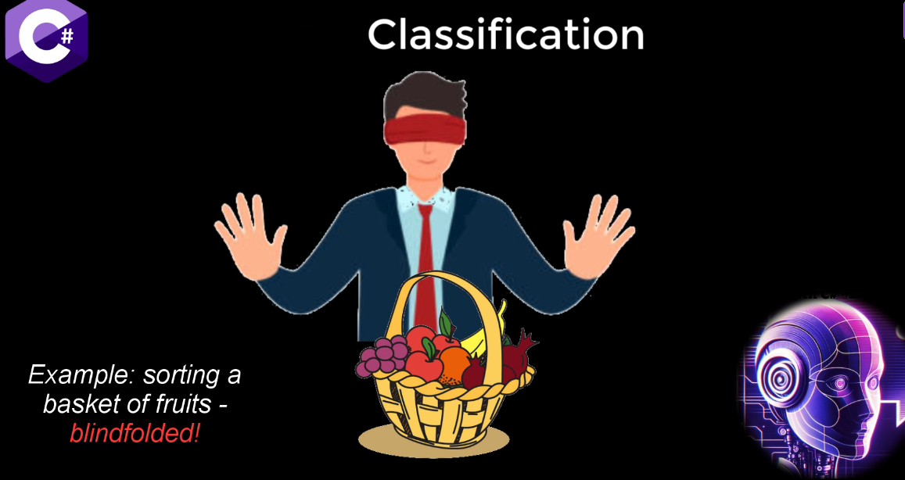
- Fruits are our data points and type of fruit is the category or label 
- 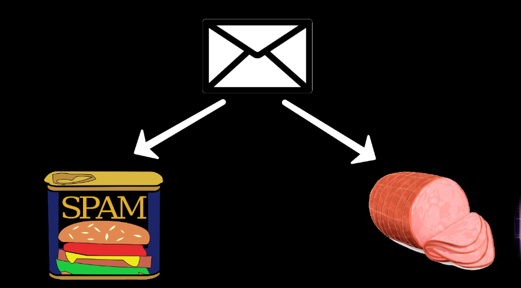
- We can use classification AI to determine if email is spam or not 
- 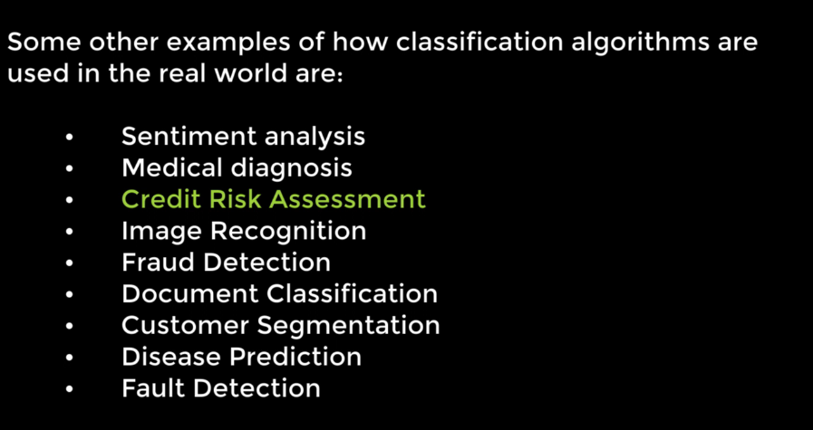
- 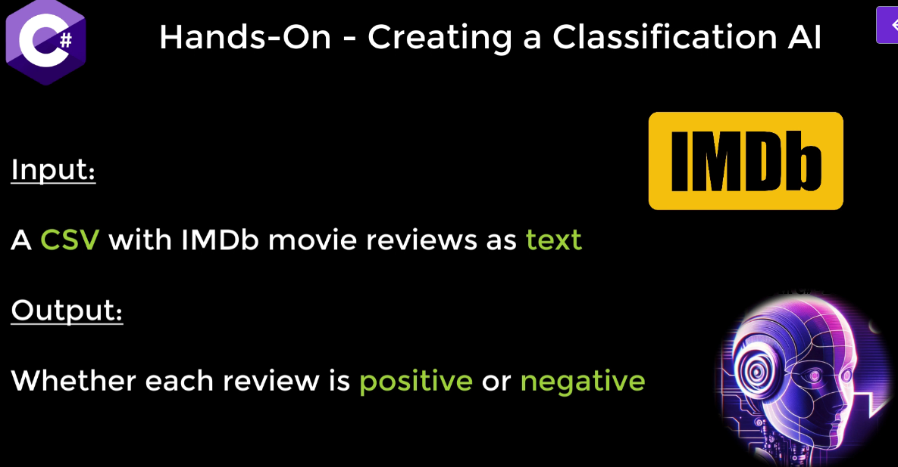
- 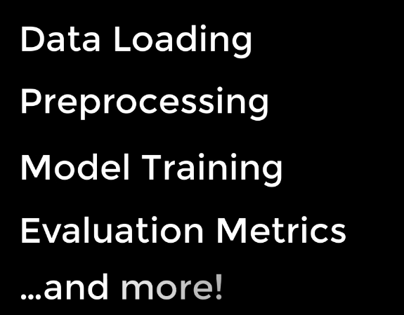
### Training the Classification AI model to a csv file containing movie reviews 
- First we will clean the training data 
- The following code will replace all quotes(') with empty text so that our model is not confused
```c#
 //Create a new MLContext instance
MLContext mLContext = new MLContext();
Load the data from the file into an IDataView object
string dataPath = "train.csv";
string text = File.ReadAllText(dataPath);
using (StreamReader streamReader = new StreamReader(dataPath))
{
   text = text.Replace("\'", "");
} 

File.WriteAllText(dataPath, text);

```
- Next we will start training the model 
```c#
//Create a new MLContext instance
MLContext mLContext = new MLContext();
//Load the data from the file into an IDataView object
string dataPath = "train.csv";
//Load training data into a dataView
IDataView dataView = mLContext.Data.LoadFromTextFile<MovieReview>(dataPath, hasHeader: true, allowQuoting: true, separatorChar: ',');

//Create a pipeline which featurizes text and use Logistic Regression algorithm
//The pipeline starts with the Transforms.Text.FeaturizeText method.
//This method is used to convert the text data into numerical features that can be used by the machine learning algorithm.
//It takes two parameters: the name of the output column ("Features") and the name of the input column ("text").
//The Append method is then called on the pipeline to add another component to the sequence.
//In this case, it appends the BinaryClassification.Trainers.SdcaLogisticRegression method, which represents the chosen machine learning algorithm.
//This algorithm is a binary logistic regression model trained using the Stochastic Dual Coordinate Ascent(SDCA) optimization algorithm.
//It takes two parameters: the name of the label column("Label") and the name of the feature column("Features").
//in summary, this line of code creates a pipeline that first converts the text data into numerical features and then applies a binary logistic regression model to train the data.
var pipeline = mLContext.Transforms.Text.FeaturizeText("Features", "text")
    .Append(mLContext.BinaryClassification.Trainers.SdcaLogisticRegression("Label", "Features"));


//In machine learning, a pipeline is a sequence of data processing components, called transformers and estimators, that are applied in a specific order to transform the data and train a model.
//The Fit method is used to train the model by fitting the pipeline to the data.
//In this case, the pipeline variable represents the sequence of transformations and the chosen machine learning algorithm.
//The Fit method takes the dataView as input and trains the model by applying the transformations and the chosen algorithm to the data.
var model = pipeline.Fit(dataView);

//The Transform method is used to apply the trained model to new data and generate predictions.
var predictions = model.Transform(dataView);

//The Evaluate method is used to evaluate the model's performance on the test data.
var metrics = mLContext.BinaryClassification.Evaluate(predictions, "Label");
Console.WriteLine($"Accuracy: {metrics.Accuracy}");
Console.WriteLine($"Accuracy: {metrics.PositivePrecision}");
Console.WriteLine($"Accuracy: {metrics.PositiveRecall}");
Console.WriteLine($"Accuracy: {metrics.F1Score}");

//Save the model to a file
mLContext.Model.Save(model, dataView.Schema, "sentiment_model.zip");


```

### Evaluating and Testing the Model
- We will load the sample test file into the project. Then we will load the zipped model first. 
- Then we will load the test data into the DataView
- We will then create a  prediction engine using the MLContext's Model.CreatePredictionEngine method. - The prediction engine is used to make predictions on new data using a trained ML.NET model.
- In this specific case, the TextData class is used as the input type for the prediction engine, and the SentimentPrediction class is used as the output type. The model variable represents the trained ML.NET model that was loaded from a file.
- Once the prediction engine is created, you can use it to make predictions by calling the Predict method and passing in an instance of the TextData class. 
- The prediction engine will apply the trained model to the input data and generate a prediction based on the model's learned patterns.
- For example, in the code snippet you provided, the prediction engine is used in a loop to make predictions on a list of TextData instances. The predicted sentiment (positive or negative) is then printed to the console.
```c#
  string modelPath = "sentiment_model.zip";
 string testDataPath = "movieReviewsTesting.csv";
 var mlContext = new MLContext();
 ITransformer model;
 using (var stream = new FileStream(modelPath, FileMode.Open, FileAccess.Read, FileShare.Read))
 {
     //Load the model from the file
     model = mlContext.Model.Load(stream, out var modelInputSchema);
 }

 //Load the test data from the file
 IDataView testData = mlContext.Data.LoadFromTextFile<TextData>(testDataPath, hasHeader: true, separatorChar: ',');

 //Apply the model to the test data
 var predictor = mlContext.Model.CreatePredictionEngine<TextData, SentimentPrediction>(model);

 //Get the predictions
 var testDataList = mlContext.Data.CreateEnumerable<TextData>(testData, reuseRowObject: false).ToList();
 foreach (var data in testDataList)
 {
     //Make a prediction
     var prediction = predictor.Predict(data);
     //Print the prediction
     Console.WriteLine($"Text: {data.text} | Prediction: {(prediction.IsPositiveSentiment ? "Positive" : "Negative")}");
 }

```

### Full code of the project 
```c#
using Microsoft.ML;
using Microsoft.ML.Data;
using System.IO;
using Microsoft.ML.Trainers;
using System.Runtime.CompilerServices;
using System.ComponentModel;
using System.Reflection.Emit;

namespace Classification
{
    public class MovieReview
    {
        //The load column attribute is used in Ml.net to specify the index of the column in a data set to load into a property of a class when loading data from a file.
        //In this case, the attribute will load values from the first column index zero of the dataset file into the label property.

        [LoadColumn(0)]
        public string text { get; set; }

        [LoadColumn(1)]
        [ColumnName("Label")]
        public bool sentiment { get; set; }


    }

    public class TextData
    {
        [LoadColumn(0)]
        public string text { get; set; }
    }

    public class SentimentPrediction
    {
        [ColumnName("Score")]
        public float SentimentScore { get; set; }

        public bool IsPositiveSentiment => SentimentScore < 0.5f;
    }

        public class Program
    {
        public static void Main(string[] args)
        {
            ////Create a new MLContext instance
            //MLContext mLContext = new MLContext();
            ////Load the data from the file into an IDataView object
            //string dataPath = "train.csv";
            ////string text = File.ReadAllText(dataPath);
            ////using (StreamReader streamReader = new StreamReader(dataPath))
            ////{
            ////    text = text.Replace("\'", "");
            ////} 

            ////File.WriteAllText(dataPath, text);


            //IDataView dataView = mLContext.Data.LoadFromTextFile<MovieReview>(dataPath, hasHeader: true, allowQuoting: true, separatorChar: ',');

            ////Console.WriteLine("Data loaded successfully");
            ////Console.WriteLine();

            ////var preview = dataView.Preview();
            ////foreach (var row in preview.RowView)
            ////{
            ////    Console.WriteLine($"{row.Values[0]} | {row.Values[1]}");
            ////}

            ////The pipeline starts with the Transforms.Text.FeaturizeText method.
            ////This method is used to convert the text data into numerical features that can be used by the machine learning algorithm.
            ////It takes two parameters: the name of the output column ("Features") and the name of the input column ("text").
            ////The Append method is then called on the pipeline to add another component to the sequence.
            ////In this case, it appends the BinaryClassification.Trainers.SdcaLogisticRegression method, which represents the chosen machine learning algorithm.
            ////This algorithm is a binary logistic regression model trained using the Stochastic Dual Coordinate Ascent(SDCA) optimization algorithm.
            ////It takes two parameters: the name of the label column("Label") and the name of the feature column("Features").
            ////in summary, this line of code creates a pipeline that first converts the text data into numerical features and then applies a binary logistic regression model to train the data.
            //var pipeline = mLContext.Transforms.Text.FeaturizeText("Features", "text")
            //    .Append(mLContext.BinaryClassification.Trainers.SdcaLogisticRegression("Label", "Features"));

            //    //In machine learning, a pipeline is a sequence of data processing components, called transformers and estimators, that are applied in a specific order to transform the data and train a model.
            //    //The Fit method is used to train the model by fitting the pipeline to the data.
            //    //In this case, the pipeline variable represents the sequence of transformations and the chosen machine learning algorithm.
            //    //The Fit method takes the dataView as input and trains the model by applying the transformations and the chosen algorithm to the data.
            //var model = pipeline.Fit(dataView);

            ////The Transform method is used to apply the trained model to new data and generate predictions.
            //var predictions = model.Transform(dataView);

            ////The Evaluate method is used to evaluate the model's performance on the test data.
            //var metrics = mLContext.BinaryClassification.Evaluate(predictions, "Label");
            //Console.WriteLine($"Accuracy: {metrics.Accuracy}");
            //Console.WriteLine($"Accuracy: {metrics.PositivePrecision}");
            //Console.WriteLine($"Accuracy: {metrics.PositiveRecall}");
            //Console.WriteLine($"Accuracy: {metrics.F1Score}");

            ////Save the model to a file
            //mLContext.Model.Save(model, dataView.Schema, "sentiment_model.zip");

            string modelPath = "sentiment_model.zip";
            string testDataPath = "movieReviewsTesting.csv";
            var mlContext = new MLContext();
            ITransformer model;
            using (var stream = new FileStream(modelPath, FileMode.Open, FileAccess.Read, FileShare.Read))
            {
                //Load the model from the file
                model = mlContext.Model.Load(stream, out var modelInputSchema);
            }

            //Load the test data from the file
            IDataView testData = mlContext.Data.LoadFromTextFile<TextData>(testDataPath, hasHeader: true, separatorChar: ',');

            //Apply the model to the test data
            var predictor = mlContext.Model.CreatePredictionEngine<TextData, SentimentPrediction>(model);

            //Get the predictions
            var testDataList = mlContext.Data.CreateEnumerable<TextData>(testData, reuseRowObject: false).ToList();
            foreach (var data in testDataList)
            {
                //Make a prediction
                var prediction = predictor.Predict(data);
                //Print the prediction
                Console.WriteLine($"Text: {data.text} | Prediction: {(prediction.IsPositiveSentiment ? "Positive" : "Negative")}");
            }
        }
    }
}


```

## Building an Image Classification AI 
- Image classification in machine learning is a specialized form of classification where the input data consists of images, and the goal is to categorize these images into predefined classes or labels 
- Images are represented a grid of pixel values with each **pixel encoding color or intensity information**. 
- **Image classification algorithms analyze these pixel values** to identify patterns and features that distinguish one class of images from another.
- For example, in a data set of animal images, the algorithm might learn that certain patterns of shapes, colors, and textures are associated with dogs, while others are associated with cats.
- It might recognize that dogs often have pointy ears and snouts, while cats have rounder faces and whiskers.
- To perform image classification, machine learning models typically use deep learning techniques such
as convolutional neural networks or CNNs.
- CNNs are specifically designed to work with image data, and are capable of automatically learning hierarchical representations of features from raw pixel values.
- **During training, the CNN learns to extract meaningful features from the images** at different levels of abstraction, starting from simple features like edges and textures, and progressing to more complex concepts like object shapes and patterns.
- These learned features are then used to make predictions about the class of new, unseen images.
- 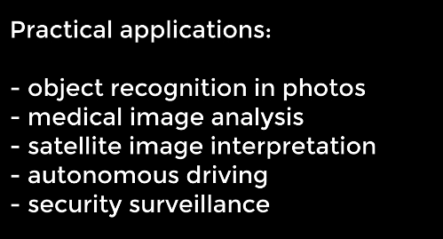
- 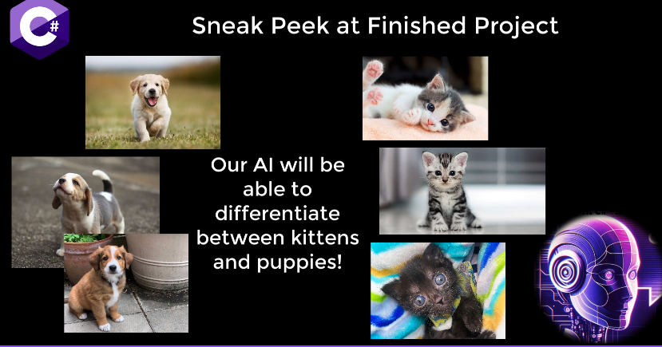
- 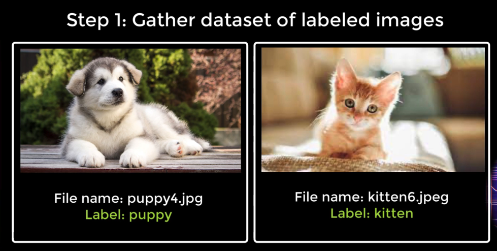
- 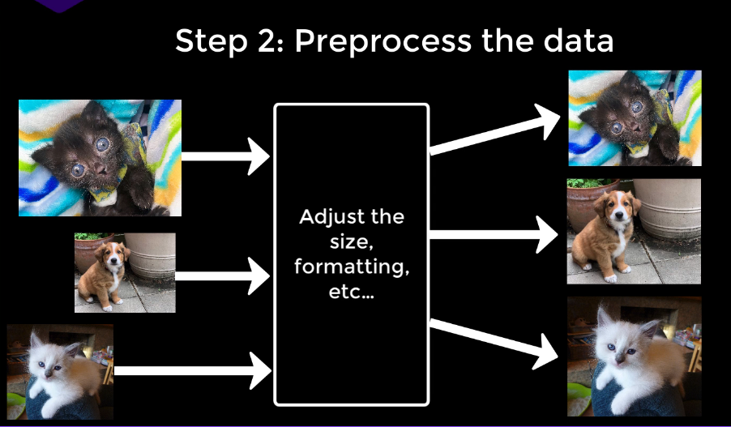
- 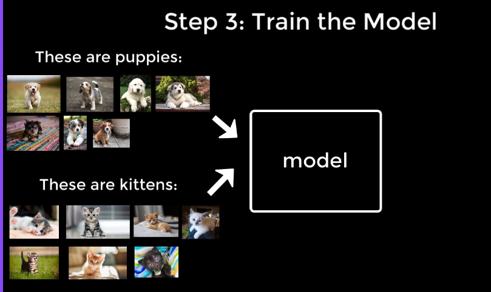
- 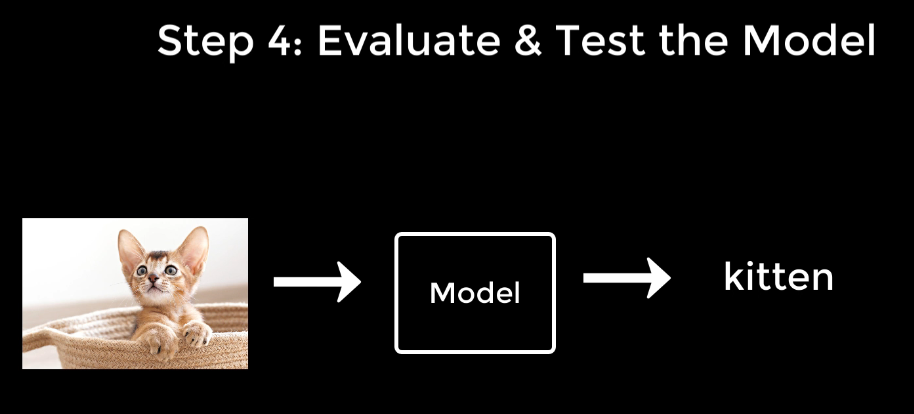
- Once we create our image classification project, we need to install the following packages:
```shell 
dotnet add package Microsoft.ML 
dotnet add package Microsoft.ML.ImageAnalytics
dotnet add package Microsoft.ML.TensorFlow
dotnet add package Microsoft.ML.Vision 
dotnet add package SciSharp.TensorFlow.Redist
dotnet add package  TensorFlow.NET
```
- Now we will first of all load the data from the images folder and put in inside a data view 
- Inside this dataview, we will have a path to the file and its corresponding label(kitten or dog)
- We will also shuffle the data so as to not have continuous filenames with puppy or kittens.
```c#
 using Microsoft.ML;
using Microsoft.ML.Data;
using Microsoft.ML.Vision;
using static Microsoft.ML.DataOperationsCatalog;

public class ImageData
{
    [LoadColumn(0)]
    public string? ImagePath { get; set; }

    [LoadColumn(1)]
    public string Label { get; set; }
}

class InputData
{
    public byte[] Image { get; set; }
    public uint LabelKey { get; set; }

    public string ImagePath { get; set; }
    public string Label { get; set; }
}

public class Program
{
    static string dataFolder = "C:\\GithubCode\\AI-Programming\\ImageClassification\\Data";

    private static IEnumerable<ImageData> LoadImagesFromDirectory(string folder)
    {
        var files = Directory.GetFiles(folder, "*", searchOption: SearchOption.AllDirectories);
        foreach(var file in files)
        {
            if ((Path.GetExtension(file) != ".jpg") &&
                (Path.GetExtension(file) != ".png") &&
                (Path.GetExtension(file) != ".jpeg"))
                continue;

            string label = Path.GetFileNameWithoutExtension(file).Trim();
            label = label.Substring(0, label.Length - 1);
            yield return new ImageData()
            {
                ImagePath = file,
                Label = label
            };
        }
    }

    public static void PrintDataView(IDataView dataView)
    {
        var preview = dataView.Preview();
        foreach (var row in preview.RowView)
        {
            foreach (var kvp in row.Values)
            {
                Console.Write($"{kvp.Key}:{kvp.Value} ");
            }
            Console.WriteLine();
        }
    }

        public static void Main()
    {
        MLContext mLContext = new MLContext();
        IEnumerable<ImageData> images = LoadImagesFromDirectory(dataFolder);
        IDataView imageData = mLContext.Data.LoadFromEnumerable(images);

        //Shuffle the data 
        IDataView shuffledData = mLContext.Data.ShuffleRows(imageData);

        PrintDataView(shuffledData);

    }
}

```

### Training the Model
- We first map the string values of the Labels to the numeric keys
- This is because ML algorithms work with numeric labels
- We also load the raw image in bytes from the specified image folder and stores them in Image column
- Then the pre-processed data is split into training set and test set. 
- Then we also set options for the image classification trainer. This options determine how the model will be trained. 
- We specify the column name that contains the raw image data and which column contains the numeric label.
- Then we create the training pipeline. 
- We also need to convert the predicted label keys back to their string values(remember they will be numeric)
- Then we pass the test set to the trained model and check the output predictions
```c#
 /*
 In this part, a preprocessing pipeline is created using the mLContext.Transforms API. The pipeline consists of two transformations:
•	MapValueToKey: This transformation maps the string labels in the "Label" column to numeric keys in the "LabelKey" column. 
This is necessary because machine learning algorithms typically work with numeric labels. 
For example, if you have labels like "cat", "dog", and "bird", they will be mapped to numeric keys like 0, 1, and 2.
•	LoadRawImageBytes: This transformation loads the raw image bytes from the specified image folder and stores them in the "Image" column. 
It takes the "ImagePath" column as input, which contains the file paths of the images. The loaded image bytes can be used as input for image classification models.
Example: Suppose you have a dataset with the following rows: | ImagePath       | Label  | |-----------------|--------| | image1.jpg      | cat    | | image2.jpg      | dog    | | image3.jpg      | bird   |
After applying the preprocessing pipeline, the resulting dataset will have the following columns: | ImagePath       | Label  | LabelKey | Image (raw image bytes) | |-----------------|--------|----------|------------------------| | image1.jpg      | cat    | 0        | [raw image bytes]      | | image2.jpg      | dog    | 1        | [raw image bytes]      | | image3.jpg      | bird   | 2        | [raw image bytes]      |
 */
var preprocessingPipeline = mLContext.Transforms.Conversion
    .MapValueToKey(inputColumnName:"Label", outputColumnName:"LabelKey")
    .Append(mLContext.Transforms.LoadRawImageBytes(
        outputColumnName: "Image",
        imageFolder: dataFolder,
        inputColumnName: "ImagePath"));


IDataView preProcessedData = preprocessingPipeline.Fit(shuffledData).Transform(shuffledData);

/*
 In this part, the preprocessed data is split into a training set and a test set using the TrainTestSplit method. 
The testFraction parameter specifies the fraction of data to be used for testing (in this case, 40%). The remaining data is used for training.
 Example: Suppose the preprocessed data contains 100 rows. After the train-test split, the training set will contain 60 rows (60% of the data) and the test set will contain 40 rows (40% of the data).
 */
TrainTestData trainTestData = mLContext.Data.TrainTestSplit(preProcessedData, testFraction: 0.4);
IDataView trainSet = trainTestData.TrainSet;
IDataView testSet = trainTestData.TestSet;


/*
In this part, the options for the image classification trainer are set. These options define how the model will be trained. Here are the key options:
•	FeatureColumnName: Specifies the name of the column that contains the input image data (raw image bytes).
•	LabelColumnName: Specifies the name of the column that contains the numeric label keys.
•	ValidationSet: Specifies the test set to be used for validation during training.
•	Arch: Specifies the architecture of the image classification model. In this case, the ResNet v2 101 architecture is used.
•	MetricsCallback: Specifies a callback function that will be called during training to print the metrics (e.g., accuracy, loss) to the console.
•	TestOnTrainSet: Specifies whether to evaluate the model on the training set during training. In this case, it is set to false.
•	ReuseTrainSetBottleneckCachedValues and ReuseValidationSetBottleneckCachedValues: These options control whether to reuse the cached bottleneck values during training. Bottleneck values are intermediate representations of the images used to speed up training.
 
 */
var classifierOptions = new ImageClassificationTrainer.Options()
{
    FeatureColumnName = "Image",
    LabelColumnName = "LabelKey",
    ValidationSet = testSet,
    Arch = ImageClassificationTrainer.Architecture.ResnetV2101,
    MetricsCallback = (metrics) => Console.WriteLine(metrics),
    TestOnTrainSet = false,
    ReuseTrainSetBottleneckCachedValues = true,
    ReuseValidationSetBottleneckCachedValues = true,
    //WorkspacePath = "C:\\GithubCode\\AI-Programming\\ImageClassification\\Data"
};


/*
In this part, the training pipeline is created using the mLContext.MulticlassClassification.Trainers.ImageClassification method. 
The pipeline consists of the image classification trainer followed by a transformation to map the predicted label keys back to their original string labels.
Example: The training pipeline takes the preprocessed training set as input and trains an image classification model. 
The trained model can then be used to make predictions on new images.
 */
var trainingPipeline = mLContext.MulticlassClassification.Trainers.ImageClassification(classifierOptions)
                        .Append(mLContext.Transforms.Conversion.MapKeyToValue("PredictedLabel"));

// Train the model
// During the training process, the model learns patterns and relationships between the input images and their corresponding labels.
// The trained model can then be used to make predictions on new, unseen images.
ITransformer trainedModel = trainingPipeline.Fit(trainSet);

```
### Final code of image classification AI along with test results 
```c#
 using Microsoft.ML;
using Microsoft.ML.Data;
using Microsoft.ML.Vision;
using static Microsoft.ML.DataOperationsCatalog;

public class ImageData
{
    [LoadColumn(0)]
    public string? ImagePath { get; set; }

    [LoadColumn(1)]
    public string Label { get; set; }
}

class InputData
{
    public byte[] Image { get; set; }
    public uint LabelKey { get; set; }

    public string ImagePath { get; set; }
    public string Label { get; set; }
}

class  Output
{
    public string ImagePath { get; set; }
    public string Label { get; set; }
    public string PredictedLabel { get; set; }
}

public class Program
{
    static string dataFolder = "C:\\GithubCode\\AI-Programming\\ImageClassification\\Data";

    private static IEnumerable<ImageData> LoadImagesFromDirectory(string folder)
    {
        var files = Directory.GetFiles(folder, "*", searchOption: SearchOption.AllDirectories);
        foreach(var file in files)
        {
            if ((Path.GetExtension(file) != ".jpg") &&
                (Path.GetExtension(file) != ".png") &&
                (Path.GetExtension(file) != ".jpeg"))
                continue;

            string label = Path.GetFileNameWithoutExtension(file).Trim();
            label = label.Substring(0, label.Length - 1);
            yield return new ImageData()
            {
                ImagePath = file,
                Label = label
            };
        }
    }

    public static void PrintDataView(IDataView dataView)
    {
        var preview = dataView.Preview();
        foreach (var row in preview.RowView)
        {
            foreach (var kvp in row.Values)
            {
                Console.Write($"{kvp.Key}:{kvp.Value} ");
            }
            Console.WriteLine();
        }
    }

    private static void OutputPrediction(Output prediction)
    {

        string imageName = Path.GetFileName(prediction.ImagePath);
        Console.WriteLine($"Image: {imageName} | Actual Label: {prediction.Label} | Predicted Label: {prediction.PredictedLabel}");
    }

    private static void ClassifyMultiple(MLContext mLContext, IDataView data, ITransformer trainedModel)
    {
        IDataView predictedData = trainedModel.Transform(data);

        var predictions = mLContext.Data.CreateEnumerable<Output>(predictedData, reuseRowObject: false).ToList();

        Console.WriteLine("AI Predictions: ");
        foreach (var prediction in predictions.Take(4))
        {
            OutputPrediction(prediction);
        }
    }

        public static void Main()
    {
        MLContext mLContext = new MLContext();
        IEnumerable<ImageData> images = LoadImagesFromDirectory(dataFolder);
        IDataView imageData = mLContext.Data.LoadFromEnumerable(images);

        //Shuffle the data 
        IDataView shuffledData = mLContext.Data.ShuffleRows(imageData);

        //PrintDataView(shuffledData);

        /*
         In this part, a preprocessing pipeline is created using the mLContext.Transforms API. The pipeline consists of two transformations:
        •	MapValueToKey: This transformation maps the string labels in the "Label" column to numeric keys in the "LabelKey" column. 
        This is necessary because machine learning algorithms typically work with numeric labels. 
        For example, if you have labels like "cat", "dog", and "bird", they will be mapped to numeric keys like 0, 1, and 2.
        •	LoadRawImageBytes: This transformation loads the raw image bytes from the specified image folder and stores them in the "Image" column. 
        It takes the "ImagePath" column as input, which contains the file paths of the images. The loaded image bytes can be used as input for image classification models.
        Example: Suppose you have a dataset with the following rows: | ImagePath       | Label  | |-----------------|--------| | image1.jpg      | cat    | | image2.jpg      | dog    | | image3.jpg      | bird   |
        After applying the preprocessing pipeline, the resulting dataset will have the following columns: | ImagePath       | Label  | LabelKey | Image (raw image bytes) | |-----------------|--------|----------|------------------------| | image1.jpg      | cat    | 0        | [raw image bytes]      | | image2.jpg      | dog    | 1        | [raw image bytes]      | | image3.jpg      | bird   | 2        | [raw image bytes]      |
         */
        var preprocessingPipeline = mLContext.Transforms.Conversion
            .MapValueToKey(inputColumnName:"Label", outputColumnName:"LabelKey")
            .Append(mLContext.Transforms.LoadRawImageBytes(
                outputColumnName: "Image",
                imageFolder: dataFolder,
                inputColumnName: "ImagePath"));


        IDataView preProcessedData = preprocessingPipeline.Fit(shuffledData).Transform(shuffledData);

        /*
         In this part, the preprocessed data is split into a training set and a test set using the TrainTestSplit method. 
        The testFraction parameter specifies the fraction of data to be used for testing (in this case, 40%). The remaining data is used for training.
         Example: Suppose the preprocessed data contains 100 rows. After the train-test split, the training set will contain 60 rows (60% of the data) and the test set will contain 40 rows (40% of the data).
         */
        TrainTestData trainTestData = mLContext.Data.TrainTestSplit(preProcessedData, testFraction: 0.4);
        IDataView trainSet = trainTestData.TrainSet;
        IDataView testSet = trainTestData.TestSet;


        /*
        In this part, the options for the image classification trainer are set. These options define how the model will be trained. Here are the key options:
        •	FeatureColumnName: Specifies the name of the column that contains the input image data (raw image bytes).
        •	LabelColumnName: Specifies the name of the column that contains the numeric label keys.
        •	ValidationSet: Specifies the test set to be used for validation during training.
        •	Arch: Specifies the architecture of the image classification model. In this case, the ResNet v2 101 architecture is used.
        •	MetricsCallback: Specifies a callback function that will be called during training to print the metrics (e.g., accuracy, loss) to the console.
        •	TestOnTrainSet: Specifies whether to evaluate the model on the training set during training. In this case, it is set to false.
        •	ReuseTrainSetBottleneckCachedValues and ReuseValidationSetBottleneckCachedValues: These options control whether to reuse the cached bottleneck values during training. Bottleneck values are intermediate representations of the images used to speed up training.
         
         */
        var classifierOptions = new ImageClassificationTrainer.Options()
        {
            FeatureColumnName = "Image",
            LabelColumnName = "LabelKey",
            ValidationSet = testSet,
            Arch = ImageClassificationTrainer.Architecture.ResnetV2101,
            MetricsCallback = (metrics) => Console.WriteLine(metrics),
            TestOnTrainSet = false,
            ReuseTrainSetBottleneckCachedValues = true,
            ReuseValidationSetBottleneckCachedValues = true,
            //WorkspacePath = "C:\\GithubCode\\AI-Programming\\ImageClassification\\Data"
        };


        /*
        In this part, the training pipeline is created using the mLContext.MulticlassClassification.Trainers.ImageClassification method. 
        The pipeline consists of the image classification trainer followed by a transformation to map the predicted label keys back to their original string labels.
        Example: The training pipeline takes the preprocessed training set as input and trains an image classification model. 
        The trained model can then be used to make predictions on new images.
         */
        var trainingPipeline = mLContext.MulticlassClassification.Trainers.ImageClassification(classifierOptions)
                                .Append(mLContext.Transforms.Conversion.MapKeyToValue("PredictedLabel"));

        // Train the model
        // During the training process, the model learns patterns and relationships between the input images and their corresponding labels.
        // The trained model can then be used to make predictions on new, unseen images.
        ITransformer trainedModel = trainingPipeline.Fit(trainSet);

        //Responsible for using the trained model to make predictions on the test data and printing the results.
        ClassifyMultiple(mLContext, testSet, trainedModel);

    }
}

```

## Coding a Regression AI 
- Regression in machine learning is like trying to draw the best-fitting line through a scatter plot of points. 
- (sizeOfHouse, Price)
- 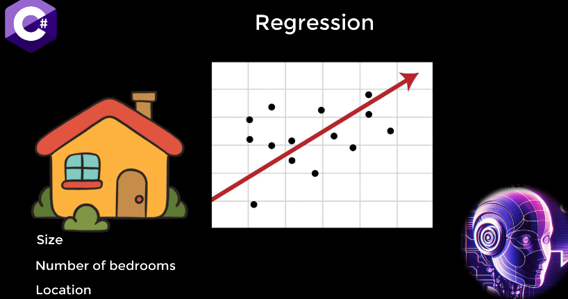
- The goal of regression algorithms is to learn the relationship between the input features and the target variable, which is the value that we want to predict from the training data.
- Once the model has learned this relationship, it can then make predictions on new, unseen data.
- 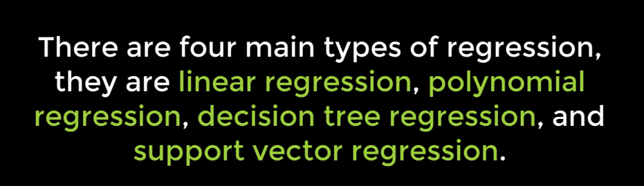
### Linear Regression
- 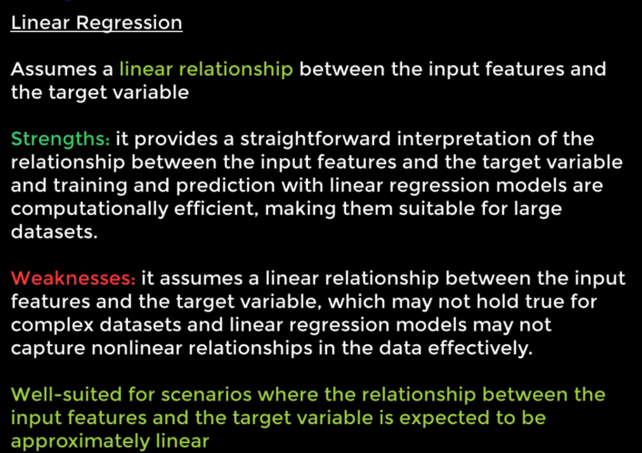
- 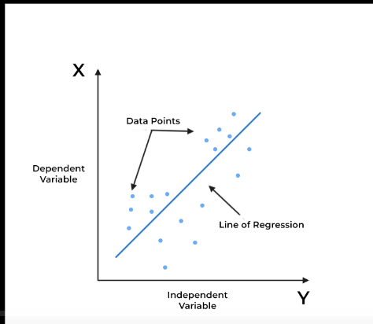
- For example, suppose we want to predict the salary of employees based on their years of experience.
- We collect data on employees years of experience and their corresponding salaries.
- Using linear regression, we can fit a straight line to this data where the input feature.
- Years of experience is used to predict the target variable salary.
### Polynomial Regression 
- Polynomial regression is an extension of linear regression that allows for more complex relationships between the input features and the target variable.
- 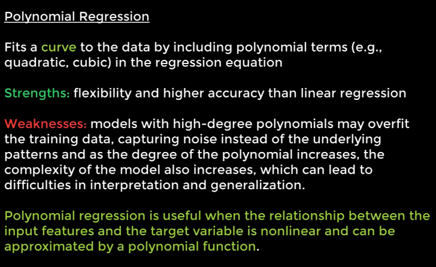
- 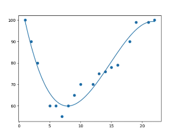
### Decision Tree Regression (Generalize Data)
- 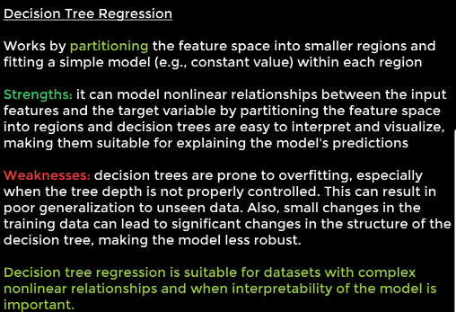
- 
- For example, suppose that we want to predict the price of a house based on its features such as size, number of bedrooms, and location.
- A decision tree regression model would split the data into subsets based on these features.
- Like houses with more than three bedrooms, houses larger than 2000ft², etc., and assign a constant
value, an average price to each subset.
- Advantages of this type of regression are that it can model non-linear relationships between the input features and the target variable.

### Support Vector Regression(SVR)
- 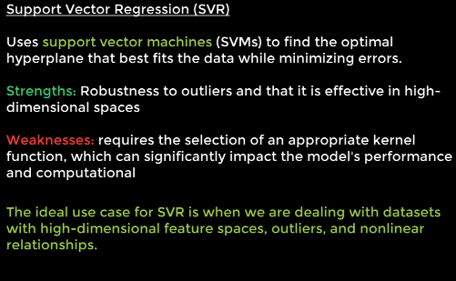
- 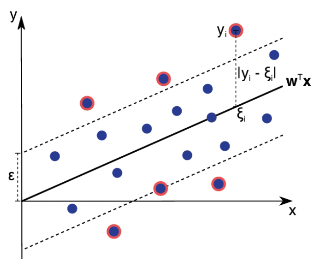
- Consider a scenario where we want to predict the fuel efficiency of a car based on its engine size,
weight, and horsepower.
- Support vector regression can be used to find the hyperplane that separates the data points with maximum margin, while minimizing the error between the predicted and actual fuel efficiency values.
- 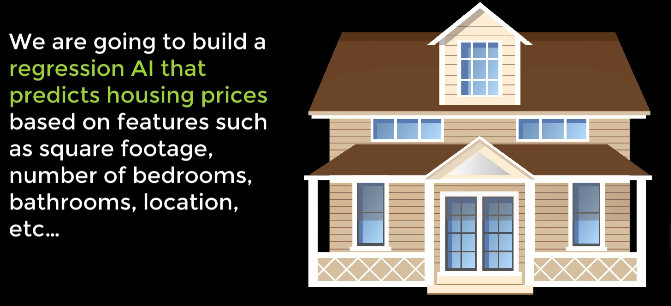
- We first load the data into a DataView 
- Then we split it into training and test sets 
- Then we define a pipeline 
- Inside the pipeline we first concatenate all the features into a single column 
- Then we do one hot encoding on the neighborhood column
- Remember, One-hot encoding is a technique used to convert categorical data into a numerical format that machine learning algorithms can use.
- We copy the sale price to the label column 
- Then we train the model 
- Finally we test the trained model against a sample house data with values for bedrooms, neighborhood, bathrooms etc specified. 
- Finally we create a prediction engine and provide the estimated sale price 
```c#
  using Microsoft.ML;
using Microsoft.ML.Data;


namespace HousePricePrediction
{
    public class HouseData
    {
        [LoadColumn(0)]
        public float HouseSizeSqft { get; set; }

        [LoadColumn(1)]
        public float NumBedrooms { get; set; }

        [LoadColumn(2)]
        public float NumBathrooms { get; set; }

        [LoadColumn(3)]
        public string Neighborhood { get; set; }

        [LoadColumn(4)]
        public float SalePrice { get; set; }    
    }

    public class HousePrediction
    {
        [ColumnName("Score")]
        public float PredictedSalePrice { get; set; }
    }

    class Program
    {
        static void Main(string[] args)
        {
            var mlContext = new MLContext(seed: 0);
            var dataPath = Path.Combine(Environment.CurrentDirectory, "house-price-data.csv");

            /*
             Specify the path to the data file containing the house price data and loads it into an IDataView object using the LoadFromTextFile method.
             */
            IDataView data = mlContext.Data.LoadFromTextFile<HouseData>(dataPath, hasHeader: true, separatorChar: ',');

            /*
             The TrainTestSplit method is used to split the data into a training set and a test set. The testFraction parameter specifies the fraction of the data that should be used for testing.
             Data is split into training and testing datasets using the TrainTestSplit method, with 80% of the data used for training and 20% for testing.
             */
            var trainTestData = mlContext.Data.TrainTestSplit(data, testFraction: 0.2);
            var trainData = trainTestData.TrainSet;
            var testData = trainTestData.TestSet;

            /*
             The pipeline is defined using the Concatenate, OneHotEncoding, CopyColumns, and FastTreeRegression classes. 
            The pipeline is used to concatenate the features into a single column, one-hot encode the neighborhood column, and copy the sale price column to the label column. 
            The FastTreeRegression class is used to train the model.
             */
            var pipeline = mlContext.Transforms.Concatenate("Features", "HouseSizeSqft", "NumBedrooms", "NumBathrooms")
                .Append(mlContext.Transforms.Categorical.OneHotEncoding("Neighborhood"))
                .Append(mlContext.Transforms.Concatenate("Features", "Features", "Neighborhood"))
                .Append(mlContext.Transforms.CopyColumns("Label", "SalePrice"))
                .Append(mlContext.Regression.Trainers.FastTree(labelColumnName: "Label"));

            /*
             The Fit method is used to train the model using the training data.
             */
            var trainedModel = pipeline.Fit(trainData);

            /*
             The Transform method is used to make predictions on the test data.
             */
            var predictions = trainedModel.Transform(testData);

            /*
             The Evaluate method is used to evaluate the model using the test data and calculate the RSquared score and root mean squared error.
             */
            var metrics = mlContext.Regression.Evaluate(predictions);

            //Console.WriteLine($"RSquared Score: {metrics.RSquared:0.##}");
            //Console.WriteLine($"Root Mean Squared error: {metrics.RootMeanSquaredError:0.##}");


            /*
             The CreatePredictionEngine method is used to create a prediction engine for making predictions on new data.
             */
            var predictionEngine = mlContext.Model.CreatePredictionEngine<HouseData, HousePrediction>(trainedModel);

            var houseData = new HouseData()
            {
                HouseSizeSqft = 2000,
                NumBedrooms = 3,
                NumBathrooms = 2,
                Neighborhood = "Southwest"
            };

            /*
             The Predict method is used to make a prediction using the prediction engine.
             */
            var prediction = predictionEngine.Predict(houseData);
            Console.WriteLine($"Predicted Sale Price: ${prediction.PredictedSalePrice}");
        }
    }
}

```

## Building a Forecasting AI
- Forecasting in machine learning is like predicting the future based on past patterns and trends.
- 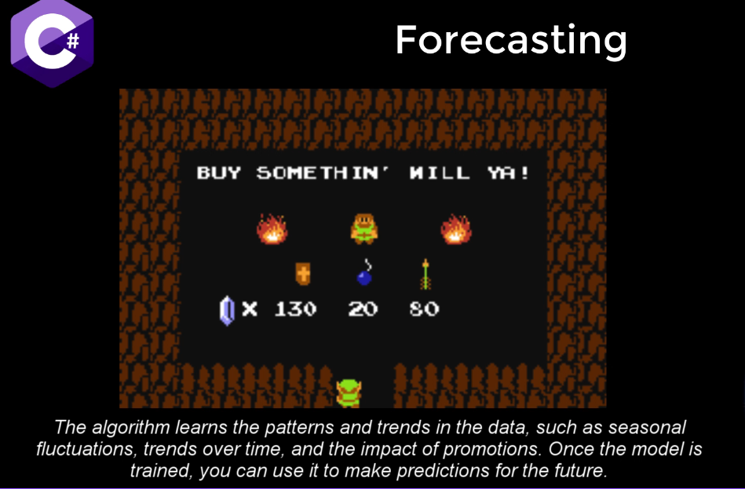
- 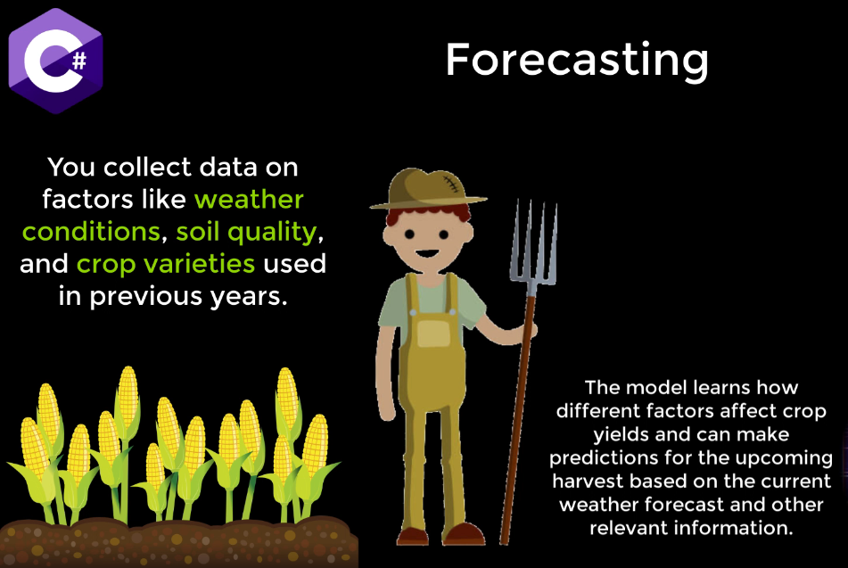
- 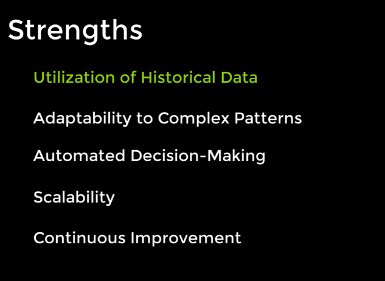
- 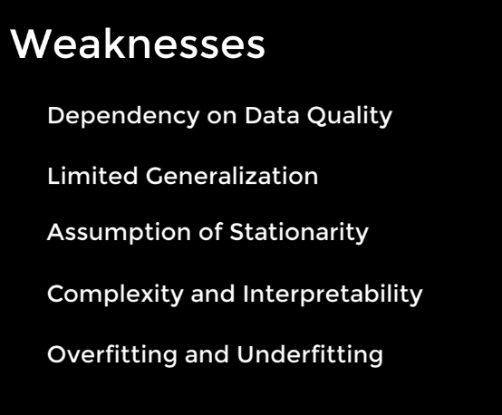
- Forecasting in machine learning learning is ideally used in scenarios where there is a need to predict future events or outcomes based on historical data patterns. 
- Investors and businesses use these forecasts for strategic planning, investment decisions, and risk
management.
- Workforce forecasting can be used to predict staffing needs, while energy forecasting can help utilities anticipate electricity demand.
- 
- First we will load the data from the csv file. 
- This file contains the date, high, open, low and closing price of stocks 
- We will concatenate high, open and low prices of stocks into a single feature which will serve as input to the model
- The output of our model will the closing price. 
- This is the target variable that our model will try to predict. 
- We will add the regression trainer to the pipeline, in out case, we will use FastTree algorithm.
- We will then split our data set into training set and test set and generate predictions
- Finally we will compare our predictions to the actual closing price of the stock 

```c#
 using Microsoft.ML;
using Microsoft.ML.Data;

namespace StockPriceForecasting
{
    class Program
    {
        public class StockData
        {
            [LoadColumn(0)]
            public string Date { get; set; }

            [LoadColumn(1)]
            public float Open { get; set; }

            [LoadColumn(2)]
            public float High { get; set; }

            [LoadColumn(3)]
            public float Low { get; set; }

            [LoadColumn(4)]
            public float Close { get; set; }
        }

        public class StockPrediction
        {
            [ColumnName("Score")]
            public float PredictedClose { get; set; }
        }

            static void Main(string[] args)
        {
            MLContext mlContext = new MLContext(seed: 0);

            IDataView dataView = mlContext.Data.LoadFromTextFile<StockData>("stock_data.csv", hasHeader: true, separatorChar: ',');

            var preview = dataView.Preview();

            foreach (var row in preview.RowView)
            {
                Console.WriteLine($"{row.Values[0]} | {row.Values[1]}");
            }

            /*
             1.	mlContext.Transforms.Concatenate("Features", "Open", "High", "Low"): 
                This transformation concatenates the "Open", "High", and "Low" columns of the input data and creates a new column called "Features". 
                The "Features" column will be used as input for the regression trainer.
             2.	.Append(mlContext.Transforms.CopyColumns("Label", "Close")): 
                This transformation copies the values from the "Close" column of the input data and creates a new column called "Label". 
                The "Label" column represents the target variable that the regression trainer will try to predict.
             3.	.Append(mlContext.Regression.Trainers.FastTree()): 
                This appends the regression trainer to the pipeline. 
                In this case, the FastTree regression trainer is used. 
                The regression trainer will use the "Features" column as input and the "Label" column as the target variable to train a machine learning model.
             */
            var pipeline = mlContext.Transforms.Concatenate("Features", "Open", "High", "Low")
                            .Append(mlContext.Transforms.CopyColumns("Label", "Close"))
                            .Append(mlContext.Regression.Trainers.FastTree());

            var trainTestData = mlContext.Data.TrainTestSplit(dataView, testFraction: 0.2);
            var model = pipeline.Fit(trainTestData.TrainSet);

            /*
             Apply the trained model to the test dataset and generates predictions for the target variable. 
            These predictions can be used to evaluate the accuracy of the machine learning model and compare them with the actual closing prices of the stocks.
             */
            var predictions = model.Transform(trainTestData.TestSet);

            // Evaluate the model
            var metrics = mlContext.Regression.Evaluate(predictions, labelColumnName: "Label", scoreColumnName: "Score");

            Console.WriteLine($"R-Squared: {metrics.RSquared}");
            Console.WriteLine($"Root Mean Squared Error: {metrics.RootMeanSquaredError}");

            var predictedResult = mlContext.Data.CreateEnumerable<StockPrediction>(predictions, reuseRowObject: false).ToList();

            var testData = mlContext.Data.CreateEnumerable<StockData>(trainTestData.TestSet, reuseRowObject: false).ToList();

            /*
               Iterate over two collections simultaneously: predictedResult and testData. 
               It uses the Zip method to combine the elements of both collections into tuples (prediction, actual).
               For each pair of elements, the loop prints the predicted and actual values of the stock's closing price using the Console.WriteLine method. 
               The predicted value is accessed through the prediction.PredictedClose property, and the actual value is accessed through the actual.Close property.
               In other words, this loop is used to compare the predicted closing prices of stocks with their actual closing prices. It can be helpful for evaluating the accuracy of the machine learning model used to make the predictions.

             */
            foreach (var (prediction, actual) in predictedResult.Zip(testData, (p, a) => (p, a)))
            {
                Console.WriteLine($"Predicted: {prediction.PredictedClose}, Actual: {actual.Close}");
            }

        }

    }
}


```


## Building a Recommendation AI
- 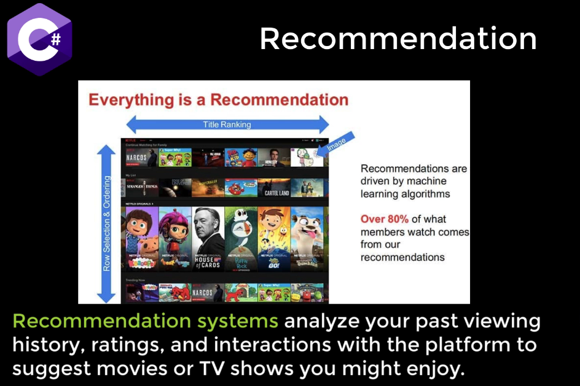
- Used in netflix to provide recommendations
- 2 main types of recommendation systems:
- **Content Based Filtering**: This approach recommends items similar to those you have liked or interacted with in the past. It analyzes the features or attributes of items like movie genres, actors and plot keywords, and compares them to your Preferences.For example, if you've watched and enjoyed action movies starring Tom cruise, the system might recommend other action movies featuring similar actors or genres.
- **Collaborative Filtering**: This approach recommends items based on the preferences and behaviors of similar users. It looks at the past interactions and ratings of users who have similar tastes to yours, and suggests items that they have liked but you haven't seen yet. For instance, if other users with similar movie preferences to yours have enjoyed a particular film, the system might recommend it to you as well. 
- 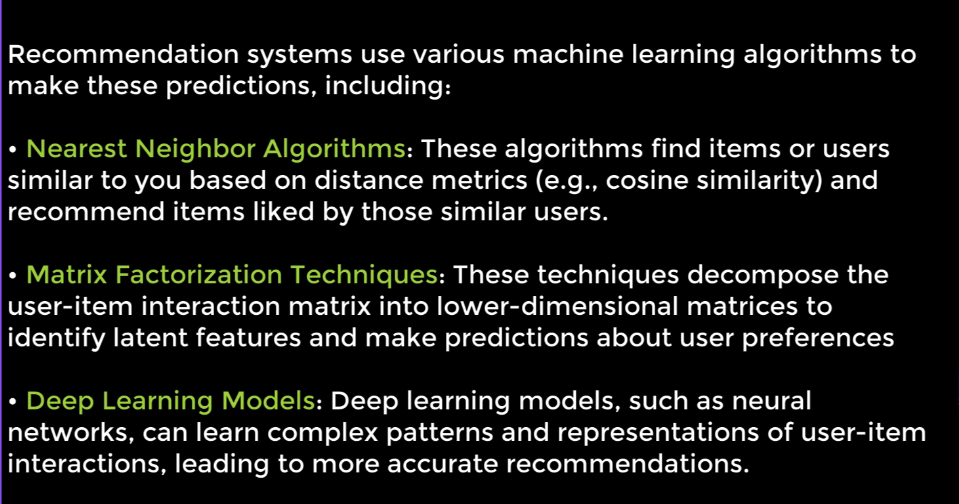
- 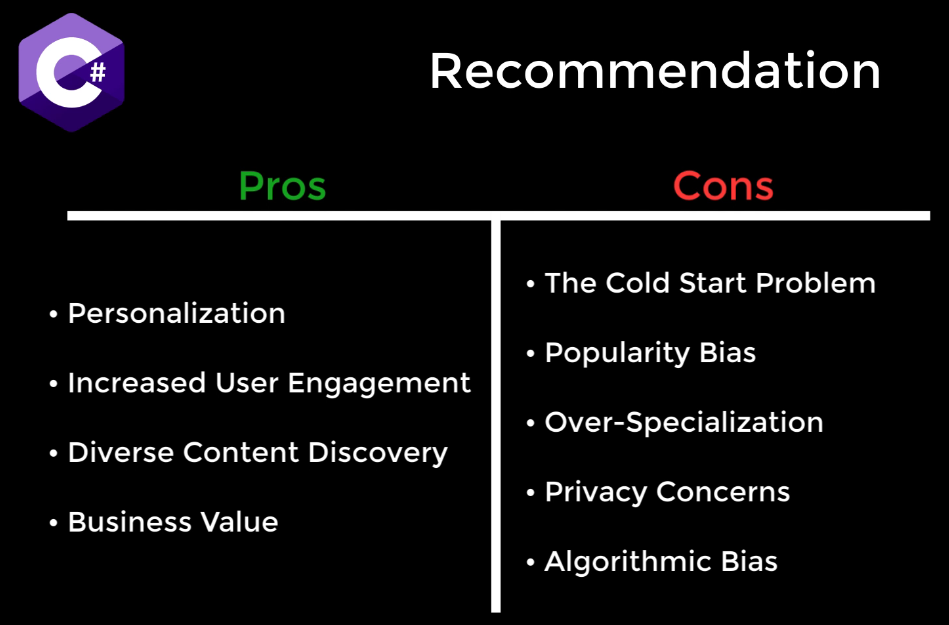
- Cold Start Problem: Recommendation systems may struggle to provide accurate recommendations for new users or items with limited historical data. This is known as the cold start problem, and can hinder the system's ability to provide personalized recommendations until sufficient data is available.
- Popularity Bias: Recommendation systems tend to recommend popular or mainstream items more frequently, leading to a bias toward well-known content. This can result in a lack of diversity in recommendations, and overlooks niche or less popular items that may be relevant to certain users.

### Building a movie recommendation system
- 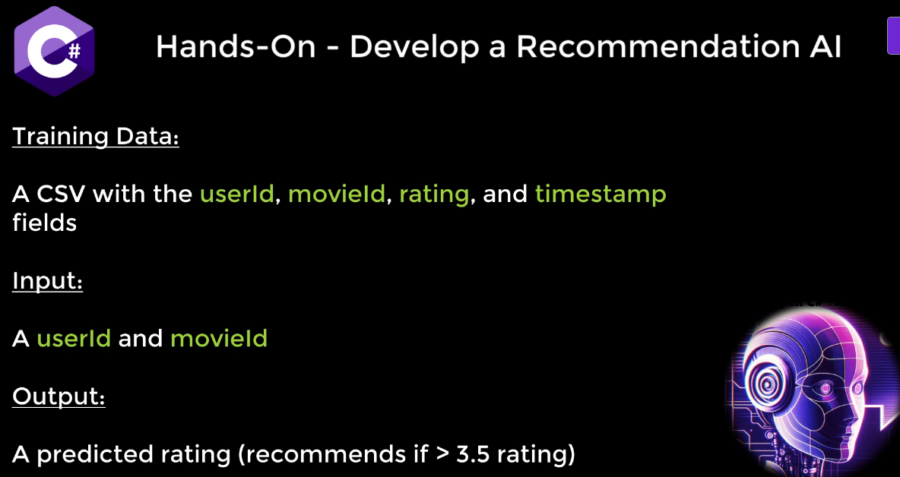
- 
- **Matrix Factorization** is a powerful technique used in recommendation system to predict user preferences for items 
- Image we have a table where rows represent users and columns represent movies. 
- 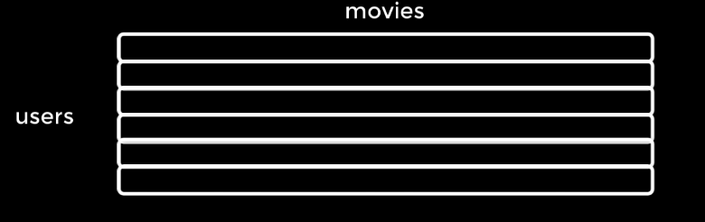
- It breaks this large table into 2 smaller matrices. One representing users and other representing movies. 
- These smaller matrices capture the underlying features or latent factors that describe the preferences and movie characteristics. For example, in a movie recommendation AI,these latent factors might include genres, actors, or other movie attributes, and user preferences for these factors.
- Each factor and movie is represented as a vector in a lower dimensional space defined by these latent factors.
- 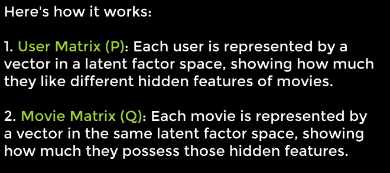
- The goal of matrix factorization is to find these two matrices, P and Q, such that when you multiply
them together, you approximate the original user movie ratings matrix.
- This approximation allows the recommendation system to fill in the missing ratings.
- By predicting how much a user would like a movie they haven't rated yet. For example, if user A likes action and comedy but dislikes romance and movie X is a comedy with some action. Matrix factorization helps the system predict that user A will likely rate movie X higher, even if
they haven't seen it yet.
- Conversely, if movie Y is a romance with no action or comedy, the system might predict a lower rating from user A.
- 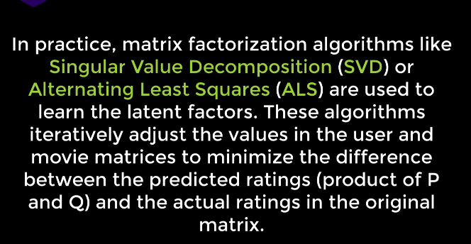
- By capturing these complex patterns, matrix factorization enables recommendation systems to make accurate and personalized suggestions, significantly improving user experience by helping them discover movies that align with their unique tastes.
- To code this we will do the following steps:
- Load the data from the text file which contains userIds, movieId and their ratings. 
- We will first preprocess the data for training. 
- We will convert userId and movieId to key values and ratings were changed from double to integers to make them easier to work with. 
- Then we will save this preprocessed data to a csv file. 
- Then based on this preprocessed csv file, we will start training our model . 
- We Will divide our data into training set and test set. 
- We will use the MatrixFactorizationTrainer to understand the underlying patterns in the rating data an make predictions for unseen users. 
- We will evaluate the metrics for the model and make a single prediction using the trained model. 
- Whole code is as follows: 
```c#
 using Microsoft.ML;
using Microsoft.ML.Data;
using Microsoft.ML.Trainers;
using System.Net.WebSockets;

namespace Recommendation
{
    public class MovieRating
    {
        [LoadColumn(0)]
        public float userId;

        [LoadColumn(1)]
        public float movieId;

        [LoadColumn(2)]
        public float Label;
    }

    public class MovieRatingPrediction
    {
        public float Label;
        public float Score;
    }

    public class Program
    {

        /*
        This method takes an MLContext object and an IDataView object as input. It performs data preprocessing by mapping the user ID and movie ID columns to key values. 
        This is done to make it easier for the recommendation model to process the data.  
         */
        public static IDataView PreProcessData(MLContext mLContext, IDataView dataView)
        {
            /*
              The user ID has remained the same, but the movie ID has been changed so that each movie ID is one after
              the other, sequentially, without any gaps.
              Furthermore, the ratings were converted from doubles into integers to make them easier to work with.
             */
            return mLContext.Transforms.Conversion.MapValueToKey(outputColumnName: "userId", inputColumnName: "userId")
                    .Append(mLContext.Transforms.Conversion.MapValueToKey(outputColumnName: "movieId", inputColumnName: "movieId"))
                    .Fit(dataView).Transform(dataView);
        }

        /*
          This method takes an MLContext object, an IDataView object, and a file path as input. 
          It saves the preprocessed data to a file in CSV format.
         
         */
        public static void SaveData(MLContext mLContext, IDataView dataView, string dataPath)
        {
            using(var fileStream = new FileStream(dataPath, FileMode.Create, FileAccess.Write, FileShare.Write))
            {
                mLContext.Data.SaveAsText(dataView, fileStream, separatorChar:',',headerRow:true, schema:false);
            }
        }

        /*
          This method takes an MLContext object as input and returns a tuple of IDataView objects. 
          It loads the preprocessed data from a CSV file and splits it into training and test data.
         */
        static (IDataView training, IDataView test) LoadData(MLContext mLContext)
        {
            var dataPath = "preprocessed_ratings.csv";
            IDataView fullData = mLContext.Data.LoadFromTextFile<MovieRating>(dataPath, hasHeader: true, separatorChar: ',');
            var trainTestData = mLContext.Data.TrainTestSplit(fullData, testFraction: 0.2);
            IDataView trainData = trainTestData.TrainSet;
            IDataView testData = trainTestData.TestSet;
            return (trainData, testData);
        }

        /*
         This method takes an IDataView object as input and prints a preview of the data. 
         It shows the key-value pairs for each row in the data.
         */
        public static void PrintDataPreview(IDataView dataView)
        {
            var preview = dataView.Preview();
            foreach (var row in preview.RowView)
            {
                foreach (var column in row.Values)
                {
                    Console.Write($"{column.Key}:{column.Value}\t");
                }
                Console.WriteLine();
            }
        }

        /*
          This method takes an MLContext object and an IDataView object as input. 
          It trains a recommendation model using the MatrixFactorizationTrainer and returns the trained model.
         */
        static ITransformer TrainModel(MLContext mlContext, IDataView trainingDataView)
        {
            IEstimator<ITransformer> estimator = mlContext.Transforms.Conversion
                                                .MapValueToKey(outputColumnName: "outputUserId", inputColumnName: "userId")
                                                .Append(mlContext.Transforms.Conversion.MapValueToKey(outputColumnName: "outputMovieId", inputColumnName: "movieId"));

            /*
             An instance of the MatrixFactorizationTrainer.Options class is created. 
            This class contains various configuration options for the Matrix Factorization trainer.
             */

            var options = new MatrixFactorizationTrainer.Options
            {
                MatrixColumnIndexColumnName = "outputUserId",
                MatrixRowIndexColumnName = "outputMovieId",
                LabelColumnName = "Label",
                NumberOfIterations = 20,
                ApproximationRank = 100
            };

            /*
             The estimator object is responsible for transforming the input data by mapping the user and movie IDs to key values.
             The estimator object will map the "userId" and "movieId" columns to key values. For example, it might map "userId" 1 to key value 0, "userId" 2 to key value 1, and so on. Similarly, it will map "movieId" 101 to key value 0, "movieId" 102 to key value 1, and so on.
             The trainerEstimator will then use the Matrix Factorization algorithm to train the model on the transformed data. 
             The model will learn the underlying patterns in the ratings data and make predictions for unseen user-movie combinations.
             */
            var trainerEstimator = estimator.Append(mlContext.Recommendation().Trainers.MatrixFactorization(options));
            ITransformer model = trainerEstimator.Fit(trainingDataView);
            Console.WriteLine("Model successfully trained");
            return model;
        }

        /*
          This method takes an MLContext object, an IDataView object, and a trained model as input. 
          It evaluates the model's performance on the test dataset by calculating the RSquared and Root Mean Squared Error metrics.
         */
        static void EvaluateModel(MLContext mLContext, IDataView testDataView, ITransformer model)
        {
            var prediction = model.Transform(testDataView);
            var metrics = mLContext.Regression.Evaluate(prediction, labelColumnName: "Label", scoreColumnName: "Score");
            Console.WriteLine($"RSquared: {metrics.RSquared}");
            Console.WriteLine($"Root Mean Squared Error: {metrics.RootMeanSquaredError}");
        }

        /*
          This method takes an MLContext object and a trained model as input. 
          It uses the model to make a single prediction for a user and a movie and prints the predicted rating.
         */

        static void UseModelForSinglePrediction(MLContext mLContext, ITransformer model)
        {
            var predictionEngine = mLContext.Model.CreatePredictionEngine<MovieRating, MovieRatingPrediction>(model);
            var testInput = new MovieRating { userId = 14, movieId = 433 };
            var movieRatingPrediction = predictionEngine.Predict(testInput);
            Console.WriteLine("Predicted rating for movie " + testInput.movieId + " is : " + Math.Round(movieRatingPrediction.Score, 1));
            string recommendation = Math.Round(movieRatingPrediction.Score, 1) > 3.5 ? 
                "Movie " + testInput.movieId + " is recommended for user " + testInput.userId :
                "Movie " + testInput.movieId + " is not recommended for user " + testInput.userId;
            Console.WriteLine(recommendation);
        }


        /*
        This method is the entry point of the program. 
        It initializes the MLContext object, loads the original data, preprocesses and saves the data, 
        loads the training and test datasets, prints a preview of the training data, 
        trains the model, evaluates the model, and makes a single prediction using the model.
         */
        public static void Main(string[] args)
        {
            var mLContext = new MLContext(seed: 0);

            var fullData = mLContext.Data.LoadFromTextFile<MovieRating>("ratings.csv", hasHeader: true, separatorChar: ',');

            var preprocessData = PreProcessData(mLContext, fullData);

            SaveData(mLContext, preprocessData, "preprocessed_ratings.csv");

            (IDataView trainingDataView, IDataView testDataView) data = LoadData(mLContext);

            PrintDataPreview(data.trainingDataView);
            ITransformer model = TrainModel(mLContext, data.trainingDataView);

            EvaluateModel(mLContext,data.testDataView, model);

            UseModelForSinglePrediction(mLContext, model);
        }
    }
}

```

## Develop a Sentiment Analysis AI
- Also known as opinion mining is a subfield of natural language processing that involves determining the emotional tone behind a series of words. 
- 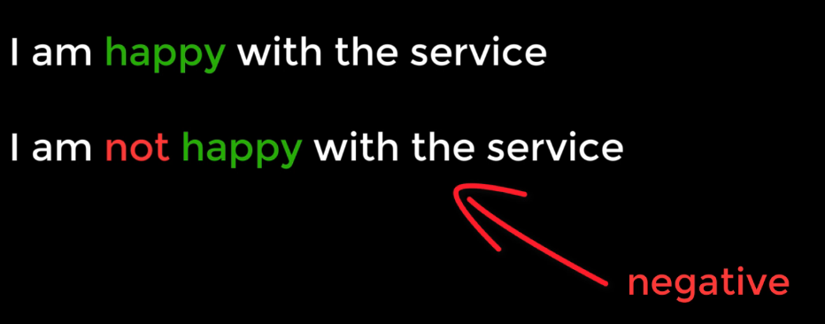
- Multiple types of sentiment analysis: 
- Fine Grained Sentiment Analysis 
- 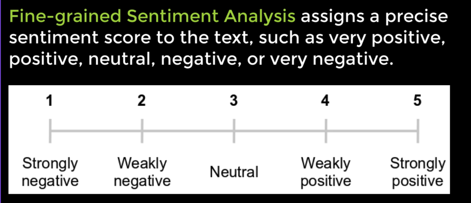
- Aspect based sentiment analysis 
- 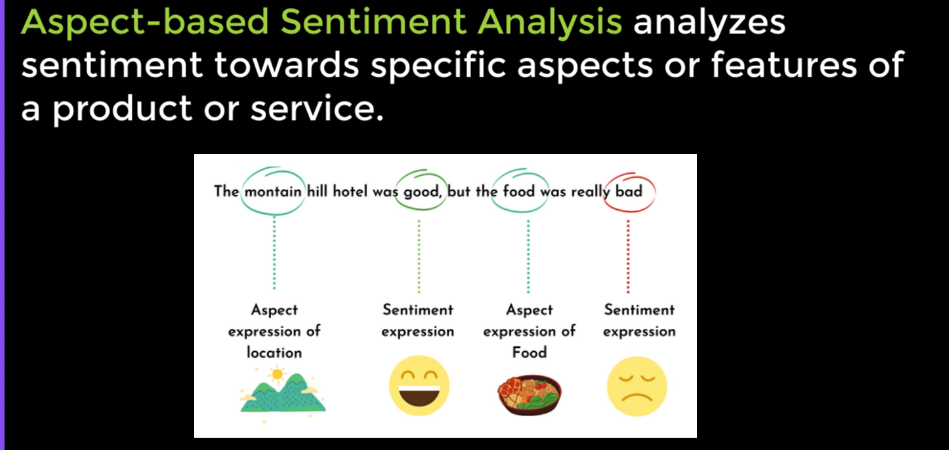
- Emotion detection (useful in customer service )
- 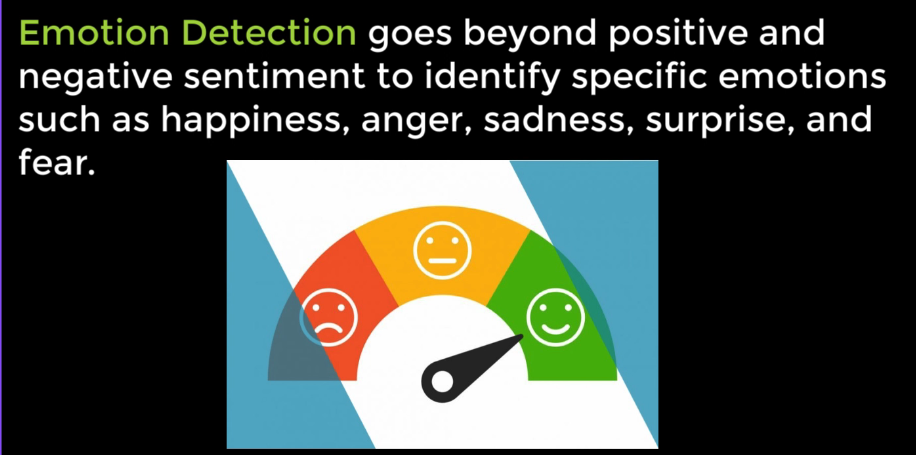
- Intent Analysis(useful for chatbots)
- 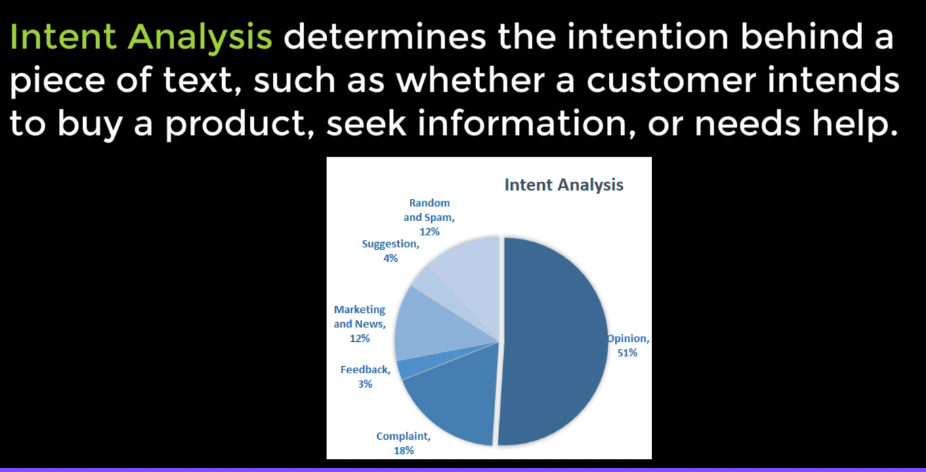
- 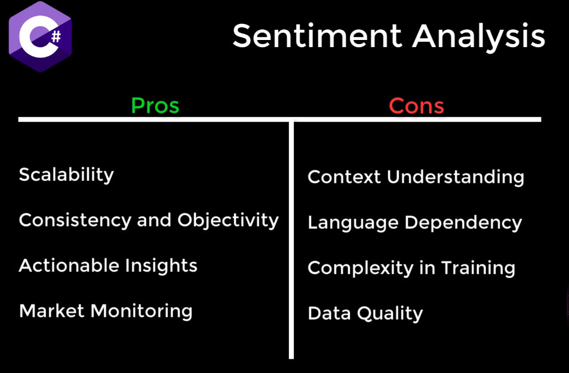
- 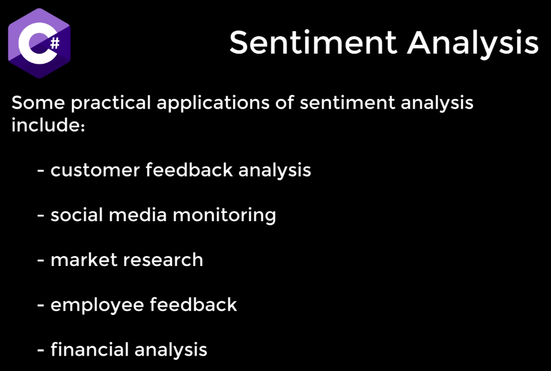
- 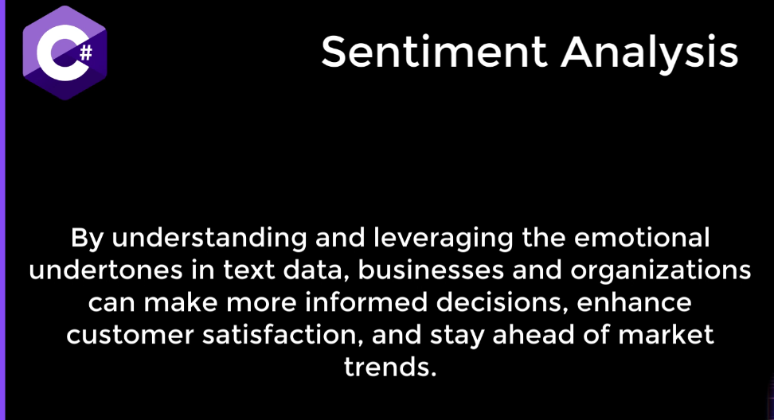
- We will develop an AI that will determine whether a movie review is positive or negative. 
- 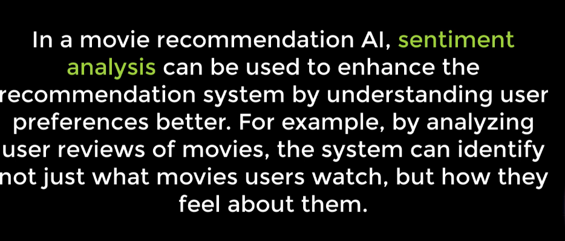
- 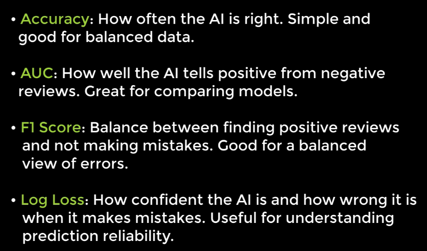
- We first preprocess the data to remove single quotes and convert positive to boolean true and negative to boolean false 
- We then load the data into a dataview
- Then we create a pipeline where we convert the "reviews" column into its numerical representation 
- We then use Logistic Regression trainer to find out the relationship between this reviews column and its label(sentiment): positive or negative(true or false respectively)
- Finally we train the model and evaluate its various metrics as to how accurate it is while making predictions
```c#
 using Microsoft.ML;
using Microsoft.ML.Data;

public class SentimentData
{
    [LoadColumn(0)]
    public string review { get; set; }

    [LoadColumn(1)]
    [ColumnName("Label")]
    public bool sentiment { get; set; }
}

public class Program
{
    static void Main(string[] args)
    {
        var mlContext = new MLContext();
        string dataPath = "movieReviews.csv";
        string text = File.ReadAllText(dataPath);

        //Remove single quotes from the csv file
        //Replace the words positive and negative with true and false
        using (StreamReader reader = new StreamReader(dataPath))
        {
            text = text.Replace("\'", "");
            text = text.Replace("positive", "true");
            text = text.Replace("negative", "false");
        }

        File.WriteAllText(dataPath, text);

        IDataView dataView = mlContext.Data.LoadFromTextFile<SentimentData>(dataPath, hasHeader: true,allowQuoting:true, separatorChar: ',');

        Console.WriteLine("Data loaded successfully");
        Console.WriteLine();
        var preview = dataView.Preview(maxRows: 5);
        foreach (var row in preview.RowView)
        {
            foreach (var column in row.Values)
            {
                Console.WriteLine($"{column.Key}: {column.Value}");
            }
        }


        var trainTestSplit  = mlContext.Data.TrainTestSplit(dataView, testFraction: 0.2);

        var trainData = trainTestSplit.TrainSet;

        /*
         We create a pipeline that is responsible for transforming the text data in the "review" column into numerical features. 
          It uses the FeaturizeText method from the Text transforms in the MLContext to convert the text into a numerical representation that can be used by the machine learning algorithm. 
          The transformed features are stored in a new column called "Features".
         After this we append a binary classification trainer to the previous transformation. 
          It uses the SdcaLogisticRegression trainer from the BinaryClassification trainers in the MLContext. 
          The trainer is responsible for training a logistic regression model to predict the sentiment label based on the transformed features. 
          The "Label" column is used as the target label, and the "Features" column is used as the input features for training the model.
         */
        var pipeline = mlContext.Transforms.Text.FeaturizeText("Features", "review")
            .Append(mlContext.BinaryClassification.Trainers.SdcaLogisticRegression("Label", "Features"));

        //Fit the pipeline to the training data
        var model = pipeline.Fit(trainData);

        var testData = trainTestSplit.TestSet;

        //Make predictions on the test data
        var predictions = model.Transform(testData);

        //Evaluate the model
        var metrics = mlContext.BinaryClassification.Evaluate(predictions, "Label");

        //How often the AI gets the sentiment(positive or negative) correct
        Console.WriteLine($"Accuracy: {metrics.Accuracy:P2}");
        //AUC stands for Area under ROC Curve. It means how well the AI can tell the difference between
        //positive and negative sentiments
        Console.WriteLine($"AUC: {metrics.AreaUnderRocCurve:P2}");
        //F1 Score is the balance between how many positive reviews the AI correctly finds(recall) and how many of the reviews it says are positive that actually are positive(precision)
        Console.WriteLine($"F1 Score: {metrics.F1Score:P2}");
        //Log loss also known as cross-entropy loss measures how confident the AI is in its predictions and
        //how wrong it is when it makes mistakes
        Console.WriteLine($"Log Loss: {metrics.LogLoss:F2}");
    }
}

```

## Develop an Anomaly Detection AI 
- It is type of AI that identifies unusual patterns or behaviors in data that donot conform to expected norms 
- These unusual patterns are called anomalies, and they can indicate critical events such as fraud,
system failures, or unusual usage patterns.
- Main Concepts: 
- Normal Data: This is the usual expected behavior in your data set. For example, normal transactions in a bank. Regular traffic on a network or typical user activity on a website.
- Anomaly: An anomaly is something that deviates from the norm. In a bank, an anomaly might be a transaction that's much larger than usual on a network. It could be an unusual spike in traffic on a website. It could be an unusual login pattern.
- Anomaly Detection System: This AI system is designed to monitor data and flag anything that looks suspicious or different from normal behavior. It can work in real time or analyze historical data.
- 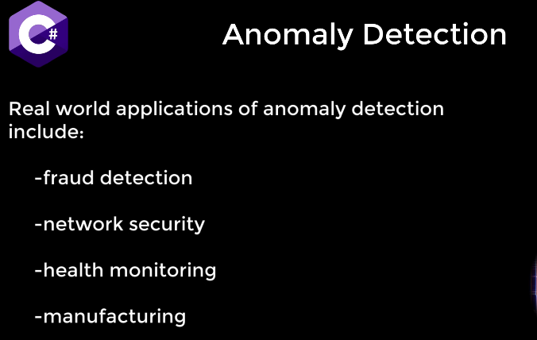
- Anomaly detection can monitor vital signs and alert health care providers to any unusual changes in
a patient's condition.
- It can detect defects in products by identifying deviations from the standard manufacturing process.
- 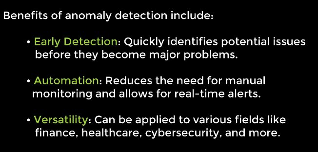
- 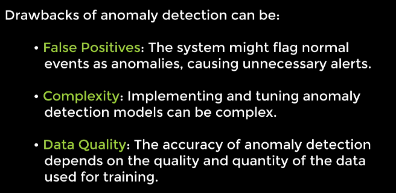
- 
- 
- Anomalies in Network Traffic can be considered as following: 
- 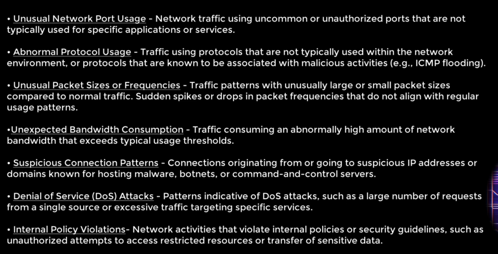
- 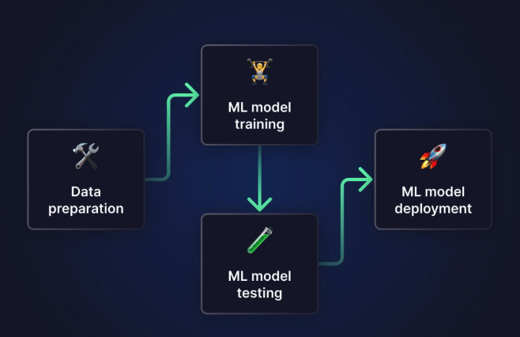
- We will first load data from network_data.csv file to a dataview. 
- We will then create a pipeline that converts the SourceIp, DestinationIp to numeric values 
- Then it concatenates features with packet size and normalizes it to a value between 0 and 1 
- Then we apply a K-Means clustering algorithm which is an unsupervised learning algorithm where it categorizes the data based on the input features. 
- Use the K-Means clustering algorithm to train your model. K-Means will partition your data into K clusters based on the mean distance between data points.
- After training, you can use the model to predict the cluster for each data point.
- Calculate the distance of each data point from its cluster centroid. Data points that are far from their centroids can be considered anomalies.
- Finally we make predictions and compare the actual label to the predicted labels and check whether it was able to detect anomalies in the data. 
```c#
 using Microsoft.ML;
using Microsoft.ML.Data;

namespace NetworkTrafficAnomalyDetection
{

    public class NetworkTrafficData
    {
        [LoadColumn(0)]
        public string Timestamp { get; set; }

        [LoadColumn(1)]
        public string SourceIP { get; set; }

        [LoadColumn(2)]
        public string DestinationIP { get; set; }

        [LoadColumn(3)]
        public string Protocol { get; set; }

        [LoadColumn(4)]
        public float PacketSize { get; set; }

        [LoadColumn(5)]
        public string Label { get; set; }

    }

    public class NetworkTrafficPrediction
    {
        [ColumnName("PredictedLabel")]
        public uint PredictedClusterId { get; set; }

        public float[] Score { get; set; }
    }
    class Program
    {
        static void Main(string[] args)
        {
            var mLContext = new MLContext();
            var dataPath = "network_data.csv";
            var dataView = mLContext.Data.LoadFromTextFile<NetworkTrafficData>(dataPath, hasHeader: true, separatorChar: ',');
            //var preview = dataView.Preview();
            //foreach (var row in preview.RowView)
            //{
            //    Console.WriteLine($"{row.Values[0]} | {row.Values[1]}");
            //}


            /*
             In the first step of the pipeline convert the "SourceIP" column in the data to a numeric key. 
              This is useful when working with categorical data in machine learning models.
             Convert the "DestinationIP" column in the data to a numeric key, similar to the previous step.
             Concatenate the "Features" column with the "PacketSize" column. 
             The "Features" column is a combination of multiple input features that will be used for training the model.
             Normalize the values in the "Features" column. 
             Normalization is a common preprocessing step in machine learning that scales the values to a specific range, often between 0 and 1. 
             This ensures that all features have a similar impact on the model.
             Apply the K-means clustering algorithm to the "Features" column. 
             K-means is an unsupervised machine learning algorithm that groups similar data points together. In this case, it will cluster the data into 3 groups based on the values in the "Features" column.
             */
            var pipeline = mLContext.Transforms.Conversion.MapValueToKey("SourceIP")
                .Append(mLContext.Transforms.Conversion.MapValueToKey("DestinationIP"))
                .Append(mLContext.Transforms.Concatenate("Features","PacketSize"))
                .Append(mLContext.Transforms.NormalizeMinMax("Features"))
                .Append(mLContext.Clustering.Trainers.KMeans("Features", numberOfClusters: 3));

            // Train the model
            var model = pipeline.Fit(dataView);

            // Make predictions
            var predictions = model.Transform(dataView);

            var predictedData = mLContext.Data.CreateEnumerable<NetworkTrafficPrediction>(predictions, reuseRowObject: false);
            var actualData = mLContext.Data.CreateEnumerable<NetworkTrafficData>(dataView, reuseRowObject: false);

            using (var predictedEnumerator = predictedData.GetEnumerator())
            using (var actualEnumerator = actualData.GetEnumerator())
            {
                while (predictedEnumerator.MoveNext() && actualEnumerator.MoveNext())
                {
                    var predicted = predictedEnumerator.Current;
                    var actual = actualEnumerator.Current;

                    var predictedLabel = predicted.PredictedClusterId == 1? "Normal": "Anomalous";
                    Console.WriteLine($"Actual Label: {actual.Label}, Predicted Label: {predictedLabel}, Score:{string.Join(", ",predicted.Score)}");
                }
            }

            Console.WriteLine("Anomaly Detection Complete.");
        }
    }
}

```