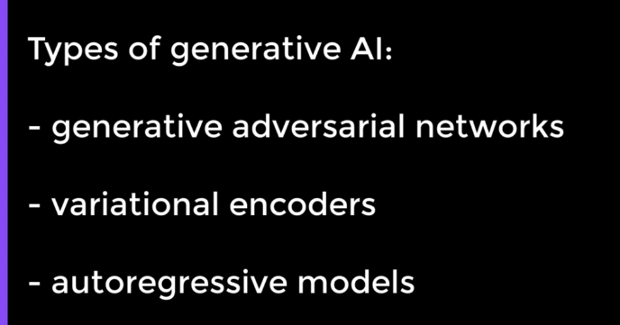
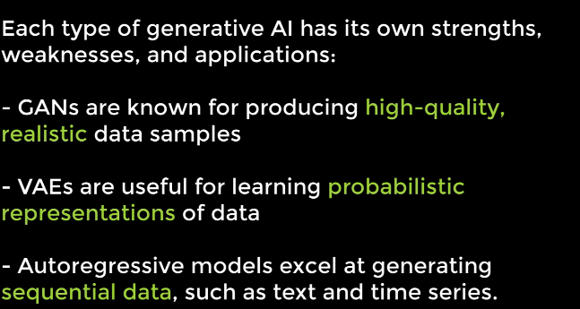
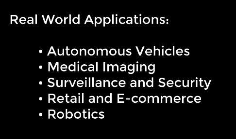

# AI Programming in C#
- using ML.NET 

- We programmers create an artificial brain 
- We reward good answers and punish bad answers 
- We want an AI to distinguish between apples and oranges 
- We train it on 500 pictures of apples and oranges 
- 
- We then show pictures and ask it to guess if the image is an apple or orange 
- This example is a subtype of AI called machine learning and it is an image classification algorithm 
- ChatGPT is a generative AI 
- It is trained on super large datasets.  
- Here AI program generates a response based on an input. 
- In AI there are subfields 
- 
- Other examples of AI are Alexa, Google Home and ChatGPT. 
- AI can also recognize emotions, however it cannot respond to them. 

## Main AI Concepts 

### Types of AI 
- Narrow AI and Strong AI 
- Narrow AI is used to perform specific tasks like an AI designed to play a game 
- Strong AI is a higher powered type of AI and can work on different types of tasks 

### Subtypes of AI 
- 

- #### Machine Learning
- In Machine Learning, we use data to train an AI model. After the model is trained, we present it with a situation and it makes a prediction based on its training. 
- Machine learning is of 3 types: 
- Supervised Learning , Unsupervised Learning and Reinforcement Learning
- **Supervised learning** is when we use labelled data to train our model to recognize patterns and predict outcomes 
- **Unsupervised learning** uses data without any labels, which the model uses to discover patterns that exist in the data and then uses the inferences to predict the outcome 
- In **Reinforcement learning**, we assign rewards and punishments to tasks to train the model, when then is able to make predictions using those results. 
- #### Classification 
- Another subtype of AI where the model puts data into different categories based on certain features it has 
- For example, we can classify words or sentences based on if they have a negative or positive emotion in them
- We can also classify images like grouping images of different fruits 
- Types of Classification are :
- **Binary Classification**
- This means we only have 2 categories: like Apples and Oranges
- **Multiclass Classification**
- More than 2 categories like Apples, Oranges and Banana
- **MultiLabel classification** 
- When the same type of data belongs to more than one category. For example if our program has categories: "nature" and "large", then mountains can belong to both these categories 
- Lot of classification algorithms 
- #### Regression 
- It is a strategy that plots all of the known data points and based on how the data is trending, it can predict future values. It allows us to see the relationship between 2 variables. 
- One variable on the X-Axis and One on the Y-Axis. 
- #### Forecasting 
- When an AI can predict future events 
- #### Recommendation 
- An AI strategy which is used to make suggestions based on prior choices. 
- If we viewed items on online store like books on Amazon's website and then seeing recommendations of similar items, that is an example of this type of AI 
- #### Neural Networks 
- 
- They are like digital brains. We write code that enables the program to learn from its mistakes based on the way that the human brain works 
- Just like brain has neurons, neural network has perceptrons, which are the digital version of neurons. 
- By adding multiple layers of interconnected perceptrons, we are able to build a neural network that mimics the functionality of a human brain by sending signals between perceptrons. 
- #### Q-Learning 
- Type of reinforcement learning where a model will perform a task over and over and improve taking the correct action over time. 
- #### Deep Learning 
- Enables AI to recognize complex learning and is made possible thanks to neural networks. Examples are deep Q-Learning and Deep Convolutional Q-Learning. 

## Neural Networks 
- A computer program that is able to learn and is modeled around how human brain works 
- Neural network are made up of digital equivalent of neurons called perceptrons. 
- 
- Each perceptron can take input from one or more perceptrons and send output to one more more perceptrons 
- Neural networks are made up of layers in the most basic form of a neural network.
- There are 3 main layers:
- Input Layer: Made up of perceptrons that make simple decisions based on input 
- Hidden Layer: Perceptrons that make more complex decisions by weighing the results from the first layer 
- Output Layer: Produces the output of the program 
- 
- It is possible for a neural network to have more than one hidden layer between the input layer and the output layer 
- 
- When a neural network has multiple hidden layers, this enables it to make even more complex decisions. 
- It is called a deep neural network and it is able to work with massive amounts of data.
- Perceptrons are connected by connections and each connection has a weight associated with it. This determines how much influence each perceptron has on the other.  An activation function determines whether or not a perceptron should fire based on the sum of its inputs, weighted using the weight associated with the connection between the two.
- Learning occurs as the network gets input and gets better and better at producing the correct output, thanks to its adjusting its weights
- 
- 3 types of neural networks:
- Feed Forward Neural Networks: Data flows in one direction from input to output node. Each node is connected to the next node in the layer.
- Backpropagation Neural Networks : It is a type of Feedforward neural network which gives feedback that is uses to improve its decisions
- Convolutional Neural Networks: It detects patterns in the data based on images and spatial data
- These types are named based on how data flows from the input node to the output node.
- Lets understand with an example 
- 
- We can show a lot of handwritten numbers along with their correct values. Neural networks adjust their weights based on its understanding to get better at recognizing the numbers
- Once trained, a neural network can look at a new handwritten number and tell us what it thinks it is, just like human beings do. 

## Machine Learning 
- subfield of AI 
- Lets say we make an algorithm to add 2 numbers
- 
- With machine learning, we do the opposite. We give the program the data and the expected results and then it comes up with the algorithm. 
- We can provide a pair of numbers and their solutions and it will infer from the data 
- In machine learning, we refer to the AI as the model and there are 2 phases a model goes through: 
- 
- In training we provide data to train the model 
- 3 main types of ML
- 
- In supervised learning the model builds a profile of an object based on its labels
- In unsupervised learning, it  builds a profile of similar looking objects by understanding the patterns between them and grouping them accordingly. 
- In reinforcement learning, we have a system of rewards and punishments. If the model correctly identifies the picture of an apple as an apple, we may reward it with a positive score. If it incorrectly labels, we provide a negative score. The model will try the max positive score as possible .

## Q-Learning
- Fundamental concept in reinforcement learning that focuses on learning the optimal action-selection strategy given a particular state of the environment. The agent learns to make decisions by interacting with its environment.
- Imagine playing a video where we control a character navigating through a maze. 
- 
- At each step we can take multiple actions like moving up, down, left and right. 
- The goal is to reach the end of the maze while maximizing our score or reward. 
- In Q-Learning, we use a table called the Q-Table to keep track of the expected future rewards for each possible action in each state of the environment. 
- Each cell in the Q-table represents the "quality" or "value" of taking a particular action in a specific state.
- We start by initializing the Q-table with arbitrary values or zeroes. 
- Then the agent selects an action to take in the current state based on the exploration-exploitation strategy. 
- Initially, the agent explores the environment by taking random actions. 
- Overtime, it gradually shifts towards exploiting the learned information to choose actions that maximize future rewards. 
- After taking an action and observing the resulting state and reward, the agent updates the Q-value for the current state action pair using the following Q-learning update rule:
- 
- As the agent learns more about the environment, we decrease the exploration rate over time, allowing the agent to focus more on exploiting the learned information. 
- The Q-Learning process continues until the Q values converge to their optimal values, indicating that the agent has learned the optimal action selection strategy for each state. 
- 
- Used in autonomous navigation systems. 
- Main weakness of traditional Q-learning is that it isnt very scalable for more complex environments. 
- It uses a table to store the Q-values, which can become impossible to manage as the state and action spaces get larger for the more complex environments. 
- This is where deep Q-learning becomes advantageous. 

## Deep Q-Learning 
- It leverages deep neural networks to approximate the Q-values instead of using a tabular representation. 
- This approach known as function approximations, allows DQN to handle high dimensional state spaces such as images or raw sensor data, making it suitable for a wide range of complex environments including video games, robotics and autonomous navigation. 
- 
- This enables DQN to generalize across similar states and actions, making it more efficient and scalable compared to traditional tabular Q-Learning. 
- 
- In pong, we represent the game state as an image frame, where each frame shows the current state of the game, including positions of the paddle and the ball. 
- Agent takes actions based on these image frames, such as moving its paddle up or down, or staying still. 
- 
- Agents goal is to learn a Q-function, represented by a deep neural network that estimates the expected future rewards for each possible action given the current state. 
- The neural network takes the image frame of the current state as input and outputs the Q-values for all possible actions. 
- During training the agent interacts with the game environment taking actions based on an epsilon greedy exploration strategy. 
- It collects experience tupes, a tuple with state,action,reward,nextState and uses them to update the Q network parameters using a variant of Q-learning algorithm called deep Q-Learning. 
- 
- 
- However deep Q-learning is not very good working with raw pixel data from images.
- For this purpose we have Deep convolutional Q-learning. 

## Deep Convolutional Q-Learning
- It is a type of reinforcement learning algorithm that uses deep convolutional neural networks(CNNs) to learn to make decisions in complex environments, particularly those with high dimensional input spaces like images or raw sensory data. 
- 
- A CNN is a type of artificial neural network based on how humans see. 
- They are composed of layers of neurons called convolutional layers that apply filters, also called kernels to input data to extract features. 
- 
- CNNs are designed to capture spatial hierarchies and patterns in data making them well suited for tasks like image classification and object detection. 
- Here,CNNs learn effective decision making policies in environments with high dimensional input spaces.
- Input is raw sensory data like images or video games. 
- CNN processes the input data, extracting meaningful features that capture spatial relationships and patterns in the environment. 
- Output of the CNN is fed into fully connected layers that estimate the Q- values for all possible actions. 
- e.g environmental monitoring with drones. 
- Goal of these drones is to monitor environmental changes, detect potential threats like wildfires or deforestation and make informed decisions to protect the ecosystem. 
- 
- In the input each drone captures images of the forest area using on-board cameras. 
- These images provide visual information about the vegetation, terrain and any potential threats or changes in the environment. 
- Raw image data is fed into a CNN, which processes the images and extracts features relevant to the environmental monitoring such as density and distribution of vegetation, presence of water bodies and signs of deforestation and wildfire. 
- 
- In the next step, we do action selection, at which point the output of the CNN is passed to the fully connected layers that estimate the Q-values for different drone locations. Based on these Q-values, the drone takes an action aiming to maximize the effectiveness of monitoring and detection while conserving energy and resources.
-  
-  Positive rewards are given for actions that contribute to effective environmental monitoring such as detecting changes in vegetation health. 
-  Negative rewards or penalties are given for actions that result in inefficiencies or failures, such as colliding with obstacles or running out of battery. 
-  The deep convolutional Q-learning algorithm updates the Q-values based on the observed rewards and transitions between states and actions enabling the drone to learn optimal strategies. 
-  Overtime, the drone learns how to effectively navigate the forest environment. 
-  
  
## Asynchronous Advantage Actor-Critic(A3C)
- It is a type of reinforcement learning algorithm designed for training agents to interact with environments and make decisions in real-time
- 4 parts of A3C 
- 
- A3C vs Q-Learning
- A3C is probabilistic vs Q-learning which is deterministic
- 
- 
- Drones learn from experience and adjust their policies to improve performance over time. 
- For e.g if a drone encounters traffic in a particular area, it may learn to re-route to avoid congestion. 
- If it encounters a high building, it may increase it altitude to skip the obstacle. 
- 

## Large Language Models (LLMs)
- Type of AI powered by neural networks 
- 
- It is like a smart assistant that can analyze and generate text such as completing sentences, translating languages or even writing articles. 
- LLMs can perform large number of tasks involving natural language processing or NLP. 
- 
- 
- These models have been trained on massive amounts of text data. 
- ChatGPT is a variant of the GPT model specifically fine tuned for conversational interactions. It is trained on a dataset containing conversational data such as social media conversations, chat logs and customer support interactions. 
- Gives better performance in conversational context. 
- 
- LLMs are blackbox systems 
- 
- LLM powered chatbots can help in customer service interactions and reduce workload on human agents. 
- LLMs can generate clinical notes and assist with medical documentation. 
- They can convert spoken or handwritten medical records into structured text to improve accuracy and efficiency of healthcare administration. 
- 

## Generative AI 
- Type of AI that can be used to generate new, original data or content based on patterns learned from existing data. 
- Unlike traditional AI models that focus on tasks like classification, regression or prediction, generative AI models can create new data samples that are similar to the one in the training data set but are not the exact copies. . 
- These models work by learning the underlying statistical patterns and structures of the data during the training process. 
- Once trained, these models can generate new data samples by sampling from the learned distribution of the data. 
- 
- 
- The generator generates fake data samples like images from random noise.
- The discriminator tries to distinguish between real data samples, like actual images and fake ones generated by the generator.
- Through adversarial training, the generator learns to generate more realistic data samples, while the discriminator learns to become better at distinguishing between the real and fake data samples.
- GANs are widely used for tasks like image generation, video generation, and data synthesis.

### Variational Encoders
- Variational encoders, or VAEs, are probabilistic generative models that learn a latent representation of the input data.
- They consist of an encoder network that maps input data to a latent space, and a decoder network that generates new data samples from the latent space. VAEs aim to learn the underlying distribution of the input data and generate new data samples by sampling from this distribution.
- They are commonly used for tasks like image generation, anomaly detection, and data compression.

### Autoregressive Models 
- Autoregressive models generate data sequentially, one element at a time based on the probability distribution of the next element given the previous elements.
- Examples of autoregressive models include recurrent neural networks or RNNs, transformer models and language models like GPT.
- Autoregressive models are commonly used for tasks like text generation, language translation, and sequence prediction.
- 
- 
- 

## Computer Vision 
 - Type of AI that focuses on enabling computers to interpret and understand visual information from the real world. 
 - It involves developing algorithms and techniques that allow machines to extract meaningful insights from digital images or videos, similar to how humans perceive and interpret visual stimuli.
 - 
 - 
 - We can use the Computer Vision program described above to analyze live video feeds from surveillance cameras and identify potential security threats such as unauthorized intruders, suspicious packages, or prohibited items.
 - The program continuously processes video frames in real time, detecting and classifying objects within the scene. 
 - When it detects a suspicious object or activity, it triggers an alert notification to alert security personnel, who can then take appropriate action to investigate and respond to the potential threat.
 - 
 - Computer Vision can be used in Radiology.